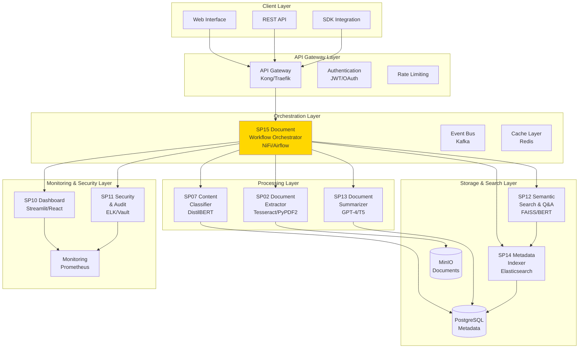

# Architettura Generale - Sistema di Gestione Documentale (UC1)

## Overview Architetturale

Il **Sistema di Gestione Documentale** è progettato come una piattaforma AI-powered per l'automazione completa del processamento, classificazione e ricerca di documenti in ZenShare Up. L'architettura segue i principi di microservizi, event-driven design e AI-first approach.



## Principi Architetturali

### 1. Microservizi AI-First
- Ogni SP è un microservizio indipendente
- Deploy separato per scalabilità AI models
- API-first design per integrazione

### 2. Event-Driven Architecture
- Asynchronous processing per performance
- Event sourcing per audit trail
- Reactive design per real-time updates

### 3. Data Mesh Approach
- Domain ownership per componente
- Federated governance
- Self-serve data access

### 4. AI Observability
- Explainability in ogni decisione AI
- Model monitoring e drift detection
- Human-in-the-loop per validation

## Componenti Architetturali

### Processing Pipeline
```
Document Upload → SP15 Orchestrator → SP02 Extract → SP07 Classify → SP13 Summarize → SP14 Index → SP12 Search → Complete
```

### Data Flow
- **Ingress**: Documenti via API/Web upload
- **Processing**: Pipeline asincrona con state management
- **Storage**: Metadati in PostgreSQL, documenti in MinIO, indici in Elasticsearch
- **Search**: Hybrid search (semantic + keyword)
- **Output**: Risultati via API/Dashboard

### Scalability Considerations
- **Horizontal Scaling**: Microservizi containerizzati (Docker/K8s)
- **AI Model Serving**: GPU pools per inference
- **Storage**: Object storage scalabile (MinIO/S3)
- **Search**: Elasticsearch cluster per high availability

### Security Architecture
- **Zero Trust**: Authentication per ogni richiesta
- **Data Encryption**: At rest e in transit
- **Access Control**: RBAC + ABAC
- **Audit**: Immutable log trail

### Deployment Architecture
- **Development**: Local Docker Compose
- **Staging**: K8s cluster con CI/CD
- **Production**: Multi-region K8s con disaster recovery

## Integrazione con ZenShare Up

### Existing Systems Integration
- **Document Management**: Sostituzione workflow manuali
- **Search Engine**: Enhancement con semantic search
- **Workflow Engine**: Estensione per documenti
- **Security**: Integrazione con IAM esistente

### API Integration Points
- **Document Upload**: `/api/v1/documents/upload`
- **Search**: `/api/v1/search/*`
- **Workflow**: `/api/v1/workflows/*`
- **Admin**: `/api/v1/admin/*`

### Data Synchronization
- **Real-time**: Event-driven sync con sistemi esistenti
- **Batch**: Overnight sync per large datasets
- **Hybrid**: Real-time per critical, batch per bulk

## Performance Targets

- **Ingestion**: 100 docs/min
- **Search**: <200ms response
- **Processing**: <60s per doc
- **Availability**: 99.9% uptime
- **Accuracy**: >90% classification

## Technology Stack

### Core Technologies
- **AI/ML**: PyTorch, Transformers, FAISS
- **Search**: Elasticsearch, OpenSearch
- **Storage**: PostgreSQL, MinIO, Redis
- **Orchestration**: Apache NiFi, Airflow
- **Messaging**: Kafka, RabbitMQ
- **Monitoring**: Prometheus, Grafana, ELK

### Cloud-Native
- **Container**: Docker
- **Orchestration**: Kubernetes
- **Service Mesh**: Istio
- **CI/CD**: GitHub Actions, ArgoCD

## Roadmap Implementation

### Phase 1: Foundation (Q1 2026)
- Core pipeline SP02-SP07-SP14
- Basic search and indexing
- Dashboard monitoring

### Phase 2: Enhancement (Q2 2026)
- AI summarization SP13
- Semantic search SP12
- Advanced orchestration SP15

### Phase 3: Optimization (Q3 2026)
- Performance optimization
- Multi-language support
- Advanced security features

### Phase 4: Innovation (Q4 2026)
- Predictive features
- Conversational AI
- Cross-system integration</content>
<parameter name="filePath">/Users/giangio/Documents/GitHub/Interzen/Interzen.POC/ZenIA/docs/use_cases/UC1 - Sistema di Gestione Documentale/00 Architettura Generale UC1.md