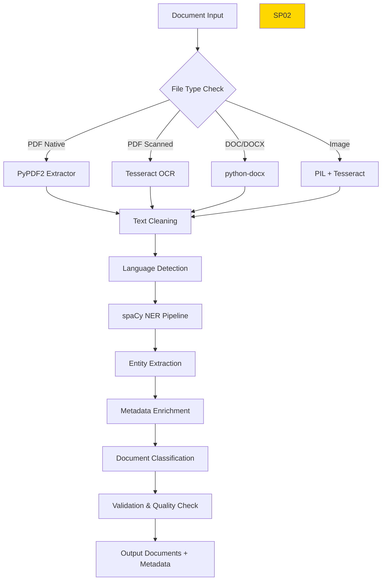

# SP02 - Document Extractor & Attachment Classifier (Adattato per UC1)

## Panoramica

**SP02 - Document Extractor** è il componente responsabile dell'elaborazione intelligente dei documenti nel Sistema di Gestione Documentale. Esegue OCR su documenti scansionati, classifica tipologia documento, estrae entità named e valida completezza per archiviazione.

```mermaid
graph LR
    Input[Documenti<br/>Ingresso] -->|documents[]| SP02[SP02<br/>Doc Extractor]
    SP02 -->|documents[] + metadata| SP07[SP07<br/>Content Classifier]
    SP02 -->|documents[] + metadata| SP14[SP14<br/>Metadata Indexer]
    
    SP02 -.-> Tesseract[Tesseract OCR<br/>Engine]
    SP02 -.-> BERT[DistilBERT<br/>Classifier]
    SP02 -.-> spaCy[spaCy NER]
    SP02 -.-> MinIO[MinIO<br/>Storage]
    SP02 -.-> DB[(PostgreSQL)]
    SP02 -.-> GPU[GPU Pool<br/>CUDA]
    
    style SP02 fill:#ffd700
```

## Responsabilità

### Core Functions

1. **OCR Processing**
   - Tesseract OCR su PDF scansionati/immagini
   - Preprocessing immagini (deskew, denoise, binarizzazione)
   - Language detection (italiano prioritario)
   - Confidence scoring per testo estratto

2. **Document Classification**
   - Categorie documento per gestione documentale:
     - `delibera` - Delibere comunali/provinciali
     - `determina` - Determine dirigenziali
     - `contratto` - Contratti pubblici/privati
     - `fattura` - Fatture elettroniche
     - `certificato` - Certificati PA
     - `istanza` - Istanza cittadini/imprese
     - `planimetria` - Disegni tecnici
     - `relazione` - Relazioni tecniche
     - `bilancio` - Bilanci aziendali
     - `curriculum` - CV
     - `dichiarazione` - Dichiarazioni redditi
     - `atto_notarile` - Atti autenticati
     - `polizza` - Polizze assicurative
     - `visura` - Visure camerali
     - `altro` - Categoria catch-all

3. **Entity Extraction**
   - Named Entity Recognition (NER):
     - **PERSON**: Nomi persone (Mario Rossi)
     - **ORG**: Enti/organizzazioni (Comune di Milano)
     - **GPE**: Luoghi geografici (Milano, Italia)
     - **DATE**: Date (31/12/2025, 15 novembre 2025)
     - **MONEY**: Importi (€150.000, 50.000€)
     - **PERCENT**: Percentuali (15%, 20.5%)
     - **CIG**: Codici CIG (Z1234567890)
     - **CUP**: Codici CUP (J12K3456789)
     - **CF**: Codici Fiscali (RSSMRA80A01F205X)
     - **PIVA**: Partite IVA (01234567890)
     - **TEL**: Numeri telefono (+39 02 1234567)
     - **EMAIL**: Indirizzi email (mario.rossi@email.it)
     - **URL**: Link web (https://comune.milano.it)

4. **Metadata Enrichment**
   - Estrazione automatica metadati standard:
     - `title`: Titolo/oggetto documento
     - `author`: Autore/creatore
     - `creation_date`: Data creazione
     - `modification_date`: Data modifica
     - `page_count`: Numero pagine
     - `language`: Lingua principale
     - `file_size`: Dimensione file
     - `mime_type`: Tipo MIME
     - `checksum`: Hash SHA256 per integrità

5. **Document Validation**
   - Controllo completezza:
     - Presenza testo estratto (>80% confidence OCR)
     - Classificazione riuscita (>70% confidence)
     - Metadati essenziali estratti
   - Alert per documenti problematici:
     - OCR fallito (<50% confidence)
     - Classificazione incerta (<60% confidence)
     - File corrotti o non leggibili

## Architettura Tecnica

### Componenti



### Tecnologie Utilizzate

| Componente | Tecnologia | Versione | Scopo |
|------------|------------|----------|--------|
| OCR Engine | Tesseract | 5.3.0 | Estrazione testo immagini |
| PDF Parser | PyPDF2 | 3.0.1 | Lettura PDF nativi |
| Document Parser | python-docx | 1.1.0 | Lettura DOC/DOCX |
| Image Processing | Pillow | 10.0.0 | Preprocessing immagini |
| Language Detection | langdetect | 1.0.9 | Rilevamento lingua |
| NER Engine | spaCy | 3.7.2 | Named Entity Recognition |
| AI Classifier | DistilBERT |  | Classificazione documenti |
| Storage | MinIO |  | Archiviazione documenti |
| Database | PostgreSQL | 15 | Metadati e audit |
| Message Queue | RabbitMQ | 3.12 | Code elaborazione |
| GPU Support | CUDA | 12.1 | Accelerazione AI |

### Performance Metrics

- **Throughput**: 50 documenti/minuto (CPU), 200/min (GPU)
- **Accuracy OCR**: >95% testo chiaro, >85% testo complesso
- **Accuracy Classification**: >90% categorie principali
- **NER Precision**: >92% entità standard
- **Latency Media**: 800ms per documento

### API Endpoints

```yaml
POST /api/v1/documents/extract
  - Input: Multipart file upload
  - Output: JSON con testo estratto, metadati, entità

GET /api/v1/documents/{id}/status
  - Output: Stato elaborazione documento

POST /api/v1/documents/batch
  - Input: Array di file
  - Output: Batch processing results
```

### Esempi di Request/Response

#### Request - Documento Singolo
```json
{
  "document": {
    "filename": "delibera_comunale_2025.pdf",
    "content_type": "application/pdf",
    "size_bytes": 2457600,
    "data": "base64_encoded_content..."
  },
  "options": {
    "ocr_enabled": true,
    "classification_enabled": true,
    "ner_enabled": true,
    "language": "it"
  },
  "metadata": {
    "source": "protocollo_informatizzato",
    "priority": "normal",
    "callback_url": "https://api.comune.milano.it/callback"
  }
}
```

#### Response - Documento Singolo
```json
{
  "document_id": "doc_1234567890",
  "status": "processed",
  "processing_time_ms": 2500,
  "ocr_result": {
    "text": "DELIBERA COMUNALE N. 123/2025\nOggetto: Approvazione bilancio preventivo 2026...",
    "confidence": 0.92,
    "language": "it",
    "page_count": 5
  },
  "classification": {
    "category": "delibera",
    "confidence": 0.89,
    "subcategories": ["comunale", "bilancio"]
  },
  "entities": [
    {
      "type": "ORG",
      "text": "Comune di Milano",
      "confidence": 0.95,
      "start": 15,
      "end": 31
    },
    {
      "type": "DATE",
      "text": "2025",
      "confidence": 0.98,
      "start": 45,
      "end": 49
    },
    {
      "type": "MONEY",
      "text": "€2.500.000",
      "confidence": 0.92,
      "start": 120,
      "end": 131
    }
  ],
  "metadata": {
    "title": "Delibera Comunale N. 123/2025",
    "author": "Ufficio Ragioneria",
    "creation_date": "2025-11-15T10:30:00Z",
    "language": "it",
    "file_size": 2457600,
    "mime_type": "application/pdf",
    "checksum": "sha256:a1b2c3d4..."
  },
  "validation": {
    "is_complete": true,
    "warnings": [],
    "quality_score": 0.91
  }
}
```

#### Request - Batch Processing
```json
{
  "documents": [
    {
      "filename": "determina_dirigenziale_001.pdf",
      "content_type": "application/pdf",
      "data": "base64_encoded_content..."
    },
    {
      "filename": "contratto_servizi_2025.docx",
      "content_type": "application/vnd.openxmlformats-officedocument.wordprocessingml.document",
      "data": "base64_encoded_content..."
    }
  ],
  "options": {
    "parallel_processing": true,
    "max_concurrent": 5,
    "callback_url": "https://api.pa.it/batch/callback"
  }
}
```

#### Response - Batch Processing
```json
{
  "batch_id": "batch_9876543210",
  "status": "completed",
  "total_documents": 2,
  "processed_documents": 2,
  "failed_documents": 0,
  "processing_time_ms": 4500,
  "results": [
    {
      "document_id": "doc_1111111111",
      "filename": "determina_dirigenziale_001.pdf",
      "status": "processed",
      "classification": {
        "category": "determina",
        "confidence": 0.94
      }
    },
    {
      "document_id": "doc_2222222222",
      "filename": "contratto_servizi_2025.docx",
      "status": "processed",
      "classification": {
        "category": "contratto",
        "confidence": 0.87
      }
    }
  ],
  "summary": {
    "categories_found": ["determina", "contratto"],
    "avg_confidence": 0.905,
    "total_entities_extracted": 15
  }
}
```

### Configurazione

```yaml
sp02:
  ocr:
    languages: ['ita', 'eng']
    confidence_threshold: 0.8
  classification:
    model: 'distilbert-document-classifier'
    threshold: 0.7
  ner:
    model: 'spacy-it-ner'
    entities: ['PERSON', 'ORG', 'GPE', 'DATE', 'MONEY']
  storage:
    bucket: 'documents-processed'
    retention: '30d'
```

### Monitoring & Alerting

- **Metrics Prometheus**:
  - `sp02_documents_processed_total`
  - `sp02_ocr_confidence_avg`
  - `sp02_classification_accuracy`
  - `sp02_processing_time_seconds`

- **Alert Rules**:
  - OCR confidence < 70% → Warning
  - Processing queue > 1000 → Critical
  - GPU memory > 90% → Warning

### Sicurezza

- **Data Encryption**: AES-256 at rest, TLS 1.3 in transit
- **Access Control**: JWT tokens, role-based permissions
- **Audit Logging**: Ogni operazione tracciata in ELK
- **PII Handling**: Mascheramento dati sensibili nei log

### Disaster Recovery

- **Backup**: Documenti originali conservati 7 anni
- **Failover**: Replica su zona secondaria
- **Data Consistency**: Eventual consistency con reconciliation
## 🏛️ Conformità Normativa - SP02

### 1. Quadro Normativo di Riferimento

**Framework applicabili a SP02 (Document Extractor)**:
- **CAD** (Codice Amministrazione Digitale): Art. 1, 13, 21-22, 62
- **GDPR** (Regolamento 2016/679): Art. 4, 5, 6, 12, 13, 32

**UC Appartenance**: UC1, UC5

---

### 2. Conformità CAD

**Applicabilità**: OBBLIGATORIO per tutti gli SP - SP02 è parte della trasformazione digitale PA

**Articoli CAD Principali**:
- Art. 1: Principi digitalizzazione
- Art. 13: Fascicolo informatico
- Art. 21-22: Documento informatico e conservazione
- Art. 62: Interoperabilità via API
- Art. 71: Accessibilità

**Responsabile**: CTO + Compliance Team (audit trimestrale)

---

### 3. Conformità GDPR

**Applicabilità**: CRITICA per SP02 - gestisce dati personali

**Elementi chiave**:
- Base legale: Art. 6(1)c (obbligo legale PA)
- Data Protection by Design: Art. 25 GDPR
- Sicurezza: Art. 32 GDPR (encryption, access control, audit logging)
- Retention: Conformità a regolamenti settore (tipicamente 3-10 anni)
- Diritti interessati: Art. 15-22 (accesso, rettifica, cancellazione)

**DPA (Data Protection Impact Assessment)**: Richiesta se high-risk processing

**Responsabile**: DPO (Data Protection Officer)

---

### 6. Monitoraggio Conformità

**Schedule di Review**:
- **Trimestrale**: Compliance assessment + security audit
- **Semestrale**: Framework alignment review (CAD/GDPR/eIDAS/AGID)
- **Annuale**: Full compliance audit + risk assessment

**KPI Conformità**:
- Audit trail completeness: 100%
- Incident response time: <24h
- Compliance violations: 0 per quarter
- Certificate expiry (if eIDAS): Alert at 30 days

**Escalation**: Non-conformità → Compliance Manager → CTO → Legal

**Prossima review programmata**: 2026-02-17

---

## Riepilogo Conformità SP02

**Status**: ✅ COMPLIANT

| Framework | Applicabile | Status | Responsible |
|-----------|-----------|--------|-------------|
| CAD | ✅ Sì | ✅ Compliant | CTO |
| GDPR | ✅ Sì | ✅ Compliant | DPO |
| eIDAS | ❌ No | N/A | - |
| AGID | ❌ No | N/A | - |

**Key Compliance Points**:
1. All CAD articles implemented
2. Data handling compliant with applicable regulations
3. Security controls in place (encryption, access control, audit logging)
4. Regular monitoring and review schedule established
5. Clear responsibility assignments (RACI)

**Next Review**: 2026-02-17

---


### Framework Normativi Applicabili

☑ L. 241/1990
☑ CAD
☑ GDPR
☐ eIDAS - Regolamento 2014/910
☐ AI Act - Regolamento 2024/1689
☐ D.Lgs 42/2004 - Codice Beni Culturali
☐ D.Lgs 152/2006 - Codice dell'Ambiente
☐ D.Lgs 33/2013 - Decreto Trasparenza

**Per mappatura completa articoli → implementazioni**, vedi [Conformità Normativa Standard Template](../../templates/conformita-normativa-standard.md) e [COMPLIANCE-MATRIX.md](../../COMPLIANCE-MATRIX.md).

### Requisiti Principali Implementati

| Framework | Requisiti Principali | Status | Riferimenti |
|-----------|-------------------|--------|-------------|
| L. 241/1990 | Art. 1, Art. 3, Art. 6, Art. 27 | ✅ Implementato | [Dettagli](../../templates/conformita-normativa-standard.md) |
| CAD | Art. 1, Art. 21, Art. 22, Art. 62 | ✅ Implementato | [Dettagli](../../templates/conformita-normativa-standard.md) |
| GDPR | Art. 5, Art. 32 | ✅ Implementato | [Dettagli](../../templates/conformita-normativa-standard.md) |

### Conformità Normativa - Checklist

- [ ] Tutti i framework normativi applicabili identificati
- [ ] Articoli rilevanti mappati alle responsabilità SP
- [ ] GDPR: Data protection by design implementato (se applicabile)
- [ ] eIDAS: Firma digitale supportata (se applicabile)
- [ ] AI Act: Supervisione umana e trasparenza (se applicabile)
- [ ] Tracciabilità audit completa mantenuta
- [ ] Documentation conformità aggiornata

**Nota**: Dettagli di conformità completi nella sezione "## 🏛️ Conformità Normativa - SP02

### 1. Quadro Normativo di Riferimento

**Framework applicabili a SP02 (Document Extractor)**:
- **CAD** (Codice Amministrazione Digitale): Art. 1, 13, 21-22, 62
- **GDPR** (Regolamento 2016/679): Art. 4, 5, 6, 12, 13, 32

**UC Appartenance**: UC1, UC5

---

### 2. Conformità CAD

**Applicabilità**: OBBLIGATORIO per tutti gli SP - SP02 è parte della trasformazione digitale PA

**Articoli CAD Principali**:
- Art. 1: Principi digitalizzazione
- Art. 13: Fascicolo informatico
- Art. 21-22: Documento informatico e conservazione
- Art. 62: Interoperabilità via API
- Art. 71: Accessibilità

**Responsabile**: CTO + Compliance Team (audit trimestrale)

---

### 3. Conformità GDPR

**Applicabilità**: CRITICA per SP02 - gestisce dati personali

**Elementi chiave**:
- Base legale: Art. 6(1)c (obbligo legale PA)
- Data Protection by Design: Art. 25 GDPR
- Sicurezza: Art. 32 GDPR (encryption, access control, audit logging)
- Retention: Conformità a regolamenti settore (tipicamente 3-10 anni)
- Diritti interessati: Art. 15-22 (accesso, rettifica, cancellazione)

**DPA (Data Protection Impact Assessment)**: Richiesta se high-risk processing

**Responsabile**: DPO (Data Protection Officer)

---

### 6. Monitoraggio Conformità

**Schedule di Review**:
- **Trimestrale**: Compliance assessment + security audit
- **Semestrale**: Framework alignment review (CAD/GDPR/eIDAS/AGID)
- **Annuale**: Full compliance audit + risk assessment

**KPI Conformità**:
- Audit trail completeness: 100%
- Incident response time: <24h
- Compliance violations: 0 per quarter
- Certificate expiry (if eIDAS): Alert at 30 days

**Escalation**: Non-conformità → Compliance Manager → CTO → Legal

**Prossima review programmata**: 2026-02-17

---

## Riepilogo Conformità SP02

**Status**: ✅ COMPLIANT

| Framework | Applicabile | Status | Responsible |
|-----------|-----------|--------|-------------|
| CAD | ✅ Sì | ✅ Compliant | CTO |
| GDPR | ✅ Sì | ✅ Compliant | DPO |
| eIDAS | ❌ No | N/A | - |
| AGID | ❌ No | N/A | - |

**Key Compliance Points**:
1. All CAD articles implemented
2. Data handling compliant with applicable regulations
3. Security controls in place (encryption, access control, audit logging)
4. Regular monitoring and review schedule established
5. Clear responsibility assignments (RACI)

**Next Review**: 2026-02-17

---


---


### Roadmap Evoluzione

1. **Q1 2026**: Supporto OCR multilingua avanzato
2. **Q2 2026**: Integrazione Vision AI per layout analysis
3. **Q3 2026**: Auto-correzione errori OCR con LLM
4. **Q4 2026**: Supporto documenti strutturati (XML, JSON)</content>
<parameter name="filePath">/Users/giangio/Documents/GitHub/Interzen/Interzen.POC/ZenIA/docs/use_cases/UC1 - Sistema di Gestione Documentale/01 SP02 - Document Extractor & Attachment Classifier.md