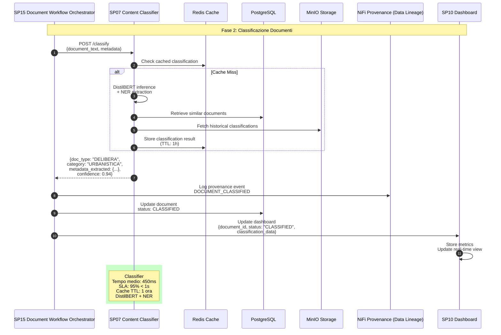

# SP07 - Content Classifier: Sequence Diagram (Adattato per UC1)

## Classificazione e Analisi Contesto Documentale

Questo diagramma mostra tutte le interazioni del **Content Classifier (SP07)** nel processo di classificazione dei documenti nel Sistema di Gestione Documentale.



## Payload Example: Classification Request

```json
{
  "document_id": "DOC-2025-001234",
  "text": "DELIBERA DELLA GIUNTA COMUNALE N. 123/2025 ...",
  "metadata": {
    "filename": "delibera_urbanistica.pdf",
    "upload_date": "2025-11-15T10:00:00Z",
    "user_id": "user-456"
  },
  "context": {
    "department": "Urbanistica",
    "priority": "normal"
  }
}
```

## Response Example

```json
{
  "document_id": "DOC-2025-001234",
  "classification": {
    "type": "DELIBERA",
    "category": "URBANISTICA",
    "subcategory": "PIANI_REGOLATORI",
    "confidence": 0.94
  },
  "extracted_metadata": {
    "title": "Approvazione Piano Urbanistico Zona Industriale",
    "date": "2025-11-15",
    "authority": "Giunta Comunale",
    "number": "123/2025",
    "amount": 150000.00,
    "cig": "Z1234567890"
  },
  "entities": [
    {
      "text": "Giunta Comunale",
      "label": "ORG",
      "confidence": 0.98
    },
    {
      "text": "Piano Urbanistico",
      "label": "LAW",
      "confidence": 0.92
    }
  ],
  "processing_time_ms": 450,
  "cached": false
}
```

## Error Handling

```json
{
  "error": "CLASSIFICATION_FAILED",
  "message": "Confidence too low for reliable classification",
  "confidence": 0.45,
  "suggestions": [
    "Review document manually",
    "Provide additional context",
    "Split document if too complex"
  ]
}
```

## Performance Metrics

- **Accuracy**: >90% per categorie principali
- **Precision**: >92% entità estratte
- **Recall**: >88% documenti classificati
- **Latency**: <500ms media
- **Throughput**: 120 documenti/minuto

## Integration Points

- **Input**: Da SP02 (testo estratto), SP14 (metadati esistenti)
- **Output**: A SP12 (per ricerca), SP13 (per riassunto), SP14 (per indicizzazione)
- **Monitoring**: Metriche inviate a SP10 Dashboard</content>
<parameter name="filePath">/Users/giangio/Documents/GitHub/Interzen/Interzen.POC/ZenIA/docs/use_cases/UC1 - Sistema di Gestione Documentale/01 SP07 - Content Classifier.md