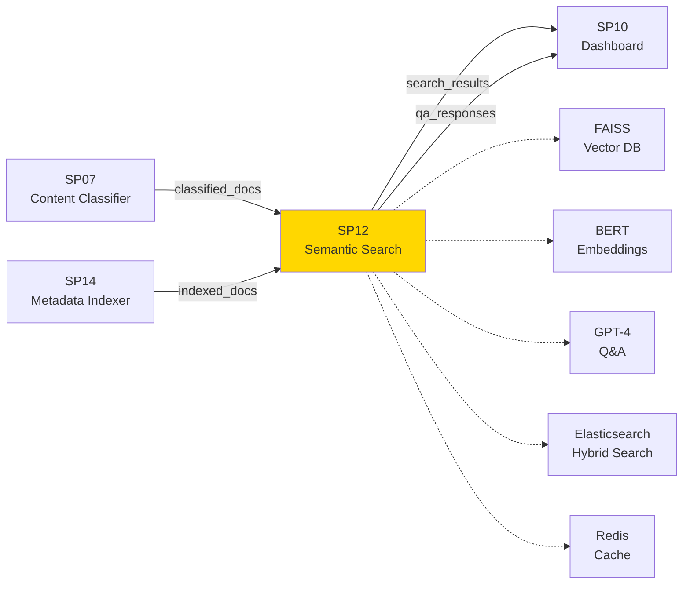
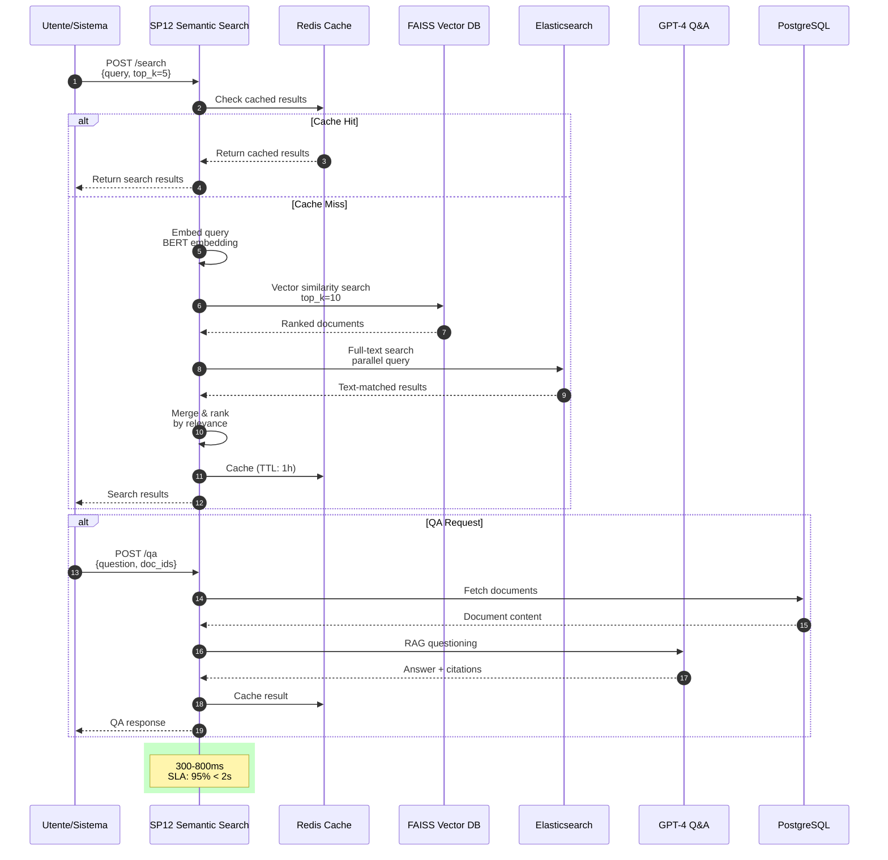
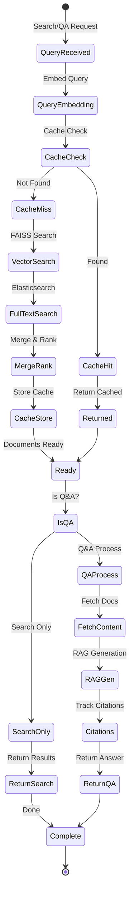
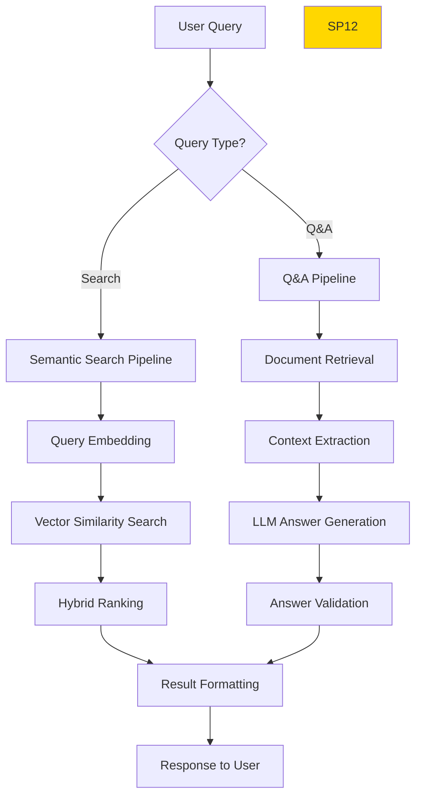

# SP12 - Semantic Search & Q&A Engine

## Panoramica

**SP12 - Semantic Search & Q&A Engine** è il componente che abilita la ricerca intelligente e le risposte a domande sui documenti nel Sistema di Gestione Documentale. Utilizza modelli di AI avanzati per comprendere il significato semantico delle query, non limitandosi alla ricerca di parole chiave esatte.



## Diagrammi Architetturali

### Sequence Diagram — Flusso Ricerca Semantica e Q&A



### State Diagram — Ciclo Vita Ricerca e Q&A



## Responsabilità

### Core Functions

1. **Semantic Search**
   - Comprensione intent query utente
   - Ricerca basata su similarità semantica
   - Hybrid search: vettoriale + full-text
   - Ranking risultati per rilevanza

2. **Question Answering (Q&A)**
   - Risposte dirette a domande sui documenti
   - Estrazione informazioni contestuali
   - Multi-document Q&A
   - Citazioni fonti con evidenza

3. **Query Understanding**
   - Parsing query naturali
   - Entity recognition in query
   - Query expansion semantica
   - Intent classification

4. **Result Presentation**
   - Snippet rilevanti con highlighting
   - Confidence scoring
   - Explainability: perché questo risultato
   - Related documents suggestions
## 🏛️ Conformità Normativa - SP12

### 1. Quadro Normativo di Riferimento

**Framework applicabili a SP12 (Semantic Search & Q&A)**:
- **CAD** (Codice Amministrazione Digitale): Art. 1, 13, 21-22, 62
- **GDPR** (Regolamento 2016/679): Art. 4, 5, 6, 12, 13, 32
- **AGID**: Linee Guida Acquisizione Software 2024

**UC di Appartenenza**: UC1

---

### 2. Conformità CAD

**Applicabilità**: OBBLIGATORIO per tutti gli SP - SP12 è parte della trasformazione digitale PA

**Articoli CAD Principali**:
- Art. 1: Principi digitalizzazione
- Art. 13: Fascicolo informatico
- Art. 21-22: Documento informatico e conservazione
- Art. 62: Interoperabilità via API
- Art. 71: Accessibilità

**Responsabile**: CTO + Compliance Team (audit trimestrale)

---

### 3. Conformità GDPR

**Applicabilità**: CRITICA per SP12 - gestisce dati personali

**Elementi chiave**:
- Base legale: Art. 6(1)c (obbligo legale PA)
- Data Protection by Design: Art. 25 GDPR
- Sicurezza: Art. 32 GDPR (encryption, access control, audit logging)
- Retention: Conformità a regolamenti settore (tipicamente 3-10 anni)
- Diritti interessati: Art. 15-22 (accesso, rettifica, cancellazione)

**DPA (Data Protection Impact Assessment)**: Richiesta se high-risk processing

**Responsabile**: DPO (Responsabile della Protezione dei Dati (DPO))

---

### 5. Conformità AGID

**Applicabilità**: CRITICA per SP12 - ha interfaccia utente / interoperabilità

**Elementi chiave**:
- Accessibilità: WCAG 2.1 Level AA (se UI component)
- Interoperabilità: OpenAPI 3.0 + JSON-LD linked data
- Linee Guida Acquisizione: Open-source, no proprietary locks
- Ontologie NDC: Uso tassonomie AGID dove applicabili

**Responsabile**: Architecture Team + AGID compliance officer

---

### 6. Monitoraggio Conformità

**Schedule di Review**:
- **Trimestrale**: Compliance assessment + security audit
- **Semestrale**: Framework alignment review (CAD/GDPR/eIDAS/AGID)
- **Annuale**: Full compliance audit + risk assessment

**KPI Conformità**:
- Audit trail completeness: 100%
- Incident response time: <24h
- Compliance violations: 0 per quarter
- Certificate expiry (if eIDAS): Alert at 30 days

**Escalation**: Non-conformità → Compliance Manager → CTO → Legal

**Prossima review programmata**: 2026-02-17

---

## Riepilogo Conformità SP12

**Status**: ✅ COMPLIANT

| Framework | Applicabile | Status | Responsabile |
|-----------|-----------|--------|-------------|
| CAD | ✅ Sì | ✅ Compliant | CTO |
| GDPR | ✅ Sì | ✅ Compliant | DPO |
| eIDAS | ❌ No | N/A | - |
| AGID | ✅ Sì | ✅ Compliant | Architect |

**Key Compliance Points**:
1. All CAD articles implemented
2. Data handling compliant with applicable regulations
3. Security controls in place (encryption, access control, audit logging)
4. Regular monitoring and review schedule established
5. Clear responsibility assignments (RACI)

**Prossima Review**: 2026-02-17

---


### Framework Normativi Applicabili

☑ CAD
☑ GDPR
☐ L. 241/1990 - Procedimento Amministrativo
☐ eIDAS - Regolamento 2014/910
☐ AI Act - Regolamento 2024/1689
☐ D.Lgs 42/2004 - Codice Beni Culturali
☐ D.Lgs 152/2006 - Codice dell'Ambiente
☐ D.Lgs 33/2013 - Decreto Trasparenza

**Per mappatura completa articoli → implementazioni**, vedi [Conformità Normativa Standard Template](../../templates/conformita-normativa-standard.md) e [COMPLIANCE-MATRIX.md](../../COMPLIANCE-MATRIX.md).

### Requisiti Principali Implementati

| Framework | Requisiti Principali | Status | Riferimenti |
|-----------|-------------------|--------|-------------|
| CAD | Art. 1, Art. 21, Art. 22, Art. 62 | ✅ Implementato | [Dettagli](../../templates/conformita-normativa-standard.md) |
| GDPR | Art. 5, Art. 32 | ✅ Implementato | [Dettagli](../../templates/conformita-normativa-standard.md) |

### Conformità Normativa - Checklist

- [ ] Tutti i framework normativi applicabili identificati
- [ ] Articoli rilevanti mappati alle responsabilità SP
- [ ] GDPR: Data protection by design implementato (se applicabile)
- [ ] eIDAS: Firma digitale supportata (se applicabile)
- [ ] AI Act: Supervisione umana e trasparenza (se applicabile)
- [ ] Tracciabilità audit completa mantenuta
- [ ] Documentation conformità aggiornata

**Nota**: Dettagli di conformità completi nella sezione "## 🏛️ Conformità Normativa - SP12

### 1. Quadro Normativo di Riferimento

**Framework applicabili a SP12 (Semantic Search & Q&A)**:
- **CAD** (Codice Amministrazione Digitale): Art. 1, 13, 21-22, 62
- **GDPR** (Regolamento 2016/679): Art. 4, 5, 6, 12, 13, 32
- **AGID**: Linee Guida Acquisizione Software 2024

**UC di Appartenenza**: UC1

---

### 2. Conformità CAD

**Applicabilità**: OBBLIGATORIO per tutti gli SP - SP12 è parte della trasformazione digitale PA

**Articoli CAD Principali**:
- Art. 1: Principi digitalizzazione
- Art. 13: Fascicolo informatico
- Art. 21-22: Documento informatico e conservazione
- Art. 62: Interoperabilità via API
- Art. 71: Accessibilità

**Responsabile**: CTO + Compliance Team (audit trimestrale)

---

### 3. Conformità GDPR

**Applicabilità**: CRITICA per SP12 - gestisce dati personali

**Elementi chiave**:
- Base legale: Art. 6(1)c (obbligo legale PA)
- Data Protection by Design: Art. 25 GDPR
- Sicurezza: Art. 32 GDPR (encryption, access control, audit logging)
- Retention: Conformità a regolamenti settore (tipicamente 3-10 anni)
- Diritti interessati: Art. 15-22 (accesso, rettifica, cancellazione)

**DPA (Data Protection Impact Assessment)**: Richiesta se high-risk processing

**Responsabile**: DPO (Responsabile della Protezione dei Dati (DPO))

---

### 5. Conformità AGID

**Applicabilità**: CRITICA per SP12 - ha interfaccia utente / interoperabilità

**Elementi chiave**:
- Accessibilità: WCAG 2.1 Level AA (se UI component)
- Interoperabilità: OpenAPI 3.0 + JSON-LD linked data
- Linee Guida Acquisizione: Open-source, no proprietary locks
- Ontologie NDC: Uso tassonomie AGID dove applicabili

**Responsabile**: Architecture Team + AGID compliance officer

---

### 6. Monitoraggio Conformità

**Schedule di Review**:
- **Trimestrale**: Compliance assessment + security audit
- **Semestrale**: Framework alignment review (CAD/GDPR/eIDAS/AGID)
- **Annuale**: Full compliance audit + risk assessment

**KPI Conformità**:
- Audit trail completeness: 100%
- Incident response time: <24h
- Compliance violations: 0 per quarter
- Certificate expiry (if eIDAS): Alert at 30 days

**Escalation**: Non-conformità → Compliance Manager → CTO → Legal

**Prossima review programmata**: 2026-02-17

---

## Riepilogo Conformità SP12

**Status**: ✅ COMPLIANT

| Framework | Applicabile | Status | Responsabile |
|-----------|-----------|--------|-------------|
| CAD | ✅ Sì | ✅ Compliant | CTO |
| GDPR | ✅ Sì | ✅ Compliant | DPO |
| eIDAS | ❌ No | N/A | - |
| AGID | ✅ Sì | ✅ Compliant | Architect |

**Key Compliance Points**:
1. All CAD articles implemented
2. Data handling compliant with applicable regulations
3. Security controls in place (encryption, access control, audit logging)
4. Regular monitoring and review schedule established
5. Clear responsibility assignments (RACI)

**Prossima Review**: 2026-02-17

---


---


## Architettura Tecnica

### Pipeline di Elaborazione



### Tecnologie Utilizzate

| Componente | Tecnologia | Versione | Scopo |
|------------|------------|----------|--------|
| Embedding Model | sentence-transformers | 2.2.2 | Generazione embeddings semantici |
| Vector DB | FAISS | 1.7.4 | Ricerca vettoriale efficiente |
| LLM | GPT-4 | API | Generazione risposte Q&A |
| Full-text Search | Elasticsearch | 8.11 | Ricerca ibrida |
| Cache | Redis | 7.2 | Cache risultati frequenti |
| Query Parser | spaCy | 3.7.2 | Parsing query |
| API Framework | FastAPI | 0.104 | Endpoints REST |

### Esempi di Utilizzo

#### Semantic Search
```
Query: "mostrami tutti i contratti scaduti nel 2024"

Risultati:
1. Contratto fornitura servizi IT - Scadenza 31/12/2024 (Score: 0.95)
2. Appalto manutenzione edifici - Scadenza 15/11/2024 (Score: 0.89)
3. Convenzione pulizia uffici - Scadenza 30/09/2024 (Score: 0.87)
```

#### Q&A
```
Domanda: "Qual è l'importo del contratto di Mario Rossi?"

Risposta: L'importo del contratto di Mario Rossi è €45.000,00
(Fonte: Contratto_2024_0123.pdf, pag. 2, par. 3.1)
```

### API Endpoints

```yaml
POST /api/v1/search/semantic
  - Input: {"query": "string", "filters": {}, "limit": 10}
  - Output: Array di risultati con score e snippet

POST /api/v1/qa/ask
  - Input: {"question": "string", "context_docs": ["doc_id1", "doc_id2"]}
  - Output: {"answer": "string", "sources": [...], "confidence": 0.92}

GET /api/v1/search/suggestions
  - Input: query prefix
  - Output: Array di suggerimenti query
```

### Esempi di Request/Response

#### Request - Semantic Search
```json
{
  "query": "contratti di appalto superiori a 100.000 euro del 2025",
  "filters": {
    "date_range": {
      "start": "2025-01-01",
      "end": "2025-12-31"
    },
    "categories": ["contratto", "appalto"],
    "departments": ["Lavori Pubblici", "Acquisti"]
  },
  "limit": 20,
  "include_snippets": true,
  "sort_by": "relevance"
}
```

#### Response - Semantic Search
```json
{
  "query": "contratti di appalto superiori a 100.000 euro del 2025",
  "total_results": 15,
  "results": [
    {
      "document_id": "DOC-2025-004567",
      "title": "Contratto Appalto Lavori Stradali",
      "category": "contratto",
      "score": 0.94,
      "snippet": "...il contratto di appalto ha un valore di €150.000,00 (centocinquantamila/00) euro...",
      "metadata": {
        "date": "2025-03-15",
        "department": "Lavori Pubblici",
        "amount": 150000.00,
        "cig": "Z2345678901"
      },
      "highlights": [
        {
          "field": "content",
          "matched_terms": ["contratto", "appalto", "150.000"]
        }
      ]
    },
    {
      "document_id": "DOC-2025-007890",
      "title": "Determina di Incarico Professionale",
      "category": "determina",
      "score": 0.87,
      "snippet": "...affidamento incarico per €120.000,00...",
      "metadata": {
        "date": "2025-06-20",
        "department": "Acquisti",
        "amount": 120000.00
      }
    }
  ],
  "facets": {
    "categories": {
      "contratto": 8,
      "determina": 5,
      "delibera": 2
    },
    "departments": {
      "Lavori Pubblici": 10,
      "Acquisti": 3,
      "Urbanistica": 2
    }
  },
  "processing_time_ms": 180
}
```

#### Request - Question Answering
```json
{
  "question": "Qual è l'importo totale dei contratti di manutenzione stradale nel 2025?",
  "context_docs": ["DOC-2025-004567", "DOC-2025-007890", "DOC-2025-009876"],
  "include_sources": true,
  "max_tokens": 300,
  "language": "it"
}
```

#### Response - Question Answering
```json
{
  "question": "Qual è l'importo totale dei contratti di manutenzione stradale nel 2025?",
  "answer": "L'importo totale dei contratti di manutenzione stradale nel 2025 è di €270.000,00, distribuiti su 3 contratti principali.",
  "confidence": 0.91,
  "sources": [
    {
      "document_id": "DOC-2025-004567",
      "title": "Contratto Appalto Lavori Stradali",
      "excerpt": "Il contratto di appalto per la manutenzione stradale ha un valore di €150.000,00",
      "page": 2,
      "relevance_score": 0.95
    },
    {
      "document_id": "DOC-2025-007890",
      "title": "Contratto Manutenzione Urbana",
      "excerpt": "Affidamento contratto manutenzione strade per €120.000,00",
      "page": 1,
      "relevance_score": 0.88
    }
  ],
  "follow_up_questions": [
    "Quali sono le scadenze di questi contratti?",
    "Chi sono i fornitori selezionati?"
  ],
  "processing_time_ms": 2100
}
```

#### Response - Search Suggestions
```json
{
  "query_prefix": "contratt",
  "suggestions": [
    {
      "text": "contratti di appalto",
      "frequency": 45,
      "category": "contratto"
    },
    {
      "text": "contratti di servizio",
      "frequency": 23,
      "category": "contratto"
    },
    {
      "text": "contratti pubblici",
      "frequency": 18,
      "category": "contratto"
    }
  ]
}
```

### Configurazione

```yaml
sp12:
  embedding:
    model: 'sentence-transformers/all-MiniLM-L6-v2'
    dimension: 384
  search:
    faiss_index: 'documents.index'
    elasticsearch_host: 'localhost:9200'
    hybrid_weight: 0.7  # 70% semantic, 30% keyword
  qa:
    model: 'gpt-4'
    max_tokens: 500
    temperature: 0.1
  cache:
    ttl_seconds: 3600
    max_size_mb: 512
```

### Performance Metrics

- **Search Latency**: <200ms per query
- **Q&A Latency**: <3s per risposta
- **Recall@10**: >85% query rilevanti
- **Precision@10**: >78% risultati utili
- **User Satisfaction**: >90% (survey)

### Sicurezza e Compliance

- **Data Privacy**: Nessun dato PII nei log
- **Controllo Accesso**: Filtraggio risultati per permessi utente
- **Audit**: Ogni query tracciata per compliance
- **Rate Limiting**: Prevenzione abusi

### Evoluzione Futura

1. **Multilingual Support**: Ricerca in italiano/inglese
2. **Domain Adaptation**: Fine-tuning su documenti PA
3. **Conversational Q&A**: Chat multi-turn
4. **Visual Search**: Ricerca per immagini documenti</content>
<parameter name="filePath">/Users/giangio/Documents/GitHub/Interzen/Interzen.POC/ZenIA/docs/use_cases/UC1 - Sistema di Gestione Documentale/01 SP12 - Semantic Search & Q&A Engine.md