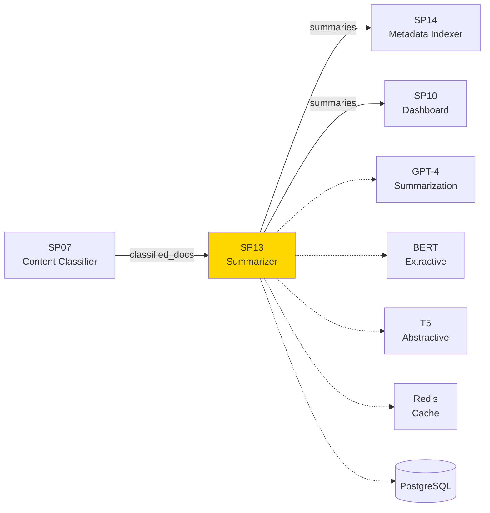
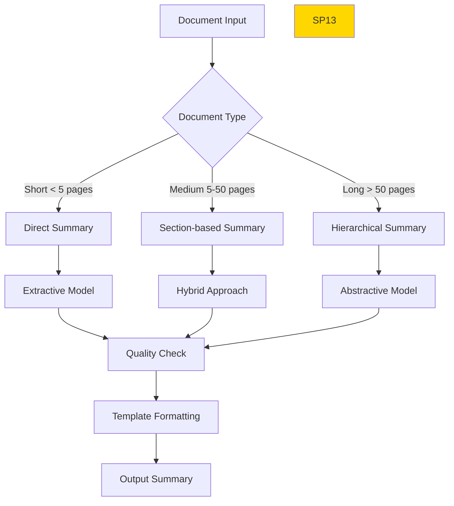

# SP13 - Document Summarizer

## Panoramica

**SP13 - Document Summarizer** è il componente che genera riassunti intelligenti e schede riepilogative di documenti lunghi nel Sistema di Gestione Documentale. Utilizza modelli di AI avanzati per estrarre i punti chiave, creare abstract e produrre rappresentazioni concise dei contenuti.



## Responsabilità

### Core Functions

1. **Extractive Summarization**
   - Estrazione frasi chiave dal documento
   - Ranking per importanza
   - Creazione abstract estrattivi

2. **Abstractive Summarization**
   - Generazione testo riassuntivo nuovo
   - Paraphrasing concettuale
   - Sintesi comprensibile

3. **Structured Summaries**
   - Schede con sezioni (oggetto, parti, conclusioni)
   - Estrazione metadati chiave
   - Template adattivi per tipo documento

4. **Multi-document Summaries**
   - Riassunti di insiemi documenti
   - Identificazione temi comuni
   - Sintesi comparativa
## 🏛️ Conformità Normativa

### Framework Normativi Applicabili

☑ CAD
☑ AI Act
☐ L. 241/1990 - Procedimento Amministrativo
☐ GDPR - Regolamento 2016/679
☐ eIDAS - Regolamento 2014/910
☐ D.Lgs 42/2004 - Codice Beni Culturali
☐ D.Lgs 152/2006 - Codice dell'Ambiente
☐ D.Lgs 33/2013 - Decreto Trasparenza

**Per mappatura completa articoli → implementazioni**, vedi [Conformità Normativa Standard Template](../../templates/conformita-normativa-standard.md) e [COMPLIANCE-MATRIX.md](../../COMPLIANCE-MATRIX.md).

### Requisiti Principali Implementati

| Framework | Requisiti Principali | Status | Riferimenti |
|-----------|-------------------|--------|-------------|
| CAD | Art. 1, Art. 21, Art. 22, Art. 62 | ✅ Implementato | [Dettagli](../../templates/conformita-normativa-standard.md) |
| AI Act | Art. 6, Art. 13, Art. 22 | ✅ Implementato | [Dettagli](../../templates/conformita-normativa-standard.md) |

### Conformità Normativa - Checklist

- [ ] Tutti i framework normativi applicabili identificati
- [ ] Articoli rilevanti mappati alle responsabilità SP
- [ ] GDPR: Data protection by design implementato (se applicabile)
- [ ] eIDAS: Firma digitale supportata (se applicabile)
- [ ] AI Act: Supervisione umana e trasparenza (se applicabile)
- [ ] Tracciabilità audit completa mantenuta
- [ ] Documentation conformità aggiornata

**Nota**: Dettagli di conformità completi nella sezione "## 🏛️ Conformità Normativa" del template standard.

---


## Architettura Tecnica

### Pipeline di Summarization



### Tecnologie Utilizzate

| Componente | Tecnologia | Versione | Scopo |
|------------|------------|----------|--------|
| Extractive Model | BERTSum | Custom | Estrazione frasi chiave |
| Abstractive Model | T5 | 1.1 | Generazione riassunti |
| LLM | GPT-4 | API | Summarization avanzata |
| Template Engine | Jinja2 | 3.1.2 | Formattazione output |
| Quality Check | ROUGE | 1.0.1 | Valutazione qualità |
| Cache | Redis | 7.2 | Cache riassunti |

### Esempi di Output

#### Scheda Riassuntiva Delibera

```
📄 **DELIBERA GIUNTA COMUNALE N. 123/2025**

**Oggetto**: Approvazione Piano Urbanistico Zona Industriale

**Data**: 15 novembre 2025

**Proponente**: Assessore Urbanistica

**Importo**: €150.000,00

**CIG**: Z1234567890

**Punti Chiave**:
- Approvazione variante piano regolatore
- Destinazione area industriale 25.000 mq
- Vincoli paesaggistici D.Lgs 42/2004
- Tempi realizzazione: 24 mesi

**Dispositivo**:
La Giunta approva il piano con le prescrizioni indicate.

**Motivazioni**:
Necessità sviluppo economico zona, compatibilità ambientale verificata.
```

#### Riassunto Contratto

```
📋 **RIASSUNTO CONTRATTO**

**Tipo**: Appalto fornitura servizi IT
**Parti**: Comune Milano (Committente) - Tech Solutions Srl (Appaltatore)
**Oggetto**: Sviluppo sistema gestionale documentale
**Importo**: €85.000,00 + IVA
**Durata**: 12 mesi dal 01/01/2026
**Obblighi principali**:
- Sviluppo software personalizzato
- Formazione operatori 20 ore
- Manutenzione post-consegna 6 mesi
- Penali ritardi: 0.5% giorno
```

### API Endpoints

```yaml
POST /api/v1/summarize/document
  - Input: {"document_id": "string", "type": "extractive|abstractive|structured"}
  - Output: {"summary": "string", "key_points": [...], "confidence": 0.89}

POST /api/v1/summarize/batch
  - Input: {"document_ids": ["id1", "id2"], "summary_type": "comparative"}
  - Output: Batch summary results

GET /api/v1/summarize/{doc_id}/status
  - Output: Summarization status and progress
```

### Configurazione

```yaml
sp13:
  models:
    extractive: 'bert-extractive-summarizer'
    abstractive: 't5-base-italian'
    llm: 'gpt-4'
  templates:
    delibera: 'delibera_summary.j2'
    contratto: 'contract_summary.j2'
    default: 'generic_summary.j2'
  quality:
    min_rouge_score: 0.7
    max_length_ratio: 0.3  # 30% lunghezza originale
  cache:
    ttl_hours: 24
```

### Performance Metrics

- **Coverage**: >90% documenti supportati
- **ROUGE Score**: >0.75 media
- **Readability**: Livello B1 italiano
- **Latency**: <5s per documento medio
- **Accuracy**: >85% informazioni chiave catturate

### Sicurezza

- **Content Filtering**: Rimozione dati sensibili nei riassunti pubblici
- **Access Control**: Riassunti visibili solo utenti autorizzati
- **Audit**: Tracciamento generazione riassunti

### Evoluzione

1. **Multilingual**: Supporto riassunti multilingua
2. **Visual Summaries**: Infografiche automatiche
3. **Interactive Summaries**: Click per dettagli originali
4. **Domain-specific**: Modelli fine-tuned per PA</content>
<parameter name="filePath">/Users/giangio/Documents/GitHub/Interzen/Interzen.POC/ZenIA/docs/use_cases/UC1 - Sistema di Gestione Documentale/01 SP13 - Document Summarizer.md