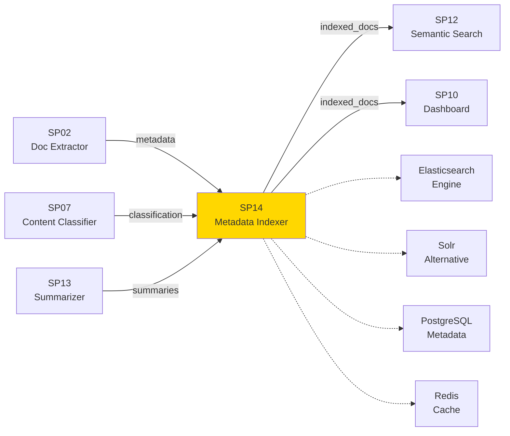
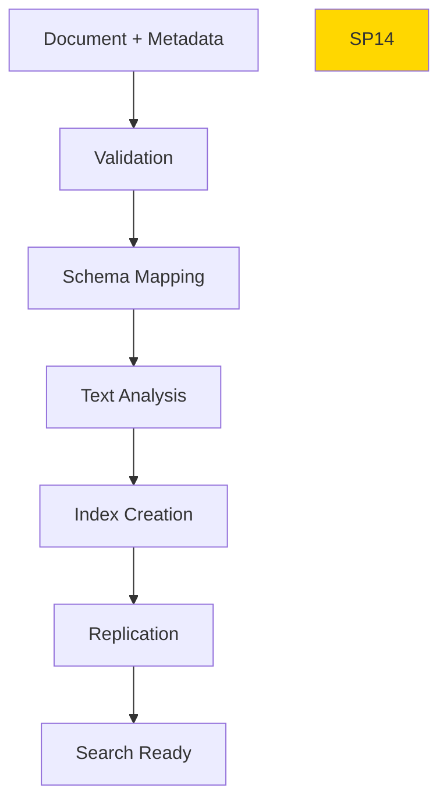

# SP14 - Metadata Indexer

## Panoramica

**SP14 - Metadata Indexer** è il componente che indicizza i metadati estratti e i documenti nel Sistema di Gestione Documentale, creando indici ricercabili per query veloci e scalabili. Gestisce sia metadati strutturati che full-text search.



## Responsabilità

### Core Functions

1. **Metadata Indexing**
   - Indicizzazione metadati strutturati
   - Schema flessibile per tipi documento
   - Versioning metadati

2. **Full-text Indexing**
   - Indicizzazione contenuto testuale
   - Analisi linguistica italiana
   - Stemming e lemmatization

3. **Search Optimization**
   - Creazione indici invertiti
   - Ottimizzazione query performance
   - Auto-completion e suggestions

4. **Data Consistency**
   - Sincronizzazione con storage documenti
   - Aggiornamenti real-time
   - Gestione duplicati

## Architettura Tecnica

### Indexing Pipeline



### Tecnologie Utilizzate

| Componente | Tecnologia | Versione | Scopo |
|------------|------------|----------|--------|
| Search Engine | Elasticsearch | 8.11 | Indicizzazione e ricerca |
| Database | PostgreSQL | 15 | Metadati strutturati |
| Cache | Redis | 7.2 | Cache query frequenti |
| Message Queue | Kafka | 3.6 | Streaming aggiornamenti |
| API | Elasticsearch REST |  | Interfaccia ricerca |

### Schema Metadati

```json
{
  "document": {
    "id": "DOC-2025-001234",
    "type": "DELIBERA",
    "category": "URBANISTICA",
    "title": "Approvazione Piano Urbanistico",
    "author": "Comune Milano",
    "creation_date": "2025-11-15T10:00:00Z",
    "language": "it",
    "page_count": 5,
    "file_size": 2048576,
    "checksum": "sha256:...",
    "tags": ["urbanistica", "piano", "approvazione"],
    "entities": {
      "organizations": ["Comune Milano"],
      "dates": ["2025-11-15"],
      "amounts": [150000.00]
    },
    "summary": "Riassunto delibera...",
    "access_level": "public",
    "retention_period": "10_years"
  }
}
```

### API Endpoints

```yaml
POST /api/v1/index/document
  - Input: Document metadata JSON
  - Output: Index confirmation

PUT /api/v1/index/document/{id}
  - Input: Updated metadata
  - Output: Update confirmation

DELETE /api/v1/index/document/{id}
  - Output: Deletion confirmation

POST /api/v1/index/batch
  - Input: Array of documents
  - Output: Batch indexing results

GET /api/v1/index/stats
  - Output: Indexing statistics
```

### Configurazione

```yaml
sp14:
  elasticsearch:
    hosts: ['localhost:9200']
    index_name: 'documents'
    shards: 3
    replicas: 1
  mapping:
    dynamic: 'strict'
    properties:
      title: {type: 'text', analyzer: 'italian'}
      content: {type: 'text', analyzer: 'italian'}
      metadata: {type: 'object'}
  cache:
    ttl_seconds: 3600
  batch:
    size: 100
    timeout_seconds: 30
```

### Performance Metrics

- **Indexing Throughput**: 500 documenti/minuto
- **Query Latency**: <50ms media
- **Index Size**: Scalabile a milioni documenti
- **Uptime**: 99.9%
- **Data Freshness**: <5s delay

### Sicurezza

- **Field-level Security**: Controllo accesso campi
- **Encryption**: Dati sensibili criptati
- **Audit**: Log tutte operazioni indicizzazione
- **Compliance**: GDPR per dati personali

### Evoluzione

1. **Graph Indexing**: Relazioni tra documenti
2. **Vector Indexing**: Integrazione embeddings
3. **Real-time Updates**: Streaming indicizzazione
4. **Multi-tenant**: Isolamento tenant</content>
<parameter name="filePath">/Users/giangio/Documents/GitHub/Interzen/Interzen.POC/ZenIA/docs/use_cases/UC1 - Sistema di Gestione Documentale/01 SP14 - Metadata Indexer.md