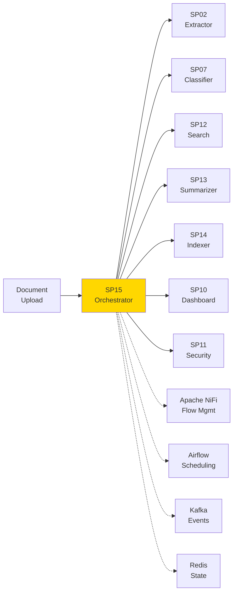
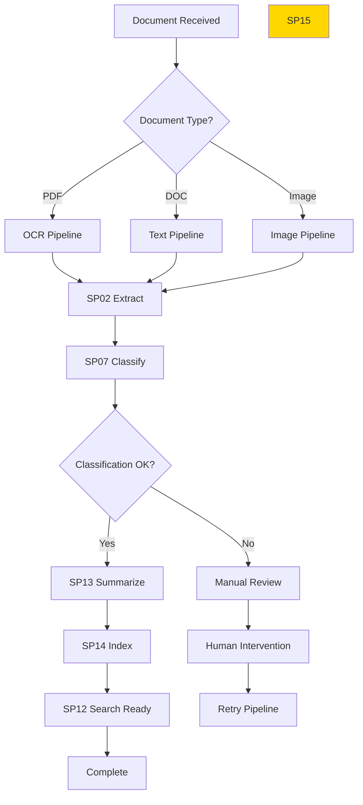

# SP15 - Document Workflow Orchestrator

## Panoramica

**SP15 - Document Workflow Orchestrator** è il componente che coordina l'intero flusso di processamento dei documenti nel Sistema di Gestione Documentale. Gestisce l'orchestrazione delle pipeline, il routing intelligente, il monitoraggio dello stato e l'integrazione con sistemi esterni.



## Responsabilità

### Core Functions

1. **Workflow Management**
   - Definizione pipeline processamento
   - Esecuzione sequenziale/asincrona
   - Gestione dipendenze componenti

2. **State Management**
   - Tracking stato documenti
   - Persistenza workflow
   - Recovery da failure

3. **Event Processing**
   - Streaming eventi documento
   - Trigger azioni automatiche
   - Notifiche real-time

4. **Integration Hub**
   - Connessione con sistemi esterni
   - API gateway per componenti
   - Data flow orchestration
## 🏛️ Conformità Normativa

### Framework Normativi Applicabili

☑ CAD
☑ GDPR
☐ L. 241/1990 - Procedimento Amministrativo
☐ eIDAS - Regolamento 2014/910
☐ AI Act - Regolamento 2024/1689
☐ D.Lgs 42/2004 - Codice Beni Culturali
☐ D.Lgs 152/2006 - Codice dell'Ambiente
☐ D.Lgs 33/2013 - Decreto Trasparenza

**Per mappatura completa articoli → implementazioni**, vedi [Conformità Normativa Standard Template](../../templates/conformita-normativa-standard.md) e [COMPLIANCE-MATRIX.md](../../COMPLIANCE-MATRIX.md).

### Requisiti Principali Implementati

| Framework | Requisiti Principali | Status | Riferimenti |
|-----------|-------------------|--------|-------------|
| CAD | Art. 1, Art. 21, Art. 22, Art. 62 | ✅ Implementato | [Dettagli](../../templates/conformita-normativa-standard.md) |
| GDPR | Art. 5, Art. 32 | ✅ Implementato | [Dettagli](../../templates/conformita-normativa-standard.md) |

### Conformità Normativa - Checklist

- [ ] Tutti i framework normativi applicabili identificati
- [ ] Articoli rilevanti mappati alle responsabilità SP
- [ ] GDPR: Data protection by design implementato (se applicabile)
- [ ] eIDAS: Firma digitale supportata (se applicabile)
- [ ] AI Act: Supervisione umana e trasparenza (se applicabile)
- [ ] Tracciabilità audit completa mantenuta
- [ ] Documentation conformità aggiornata

**Nota**: Dettagli di conformità completi nella sezione "## 🏛️ Conformità Normativa" del template standard.

---


## Architettura Tecnica

### Workflow Engine



### Tecnologie Utilizzate

| Componente | Tecnologia | Versione | Scopo |
|------------|------------|----------|--------|
| Flow Engine | Apache NiFi | 1.24 | Data flow orchestration |
| Scheduler | Apache Airflow | 2.8 | Workflow scheduling |
| Message Bus | Apache Kafka | 3.6 | Event streaming |
| State Store | Redis | 7.2 | Workflow state |
| API Gateway | Kong | 3.5 | API management |
| Monitoring | Prometheus | 2.47 | Metrics collection |

### Workflow Templates

#### Pipeline Base Documento

```yaml
name: document_processing_pipeline
steps:
  - name: extract
    component: SP02
    input: document_file
    output: extracted_text
    timeout: 30s
    retry: 3
    
  - name: classify
    component: SP07
    input: extracted_text
    output: classification
    depends_on: extract
    timeout: 10s
    
  - name: summarize
    component: SP13
    input: [extracted_text, classification]
    output: summary
    depends_on: classify
    timeout: 60s
    
  - name: index
    component: SP14
    input: [extracted_text, classification, summary]
    output: indexed_document
    depends_on: summarize
    timeout: 15s
```

### API Endpoints

```yaml
POST /api/v1/workflows/start
  - Input: {"document_id": "string", "pipeline": "string"}
  - Output: {"workflow_id": "string", "status": "started"}

GET /api/v1/workflows/{id}/status
  - Output: Current workflow status and progress

POST /api/v1/workflows/{id}/pause
  - Output: Pause confirmation

POST /api/v1/workflows/{id}/resume
  - Output: Resume confirmation

GET /api/v1/workflows/metrics
  - Output: Workflow performance metrics
```

### Configurazione

```yaml
sp15:
  nifi:
    url: 'http://nifi:8080'
    registry: 'http://nifi-registry:18080'
  airflow:
    dag_folder: '/opt/airflow/dags'
    default_timeout: '1h'
  kafka:
    brokers: ['kafka:9092']
    topics:
      document_events: 'document-events'
      workflow_events: 'workflow-events'
  redis:
    host: 'redis:6379'
    db: 1
    key_prefix: 'workflow:'
```

### Performance Metrics

- **Throughput**: 100 documenti/minuto
- **Latency Media**: 45s per pipeline completa
- **Success Rate**: >95%
- **Scalability**: Auto-scaling basato load
- **Reliability**: 99.9% uptime

### Sicurezza

- **Authentication**: JWT per API access
- **Authorization**: RBAC per workflow operations
- **Encryption**: TLS per comunicazioni
- **Audit**: Log completo operazioni

### Evoluzione

1. **Event-driven**: Reattività eventi real-time
2. **AI Optimization**: Routing intelligente workflow
3. **Multi-cloud**: Orchestrazione ibrida
4. **Low-code**: Designer workflow visuale</content>
<parameter name="filePath">/Users/giangio/Documents/GitHub/Interzen/Interzen.POC/ZenIA/docs/use_cases/UC1 - Sistema di Gestione Documentale/01 SP15 - Document Workflow Orchestrator.md