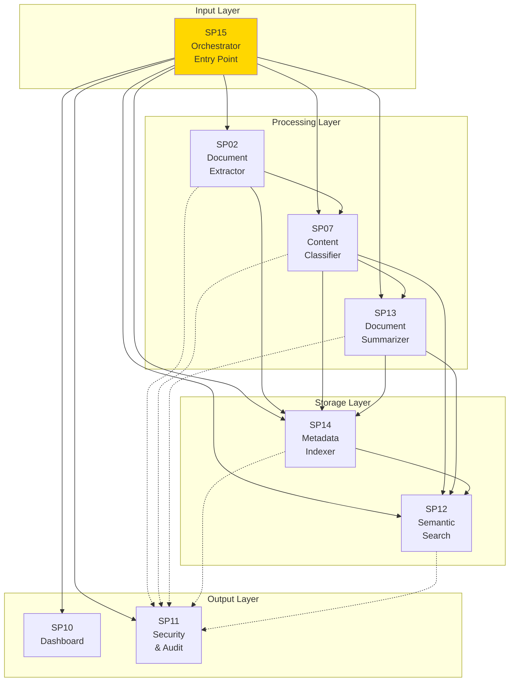
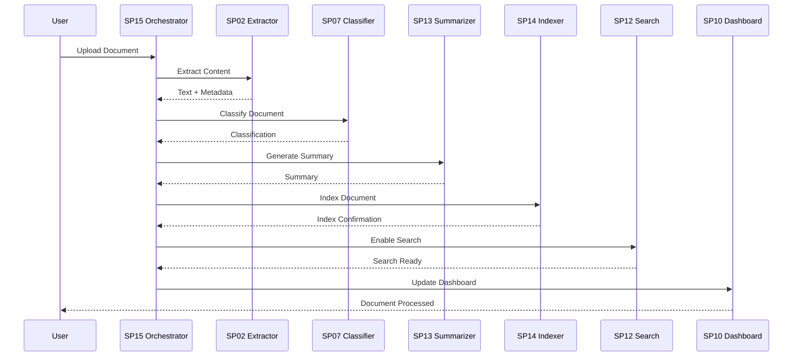
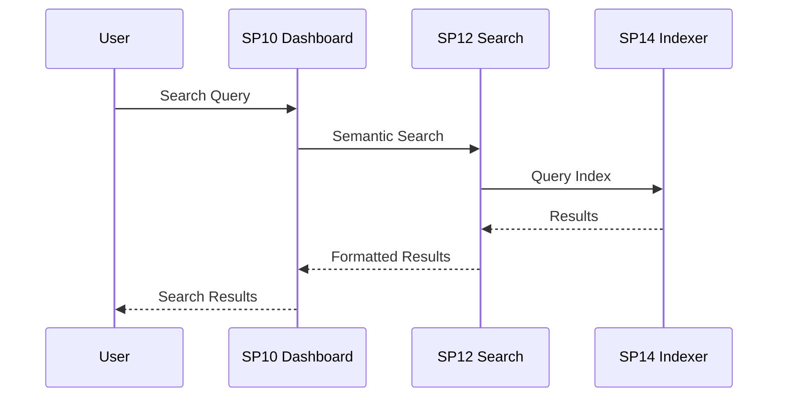

# Matrice Dipendenze Sottoprogetti - UC1 Sistema di Gestione Documentale

## Overview Dipendenze

Questa matrice mostra le interdipendenze tra i sottoprogetti del Sistema di Gestione Documentale, identificando relazioni di dipendenza, flusso dati e punti di integrazione.

## Matrice Dipendenze Dettagliata

| Sottoprogetto | Dipendenze In | Dipendenze Out | Tipo Dipendenza | Dati Scambiati |
|---------------|---------------|----------------|-----------------|----------------|
| **SP15** Document Workflow Orchestrator | - | SP02, SP07, SP13, SP14, SP12, SP10, SP11 | Orchestrazione | Workflow commands, status updates |
| **SP02** Document Extractor | SP15 | SP07, SP14, SP11 | Processing | Extracted text, metadata, OCR results |
| **SP07** Content Classifier | SP15, SP02 | SP13, SP14, SP12, SP11 | Classification | Document type, category, entities |
| **SP13** Document Summarizer | SP15, SP07 | SP14, SP12, SP11 | Summarization | Summaries, key points, structured data |
| **SP14** Metadata Indexer | SP15, SP02, SP07, SP13 | SP12, SP11 | Indexing | Indexed documents, search indices |
| **SP12** Semantic Search & Q&A | SP15, SP07, SP13, SP14 | SP10, SP11 | Search | Search results, Q&A responses |
| **SP10** Dashboard | SP15, SP12 | - | Presentation | UI data, metrics, visualizations |
| **SP11** Security & Audit | SP15, SP02, SP07, SP13, SP14, SP12 | - | Security | Audit logs, security events |

## Pipeline Operative

### Pipeline Principale: Document Processing

### Pipeline Secondaria: Search Query

## Punti di Integrazione

### API Endpoints

| Endpoint | Metodo | Produttore | Consumatore | Scopo |
|----------|--------|------------|-------------|-------|
| `/api/v1/documents/upload` | POST | SP15 | External | Upload documento |
| `/api/v1/documents/extract` | POST | SP02 | SP15 | Estrazione contenuto |
| `/api/v1/documents/classify` | POST | SP07 | SP15 | Classificazione |
| `/api/v1/documents/summarize` | POST | SP13 | SP15 | Riassunto |
| `/api/v1/documents/index` | POST | SP14 | SP15 | Indicizzazione |
| `/api/v1/search/semantic` | POST | SP12 | SP10 | Ricerca semantica |
| `/api/v1/dashboard/metrics` | GET | SP10 | External | Metriche |

### Event Stream

| Event | Produttore | Consumatore | Trigger |
|-------|------------|-------------|---------|
| `document.uploaded` | SP15 | SP02 | Upload completato |
| `document.extracted` | SP02 | SP07, SP14 | Estrazione completata |
| `document.classified` | SP07 | SP13, SP14 | Classificazione completata |
| `document.summarized` | SP13 | SP14 | Riassunto completato |
| `document.indexed` | SP14 | SP12 | Indicizzazione completata |
| `search.performed` | SP12 | SP10 | Query eseguita |

## Considerazioni Architetturali

### Accoppiamento
- **Loose Coupling**: Comunicazione via eventi/API
- **High Cohesion**: Ogni SP ha responsabilità singola
- **Fault Tolerance**: Circuit breaker per failure isolation

### Scalabilità
- **Horizontal Scaling**: SP indipendenti scalabili separatamente
- **Load Balancing**: API Gateway distribuisce load
- **Caching**: Redis per ridurre load su componenti downstream

### Monitoraggio
- **Health Checks**: Ogni SP espone endpoint health
- **Metrics**: Prometheus per performance monitoring
- **Tracing**: Distributed tracing per request flow

### Sicurezza
- **Authentication**: JWT su ogni API call
- **Authorization**: RBAC per accesso risorse
- **Encryption**: TLS per data in transit

## Testing Strategy

### Unit Testing
- Ogni SP testato isolatamente
- Mock per dipendenze esterne

### Integration Testing
- Test pipeline end-to-end
- Contract testing per API

### Performance Testing
- Load testing per scalabilità
- Stress testing per limiti

### Security Testing
- Penetration testing
- Vulnerability scanning
- Compliance auditing</content>
<parameter name="filePath">/Users/giangio/Documents/GitHub/Interzen/Interzen.POC/ZenIA/docs/use_cases/UC1 - Sistema di Gestione Documentale/02 Matrice Dipendenze Sottoprogetti UC1.md
