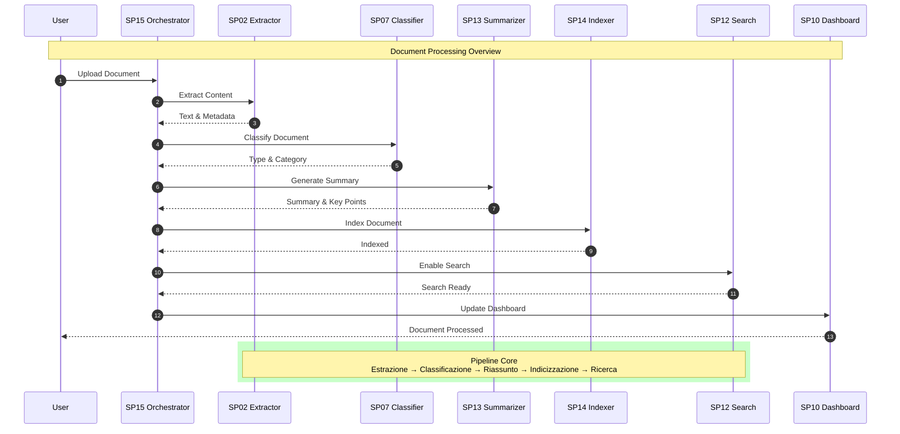

# Sequence Diagram - Overview Semplificato (UC1)

## Panoramica Semplificata del Flusso Documentale

Questo diagramma mostra il flusso principale di processamento documenti in versione semplificata, focalizzandosi sui passaggi essenziali.

## Spiegazione dei Passaggi

### 1. Upload Documento
- Utente carica documento via interfaccia
- SP15 Orchestrator riceve e valida richiesta

### 2. Estrazione Contenuto
- SP02 estrae testo da PDF/immagini
- Identifica metadati base (autore, data, etc.)

### 3. Classificazione
- SP07 determina tipo documento (delibera, contratto, etc.)
- Assegna categoria e sottocategoria

### 4. Generazione Riassunto
- SP13 crea riassunto automatico
- Estrae punti chiave e informazioni rilevanti

### 5. Indicizzazione
- SP14 rende documento ricercabile
- Crea indici full-text e semantici

### 6. Abilitazione Ricerca
- SP12 prepara motore di ricerca
- Documento diventa interrogabile

### 7. Aggiornamento Dashboard
- SP10 mostra stato e risultati
- Utente riceve notifica completamento

## Tempi Tipici

- **Totale**: 15-45 secondi
- **Estrazione**: 3-8 secondi
- **Classificazione**: <1 secondo
- **Riassunto**: 2-5 secondi
- **Indicizzazione**: 1-3 secondi

## Punti di Decisione

### Classificazione Alta Confidenza
- Procede automaticamente
- Documento pronto per ricerca

### Classificazione Bassa Confidenza
- Flag per revisione umana
- Possibilità correzione manuale

### Errori di Processamento
- Retry automatico
- Alert per intervento operatore</content>
<parameter name="filePath">/Users/giangio/Documents/GitHub/Interzen/Interzen.POC/ZenIA/docs/use_cases/UC1 - Sistema di Gestione Documentale/01 Sequence - Overview Semplificato.md
