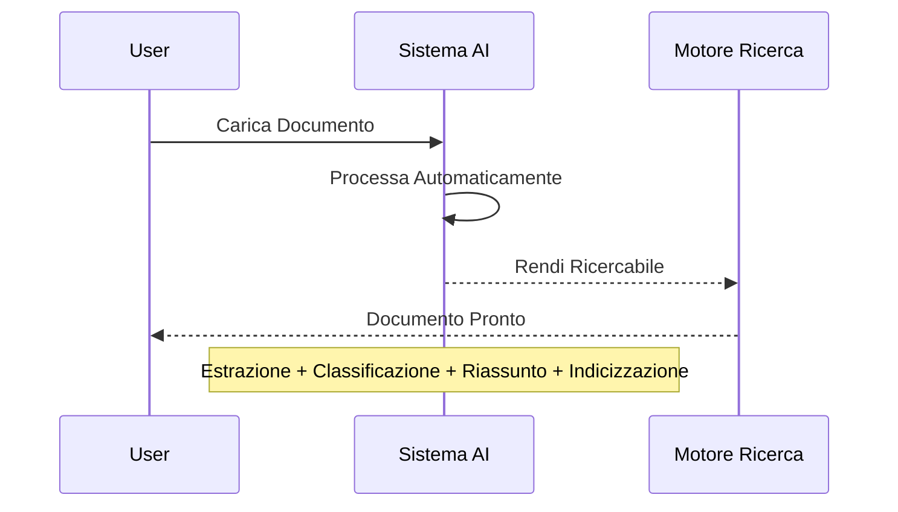

# Sequence Diagram - Ultra Semplificato (UC1)

## Flusso Ultra-Semplificato Documenti

Versione minimal del processamento documenti.

## Spiegazione Minimal

1. **Carica**: Utente upload documento
2. **Processa**: AI elabora automaticamente
3. **Rendi Ricercabile**: Sistema abilita ricerca
4. **Pronto**: Documento disponibile per query

## Concetti Chiave

- **Automatico**: Tutto gestito dall'AI
- **Veloce**: 15-45 secondi
- **Ricercabile**: Query semantiche abilitate
- **Trasparente**: Dashboard mostra progresso</content>
<parameter name="filePath">/Users/giangio/Documents/GitHub/Interzen/Interzen.POC/ZenIA/docs/use_cases/UC1 - Sistema di Gestione Documentale/01 Sequence - Ultra Semplificato.md
