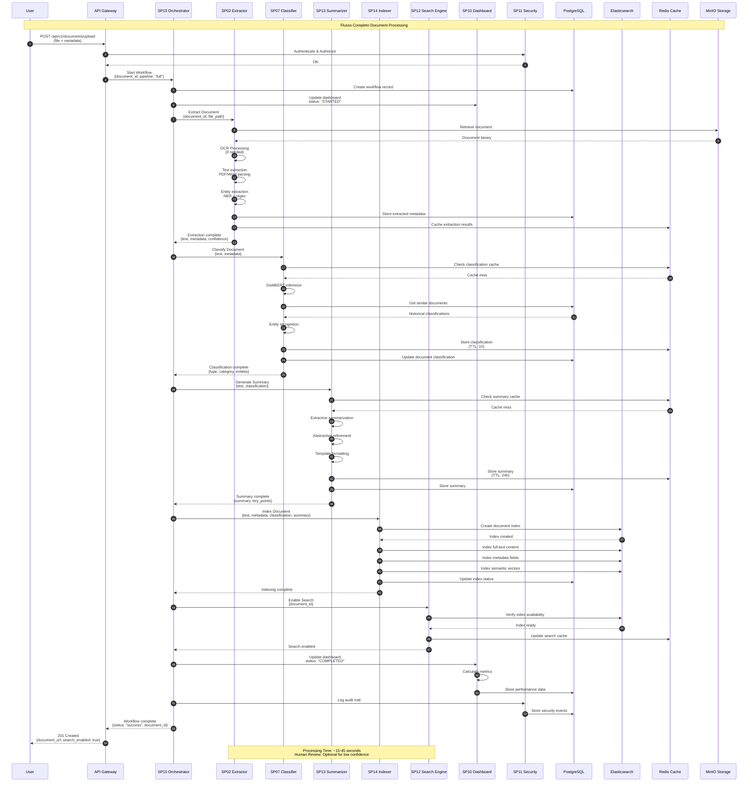

# Sequence Diagram - Document Processing Completo (UC1)

## Flusso Completo di Processamento Documenti

Questo diagramma mostra l'intero flusso di processamento di un documento nel Sistema di Gestione Documentale, dall'upload alla ricerca abilitata.

## Dettagli del Flusso

### Fase 1: Upload e Autenticazione
- **API Gateway**: Riceve upload, valida autenticazione
- **SP11 Security**: Verifica permessi utente
- **SP15 Orchestrator**: Inizializza workflow nel DB

### Fase 2: Estrazione Contenuto
- **SP02 Extractor**: OCR + parsing testo
- **Entity Recognition**: Estrae metadati strutturati
- **Caching**: Risultati temporaneamente in Redis

### Fase 3: Classificazione
- **SP07 Classifier**: AI per tipo/categoria documento
- **Similarity Search**: Confronta con documenti storici
- **Confidence Scoring**: Valuta affidabilità classificazione

### Fase 4: Riassunto
- **SP13 Summarizer**: Genera abstract e punti chiave
- **Template-based**: Formattazione per tipo documento
- **Quality Check**: Valutazione leggibilità

### Fase 5: Indicizzazione
- **SP14 Indexer**: Crea indici Elasticsearch
- **Full-text**: Ricerca tradizionale
- **Semantic**: Vettori per ricerca AI
- **Metadata**: Campi strutturati

### Fase 6: Abilitazione Ricerca
- **SP12 Search**: Verifica disponibilità indici
- **Cache Warming**: Prepara risultati frequenti

### Fase 7: Completamento
- **SP10 Dashboard**: Aggiorna UI e metriche
- **SP11 Audit**: Traccia operazioni per compliance
- **Notifica**: Utente riceve conferma processamento

## Metriche di Performance

| Fase | Tempo Medio | SLA | Note |
|------|-------------|-----|------|
| Upload | <2s | 95% <5s | Include autenticazione |
| Estrazione | 3-8s | 95% <15s | Dipende da dimensione/complessità |
| Classificazione | 0.4-1s | 95% <2s | Cache hit: <0.1s |
| Riassunto | 2-5s | 95% <10s | LLM inference time |
| Indicizzazione | 1-3s | 95% <5s | Elasticsearch bulk |
| Totale | 15-45s | 95% <60s | End-to-end |

## Error Handling

### Error Scenarios
- **OCR Failure**: Fallback a text extraction manuale
- **Classification Low Confidence**: Flag per review umana
- **Indexing Timeout**: Retry con backoff
- **Storage Unavailable**: Queue per retry

### Recovery Mechanisms
- **Circuit Breaker**: Isolamento failure tra componenti
- **Dead Letter Queue**: Documenti falliti per analisi
- **Manual Override**: Possibilità intervento operatore

## Integration Points

### External Systems
- **Identity Provider**: Autenticazione utenti
- **File Storage**: MinIO/S3 per documenti
- **Search Frontend**: UI per query utente
- **Monitoring**: Prometheus per alerting

### Internal APIs
- **Workflow API**: Gestione stato processamento
- **Search API**: Query semantiche
- **Admin API**: Configurazione e manutenzione</content>
<parameter name="filePath">/Users/giangio/Documents/GitHub/Interzen/Interzen.POC/ZenIA/docs/use_cases/UC1 - Sistema di Gestione Documentale/01 Sequence - Document Processing Completo.md