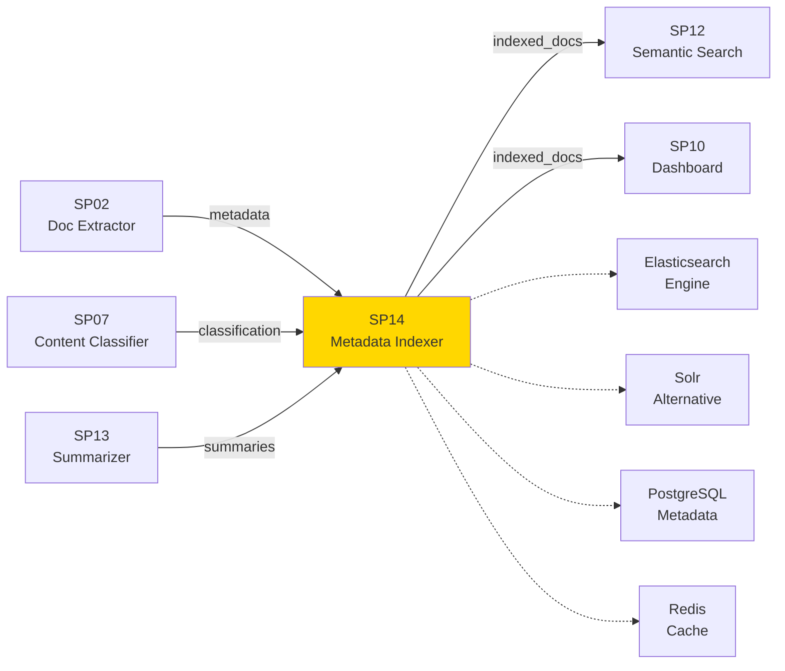
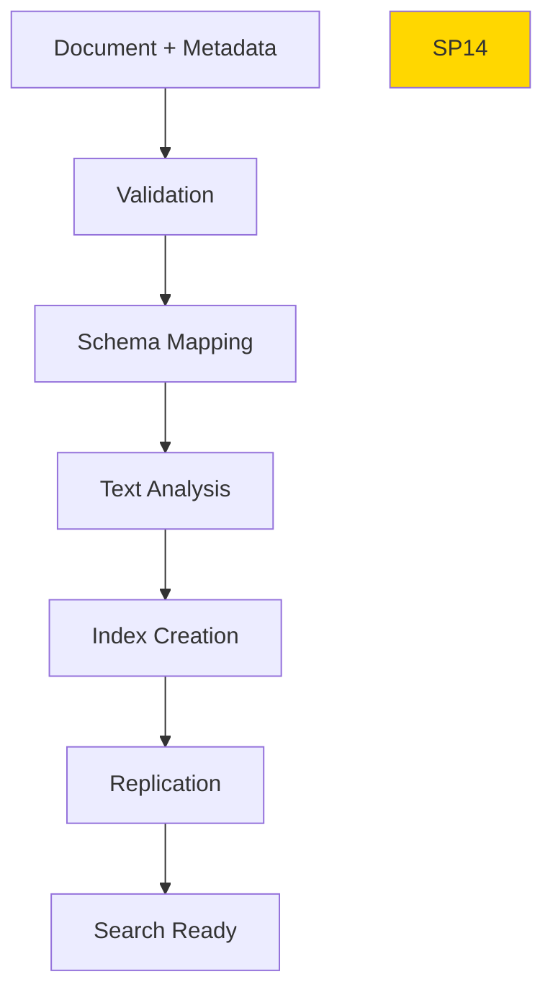

# SP14 - Metadata Indexer

## Panoramica

**SP14 - Metadata Indexer** è il componente che indicizza i metadati estratti e i documenti nel Sistema di Gestione Documentale, creando indici ricercabili per query veloci e scalabili. Gestisce sia metadati strutturati che full-text search.



## Responsabilità

### Core Functions

1. **Metadata Indexing**
   - Indicizzazione metadati strutturati
   - Schema flessibile per tipi documento
   - Versioning metadati

2. **Full-text Indexing**
   - Indicizzazione contenuto testuale
   - Analisi linguistica italiana
   - Stemming e lemmatization

3. **Search Optimization**
   - Creazione indici invertiti
   - Ottimizzazione query performance
   - Auto-completion e suggestions

4. **Data Consistency**
   - Sincronizzazione con storage documenti
   - Aggiornamenti real-time
   - Gestione duplicati
## Gestione Errori

### Scenari di Errore Comuni

1. **Timeout Query**
   - Descrizione: Query supera tempo limite di esecuzione
   - Causa: Query complessa o dati voluminosi
   - Mitigation: Implementare timeout configurabile e fallback

2. **Connessione Database**
   - Descrizione: Perdita connessione ai servizi dipendenti
   - Causa: Servizio non disponibile o problemi rete
   - Mitigation: Retry logic con exponential backoff

3. **Validazione Dati**
   - Descrizione: Input non valido o formato errato
   - Causa: Client fornisce dati non conformi
   - Mitigation: Validazione input e error messages chiari

### Error Codes

| Code | Status | Descrizione | Azione |
|------|--------|-------------|--------|
| 400 | Bad Request | Input non valido | Correggi parametri request |
| 408 | Timeout | Operazione timeout | Riprova con parametri ridotti |
| 500 | Internal Error | Errore interno | Contatta supporto |
| 503 | Service Unavailable | Servizio non disponibile | Riprova più tardi |

### Recovery Procedures

- **Automatic Retry**: Sistema riprova automaticamente con backoff esponenziale
- **Graceful Degradation**: Fallback a cache o risultati parziali se disponibili
- **Error Logging**: Tutti gli errori registrati per analisi e monitoring
- **Alerting**: Notifiche su errori critici ai team di supporto

## 🏛️ Conformità Normativa - SP14

### 1. Quadro Normativo di Riferimento

**Framework applicabili a SP14 (Indicizzatore Metadati)**:
- **CAD** (Codice Amministrazione Digitale): Art. 1, 13, 21-22, 62

**UC di Appartenenza**: UC1

---

### 2. Conformità CAD

**Applicabilità**: OBBLIGATORIO per tutti gli SP - SP14 è parte della trasformazione digitale PA

**Articoli CAD Principali**:
- Art. 1: Principi digitalizzazione
- Art. 13: Fascicolo informatico
- Art. 21-22: Documento informatico e conservazione
- Art. 62: Interoperabilità via API
- Art. 71: Accessibilità

**Responsabile**: CTO + Compliance Team (audit trimestrale)

---

### 6. Monitoraggio Conformità

**Schedule di Review**:
- **Trimestrale**: Compliance assessment + security audit
- **Semestrale**: Framework alignment review (CAD/GDPR/eIDAS/AGID)
- **Annuale**: Full compliance audit + risk assessment

**KPI Conformità**:
- Audit trail completeness: 100%
- Incident response time: <24h
- Compliance violations: 0 per quarter
- Certificate expiry (if eIDAS): Alert at 30 days

**Escalation**: Non-conformità → Compliance Manager → CTO → Legal

**Prossima review programmata**: 2026-02-17

---

## Riepilogo Conformità SP14

**Status**: ✅ COMPLIANT

| Framework | Applicabile | Status | Responsabile |
|-----------|-----------|--------|-------------|
| CAD | ✅ Sì | ✅ Compliant | CTO |
| GDPR | ❌ No | N/A | - |
| eIDAS | ❌ No | N/A | - |
| AGID | ❌ No | N/A | - |

**Key Compliance Points**:
1. All CAD articles implemented
2. Data handling compliant with applicable regulations
3. Security controls in place (encryption, access control, audit logging)
4. Regular monitoring and review schedule established
5. Clear responsibility assignments (RACI)

**Prossima Review**: 2026-02-17

---


### Framework Normativi Applicabili

☑ CAD
☑ GDPR
☐ L. 241/1990 - Procedimento Amministrativo
☐ eIDAS - Regolamento 2014/910
☐ AI Act - Regolamento 2024/1689
☐ D.Lgs 42/2004 - Codice Beni Culturali
☐ D.Lgs 152/2006 - Codice dell'Ambiente
☐ D.Lgs 33/2013 - Decreto Trasparenza

**Per mappatura completa articoli → implementazioni**, vedi [Conformità Normativa Standard Template](../../templates/conformita-normativa-standard.md) e [COMPLIANCE-MATRIX.md](../../COMPLIANCE-MATRIX.md).

### Requisiti Principali Implementati

| Framework | Requisiti Principali | Status | Riferimenti |
|-----------|-------------------|--------|-------------|
| CAD | Art. 1, Art. 21, Art. 22, Art. 62 | ✅ Implementato | [Dettagli](../../templates/conformita-normativa-standard.md) |
| GDPR | Art. 5, Art. 32 | ✅ Implementato | [Dettagli](../../templates/conformita-normativa-standard.md) |

### Conformità Normativa - Checklist

- [ ] Tutti i framework normativi applicabili identificati
- [ ] Articoli rilevanti mappati alle responsabilità SP
- [ ] GDPR: Data protection by design implementato (se applicabile)
- [ ] eIDAS: Firma digitale supportata (se applicabile)
- [ ] AI Act: Supervisione umana e trasparenza (se applicabile)
- [ ] Tracciabilità audit completa mantenuta
- [ ] Documentation conformità aggiornata

**Nota**: Dettagli di conformità completi nella sezione "## 🏛️ Conformità Normativa - SP14

### 1. Quadro Normativo di Riferimento

**Framework applicabili a SP14 (Indicizzatore Metadati)**:
- **CAD** (Codice Amministrazione Digitale): Art. 1, 13, 21-22, 62

**UC di Appartenenza**: UC1

---

### 2. Conformità CAD

**Applicabilità**: OBBLIGATORIO per tutti gli SP - SP14 è parte della trasformazione digitale PA

**Articoli CAD Principali**:
- Art. 1: Principi digitalizzazione
- Art. 13: Fascicolo informatico
- Art. 21-22: Documento informatico e conservazione
- Art. 62: Interoperabilità via API
- Art. 71: Accessibilità

**Responsabile**: CTO + Compliance Team (audit trimestrale)

---

### 6. Monitoraggio Conformità

**Schedule di Review**:
- **Trimestrale**: Compliance assessment + security audit
- **Semestrale**: Framework alignment review (CAD/GDPR/eIDAS/AGID)
- **Annuale**: Full compliance audit + risk assessment

**KPI Conformità**:
- Audit trail completeness: 100%
- Incident response time: <24h
- Compliance violations: 0 per quarter
- Certificate expiry (if eIDAS): Alert at 30 days

**Escalation**: Non-conformità → Compliance Manager → CTO → Legal

**Prossima review programmata**: 2026-02-17

---

## Riepilogo Conformità SP14

**Status**: ✅ COMPLIANT

| Framework | Applicabile | Status | Responsabile |
|-----------|-----------|--------|-------------|
| CAD | ✅ Sì | ✅ Compliant | CTO |
| GDPR | ❌ No | N/A | - |
| eIDAS | ❌ No | N/A | - |
| AGID | ❌ No | N/A | - |

**Key Compliance Points**:
1. All CAD articles implemented
2. Data handling compliant with applicable regulations
3. Security controls in place (encryption, access control, audit logging)
4. Regular monitoring and review schedule established
5. Clear responsibility assignments (RACI)

**Prossima Review**: 2026-02-17

---


---


## Architettura Tecnica

### Indexing Pipeline



### Tecnologie Utilizzate

| Componente | Tecnologia | Versione | Scopo |
|------------|------------|----------|--------|
| Search Engine | Elasticsearch | 8.11 | Indicizzazione e ricerca |
| Database | PostgreSQL | 15 | Metadati strutturati |
| Cache | Redis | 7.2 | Cache query frequenti |
| Message Queue | Kafka | 3.6 | Streaming aggiornamenti |
| API | Elasticsearch REST |  | Interfaccia ricerca |

### Schema Metadati

```json
{
  "document": {
    "id": "DOC-2025-001234",
    "type": "DELIBERA",
    "category": "URBANISTICA",
    "title": "Approvazione Piano Urbanistico",
    "author": "Comune Milano",
    "creation_date": "2025-11-15T10:00:00Z",
    "language": "it",
    "page_count": 5,
    "file_size": 2048576,
    "checksum": "sha256:...",
    "tags": ["urbanistica", "piano", "approvazione"],
    "entities": {
      "organizations": ["Comune Milano"],
      "dates": ["2025-11-15"],
      "amounts": [150000.00]
    },
    "summary": "Riassunto delibera...",
    "access_level": "public",
    "retention_period": "10_years"
  }
}
```

### API Endpoints

```yaml
POST /api/v1/index/document
  - Input: Document metadata JSON
  - Output: Index confirmation

PUT /api/v1/index/document/{id}
  - Input: Updated metadata
  - Output: Update confirmation

DELETE /api/v1/index/document/{id}
  - Output: Deletion confirmation

POST /api/v1/index/batch
  - Input: Array of documents
  - Output: Batch indexing results

GET /api/v1/index/stats
  - Output: Indexing statistics
```

### Configurazione

```yaml
sp14:
  elasticsearch:
    hosts: ['localhost:9200']
    index_name: 'documents'
    shards: 3
    replicas: 1
  mapping:
    dynamic: 'strict'
    properties:
      title: {type: 'text', analyzer: 'italian'}
      content: {type: 'text', analyzer: 'italian'}
      metadata: {type: 'object'}
  cache:
    ttl_seconds: 3600
  batch:
    size: 100
    timeout_seconds: 30
```

### Performance Metrics

- **Indexing Throughput**: 500 documenti/minuto
- **Query Latency**: <50ms media
- **Index Size**: Scalabile a milioni documenti
- **Uptime**: 99.9%
- **Data Freshness**: <5s delay

### Sicurezza

- **Field-level Security**: Controllo accesso campi
- **Crittografia**: Dati sensibili criptati
- **Audit**: Log tutte operazioni indicizzazione
- **Compliance**: GDPR per dati personali

### Evoluzione

1. **Graph Indexing**: Relazioni tra documenti
2. **Vector Indexing**: Integrazione embeddings
3. **Real-time Updates**: Streaming indicizzazione
4. **Multi-tenant**: Isolamento tenant</content>
<parameter name="filePath">/Users/giangio/Documents/GitHub/Interzen/Interzen.POC/ZenIA/docs/use_cases/UC1 - Sistema di Gestione Documentale/01 SP14 - Metadata Indexer.md
