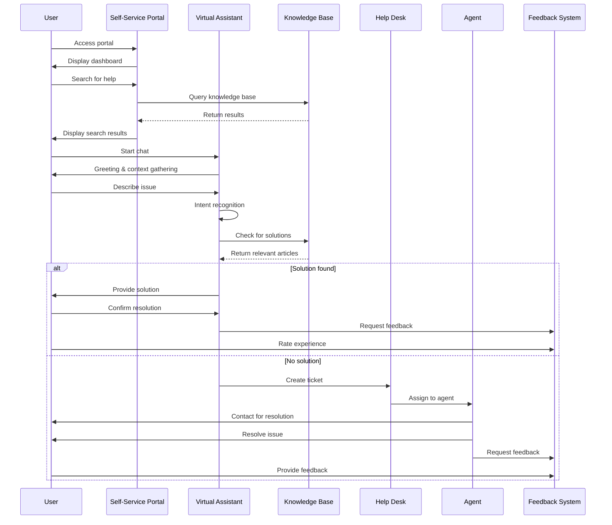
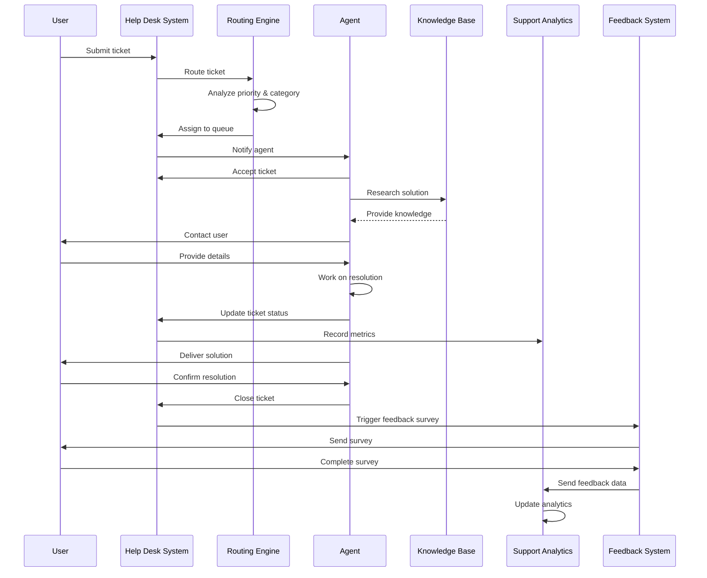
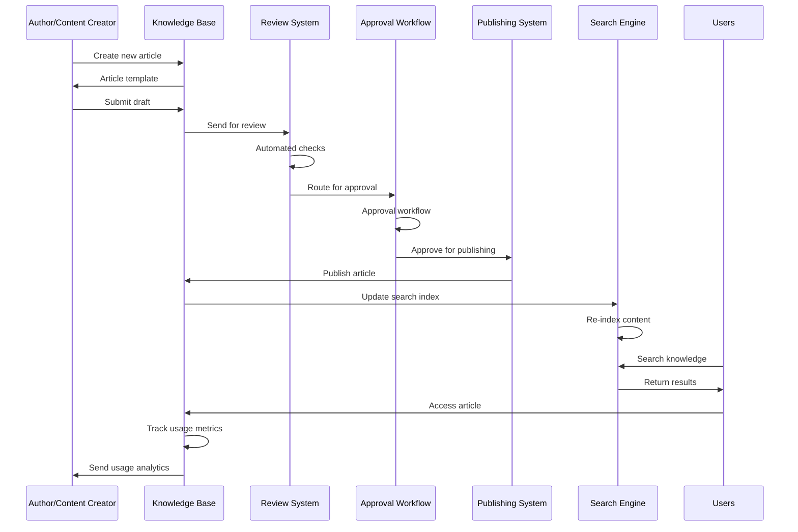
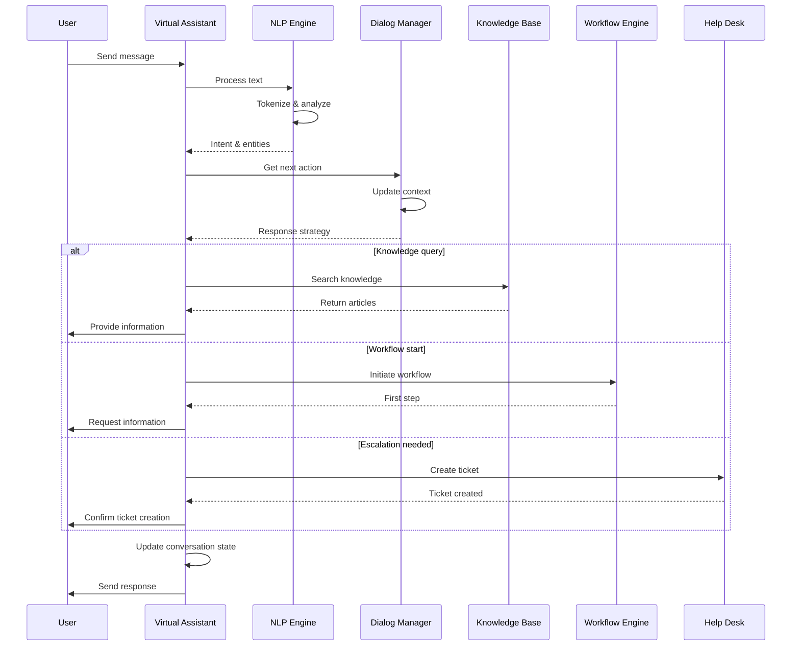
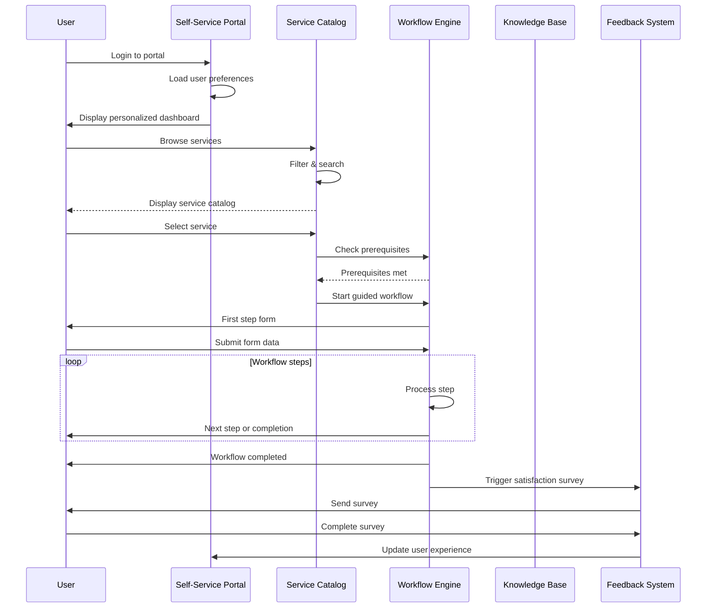
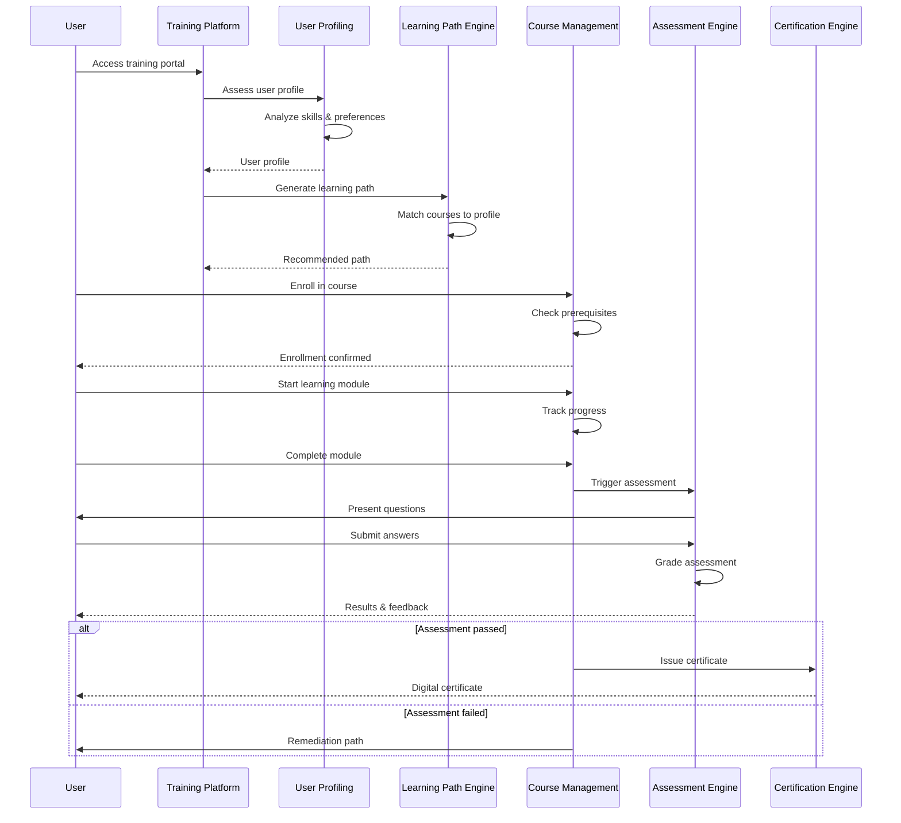
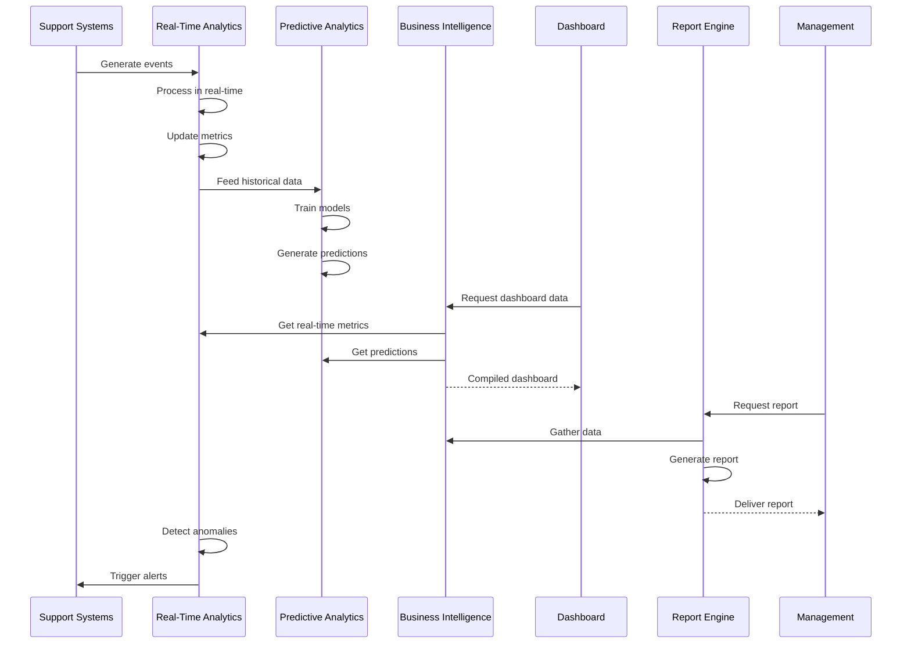
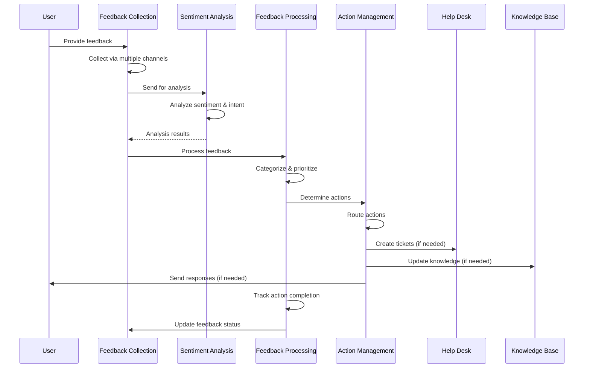

# 02 Sequence Diagrams UC10

## Support Request Flow



## Ticket Resolution Flow



## Knowledge Base Management Flow



## Virtual Assistant Interaction Flow



## Self-Service Portal Flow



## Training Platform Flow



## Support Analytics Flow



## Feedback Management Flow



## Integration Flow UC10 Components

```mermaid
sequenceDiagram
    participant U as User
    participant SP as Self-Service Portal
    participant VA as Virtual Assistant
    participant HD as Help Desk
    participant KB as Knowledge Base
    participant TP as Training Platform
    participant SA as Support Analytics
    participant FB as Feedback Management

    U->>SP: Access support
    SP->>VA: Route to assistant
    VA->>KB: Query knowledge
    KB-->>VA: Return solutions

    VA->>HD: Escalate if needed
    HD->>HD: Process ticket
    HD->>TP: Recommend training

    HD->>SA: Send metrics
    SA->>SA: Analyze performance

    HD->>FB: Collect feedback
    FB->>FB: Process & analyze
    FB->>KB: Update knowledge base
    FB->>HD: Trigger improvements

    SA->>SP: Update portal content
    SA->>VA: Improve responses
    SA->>HD: Optimize routing
```</content>
<parameter name="filePath">/Users/giangio/Documents/GitHub/Interzen/Interzen.POC/ZenIA/docs/use_cases/UC10 - Supporto all'Utente/02 Sequence Diagrams UC10.md