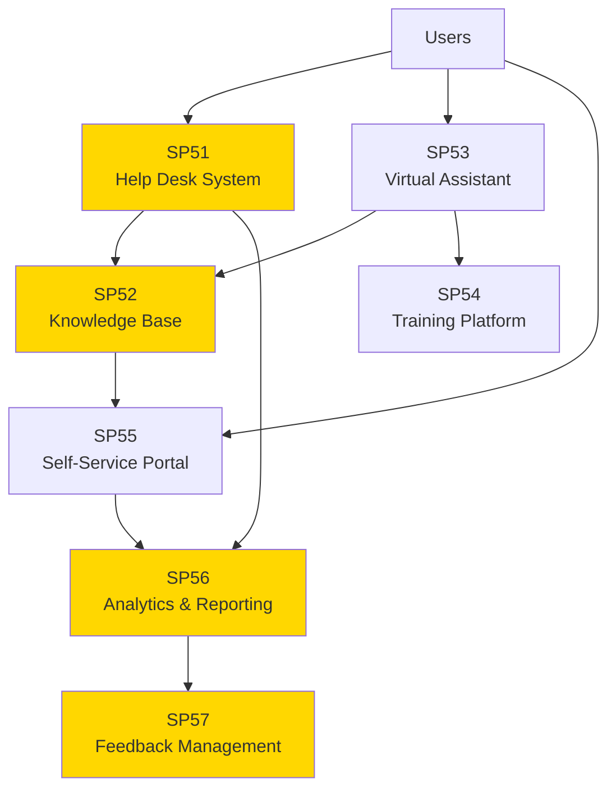

# Matrice Dipendenze - UC10 Supporto all'Utente

## Overview



## Dipendenze per SP

| SP | Nome | Input From | Output To | Criticità |
|---|---|---|---|---|
| **SP51** | Help Desk System | Users, SP56 | SP52, SP56, SP57 | CRITICA |
| **SP52** | Knowledge Base Management | SP51, SP53, SP55 | SP51, SP53, SP55, SP56 | CRITICA |
| **SP53** | Virtual Assistant & Chatbot | Users, SP52 | SP52, SP54, SP56 | ALTA |
| **SP54** | User Training Platform | SP53, SP55 | Learning analytics, SP56 | MEDIA |
| **SP55** | Self-Service Portal | Users, SP52 | SP56, SP57 | ALTA |
| **SP56** | Support Analytics & Reporting | SP51, SP52, SP53, SP55 | Dashboard, SP57, Decision Support | ALTA |
| **SP57** | User Feedback Management | SP56, Users | Improvement insights, Analytics | MEDIA |

## Flusso Principale

**Entry Points** (Users):
- SP51 (Help Desk) - per supporto umano
- SP53 (Virtual Assistant) - per supporto automatizzato
- SP55 (Self-Service Portal) - per self-service

**Core Flow**:
```
Users
├→ SP51 (Help Desk) ─→ SP52 (KB) ─→ SP56 (Analytics) ─→ SP57 (Feedback)
├→ SP53 (Chat) ──────┘          └─→ SP54 (Training)
└→ SP55 (Self-Service) ─────────┘
```

**Resolution Path**:
1. User contatta via SP51/SP53/SP55
2. System ricerca KB (SP52) per soluzione
3. Se KB insufficiente, escalation a SP51 (Help Desk)
4. Dopo risoluzione: feedback raccolto in SP57
5. Analytics (SP56) monitora satisfaction, trend, bottlenecks

## Criticità

### CRITICA
- **SP51 (Help Desk)**: Entry point per supporto umano - se down, supporto umano unavailable
- **SP52 (Knowledge Base)**: Central repository - se down, tutti gli altri SPs non possono accedere knowledge

### ALTA
- **SP53 (Virtual Assistant)**: Entry point automatizzato - se down, riduce self-service capability
- **SP55 (Self-Service Portal)**: User-facing - se down, riduce user autonomy
- **SP56 (Analytics)**: Monitora SLA, satisfaction - se down, no visibility su support health

### MEDIA
- **SP54 (Training)**: Nice-to-have, non impatta resolution diretta
- **SP57 (Feedback)**: Supporta improvement, ma non impatta support operation

## Mitigazioni

| SP | Mitigazione | RTO | Fallback |
|---|---|---|---|
| **SP51** | Queue system, load balancing | 1h | Manual escalation |
| **SP52** | Cache KB (TTL 1h), multi-region replicas | 30min | Degraded mode (search-only) |
| **SP53** | Async processing, fallback to SP51 | 15min | Route to SP51 Help Desk |
| **SP54** | Async batch processing | 4h | Manual training delivery |
| **SP55** | CDN caching, multi-region | 30min | Mobile fallback |
| **SP56** | Async batch analytics | 24h | Previous day snapshot |
| **SP57** | Queue feedback, process async | 48h | Email collection fallback |

## KPIs

| SP | KPI | Target | Criticità |
|---|---|---|---|
| **SP51** | Response SLA | < 15min | CRITICA |
| **SP51** | Resolution SLA | < 4h | CRITICA |
| **SP52** | Search accuracy | > 85% | CRITICA |
| **SP52** | Search latency | < 1s | CRITICA |
| **SP53** | Response latency | < 2s | ALTA |
| **SP53** | Understanding accuracy | > 85% | ALTA |
| **SP54** | Completion rate | > 80% | MEDIA |
| **SP55** | Availability | > 99.5% | ALTA |
| **SP56** | Analytics latency | < 24h | ALTA |
| **SP57** | Action rate | > 70% (feedback acted upon) | MEDIA |
| **UC10 Overall** | Customer satisfaction | > 4.5/5 | CRITICA |

## Ordine Implementazione

1. **SP52 (Knowledge Base)** - Foundation
   - Popolare con initial content
   - Implementare search engine
   - Setup governance process

2. **SP51 (Help Desk)** - Primary support
   - Ticket system
   - SLA tracking
   - Integration con SP52

3. **SP55 (Self-Service Portal)** - Self-service entry point
   - FAQ interface
   - KB search integration
   - Basic workflow support

4. **SP53 (Virtual Assistant)** - Automation
   - Intent recognition
   - KB search capability
   - Escalation logic

5. **SP56 (Support Analytics)** - Monitoring
   - SLA dashboard
   - Satisfaction metrics
   - Trend analysis

6. **SP54 (Training Platform)** - Enablement
   - Learning paths
   - Competency tracking
   - Certification management

7. **SP57 (Feedback Management)** - Continuous improvement
   - Survey collection
   - Sentiment analysis
   - Insight generation

## Dipendenze Critiche

### SP52 (Knowledge Base) è foundational
```
SP51 → SP52 (HARD dependency)
SP53 → SP52 (HARD dependency)
SP55 → SP52 (HARD dependency)
SP56 → SP52 (HARD dependency)
```
Se SP52 down: tutti gli altri impattati

### SP56 (Analytics) per monitoring
```
SP51 → SP56 (soft, async)
SP53 → SP56 (soft, async)
SP55 → SP56 (soft, async)
SP57 → SP56 (soft, async)
```
Se SP56 down: system continua ma no visibility

## Scalabilità

| SP | Concurrent Users | Message Queue | Cache | DB Sharding |
|---|---|---|---|---|
| SP51 | 1000s | RabbitMQ/Kafka | Redis | Yes (by ticket ID) |
| SP52 | 10000s | N/A | Redis (KB entries) | Yes (by category) |
| SP53 | 10000s | Kafka | Redis (session) | Yes (by user ID) |
| SP54 | 1000s | RabbitMQ | Redis (progress) | Yes (by user ID) |
| SP55 | 10000s | CDN | CDN cache | Yes (by region) |
| SP56 | N/A (batch) | Spark | No | Yes (by date) |
| SP57 | 1000s | Kafka | No | Yes (by timestamp) |

