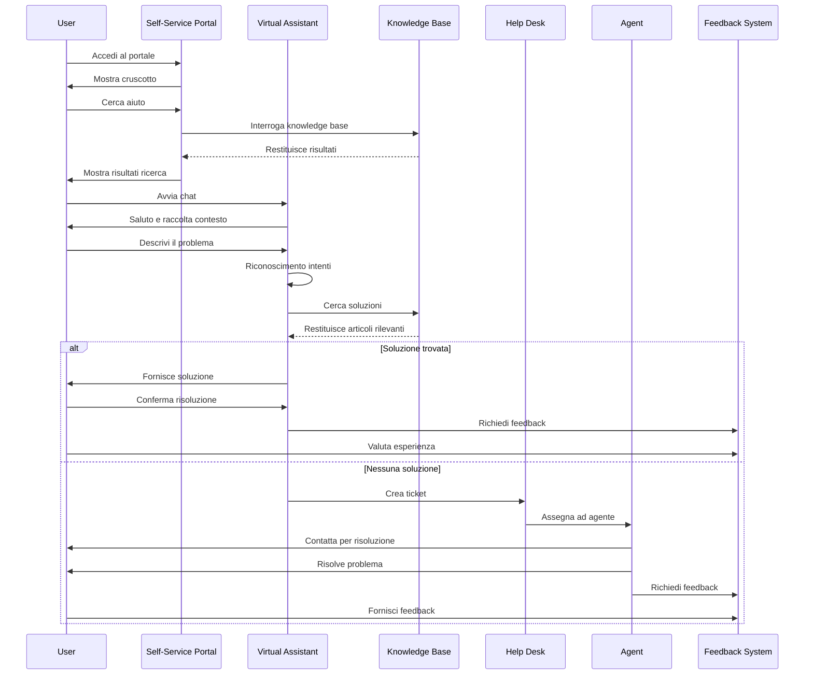
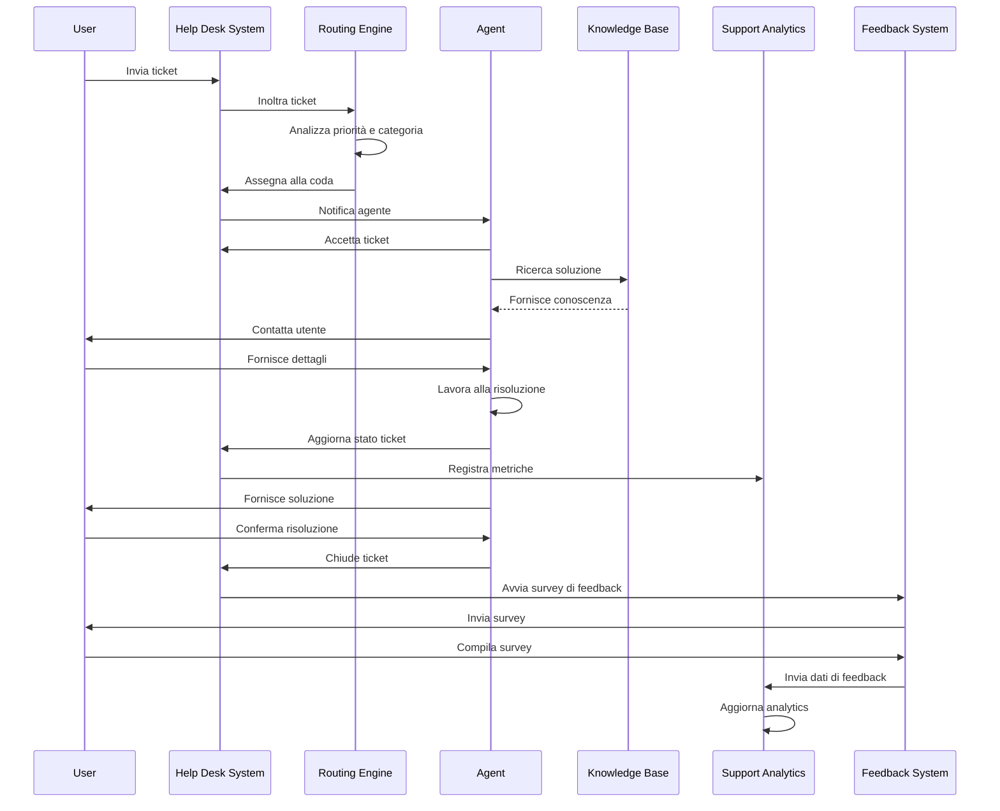
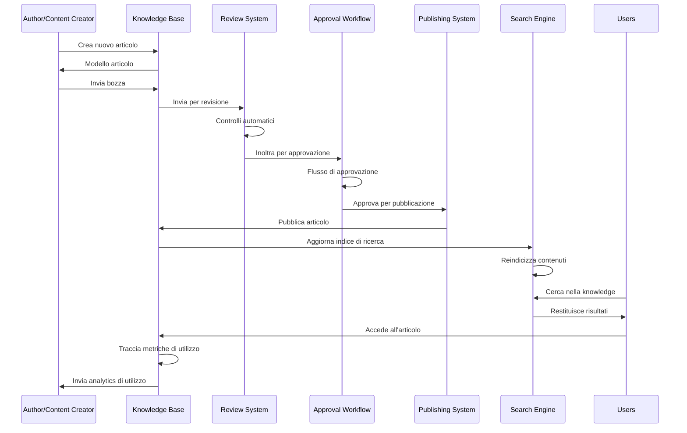
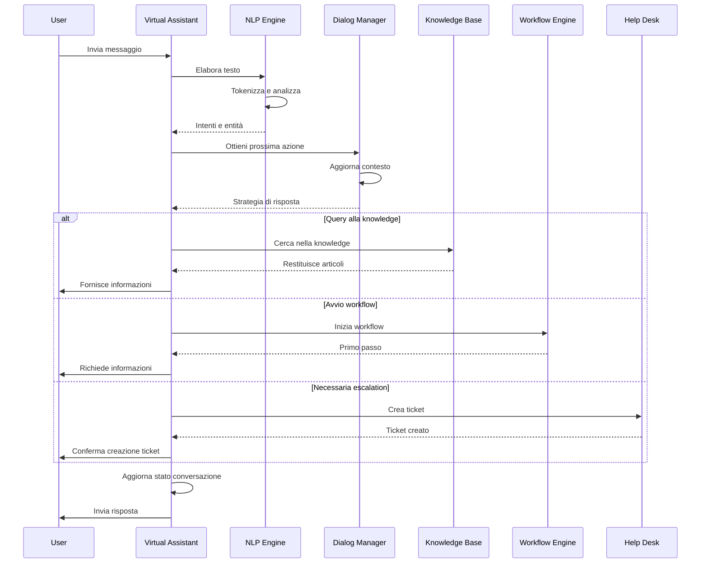
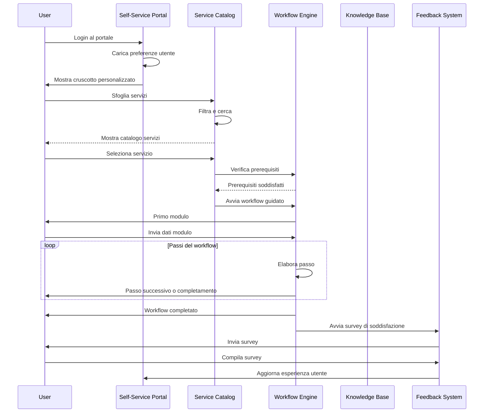
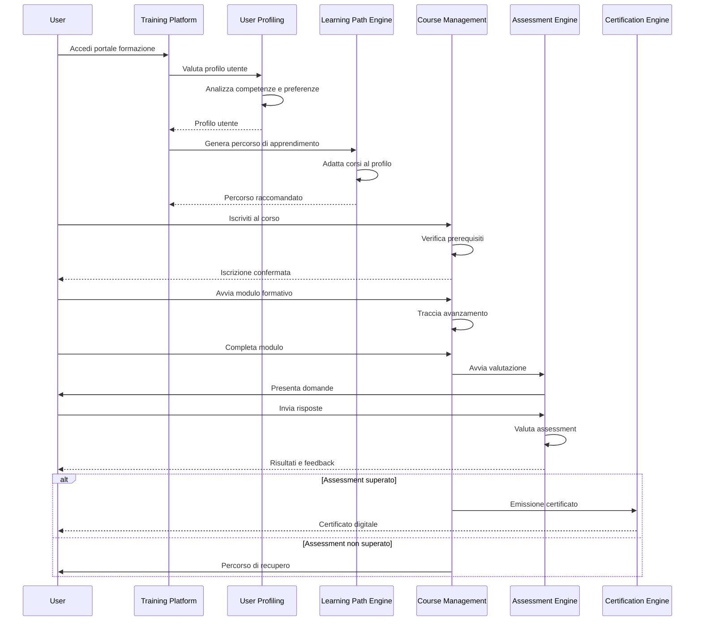
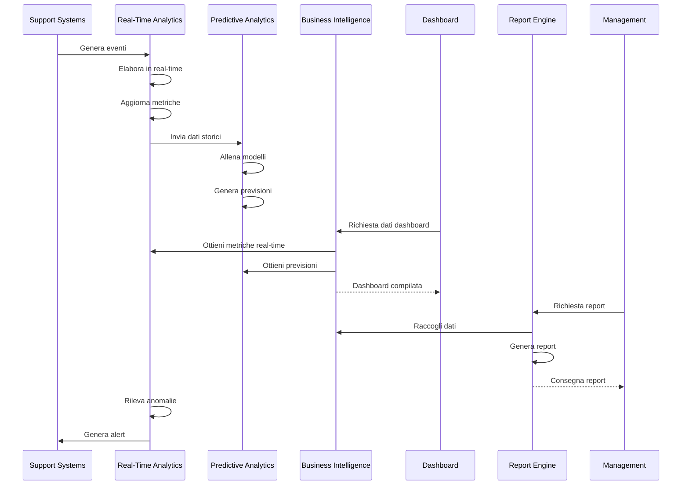
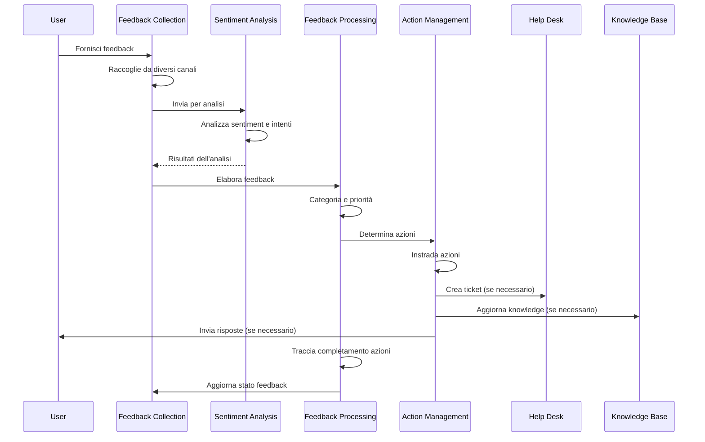
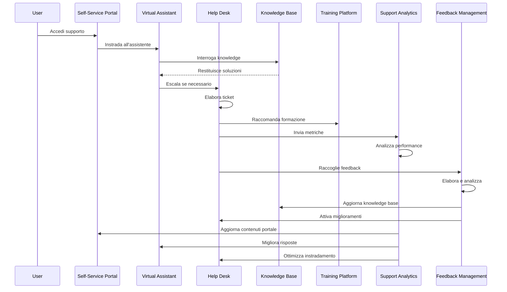

# Diagrammi di Sequenza UC10

## Flusso Richiesta Supporto

## Flusso Risoluzione Ticket

## Flusso Gestione Knowledge Base

## Flusso Interazione Assistente Virtuale

## Flusso Self-Service Portal

## Flusso Piattaforma di Formazione

## Flusso Support Analytics

## Flusso Gestione Feedback

## Flusso di Integrazione Componenti UC10

<parameter name="filePath">/Users/giangio/Documents/GitHub/Interzen/Interzen.POC/ZenIA/docs/use_cases/UC10 - Supporto all'Utente/02 Sequence Diagrams UC10.md