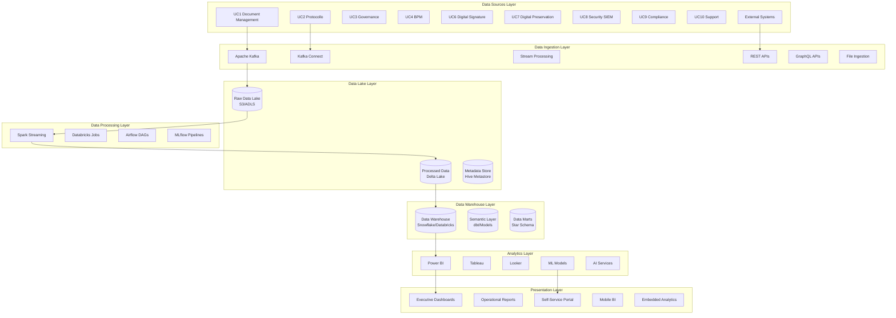
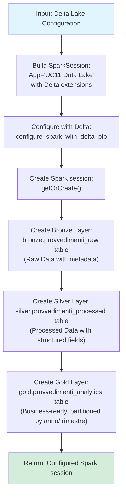
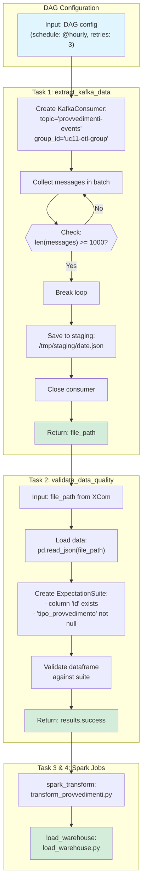
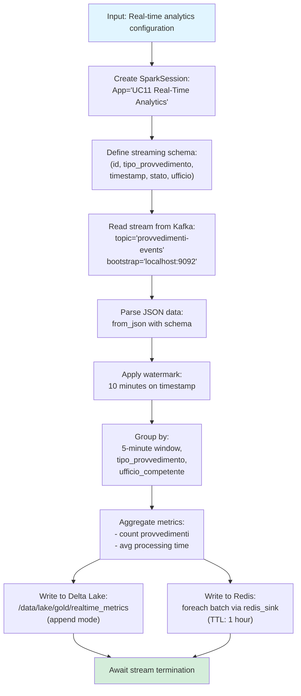

# 00 Architettura UC11 - Analisi Dati e Reporting

## Overview Architetturale

L'architettura di UC11 - Analisi Dati e Reporting è progettata come una piattaforma dati enterprise moderna che supporta analytics avanzati, business intelligence e reporting automatizzato. L'architettura segue i principi del data mesh e lakehouse, combinando le migliori pratiche di data warehousing tradizionale con le capacità scalabili del data lake.

## Architettura Generale



## Componenti Architetturali

### 1. Data Ingestion Layer

#### Apache Kafka Cluster
```yaml
# docker-compose.kafka.yml
version: '3.8'
services:
  zookeeper:
    image: confluentinc/cp-zookeeper:7.4.0
    environment:
      ZOOKEEPER_CLIENT_PORT: 2181
      ZOOKEEPER_TICK_TIME: 2000

  kafka:
    image: confluentinc/cp-kafka:7.4.0
    depends_on:
      - zookeeper
    environment:
      KAFKA_BROKER_ID: 1
      KAFKA_ZOOKEEPER_CONNECT: zookeeper:2181
      KAFKA_LISTENER_SECURITY_PROTOCOL_MAP: PLAINTEXT:PLAINTEXT,PLAINTEXT_INTERNAL:PLAINTEXT
      KAFKA_ADVERTISED_LISTENERS: PLAINTEXT://localhost:9092,PLAINTEXT_INTERNAL://kafka:29092
      KAFKA_OFFSETS_TOPIC_REPLICATION_FACTOR: 1
      KAFKA_TRANSACTION_STATE_LOG_MIN_ISR: 1
      KAFKA_TRANSACTION_STATE_LOG_REPLICATION_FACTOR: 1

  schema-registry:
    image: confluentinc/cp-schema-registry:7.4.0
    depends_on:
      - kafka
    environment:
      SCHEMA_REGISTRY_HOST_NAME: schema-registry
      SCHEMA_REGISTRY_KAFKA_BROKERS: kafka:29092
```

#### Kafka Connect per Database Ingestion
```json
{
  "name": "postgres-provvedimenti-connector",
  "config": {
    "connector.class": "io.debezium.connector.postgresql.PostgresConnector",
    "database.hostname": "postgres-db",
    "database.port": "5432",
    "database.user": "cdc_user",
    "database.password": "cdc_password",
    "database.dbname": "provvedimenti_db",
    "database.server.name": "provvedimenti",
    "table.include.list": "public.provvedimenti,public.allegati,public.fascicoli",
    "plugin.name": "pgoutput",
    "key.converter": "org.apache.kafka.connect.json.JsonConverter",
    "value.converter": "org.apache.kafka.connect.json.JsonConverter",
    "transforms": "unwrap",
    "transforms.unwrap.type": "io.debezium.transforms.ExtractNewRecordState",
    "transforms.unwrap.drop.tombstones": "false"
  }
}
```

### 2. Data Lake Layer

#### Delta Lake Architecture


### 3. Data Processing Layer

#### Apache Airflow DAG per ETL


#### Spark Streaming per Real-Time Processing


### 4. Data Warehouse Layer

#### Snowflake Architecture
```sql
-- warehouse_setup.sql
-- Create database and schemas
CREATE DATABASE IF NOT EXISTS UC11_ANALYTICS;
USE DATABASE UC11_ANALYTICS;

-- Create schemas
CREATE SCHEMA IF NOT EXISTS RAW;
CREATE SCHEMA IF NOT EXISTS PROCESSED;
CREATE SCHEMA IF NOT EXISTS ANALYTICS;
CREATE SCHEMA IF NOT EXISTS ML_MODELS;

-- Create raw data tables
CREATE OR REPLACE TABLE RAW.PROVVEDIMENTI_RAW (
    ID VARCHAR,
    DATA_INGESTION TIMESTAMP,
    SOURCE_SYSTEM VARCHAR,
    RAW_DATA VARIANT,
    METADATA VARIANT
);

-- Create processed tables
CREATE OR REPLACE TABLE PROCESSED.PROVVEDIMENTI_PROCESSED (
    ID VARCHAR,
    TIPO_PROVVEDIMENTO VARCHAR,
    DATA_CREAZIONE DATE,
    STATO VARCHAR,
    GIORNI_LAVORAZIONE INTEGER,
    UFFICIO_COMPETENTE VARCHAR,
    RICHIEDENTE VARIANT,
    PROCESSED_AT TIMESTAMP
);

-- Create analytics tables (Star Schema)
CREATE OR REPLACE TABLE ANALYTICS.DIM_TIPO_PROVVEDIMENTO (
    TIPO_ID INTEGER AUTOINCREMENT PRIMARY KEY,
    TIPO_NOME VARCHAR,
    CATEGORIA VARCHAR,
    DESCRIZIONE VARCHAR,
    IS_ACTIVE BOOLEAN DEFAULT TRUE
);

CREATE OR REPLACE TABLE ANALYTICS.DIM_UFFICIO (
    UFFICIO_ID INTEGER AUTOINCREMENT PRIMARY KEY,
    UFFICIO_NOME VARCHAR,
    DIREZIONE VARCHAR,
    RESPONSABILE VARCHAR,
    IS_ACTIVE BOOLEAN DEFAULT TRUE
);

CREATE OR REPLACE TABLE ANALYTICS.DIM_TEMPO (
    DATA DATE PRIMARY KEY,
    ANNO INTEGER,
    TRIMESTRE INTEGER,
    MESE INTEGER,
    GIORNO INTEGER,
    GIORNO_SETTIMANA INTEGER,
    NOME_MESE VARCHAR,
    NOME_TRIMESTRE VARCHAR
);

CREATE OR REPLACE TABLE ANALYTICS.FACT_PROVVEDIMENTI (
    ID VARCHAR PRIMARY KEY,
    TIPO_ID INTEGER REFERENCES ANALYTICS.DIM_TIPO_PROVVEDIMENTO(TIPO_ID),
    UFFICIO_ID INTEGER REFERENCES ANALYTICS.DIM_UFFICIO(UFFICIO_ID),
    DATA_ID DATE REFERENCES ANALYTICS.DIM_TEMPO(DATA),
    DATA_CREAZIONE DATE,
    GIORNI_LAVORAZIONE INTEGER,
    STATO_FINALE VARCHAR,
    RICHIEDENTE_TIPO VARCHAR,
    VALORE_ECONOMICO DECIMAL(15,2),
    COMPLIANCE_SCORE DECIMAL(5,2),
    CREATED_AT TIMESTAMP DEFAULT CURRENT_TIMESTAMP
);

-- Create views for BI tools
CREATE OR REPLACE VIEW ANALYTICS.VW_PROVVEDIMENTI_KPI AS
SELECT
    d.DATA,
    d.ANNO,
    d.TRIMESTRE,
    d.MESE,
    tp.TIPO_NOME,
    u.UFFICIO_NOME,
    COUNT(f.ID) as TOTALE_PROVVEDIMENTI,
    AVG(f.GIORNI_LAVORAZIONE) as MEDIA_GIORNI,
    SUM(CASE WHEN f.STATO_FINALE = 'APPROVATO' THEN 1 ELSE 0 END) as PROVVEDIMENTI_APPROVATI,
    AVG(f.COMPLIANCE_SCORE) as AVG_COMPLIANCE_SCORE
FROM ANALYTICS.FACT_PROVVEDIMENTI f
JOIN ANALYTICS.DIM_TEMPO d ON f.DATA_ID = d.DATA
JOIN ANALYTICS.DIM_TIPO_PROVVEDIMENTO tp ON f.TIPO_ID = tp.TIPO_ID
JOIN ANALYTICS.DIM_UFFICIO u ON f.UFFICIO_ID = u.UFFICIO_ID
GROUP BY d.DATA, d.ANNO, d.TRIMESTRE, d.MESE, tp.TIPO_NOME, u.UFFICIO_NOME;
```

### 5. Analytics Layer

#### Machine Learning Pipeline

```mermaid
flowchart TD
    subgraph "ProvvedimentiPredictor Class"
        A["Input: Training dataframe (df)"]
    end

    subgraph "preprocess_data Method"
        B["Encode categorical variables:<br/>- tipo_provvedimento<br/>- ufficio_competente<br/>- richiedente_tipo<br/>- priorita"]
        B --> C["Create target variable:<br/>processing_category = pd.cut<br/>(bins: FAST, NORMAL, SLOW, VERY_SLOW)"]
        C --> D["Return: Processed dataframe"]
    end

    subgraph "train_model Method"
        E["Start MLflow run"] --> F["Preprocess data"]
        F --> G["Split dataset:<br/>X = features, y = target<br/>80% train / 20% test"]
        G --> H["Create RandomForestClassifier:<br/>n_estimators=100, max_depth=10"]
        H --> I["Fit model on training data"]
        I --> J["Predict on test data"]
        J --> K["Calculate classification report"]
        K --> L["Log metrics to MLflow:<br/>- accuracy<br/>- f1_macro"]
        L --> M["Log model to MLflow"]
        M --> N["Return: Classification report"]
    end

    subgraph "predict_processing_time Method"
        O["Input: New provvedimento_data"] --> P["Create DataFrame from input"]
        P --> Q["Preprocess input data"]
        Q --> R["Predict category with model"]
        R --> S["Get prediction probabilities"]
        S --> T["Return: predicted_category<br/>+ probabilities dict"]
    end

    A --> B
    D --> E
    N --> O

    style A fill:#e1f5ff
    style D fill:#d4edda
    style N fill:#d4edda
    style T fill:#d4edda
```


### 6. Presentation Layer

#### Power BI Dashboard Architecture

**powerbi_embed_config.json**
```json
{
  "powerbi": {
    "workspaceId": "12345678-1234-1234-1234-123456789012",
    "reportId": "87654321-4321-4321-4321-210987654321",
    "embedUrl": "https://app.powerbi.com/reportEmbed",
    "accessToken": "eyJ0eXAiOiJKV1QiLCJhbGciOiJSUzI1NiIsIng1dCI6Ik1uQ19WWmNBVGZNNXBPWWlKSE1iYTlnb0VLWSIsImtpZCI6Ik1uQ19WWmNBVGZNNXBPWWlKSE1iYTlnb0VLWSJ9"
  },
  "permissions": {
    "allowEdit": false,
    "allowSave": false,
    "allowSaveAs": false
  },
  "filters": {
    "filterPaneEnabled": true,
    "navContentPaneEnabled": true
  },
  "settings": {
    "localeSettings": {
      "language": "it-IT",
      "formatLocale": "it-IT"
    }
  }
}
```

#### Self-Service Analytics Portal
```typescript
// self_service_portal/src/components/DashboardBuilder.tsx
import React, { useState, useEffect } from 'react';
import { DragDropContext, Droppable, Draggable } from 'react-beautiful-dnd';
import { Chart } from 'chart.js';
import { PowerBIEmbed } from 'powerbi-client-react';

interface DashboardBuilderProps {
  userPermissions: string[];
  availableDatasets: Dataset[];
}

const DashboardBuilder: React.FC<DashboardBuilderProps> = ({
  userPermissions,
  availableDatasets
}) => {
  const [dashboardConfig, setDashboardConfig] = useState<DashboardConfig>({
    title: '',
    description: '',
    components: [],
    filters: [],
    permissions: []
  });

  const [selectedDataset, setSelectedDataset] = useState<string>('');
  const [chartType, setChartType] = useState<ChartType>('bar');

  const handleDragEnd = (result: any) => {
    if (!result.destination) return;

    const items = Array.from(dashboardConfig.components);
    const [reorderedItem] = items.splice(result.source.index, 1);
    items.splice(result.destination.index, 0, reorderedItem);

    setDashboardConfig({
      ...dashboardConfig,
      components: items
    });
  };

  const addChartComponent = () => {
    const newComponent: DashboardComponent = {
      id: `chart-${Date.now()}`,
      type: 'chart',
      title: `Chart ${dashboardConfig.components.length + 1}`,
      dataset: selectedDataset,
      chartType: chartType,
      config: {
        xAxis: '',
        yAxis: '',
        aggregation: 'count'
      },
      position: { x: 0, y: 0, width: 6, height: 4 }
    };

    setDashboardConfig({
      ...dashboardConfig,
      components: [...dashboardConfig.components, newComponent]
    });
  };

  const saveDashboard = async () => {
    try {
      const response = await fetch('/api/dashboards', {
        method: 'POST',
        headers: {
          'Content-Type': 'application/json',
          'Authorization': `Bearer ${localStorage.getItem('token')}`
        },
        body: JSON.stringify(dashboardConfig)
      });

      if (response.ok) {
        alert('Dashboard saved successfully!');
      }
    } catch (error) {
      console.error('Error saving dashboard:', error);
    }
  };

  return (
    <div className="dashboard-builder">
      <div className="builder-toolbar">
        <select
          value={selectedDataset}
          onChange={(e) => setSelectedDataset(e.target.value)}
        >
          <option value="">Select Dataset</option>
          {availableDatasets.map(dataset => (
            <option key={dataset.id} value={dataset.id}>
              {dataset.name}
            </option>
          ))}
        </select>

        <select
          value={chartType}
          onChange={(e) => setChartType(e.target.value as ChartType)}
        >
          <option value="bar">Bar Chart</option>
          <option value="line">Line Chart</option>
          <option value="pie">Pie Chart</option>
          <option value="scatter">Scatter Plot</option>
        </select>

        <button onClick={addChartComponent}>Add Chart</button>
        <button onClick={saveDashboard}>Save Dashboard</button>
      </div>

      <DragDropContext onDragEnd={handleDragEnd}>
        <Droppable droppableId="dashboard-components">
          {(provided) => (
            <div
              className="dashboard-canvas"
              {...provided.droppableProps}
              ref={provided.innerRef}
            >
              {dashboardConfig.components.map((component, index) => (
                <Draggable key={component.id} draggableId={component.id} index={index}>
                  {(provided) => (
                    <div
                      className="dashboard-component"
                      ref={provided.innerRef}
                      {...provided.draggableProps}
                      {...provided.dragHandleProps}
                    >
                      <ChartComponent component={component} />
                    </div>
                  )}
                </Draggable>
              ))}
              {provided.placeholder}
            </div>
          )}
        </Droppable>
      </DragDropContext>
    </div>
  );
};

export default DashboardBuilder;
```

## Sicurezza e Governance

### Data Security Architecture
```yaml
# security_config.yml
data_security:
  encryption:
    at_rest: AES256
    in_transit: TLS1.3
    key_management: AWS_KMS

  access_control:
    authentication: OAuth2_JWT
    authorization: ABAC
    row_level_security: true
    data_masking: dynamic

  audit:
    logging: CloudTrail
    monitoring: CloudWatch
    alerting: SNS

data_governance:
  catalog: Alation
  quality: Great_Expectations
  lineage: Marquez
  privacy: GDPR_Compliance

compliance:
  gdpr:
    data_retention: 7_years
    right_to_be_forgotten: automated
    data_portability: API_available

  audit_trail:
    immutable_log: true
    tamper_proof: blockchain
    retention: indefinite
```

### Data Quality Framework

```mermaid
flowchart TD
    subgraph "DataQualityManager Class"
        A["Input: context_root_dir"] --> B["Create FileDataContext"]
    end

    subgraph "create_provvedimenti_suite Method"
        C["Create ExpectationSuite:<br/>'provvedimenti_quality_suite'"] --> D["Add Completeness checks:<br/>- column 'id' exists<br/>- 'tipo_provvedimento' not null"]
        D --> E["Add Accuracy checks:<br/>- 'stato' in valid set"]
        E --> F["Add Consistency checks:<br/>- data_modifica > data_creazione"]
        F --> G["Add Timeliness checks:<br/>- data_creazione between 2020-2030"]
        G --> H["Return: Configured suite"]
    end

    subgraph "validate_dataset Method"
        I["Input: dataset_path, suite"] --> J["Get validator from context:<br/>with datasource and path"]
        J --> K["Validate expectation suite:<br/>results = validator.validate"]
        K --> L["Generate quality report:<br/>- overall_success<br/>- statistics<br/>- expectations count"]
        L --> M["Return: Quality report"]
    end

    subgraph "setup_monitoring Method"
        N["Create checkpoint config:<br/>name, actions, suite"] --> O["Configure action_list:<br/>- Store validation result<br/>- Update data docs<br/>- Slack notification on failure"]
        O --> P["Create Checkpoint:<br/>with config"]
        P --> Q["Return: Checkpoint instance"]
    end

    B --> C
    H --> I
    M --> N

    style A fill:#e1f5ff
    style H fill:#d4edda
    style M fill:#d4edda
    style Q fill:#d4edda
```


## Performance e Scalabilità

### Performance Optimization
```sql
-- performance_optimizations.sql
-- Create performance optimized tables
CREATE OR REPLACE TABLE ANALYTICS.FACT_PROVVEDIMENTI_OPTIMIZED (
    ID VARCHAR,
    TIPO_ID INTEGER,
    UFFICIO_ID INTEGER,
    DATA_ID DATE,
    DATA_CREAZIONE DATE,
    GIORNI_LAVORAZIONE INTEGER,
    STATO_FINALE VARCHAR,
    RICHIEDENTE_TIPO VARCHAR,
    VALORE_ECONOMICO DECIMAL(15,2),
    COMPLIANCE_SCORE DECIMAL(5,2)
)
CLUSTER BY (DATA_ID, TIPO_ID, UFFICIO_ID);

-- Create search optimization
ALTER TABLE ANALYTICS.FACT_PROVVEDIMENTI_OPTIMIZED ADD SEARCH OPTIMIZATION;

-- Create materialized views for common queries
CREATE OR REPLACE MATERIALIZED VIEW ANALYTICS.MV_PROVVEDIMENTI_KPI
AS
SELECT
    d.ANNO,
    d.TRIMESTRE,
    tp.TIPO_NOME,
    u.UFFICIO_NOME,
    COUNT(f.ID) as TOTALE_PROVVEDIMENTI,
    AVG(f.GIORNI_LAVORAZIONE) as MEDIA_GIORNI,
    SUM(CASE WHEN f.STATO_FINALE = 'APPROVATO' THEN 1 ELSE 0 END) as PROVVEDIMENTI_APPROVATI
FROM ANALYTICS.FACT_PROVVEDIMENTI_OPTIMIZED f
JOIN ANALYTICS.DIM_TEMPO d ON f.DATA_ID = d.DATA
JOIN ANALYTICS.DIM_TIPO_PROVVEDIMENTO tp ON f.TIPO_ID = tp.TIPO_ID
JOIN ANALYTICS.DIM_UFFICIO u ON f.UFFICIO_ID = u.UFFICIO_ID
GROUP BY d.ANNO, d.TRIMESTRE, tp.TIPO_NOME, u.UFFICIO_NOME;

-- Create indexes for performance
CREATE INDEX IDX_PROVVEDIMENTI_DATA ON ANALYTICS.FACT_PROVVEDIMENTI_OPTIMIZED (DATA_CREAZIONE);
CREATE INDEX IDX_PROVVEDIMENTI_TIPO ON ANALYTICS.FACT_PROVVEDIMENTI_OPTIMIZED (TIPO_ID);
CREATE INDEX IDX_PROVVEDIMENTI_UFFICIO ON ANALYTICS.FACT_PROVVEDIMENTI_OPTIMIZED (UFFICIO_ID);
```

### Scalability Configuration
```yaml
# scalability_config.yml
infrastructure:
  compute:
    min_instances: 2
    max_instances: 50
    scaling_policy:
      cpu_utilization: 70
      memory_utilization: 80

  storage:
    data_lake: S3
    warehouse: Snowflake
    caching: Redis_Cluster

  networking:
    load_balancer: Application_Load_Balancer
    cdn: CloudFront
    waf: AWS_WAF

monitoring:
  metrics:
    - cpu_utilization
    - memory_utilization
    - disk_usage
    - query_latency
    - error_rate

  alerts:
    high_cpu: "> 80% for 5 minutes"
    high_memory: "> 85% for 5 minutes"
    slow_queries: "> 30s for 10 queries"
    data_quality_failures: "> 5 failures per hour"

autoscaling:
  rules:
    - name: scale_out
      conditions:
        - metric: cpu_utilization
          operator: ">"
          value: 70
      actions:
        - type: scale_out
          amount: 2

    - name: scale_in
      conditions:
        - metric: cpu_utilization
          operator: "<"
          value: 30
      actions:
        - type: scale_in
          amount: 1
```

## Disaster Recovery e Backup

### Backup Strategy
```bash
#!/bin/bash
# backup_strategy.sh

# Data Lake Backup
aws s3 sync s3://uc11-data-lake/ s3://uc11-data-lake-backup/$(date +%Y%m%d)/ \
    --delete \
    --storage-class STANDARD_IA

# Warehouse Backup
snowsql -c myconnection -q "
BACKUP DATABASE UC11_ANALYTICS
TO s3://uc11-backup/warehouse/$(date +%Y%m%d)/
ENCRYPTION = (TYPE = 'SNOWFLAKE_SSE')
"

# Configuration Backup
aws s3 cp /etc/uc11/config/ s3://uc11-backup/config/$(date +%Y%m%d)/ \
    --recursive \
    --storage-class STANDARD

# ML Models Backup
aws s3 sync s3://uc11-ml-models/ s3://uc11-backup/models/$(date +%Y%m%d)/ \
    --delete \
    --storage-class STANDARD_IA
```

### Disaster Recovery Plan
```yaml
# dr_plan.yml
disaster_recovery:
  rto: 4_hours      # Recovery Time Objective
  rpo: 1_hour       # Recovery Point Objective

  failover_procedures:
    - detect_failure
    - isolate_affected_systems
    - promote_backup_region
    - restore_from_backup
    - validate_system_integrity
    - redirect_traffic

  backup_regions:
    primary: eu-west-1
    secondary: eu-central-1

  data_recovery:
    data_lake:
      strategy: cross_region_replication
      retention: 30_days
    warehouse:
      strategy: database_backup
      retention: 90_days
    configurations:
      strategy: gitops_backup
      retention: indefinite

  testing:
    frequency: quarterly
    scope: full_failover_test
    stakeholders: all_teams
```

Questa architettura fornisce una base solida per UC11, abilitando analytics avanzati e business intelligence attraverso una moderna data platform. L'implementazione graduale permette di partire con analytics descrittivi per poi evolvere verso predictive e prescriptive analytics.</content>
<parameter name="filePath">/Users/giangio/Documents/GitHub/Interzen/Interzen.POC/ZenIA/docs/use_cases/UC11 - Analisi Dati e Reporting/00 Architettura UC11.md