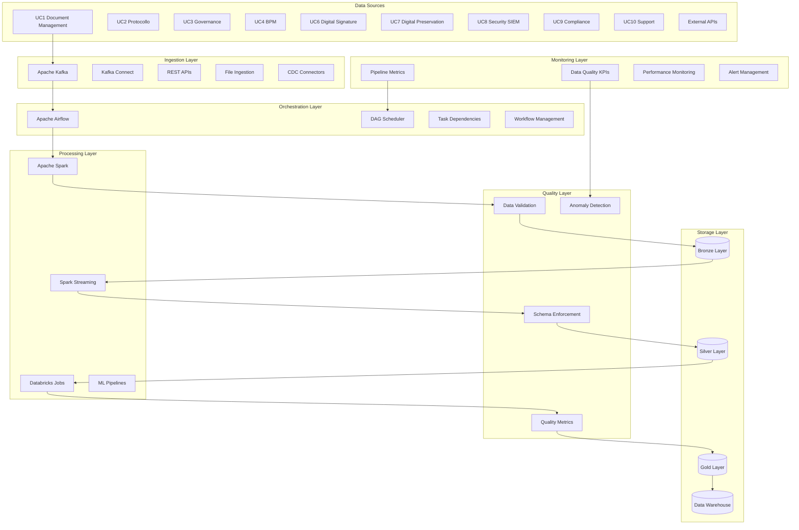

# SP59 - ETL & Data Processing Pipelines

## Descrizione Componente

**SP56 - ETL & Data Processing Pipelines** rappresenta il motore di processamento dati di UC11, fornendo pipeline scalabili e robuste per l'estrazione, trasformazione e caricamento dei dati. Implementa architetture moderne basate su Apache Airflow, Spark e Kafka per gestire flussi di dati complessi e garantire qualità e affidabilità del processamento.

## Obiettivi

- **Scalable Data Processing**: Pipeline che scalano automaticamente con il volume dei dati
- **Data Quality Assurance**: Validazione e pulizia automatica dei dati durante il processamento
- **Real-Time & Batch Processing**: Supporto sia per processamento real-time che batch
- **Fault Tolerance**: Resilienza ai fallimenti con recovery automatico
- **Monitoring & Observability**: Monitoraggio completo delle performance delle pipeline

## Architettura

## 🏛️ Conformità Normativa

### Framework Normativi Applicabili

☑ CAD
☑ GDPR
☐ L. 241/1990 - Procedimento Amministrativo
☐ eIDAS - Regolamento 2014/910
☐ AI Act - Regolamento 2024/1689
☐ D.Lgs 42/2004 - Codice Beni Culturali
☐ D.Lgs 152/2006 - Codice dell'Ambiente
☐ D.Lgs 33/2013 - Decreto Trasparenza

**Per mappatura completa articoli → implementazioni**, vedi [Conformità Normativa Standard Template](../../templates/conformita-normativa-standard.md) e [COMPLIANCE-MATRIX.md](../../COMPLIANCE-MATRIX.md).

### Requisiti Principali Implementati

| Framework | Requisiti Principali | Status | Riferimenti |
|-----------|-------------------|--------|-------------|
| CAD | Art. 1, Art. 21, Art. 22, Art. 62 | ✅ Implementato | [Dettagli](../../templates/conformita-normativa-standard.md) |
| GDPR | Art. 5, Art. 32 | ✅ Implementato | [Dettagli](../../templates/conformita-normativa-standard.md) |

### Conformità Normativa - Checklist

- [ ] Tutti i framework normativi applicabili identificati
- [ ] Articoli rilevanti mappati alle responsabilità SP
- [ ] GDPR: Data protection by design implementato (se applicabile)
- [ ] eIDAS: Firma digitale supportata (se applicabile)
- [ ] AI Act: Supervisione umana e trasparenza (se applicabile)
- [ ] Tracciabilità audit completa mantenuta
- [ ] Documentation conformità aggiornata

**Nota**: Dettagli di conformità completi nella sezione "## 🏛️ Conformità Normativa" del template standard.

---

## Implementazione Tecnica

### Apache Airflow DAG per ETL Orchestration

L'orchestrazione delle pipeline ETL è gestita attraverso Apache Airflow con Directed Acyclic Graphs (DAG):

**Workflow Management**:
- Definizione dichiarativa dei workflow attraverso DAG Python
- Gestione delle dipendenze tra task e pipeline
- Scheduling flessibile con cron expressions
- Retry logic e backfill capabilities

**Task Orchestration**:
- Esecuzione parallela di task indipendenti
- Gestione dello stato e recovery automatico
- Monitoring integrato dello stato dei workflow
- Integrazione con sistemi di alerting

### Spark Structured Streaming per Real-Time Processing

Il processamento real-time è implementato utilizzando Apache Spark Structured Streaming:

**Stream Processing**:
- Micro-batch processing per bassa latenza
- Windowing operations per aggregazioni temporali
- Watermarking per gestione dell'ordering
- Exactly-once semantics per garanzia di consegna

**Data Transformation**:
- Trasformazioni SQL e DataFrame API
- Join tra stream e dati statici
- Aggregazioni continue e stateful operations
- Output sink multipli (Delta Lake, Kafka, database)

### Data Quality Framework

Il framework di qualità dati garantisce l'integrità e affidabilità delle informazioni processate:

**Validation Rules**:
- Controlli di completezza e accuratezza dei dati
- Validazione schema e tipi di dato
- Business rules enforcement
- Anomaly detection con algoritmi ML

**Quality Metrics**:
- Calcolo automatico di metriche di qualità
- Threshold configurabili per alert
- Trend analysis e reporting storico
- Integrazione con sistemi di monitoraggio

### Pipeline Monitoring e Alerting

Il monitoraggio completo garantisce visibilità e controllo delle operazioni:

**Performance Metrics**:
- Throughput e latenza delle pipeline
- Utilizzo risorse (CPU, memoria, storage)
- Error rates e success rates
- SLA compliance monitoring

**Alert Management**:
- Alert configurabili per condizioni critiche
- Escalation automatica e notifiche
- Dashboard real-time per operations
- Historical analysis per ottimizzazioni

### Fault Tolerance e Recovery

La resilienza del sistema è garantita attraverso meccanismi avanzati di fault tolerance:

**Error Handling**:
- Retry logic con backoff esponenziale
- Dead letter queue per messaggi falliti
- Circuit breaker per protezione da cascate
- Graceful degradation in caso di failure

**Recovery Mechanisms**:
- Checkpointing automatico dello stato
- Idempotent operations per safety
- Manual recovery procedures
- Disaster recovery con multi-region replication

Questo componente SP56 fornisce una pipeline ETL completa e robusta con capacità avanzate di processamento dati, qualità, monitoraggio e fault tolerance per supportare tutti i requisiti di UC11.</content>
<parameter name="filePath">/Users/giangio/Documents/GitHub/Interzen/Interzen.POC/ZenIA/docs/use_cases/UC11 - Analisi Dati e Reporting/01 SP56 - ETL & Data Processing Pipelines.md