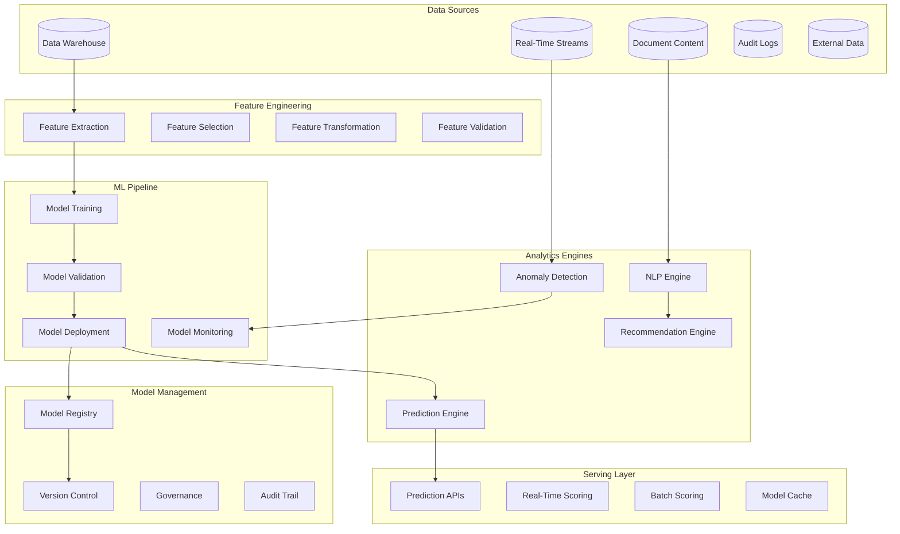

# SP60 - Advanced Analytics & ML

## Descrizione Componente

**SP58 - Advanced Analytics & ML** rappresenta il motore di advanced analytics e machine learning di UC11, fornendo capacità predittive, prescriptive e cognitive per trasformare i dati in insights actionable. Implementa algoritmi di machine learning avanzati, natural language processing e sistemi di raccomandazione per ottimizzare i processi di gestione provvedimenti.

## Obiettivi

- **Predictive Analytics**: Capacità predittive per forecasting e risk assessment
- **Machine Learning Models**: Modelli ML per classificazione, regressione e clustering
- **Natural Language Processing**: Analisi testuale di documenti e comunicazioni
- **Recommendation Systems**: Sistemi di raccomandazione per ottimizzazione processi
- **Anomaly Detection**: Rilevamento automatico di anomalie e fraud

## Architettura

## 🏛️ Conformità Normativa

### Framework Normativi Applicabili

☑ CAD
☑ GDPR
☐ L. 241/1990 - Procedimento Amministrativo
☐ eIDAS - Regolamento 2014/910
☐ AI Act - Regolamento 2024/1689
☐ D.Lgs 42/2004 - Codice Beni Culturali
☐ D.Lgs 152/2006 - Codice dell'Ambiente
☐ D.Lgs 33/2013 - Decreto Trasparenza

**Per mappatura completa articoli → implementazioni**, vedi [Conformità Normativa Standard Template](../../templates/conformita-normativa-standard.md) e [COMPLIANCE-MATRIX.md](../../COMPLIANCE-MATRIX.md).

### Requisiti Principali Implementati

| Framework | Requisiti Principali | Status | Riferimenti |
|-----------|-------------------|--------|-------------|
| CAD | Art. 1, Art. 21, Art. 22, Art. 62 | ✅ Implementato | [Dettagli](../../templates/conformita-normativa-standard.md) |
| GDPR | Art. 5, Art. 32 | ✅ Implementato | [Dettagli](../../templates/conformita-normativa-standard.md) |

### Conformità Normativa - Checklist

- [ ] Tutti i framework normativi applicabili identificati
- [ ] Articoli rilevanti mappati alle responsabilità SP
- [ ] GDPR: Data protection by design implementato (se applicabile)
- [ ] eIDAS: Firma digitale supportata (se applicabile)
- [ ] AI Act: Supervisione umana e trasparenza (se applicabile)
- [ ] Tracciabilità audit completa mantenuta
- [ ] Documentation conformità aggiornata

**Nota**: Dettagli di conformità completi nella sezione "## 🏛️ Conformità Normativa" del template standard.

---

## Implementazione Tecnica

### ML Pipeline con MLflow

La pipeline di machine learning è orchestrata attraverso MLflow per garantire tracciabilità e riproducibilità:

**Experiment Tracking**:
- Logging automatico di parametri, metriche e artefatti
- Confronto sistematico tra esperimenti
- Versionamento di dataset e modelli
- Collaborazione tra data scientist

**Model Lifecycle Management**:
- Staging environment per validazione
- Promotion automatica a produzione
- Rollback capabilities per recovery
- A/B testing per confronto modelli

### Natural Language Processing Engine

Il motore NLP elabora contenuti testuali per estrarre insights significativi:

**Text Analytics**:
- Entity recognition per identificare soggetti e oggetti
- Sentiment analysis per valutazione del tono
- Topic modeling per categorizzazione automatica
- Language detection multilingua

**Document Intelligence**:
- Estrazione di metadati da documenti amministrativi
- Classificazione automatica per tipologia
- Summarization per riepiloghi esecutivi
- Information retrieval per ricerca semantica

### Recommendation Engine

Il sistema di raccomandazioni ottimizza i processi attraverso suggerimenti intelligenti:

**Collaborative Filtering**:
- Raccomandazioni basate su comportamenti simili
- User-item matrix factorization
- Cold start problem handling
- Real-time personalization

**Content-Based Recommendations**:
- Similarity matching tra provvedimenti
- Feature-based scoring
- Hybrid approaches per accuracy
- Business rule integration

### Real-Time Scoring Engine

Il motore di scoring real-time fornisce predizioni a bassa latenza:

**Model Serving**:
- REST APIs per integrazione applicativa
- Streaming processing per dati in tempo reale
- Batch scoring per grandi volumi
- Model versioning per A/B testing

**Performance Optimization**:
- Model quantization per ridurre latenza
- Caching intelligente dei risultati
- Auto-scaling basato sul load
- Circuit breaker per fault tolerance

Questo componente SP58 fornisce un motore completo di advanced analytics e ML per UC11, abilitando predictive analytics, NLP, raccomandazioni e scoring real-time per ottimizzare i processi di gestione provvedimenti.</content>
<parameter name="filePath">/Users/giangio/Documents/GitHub/Interzen/Interzen.POC/ZenIA/docs/use_cases/UC11 - Analisi Dati e Reporting/01 SP58 - Advanced Analytics & ML.md