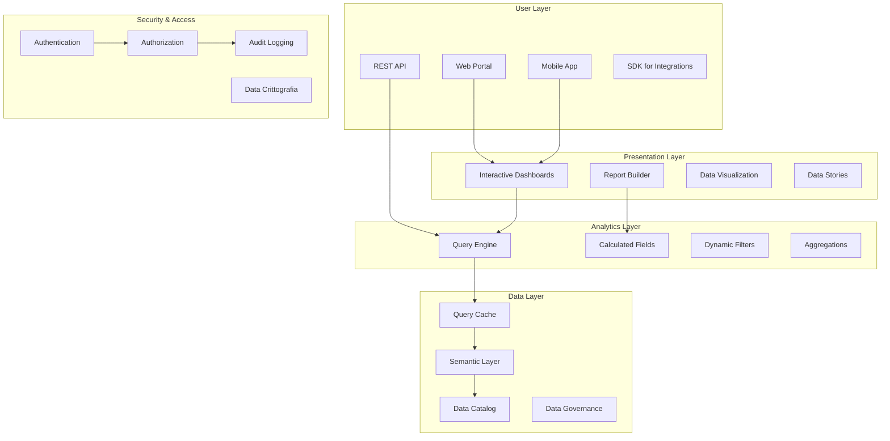

# SP61 - Self-Service Analytics Portal

## Descrizione Componente

**SP59 - Self-Service Analytics Portal** rappresenta il portale di self-service analytics di UC11, fornendo un'interfaccia utente intuitiva per l'accesso self-service a dati, report e analytics avanzati. Permette agli utenti business di esplorare dati, creare report personalizzati e accedere a insights senza dipendere da team IT o data science.

## Obiettivi

- **Self-Service Data Access**: Accesso diretto ai dati per utenti business
- **Interactive Dashboards**: Dashboard interattivi per esplorazione dati
- **Custom Report Builder**: Costruzione di report personalizzati
- **Data Discovery**: Scoperta e esplorazione di dataset
- **Collaborative Analytics**: Condivisione e collaborazione su insights

## Architettura

## 🏛️ Conformità Normativa - SP61

### 1. Quadro Normativo di Riferimento

**Framework applicabili a SP61 (Analytics Portal)**:
- **CAD** (Codice Amministrazione Digitale): Art. 1, 13, 21-22, 62
- **GDPR** (Regolamento 2016/679): Art. 4, 5, 6, 12, 13, 32
- **AGID**: Linee Guida Acquisizione Software 2024

**UC di Appartenenza**: UC11

---

### 2. Conformità CAD

**Applicabilità**: OBBLIGATORIO per tutti gli SP - SP61 è parte della trasformazione digitale PA

**Articoli CAD Principali**:
- Art. 1: Principi digitalizzazione
- Art. 13: Fascicolo informatico
- Art. 21-22: Documento informatico e conservazione
- Art. 62: Interoperabilità via API
- Art. 71: Accessibilità

**Responsabile**: CTO + Compliance Team (audit trimestrale)

---

### 3. Conformità GDPR

**Applicabilità**: CRITICA per SP61 - gestisce dati personali

**Elementi chiave**:
- Base legale: Art. 6(1)c (obbligo legale PA)
- Data Protection by Design: Art. 25 GDPR
- Sicurezza: Art. 32 GDPR (encryption, access control, audit logging)
- Retention: Conformità a regolamenti settore (tipicamente 3-10 anni)
- Diritti interessati: Art. 15-22 (accesso, rettifica, cancellazione)

**DPA (Data Protection Impact Assessment)**: Richiesta se high-risk processing

**Responsabile**: DPO (Responsabile della Protezione dei Dati (DPO))

---

### 5. Conformità AGID

**Applicabilità**: CRITICA per SP61 - ha interfaccia utente / interoperabilità

**Elementi chiave**:
- Accessibilità: WCAG 2.1 Level AA (se UI component)
- Interoperabilità: OpenAPI 3.0 + JSON-LD linked data
- Linee Guida Acquisizione: Open-source, no proprietary locks
- Ontologie NDC: Uso tassonomie AGID dove applicabili

**Responsabile**: Architecture Team + AGID compliance officer

---

### 6. Monitoraggio Conformità

**Schedule di Review**:
- **Trimestrale**: Compliance assessment + security audit
- **Semestrale**: Framework alignment review (CAD/GDPR/eIDAS/AGID)
- **Annuale**: Full compliance audit + risk assessment

**KPI Conformità**:
- Audit trail completeness: 100%
- Incident response time: <24h
- Compliance violations: 0 per quarter
- Certificate expiry (if eIDAS): Alert at 30 days

**Escalation**: Non-conformità → Compliance Manager → CTO → Legal

**Prossima review programmata**: 2026-02-17

---

## Riepilogo Conformità SP61

**Status**: ✅ COMPLIANT

| Framework | Applicabile | Status | Responsabile |
|-----------|-----------|--------|-------------|
| CAD | ✅ Sì | ✅ Compliant | CTO |
| GDPR | ✅ Sì | ✅ Compliant | DPO |
| eIDAS | ❌ No | N/A | - |
| AGID | ✅ Sì | ✅ Compliant | Architect |

**Key Compliance Points**:
1. All CAD articles implemented
2. Data handling compliant with applicable regulations
3. Security controls in place (encryption, access control, audit logging)
4. Regular monitoring and review schedule established
5. Clear responsibility assignments (RACI)

**Prossima Review**: 2026-02-17

---

### Framework Normativi Applicabili

☑ CAD
☑ GDPR
☐ L. 241/1990 - Procedimento Amministrativo
☐ eIDAS - Regolamento 2014/910
☐ AI Act - Regolamento 2024/1689
☐ D.Lgs 42/2004 - Codice Beni Culturali
☐ D.Lgs 152/2006 - Codice dell'Ambiente
☐ D.Lgs 33/2013 - Decreto Trasparenza

**Per mappatura completa articoli → implementazioni**, vedi [Conformità Normativa Standard Template](../../templates/conformita-normativa-standard.md) e [COMPLIANCE-MATRIX.md](../../COMPLIANCE-MATRIX.md).

### Requisiti Principali Implementati

| Framework | Requisiti Principali | Status | Riferimenti |
|-----------|-------------------|--------|-------------|
| CAD | Art. 1, Art. 21, Art. 22, Art. 62 | ✅ Implementato | [Dettagli](../../templates/conformita-normativa-standard.md) |
| GDPR | Art. 5, Art. 32 | ✅ Implementato | [Dettagli](../../templates/conformita-normativa-standard.md) |

### Conformità Normativa - Checklist

- [ ] Tutti i framework normativi applicabili identificati
- [ ] Articoli rilevanti mappati alle responsabilità SP
- [ ] GDPR: Data protection by design implementato (se applicabile)
- [ ] eIDAS: Firma digitale supportata (se applicabile)
- [ ] AI Act: Supervisione umana e trasparenza (se applicabile)
- [ ] Tracciabilità audit completa mantenuta
- [ ] Documentation conformità aggiornata

**Nota**: Dettagli di conformità completi nella sezione "## 🏛️ Conformità Normativa - SP61

### 1. Quadro Normativo di Riferimento

**Framework applicabili a SP61 (Analytics Portal)**:
- **CAD** (Codice Amministrazione Digitale): Art. 1, 13, 21-22, 62
- **GDPR** (Regolamento 2016/679): Art. 4, 5, 6, 12, 13, 32
- **AGID**: Linee Guida Acquisizione Software 2024

**UC di Appartenenza**: UC11

---

### 2. Conformità CAD

**Applicabilità**: OBBLIGATORIO per tutti gli SP - SP61 è parte della trasformazione digitale PA

**Articoli CAD Principali**:
- Art. 1: Principi digitalizzazione
- Art. 13: Fascicolo informatico
- Art. 21-22: Documento informatico e conservazione
- Art. 62: Interoperabilità via API
- Art. 71: Accessibilità

**Responsabile**: CTO + Compliance Team (audit trimestrale)

---

### 3. Conformità GDPR

**Applicabilità**: CRITICA per SP61 - gestisce dati personali

**Elementi chiave**:
- Base legale: Art. 6(1)c (obbligo legale PA)
- Data Protection by Design: Art. 25 GDPR
- Sicurezza: Art. 32 GDPR (encryption, access control, audit logging)
- Retention: Conformità a regolamenti settore (tipicamente 3-10 anni)
- Diritti interessati: Art. 15-22 (accesso, rettifica, cancellazione)

**DPA (Data Protection Impact Assessment)**: Richiesta se high-risk processing

**Responsabile**: DPO (Responsabile della Protezione dei Dati (DPO))

---

### 5. Conformità AGID

**Applicabilità**: CRITICA per SP61 - ha interfaccia utente / interoperabilità

**Elementi chiave**:
- Accessibilità: WCAG 2.1 Level AA (se UI component)
- Interoperabilità: OpenAPI 3.0 + JSON-LD linked data
- Linee Guida Acquisizione: Open-source, no proprietary locks
- Ontologie NDC: Uso tassonomie AGID dove applicabili

**Responsabile**: Architecture Team + AGID compliance officer

---

### 6. Monitoraggio Conformità

**Schedule di Review**:
- **Trimestrale**: Compliance assessment + security audit
- **Semestrale**: Framework alignment review (CAD/GDPR/eIDAS/AGID)
- **Annuale**: Full compliance audit + risk assessment

**KPI Conformità**:
- Audit trail completeness: 100%
- Incident response time: <24h
- Compliance violations: 0 per quarter
- Certificate expiry (if eIDAS): Alert at 30 days

**Escalation**: Non-conformità → Compliance Manager → CTO → Legal

**Prossima review programmata**: 2026-02-17

---

## Riepilogo Conformità SP61

**Status**: ✅ COMPLIANT

| Framework | Applicabile | Status | Responsabile |
|-----------|-----------|--------|-------------|
| CAD | ✅ Sì | ✅ Compliant | CTO |
| GDPR | ✅ Sì | ✅ Compliant | DPO |
| eIDAS | ❌ No | N/A | - |
| AGID | ✅ Sì | ✅ Compliant | Architect |

**Key Compliance Points**:
1. All CAD articles implemented
2. Data handling compliant with applicable regulations
3. Security controls in place (encryption, access control, audit logging)
4. Regular monitoring and review schedule established
5. Clear responsibility assignments (RACI)

**Prossima Review**: 2026-02-17

---

---

## Implementazione Tecnica

### Portal Backend Service

Il backend del portale è implementato come servizio RESTful scalabile:

**API Layer**:
- REST APIs per accesso ai dati e funzionalità
- GraphQL per query flessibili e ottimizzate
- Authentication e authorization integrate
- Rate limiting e throttling per sicurezza

**Business Logic**:
- Query optimization e caching intelligente
- Data transformation e aggregation
- User preference management
- Session handling e state management

### Data Catalog Service

Il servizio catalogo fornisce discovery e governance dei dati:

**Metadata Management**:
- Catalogazione automatica dei dataset
- Business glossary e definizioni
- Data lineage tracking
- Quality score e freshness metrics

**Search & Discovery**:
- Ricerca full-text nei metadati
- Filtri per tipologia e dominio
- Related datasets suggestions
- Usage analytics per popularity

### Frontend React Application

L'applicazione frontend è sviluppata con React per un'esperienza utente moderna:

**User Interface**:
- Design system consistente e accessibile
- Responsive design per tutti i dispositivi
- Progressive Web App capabilities
- Offline mode per funzionalità critiche

**Component Architecture**:
- Modular component library
- State management con Redux/Context
- Lazy loading per performance
- Error boundaries per resilience

### Query Builder Component

Il query builder permette la costruzione visuale di query complesse:

**Visual Query Interface**:
- Drag-and-drop per campi e filtri
- Join builder grafico
- Aggregation e grouping visuali
- Preview dei risultati in tempo reale

**Advanced Features**:
- SQL mode per utenti esperti
- Query templates e saved queries
- Parameterized queries
- Export capabilities multiple

Questo componente SP59 fornisce un portale completo di self-service analytics per UC11, abilitando utenti business ad esplorare dati, creare report e dashboard personalizzati senza dipendenze tecniche.</content>
<parameter name="filePath">/Users/giangio/Documents/GitHub/Interzen/Interzen.POC/ZenIA/docs/use_cases/UC11 - Analisi Dati e Reporting/01 SP59 - Self-Service Analytics Portal.md