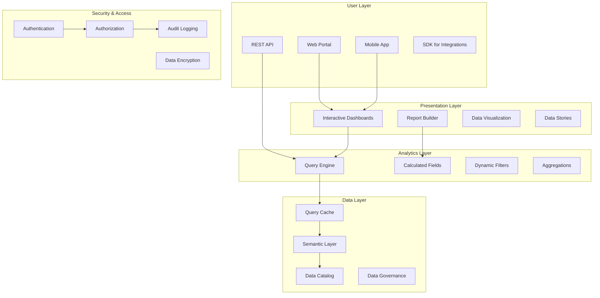

# SP61 - Self-Service Analytics Portal

## Descrizione Componente

**SP59 - Self-Service Analytics Portal** rappresenta il portale di self-service analytics di UC11, fornendo un'interfaccia utente intuitiva per l'accesso self-service a dati, report e analytics avanzati. Permette agli utenti business di esplorare dati, creare report personalizzati e accedere a insights senza dipendere da team IT o data science.

## Obiettivi

- **Self-Service Data Access**: Accesso diretto ai dati per utenti business
- **Interactive Dashboards**: Dashboard interattivi per esplorazione dati
- **Custom Report Builder**: Costruzione di report personalizzati
- **Data Discovery**: Scoperta e esplorazione di dataset
- **Collaborative Analytics**: Condivisione e collaborazione su insights

## Architettura

## Implementazione Tecnica

### Portal Backend Service

Il backend del portale è implementato come servizio RESTful scalabile:

**API Layer**:
- REST APIs per accesso ai dati e funzionalità
- GraphQL per query flessibili e ottimizzate
- Authentication e authorization integrate
- Rate limiting e throttling per sicurezza

**Business Logic**:
- Query optimization e caching intelligente
- Data transformation e aggregation
- User preference management
- Session handling e state management

### Data Catalog Service

Il servizio catalogo fornisce discovery e governance dei dati:

**Metadata Management**:
- Catalogazione automatica dei dataset
- Business glossary e definizioni
- Data lineage tracking
- Quality score e freshness metrics

**Search & Discovery**:
- Ricerca full-text nei metadati
- Filtri per tipologia e dominio
- Related datasets suggestions
- Usage analytics per popularity

### Frontend React Application

L'applicazione frontend è sviluppata con React per un'esperienza utente moderna:

**User Interface**:
- Design system consistente e accessibile
- Responsive design per tutti i dispositivi
- Progressive Web App capabilities
- Offline mode per funzionalità critiche

**Component Architecture**:
- Modular component library
- State management con Redux/Context
- Lazy loading per performance
- Error boundaries per resilience

### Query Builder Component

Il query builder permette la costruzione visuale di query complesse:

**Visual Query Interface**:
- Drag-and-drop per campi e filtri
- Join builder grafico
- Aggregation e grouping visuali
- Preview dei risultati in tempo reale

**Advanced Features**:
- SQL mode per utenti esperti
- Query templates e saved queries
- Parameterized queries
- Export capabilities multiple

Questo componente SP59 fornisce un portale completo di self-service analytics per UC11, abilitando utenti business ad esplorare dati, creare report e dashboard personalizzati senza dipendenze tecniche.</content>
<parameter name="filePath">/Users/giangio/Documents/GitHub/Interzen/Interzen.POC/ZenIA/docs/use_cases/UC11 - Analisi Dati e Reporting/01 SP59 - Self-Service Analytics Portal.md