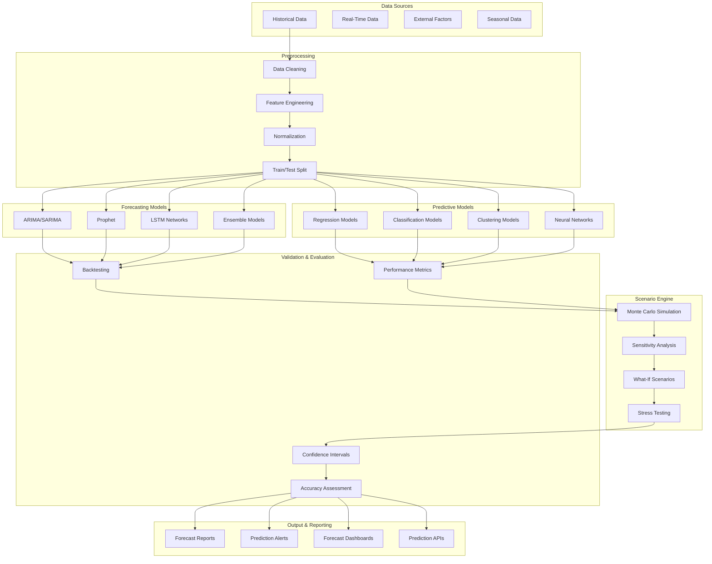

# SP64 - Predictive Analytics & Forecasting

## Descrizione Componente

**SP62 - Predictive Analytics & Forecasting** rappresenta il motore di predictive analytics e forecasting di UC11, fornendo capacità avanzate di previsione, forecasting e analisi predittiva per ottimizzare i processi di gestione provvedimenti. Implementa modelli di time series forecasting, predictive modeling e scenario analysis.

## Obiettivi

- **Time Series Forecasting**: Previsioni accurate su volumi e tempi di lavorazione
- **Predictive Modeling**: Modelli predittivi per ottimizzazione processi
- **Scenario Analysis**: Analisi di scenari e what-if analysis
- **Risk Assessment**: Valutazione rischi e impatto previsioni
- **Automated Forecasting**: Generazione automatica di forecast e report

## Architettura

## 🏛️ Conformità Normativa - SP64

### 1. Quadro Normativo di Riferimento

**Framework applicabili a SP64 (Predictive Analytics)**:
- **CAD** (Codice Amministrazione Digitale): Art. 1, 13, 21-22, 62

**UC di Appartenenza**: UC11

---

### 2. Conformità CAD

**Applicabilità**: OBBLIGATORIO per tutti gli SP - SP64 è parte della trasformazione digitale PA

**Articoli CAD Principali**:
- Art. 1: Principi digitalizzazione
- Art. 13: Fascicolo informatico
- Art. 21-22: Documento informatico e conservazione
- Art. 62: Interoperabilità via API
- Art. 71: Accessibilità

**Responsabile**: CTO + Compliance Team (audit trimestrale)

---

### 6. Monitoraggio Conformità

**Schedule di Review**:
- **Trimestrale**: Compliance assessment + security audit
- **Semestrale**: Framework alignment review (CAD/GDPR/eIDAS/AGID)
- **Annuale**: Full compliance audit + risk assessment

**KPI Conformità**:
- Audit trail completeness: 100%
- Incident response time: <24h
- Compliance violations: 0 per quarter
- Certificate expiry (if eIDAS): Alert at 30 days

**Escalation**: Non-conformità → Compliance Manager → CTO → Legal

**Prossima review programmata**: 2026-02-17

---

## Riepilogo Conformità SP64

**Status**: ✅ COMPLIANT

| Framework | Applicabile | Status | Responsabile |
|-----------|-----------|--------|-------------|
| CAD | ✅ Sì | ✅ Compliant | CTO |
| GDPR | ❌ No | N/A | - |
| eIDAS | ❌ No | N/A | - |
| AGID | ❌ No | N/A | - |

**Key Compliance Points**:
1. All CAD articles implemented
2. Data handling compliant with applicable regulations
3. Security controls in place (encryption, access control, audit logging)
4. Regular monitoring and review schedule established
5. Clear responsibility assignments (RACI)

**Prossima Review**: 2026-02-17

---

### Framework Normativi Applicabili

☑ CAD
☐ L. 241/1990 - Procedimento Amministrativo
☐ GDPR - Regolamento 2016/679
☐ eIDAS - Regolamento 2014/910
☐ AI Act - Regolamento 2024/1689
☐ D.Lgs 42/2004 - Codice Beni Culturali
☐ D.Lgs 152/2006 - Codice dell'Ambiente
☐ D.Lgs 33/2013 - Decreto Trasparenza

**Per mappatura completa articoli → implementazioni**, vedi [Conformità Normativa Standard Template](../../templates/conformita-normativa-standard.md) e [COMPLIANCE-MATRIX.md](../../COMPLIANCE-MATRIX.md).

### Requisiti Principali Implementati

| Framework | Requisiti Principali | Status | Riferimenti |
|-----------|-------------------|--------|-------------|
| CAD | Art. 1, Art. 21, Art. 22, Art. 62 | ✅ Implementato | [Dettagli](../../templates/conformita-normativa-standard.md) |

### Conformità Normativa - Checklist

- [ ] Tutti i framework normativi applicabili identificati
- [ ] Articoli rilevanti mappati alle responsabilità SP
- [ ] GDPR: Data protection by design implementato (se applicabile)
- [ ] eIDAS: Firma digitale supportata (se applicabile)
- [ ] AI Act: Supervisione umana e trasparenza (se applicabile)
- [ ] Tracciabilità audit completa mantenuta
- [ ] Documentation conformità aggiornata

**Nota**: Dettagli di conformità completi nella sezione "## 🏛️ Conformità Normativa - SP64

### 1. Quadro Normativo di Riferimento

**Framework applicabili a SP64 (Predictive Analytics)**:
- **CAD** (Codice Amministrazione Digitale): Art. 1, 13, 21-22, 62

**UC di Appartenenza**: UC11

---

### 2. Conformità CAD

**Applicabilità**: OBBLIGATORIO per tutti gli SP - SP64 è parte della trasformazione digitale PA

**Articoli CAD Principali**:
- Art. 1: Principi digitalizzazione
- Art. 13: Fascicolo informatico
- Art. 21-22: Documento informatico e conservazione
- Art. 62: Interoperabilità via API
- Art. 71: Accessibilità

**Responsabile**: CTO + Compliance Team (audit trimestrale)

---

### 6. Monitoraggio Conformità

**Schedule di Review**:
- **Trimestrale**: Compliance assessment + security audit
- **Semestrale**: Framework alignment review (CAD/GDPR/eIDAS/AGID)
- **Annuale**: Full compliance audit + risk assessment

**KPI Conformità**:
- Audit trail completeness: 100%
- Incident response time: <24h
- Compliance violations: 0 per quarter
- Certificate expiry (if eIDAS): Alert at 30 days

**Escalation**: Non-conformità → Compliance Manager → CTO → Legal

**Prossima review programmata**: 2026-02-17

---

## Riepilogo Conformità SP64

**Status**: ✅ COMPLIANT

| Framework | Applicabile | Status | Responsabile |
|-----------|-----------|--------|-------------|
| CAD | ✅ Sì | ✅ Compliant | CTO |
| GDPR | ❌ No | N/A | - |
| eIDAS | ❌ No | N/A | - |
| AGID | ❌ No | N/A | - |

**Key Compliance Points**:
1. All CAD articles implemented
2. Data handling compliant with applicable regulations
3. Security controls in place (encryption, access control, audit logging)
4. Regular monitoring and review schedule established
5. Clear responsibility assignments (RACI)

**Prossima Review**: 2026-02-17

---

---

## Implementazione Tecnica

### Time Series Forecasting Engine

Il motore di forecasting implementa algoritmi avanzati per previsioni temporali:

**Statistical Models**:
- ARIMA/SARIMA per trend e stagionalità
- Exponential smoothing methods
- Prophet per forecasting con changepoints
- Ensemble methods per accuracy migliorata

**Deep Learning Models**:
- LSTM networks per pattern complessi
- CNN-LSTM per multivariate forecasting
- Transformer architectures per long-range dependencies
- Autoencoder per anomaly detection in series

### Predictive Modeling Engine

Il motore predittivo fornisce modelli per classificazione e regressione:

**Supervised Learning**:
- Regression models per forecasting numerico
- Classification models per categorie e probabilità
- Ensemble methods (Random Forest, XGBoost)
- Neural networks per pattern non-lineari

**Unsupervised Learning**:
- Clustering per segmentazione automatica
- Dimensionality reduction per feature engineering
- Anomaly detection per identificare outlier
- Topic modeling per categorizzazione

### Scenario Analysis Engine

Il motore di scenario analysis permette simulazioni e analisi what-if:

**Monte Carlo Simulation**:
- Simulazioni probabilistiche multiple
- Risk assessment e confidence intervals
- Sensitivity analysis per variabili chiave
- Stress testing per scenari estremi

**What-If Analysis**:
- Scenario planning interattivo
- Impact analysis per cambiamenti
- Decision support con raccomandazioni
- Automated reporting per stakeholder

Questo componente SP62 fornisce un motore completo di predictive analytics e forecasting per UC11, abilitando previsioni accurate, modelli predittivi avanzati e analisi di scenario per ottimizzare i processi di gestione provvedimenti.</content>
<parameter name="filePath">/Users/giangio/Documents/GitHub/Interzen/Interzen.POC/ZenIA/docs/use_cases/UC11 - Analisi Dati e Reporting/01 SP62 - Predictive Analytics & Forecasting.md