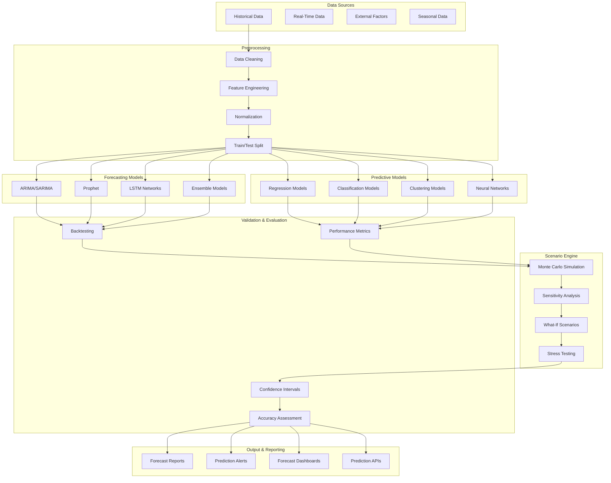

# SP64 - Predictive Analytics & Forecasting

## Descrizione Componente

**SP62 - Predictive Analytics & Forecasting** rappresenta il motore di predictive analytics e forecasting di UC11, fornendo capacità avanzate di previsione, forecasting e analisi predittiva per ottimizzare i processi di gestione provvedimenti. Implementa modelli di time series forecasting, predictive modeling e scenario analysis.

## Obiettivi

- **Time Series Forecasting**: Previsioni accurate su volumi e tempi di lavorazione
- **Predictive Modeling**: Modelli predittivi per ottimizzazione processi
- **Scenario Analysis**: Analisi di scenari e what-if analysis
- **Risk Assessment**: Valutazione rischi e impatto previsioni
- **Automated Forecasting**: Generazione automatica di forecast e report

## Architettura

## Implementazione Tecnica

### Time Series Forecasting Engine

Il motore di forecasting implementa algoritmi avanzati per previsioni temporali:

**Statistical Models**:
- ARIMA/SARIMA per trend e stagionalità
- Exponential smoothing methods
- Prophet per forecasting con changepoints
- Ensemble methods per accuracy migliorata

**Deep Learning Models**:
- LSTM networks per pattern complessi
- CNN-LSTM per multivariate forecasting
- Transformer architectures per long-range dependencies
- Autoencoder per anomaly detection in series

### Predictive Modeling Engine

Il motore predittivo fornisce modelli per classificazione e regressione:

**Supervised Learning**:
- Regression models per forecasting numerico
- Classification models per categorie e probabilità
- Ensemble methods (Random Forest, XGBoost)
- Neural networks per pattern non-lineari

**Unsupervised Learning**:
- Clustering per segmentazione automatica
- Dimensionality reduction per feature engineering
- Anomaly detection per identificare outlier
- Topic modeling per categorizzazione

### Scenario Analysis Engine

Il motore di scenario analysis permette simulazioni e analisi what-if:

**Monte Carlo Simulation**:
- Simulazioni probabilistiche multiple
- Risk assessment e confidence intervals
- Sensitivity analysis per variabili chiave
- Stress testing per scenari estremi

**What-If Analysis**:
- Scenario planning interattivo
- Impact analysis per cambiamenti
- Decision support con raccomandazioni
- Automated reporting per stakeholder

Questo componente SP62 fornisce un motore completo di predictive analytics e forecasting per UC11, abilitando previsioni accurate, modelli predittivi avanzati e analisi di scenario per ottimizzare i processi di gestione provvedimenti.</content>
<parameter name="filePath">/Users/giangio/Documents/GitHub/Interzen/Interzen.POC/ZenIA/docs/use_cases/UC11 - Analisi Dati e Reporting/01 SP62 - Predictive Analytics & Forecasting.md