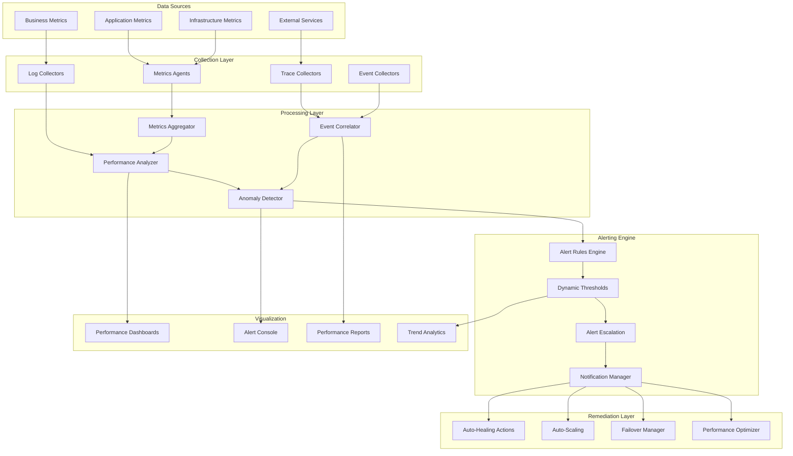

# SP65 - Performance Monitoring & Alerting

## Descrizione Componente

**SP63 - Performance Monitoring & Alerting** rappresenta il sistema di monitoraggio delle performance e alerting intelligente di UC11, fornendo monitoraggio real-time delle metriche di sistema, rilevamento anomalie e generazione automatica di alert per garantire l'affidabilità e le performance ottimali della piattaforma di analisi dati.

## Obiettivi

- **Real-Time Monitoring**: Monitoraggio continuo delle metriche di performance
- **Anomaly Detection**: Rilevamento automatico di anomalie e comportamenti anomali
- **Intelligent Alerting**: Sistema di alert intelligente con escalation automatica
- **Performance Analytics**: Analisi delle performance e trend di sistema
- **Automated Remediation**: Azioni correttive automatiche per problemi comuni

## Architettura

## 🏛️ Conformità Normativa

### Framework Normativi Applicabili

☑ CAD
☑ GDPR
☐ L. 241/1990 - Procedimento Amministrativo
☐ eIDAS - Regolamento 2014/910
☐ AI Act - Regolamento 2024/1689
☐ D.Lgs 42/2004 - Codice Beni Culturali
☐ D.Lgs 152/2006 - Codice dell'Ambiente
☐ D.Lgs 33/2013 - Decreto Trasparenza

**Per mappatura completa articoli → implementazioni**, vedi [Conformità Normativa Standard Template](../../templates/conformita-normativa-standard.md) e [COMPLIANCE-MATRIX.md](../../COMPLIANCE-MATRIX.md).

### Requisiti Principali Implementati

| Framework | Requisiti Principali | Status | Riferimenti |
|-----------|-------------------|--------|-------------|
| CAD | Art. 1, Art. 21, Art. 22, Art. 62 | ✅ Implementato | [Dettagli](../../templates/conformita-normativa-standard.md) |
| GDPR | Art. 5, Art. 32 | ✅ Implementato | [Dettagli](../../templates/conformita-normativa-standard.md) |

### Conformità Normativa - Checklist

- [ ] Tutti i framework normativi applicabili identificati
- [ ] Articoli rilevanti mappati alle responsabilità SP
- [ ] GDPR: Data protection by design implementato (se applicabile)
- [ ] eIDAS: Firma digitale supportata (se applicabile)
- [ ] AI Act: Supervisione umana e trasparenza (se applicabile)
- [ ] Tracciabilità audit completa mantenuta
- [ ] Documentation conformità aggiornata

**Nota**: Dettagli di conformità completi nella sezione "## 🏛️ Conformità Normativa" del template standard.

---

## Implementazione Tecnica

### Metrics Collection System

Il sistema di raccolta metriche monitora tutti gli aspetti delle performance:

**Infrastructure Metrics**:
- CPU, memoria e I/O utilization
- Network throughput e latency
- Storage performance e capacity
- Container orchestration metrics

**Application Metrics**:
- Query performance e throughput
- Error rates e response times
- Data processing volumes
- Model accuracy e drift detection

### Anomaly Detection Engine

Il motore di rilevamento anomalie identifica problemi automaticamente:

**Statistical Methods**:
- Time series analysis per trend deviation
- Z-score e percentile-based detection
- Seasonal decomposition per pattern recognition
- Correlation analysis per root cause identification

**Machine Learning Methods**:
- Isolation Forest per multivariate anomalies
- Autoencoder per unsupervised learning
- LSTM per sequential pattern anomalies
- Ensemble methods per improved accuracy

### Intelligent Alerting System

Il sistema di alerting intelligente riduce il noise e aumenta la rilevanza:

**Smart Alert Rules**:
- Dynamic thresholds basati su baseline
- Alert correlation per ridurre duplicati
- Severity classification automatica
- Alert enrichment con contesto

**Multi-Channel Notifications**:
- Email, SMS e Slack integration
- Escalation policies basate su severity
- On-call rotation e scheduling
- Alert acknowledgment e tracking

### Automated Remediation System

Il sistema di remediation automatica risolve problemi autonomamente:

**Auto-Healing Actions**:
- Service restart per failure recovery
- Resource scaling per performance issues
- Configuration rollback per misconfigurations
- Cache invalidation per data consistency

**Self-Optimization**:
- Query optimization automatica
- Index rebuilding per performance
- Data partitioning dinamica
- Model retraining per accuracy drift

Questo componente SP63 fornisce un sistema completo di monitoraggio delle performance e alerting intelligente per UC11, abilitando il rilevamento proattivo di problemi, notifiche automatiche e remediation self-healing per garantire l'affidabilità e le performance ottimali della piattaforma di analisi dati.</content>
<parameter name="filePath">/Users/giangio/Documents/GitHub/Interzen/Interzen.POC/ZenIA/docs/use_cases/UC11 - Analisi Dati e Reporting/01 SP63 - Performance Monitoring & Alerting.md