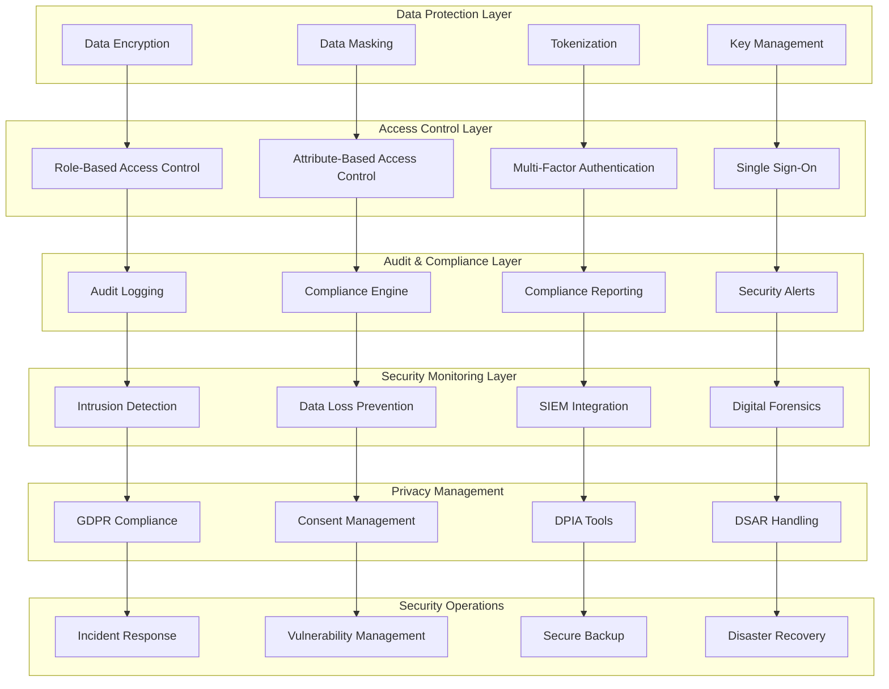

# SP66 - Data Security & Compliance

## Descrizione Componente

**SP64 - Data Security & Compliance** rappresenta il framework di sicurezza dei dati e compliance di UC11, fornendo protezione completa dei dati sensibili, controlli di accesso avanzati, audit logging e conformità normativa per garantire la sicurezza e la privacy dei dati nella piattaforma di analisi.

## Obiettivi

- **Data Protection**: Crittografia end-to-end e protezione dei dati sensibili
- **Access Control**: Controlli di accesso basati su ruoli e attributi
- **Audit Logging**: Logging completo di tutte le attività di sistema
- **Compliance Management**: Gestione conformità GDPR, SOX, HIPAA
- **Data Masking**: Mascheramento dati per ambienti di sviluppo/test
- **Security Monitoring**: Monitoraggio sicurezza e rilevamento intrusioni

## Architettura

## Implementazione Tecnica

### Data Encryption & Protection System

Il sistema di encryption garantisce la protezione dei dati end-to-end:

**Encryption at Rest**:
- AES-256 encryption per tutti i dati stored
- Envelope encryption con KMS
- Key rotation automatica
- Secure key storage e management

**Encryption in Transit**:
- TLS 1.3 per tutte le comunicazioni
- Perfect forward secrecy
- Certificate pinning per API
- VPN obbligatoria per accessi interni

### Access Control & Authorization System

Il sistema di controllo accessi implementa sicurezza a livelli multipli:

**Identity Management**:
- Single Sign-On (SSO) integrato
- Multi-Factor Authentication (MFA)
- Role-Based Access Control (RBAC)
- Attribute-Based Access Control (ABAC)

**Data Protection**:
- Data masking per sensitive information
- Tokenization per PCI compliance
- Dynamic data masking basato su ruolo
- Row-level security per granular access

### Audit Logging & Compliance System

Il sistema di audit garantisce tracciabilità completa e compliance:

**Comprehensive Auditing**:
- Audit logging per tutte le operazioni
- Immutable audit trail con blockchain
- Real-time monitoring e alerting
- Automated compliance reporting

**GDPR & Privacy Compliance**:
- Data Subject Access Requests (DSAR)
- Right to erasure implementation
- Consent management system
- Data Protection Impact Assessment (DPIA)

Questo componente SP64 fornisce un framework completo di sicurezza dei dati e compliance per UC11, abilitando protezione dei dati, controlli di accesso avanzati, audit logging e conformità normativa per garantire la sicurezza e la privacy dei dati nella piattaforma di analisi.</content>
<parameter name="filePath">/Users/giangio/Documents/GitHub/Interzen/Interzen.POC/ZenIA/docs/use_cases/UC11 - Analisi Dati e Reporting/01 SP64 - Data Security & Compliance.md