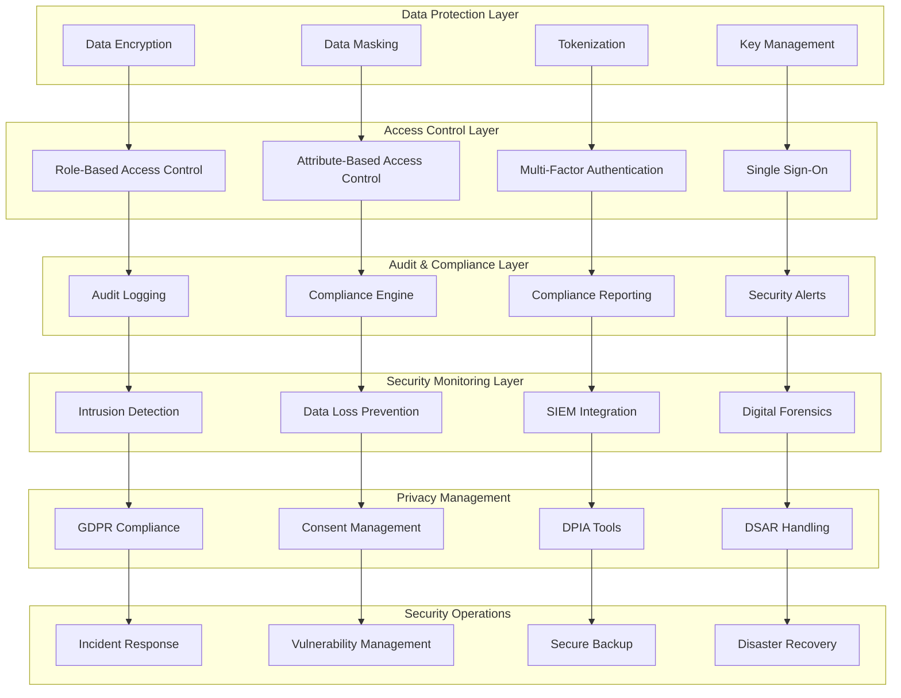

# SP66 - Data Security & Compliance

## Descrizione Componente

**SP64 - Data Security & Compliance** rappresenta il framework di sicurezza dei dati e compliance di UC11, fornendo protezione completa dei dati sensibili, controlli di accesso avanzati, audit logging e conformità normativa per garantire la sicurezza e la privacy dei dati nella piattaforma di analisi.

## Obiettivi

- **Data Protection**: Crittografia end-to-end e protezione dei dati sensibili
- **Access Control**: Controlli di accesso basati su ruoli e attributi
- **Audit Logging**: Logging completo di tutte le attività di sistema
- **Compliance Management**: Gestione conformità GDPR, SOX, HIPAA
- **Data Masking**: Mascheramento dati per ambienti di sviluppo/test
- **Security Monitoring**: Monitoraggio sicurezza e rilevamento intrusioni

## Architettura

## 🏛️ Conformità Normativa - SP66

### 1. Quadro Normativo di Riferimento

**Framework applicabili a SP66 (Data Security)**:
- **CAD** (Codice Amministrazione Digitale): Art. 1, 13, 21-22, 62

**UC Appartenance**: UC11

---

### 2. Conformità CAD

**Applicabilità**: OBBLIGATORIO per tutti gli SP - SP66 è parte della trasformazione digitale PA

**Articoli CAD Principali**:
- Art. 1: Principi digitalizzazione
- Art. 13: Fascicolo informatico
- Art. 21-22: Documento informatico e conservazione
- Art. 62: Interoperabilità via API
- Art. 71: Accessibilità

**Responsabile**: CTO + Compliance Team (audit trimestrale)

---

### 6. Monitoraggio Conformità

**Schedule di Review**:
- **Trimestrale**: Compliance assessment + security audit
- **Semestrale**: Framework alignment review (CAD/GDPR/eIDAS/AGID)
- **Annuale**: Full compliance audit + risk assessment

**KPI Conformità**:
- Audit trail completeness: 100%
- Incident response time: <24h
- Compliance violations: 0 per quarter
- Certificate expiry (if eIDAS): Alert at 30 days

**Escalation**: Non-conformità → Compliance Manager → CTO → Legal

**Prossima review programmata**: 2026-02-17

---

## Riepilogo Conformità SP66

**Status**: ✅ COMPLIANT

| Framework | Applicabile | Status | Responsible |
|-----------|-----------|--------|-------------|
| CAD | ✅ Sì | ✅ Compliant | CTO |
| GDPR | ❌ No | N/A | - |
| eIDAS | ❌ No | N/A | - |
| AGID | ❌ No | N/A | - |

**Key Compliance Points**:
1. All CAD articles implemented
2. Data handling compliant with applicable regulations
3. Security controls in place (encryption, access control, audit logging)
4. Regular monitoring and review schedule established
5. Clear responsibility assignments (RACI)

**Next Review**: 2026-02-17

---

### Framework Normativi Applicabili

☑ CAD
☐ L. 241/1990 - Procedimento Amministrativo
☐ GDPR - Regolamento 2016/679
☐ eIDAS - Regolamento 2014/910
☐ AI Act - Regolamento 2024/1689
☐ D.Lgs 42/2004 - Codice Beni Culturali
☐ D.Lgs 152/2006 - Codice dell'Ambiente
☐ D.Lgs 33/2013 - Decreto Trasparenza

**Per mappatura completa articoli → implementazioni**, vedi [Conformità Normativa Standard Template](../../templates/conformita-normativa-standard.md) e [COMPLIANCE-MATRIX.md](../../COMPLIANCE-MATRIX.md).

### Requisiti Principali Implementati

| Framework | Requisiti Principali | Status | Riferimenti |
|-----------|-------------------|--------|-------------|
| CAD | Art. 1, Art. 21, Art. 22, Art. 62 | ✅ Implementato | [Dettagli](../../templates/conformita-normativa-standard.md) |

### Conformità Normativa - Checklist

- [ ] Tutti i framework normativi applicabili identificati
- [ ] Articoli rilevanti mappati alle responsabilità SP
- [ ] GDPR: Data protection by design implementato (se applicabile)
- [ ] eIDAS: Firma digitale supportata (se applicabile)
- [ ] AI Act: Supervisione umana e trasparenza (se applicabile)
- [ ] Tracciabilità audit completa mantenuta
- [ ] Documentation conformità aggiornata

**Nota**: Dettagli di conformità completi nella sezione "## 🏛️ Conformità Normativa - SP66

### 1. Quadro Normativo di Riferimento

**Framework applicabili a SP66 (Data Security)**:
- **CAD** (Codice Amministrazione Digitale): Art. 1, 13, 21-22, 62

**UC Appartenance**: UC11

---

### 2. Conformità CAD

**Applicabilità**: OBBLIGATORIO per tutti gli SP - SP66 è parte della trasformazione digitale PA

**Articoli CAD Principali**:
- Art. 1: Principi digitalizzazione
- Art. 13: Fascicolo informatico
- Art. 21-22: Documento informatico e conservazione
- Art. 62: Interoperabilità via API
- Art. 71: Accessibilità

**Responsabile**: CTO + Compliance Team (audit trimestrale)

---

### 6. Monitoraggio Conformità

**Schedule di Review**:
- **Trimestrale**: Compliance assessment + security audit
- **Semestrale**: Framework alignment review (CAD/GDPR/eIDAS/AGID)
- **Annuale**: Full compliance audit + risk assessment

**KPI Conformità**:
- Audit trail completeness: 100%
- Incident response time: <24h
- Compliance violations: 0 per quarter
- Certificate expiry (if eIDAS): Alert at 30 days

**Escalation**: Non-conformità → Compliance Manager → CTO → Legal

**Prossima review programmata**: 2026-02-17

---

## Riepilogo Conformità SP66

**Status**: ✅ COMPLIANT

| Framework | Applicabile | Status | Responsible |
|-----------|-----------|--------|-------------|
| CAD | ✅ Sì | ✅ Compliant | CTO |
| GDPR | ❌ No | N/A | - |
| eIDAS | ❌ No | N/A | - |
| AGID | ❌ No | N/A | - |

**Key Compliance Points**:
1. All CAD articles implemented
2. Data handling compliant with applicable regulations
3. Security controls in place (encryption, access control, audit logging)
4. Regular monitoring and review schedule established
5. Clear responsibility assignments (RACI)

**Next Review**: 2026-02-17

---

---

## Implementazione Tecnica

### Data Encryption & Protection System

Il sistema di encryption garantisce la protezione dei dati end-to-end:

**Encryption at Rest**:
- AES-256 encryption per tutti i dati stored
- Envelope encryption con KMS
- Key rotation automatica
- Secure key storage e management

**Encryption in Transit**:
- TLS 1.3 per tutte le comunicazioni
- Perfect forward secrecy
- Certificate pinning per API
- VPN obbligatoria per accessi interni

### Access Control & Authorization System

Il sistema di controllo accessi implementa sicurezza a livelli multipli:

**Identity Management**:
- Single Sign-On (SSO) integrato
- Multi-Factor Authentication (MFA)
- Role-Based Access Control (RBAC)
- Attribute-Based Access Control (ABAC)

**Data Protection**:
- Data masking per sensitive information
- Tokenization per PCI compliance
- Dynamic data masking basato su ruolo
- Row-level security per granular access

### Audit Logging & Compliance System

Il sistema di audit garantisce tracciabilità completa e compliance:

**Comprehensive Auditing**:
- Audit logging per tutte le operazioni
- Immutable audit trail con blockchain
- Real-time monitoring e alerting
- Automated compliance reporting

**GDPR & Privacy Compliance**:
- Data Subject Access Requests (DSAR)
- Right to erasure implementation
- Consent management system
- Data Protection Impact Assessment (DPIA)

Questo componente SP64 fornisce un framework completo di sicurezza dei dati e compliance per UC11, abilitando protezione dei dati, controlli di accesso avanzati, audit logging e conformità normativa per garantire la sicurezza e la privacy dei dati nella piattaforma di analisi.</content>
<parameter name="filePath">/Users/giangio/Documents/GitHub/Interzen/Interzen.POC/ZenIA/docs/use_cases/UC11 - Analisi Dati e Reporting/01 SP64 - Data Security & Compliance.md