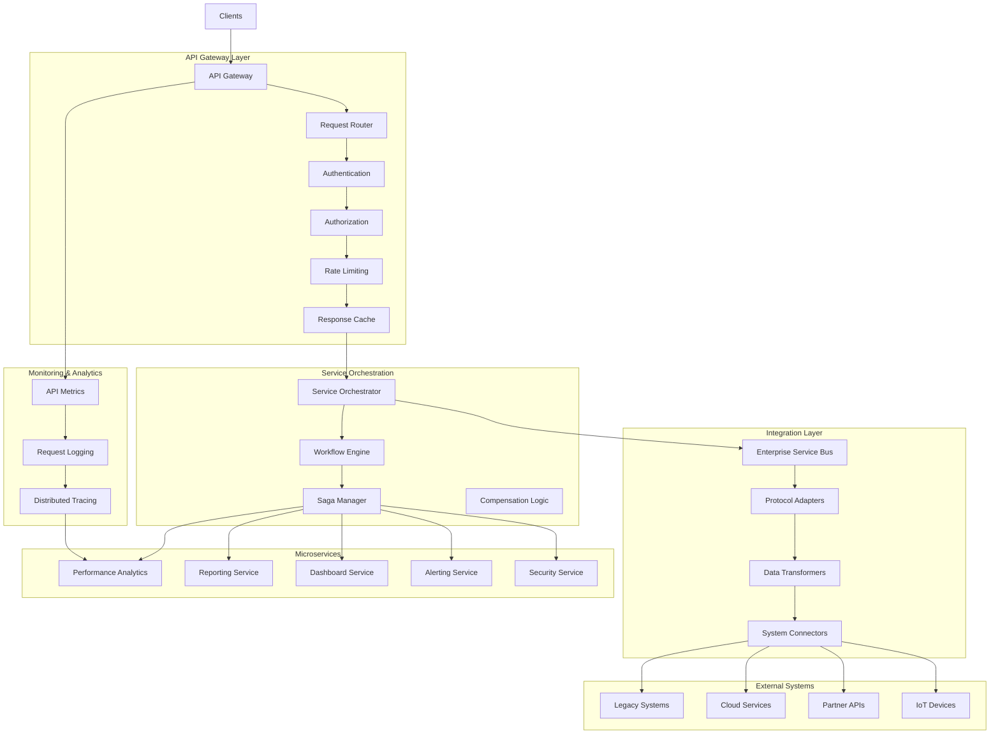

# SP67 - API Gateway & Integration Layer

## Descrizione Componente

**SP65 - API Gateway & Integration Layer** rappresenta il gateway API e il livello di integrazione di UC11, fornendo un punto di ingresso unificato per tutti i servizi di analisi dati, gestione delle API, orchestrazione dei microservizi e integrazione con sistemi esterni per garantire comunicazione sicura e efficiente tra i componenti della piattaforma.

## Obiettivi

- **API Management**: Gestione centralizzata delle API con versioning e documentazione
- **Service Orchestration**: Orchestrazione dei microservizi e workflow complessi
- **Integration Hub**: Hub di integrazione per sistemi interni ed esterni
- **Load Balancing**: Bilanciamento del carico e gestione del traffico
- **Security Gateway**: Gateway di sicurezza con autenticazione e autorizzazione
- **Monitoring & Analytics**: Monitoraggio delle API e analisi delle performance

## Architettura

## 🏛️ Conformità Normativa

### Framework Normativi Applicabili

☑ CAD
☑ GDPR
☐ L. 241/1990 - Procedimento Amministrativo
☐ eIDAS - Regolamento 2014/910
☐ AI Act - Regolamento 2024/1689
☐ D.Lgs 42/2004 - Codice Beni Culturali
☐ D.Lgs 152/2006 - Codice dell'Ambiente
☐ D.Lgs 33/2013 - Decreto Trasparenza

**Per mappatura completa articoli → implementazioni**, vedi [Conformità Normativa Standard Template](../../templates/conformita-normativa-standard.md) e [COMPLIANCE-MATRIX.md](../../COMPLIANCE-MATRIX.md).

### Requisiti Principali Implementati

| Framework | Requisiti Principali | Status | Riferimenti |
|-----------|-------------------|--------|-------------|
| CAD | Art. 1, Art. 21, Art. 22, Art. 62 | ✅ Implementato | [Dettagli](../../templates/conformita-normativa-standard.md) |
| GDPR | Art. 5, Art. 32 | ✅ Implementato | [Dettagli](../../templates/conformita-normativa-standard.md) |

### Conformità Normativa - Checklist

- [ ] Tutti i framework normativi applicabili identificati
- [ ] Articoli rilevanti mappati alle responsabilità SP
- [ ] GDPR: Data protection by design implementato (se applicabile)
- [ ] eIDAS: Firma digitale supportata (se applicabile)
- [ ] AI Act: Supervisione umana e trasparenza (se applicabile)
- [ ] Tracciabilità audit completa mantenuta
- [ ] Documentation conformità aggiornata

**Nota**: Dettagli di conformità completi nella sezione "## 🏛️ Conformità Normativa" del template standard.

---

## Implementazione Tecnica

### API Gateway Core

Il core del gateway API gestisce tutto il traffico applicativo:

**Traffic Management**:
- Load balancing intelligente
- Circuit breaker per fault tolerance
- Request routing dinamico
- API versioning e deprecation

**Security Layer**:
- Authentication e authorization centralizzate
- Rate limiting e throttling
- IP whitelisting e blacklisting
- API key management

### Service Orchestrator

L'orchestratore coordina l'esecuzione di workflow complessi:

**Workflow Engine**:
- Saga pattern per transazioni distribuite
- Compensation logic per error recovery
- Parallel execution per performance
- Dependency management

**Event-Driven Architecture**:
- Event sourcing per audit trail
- CQRS per read/write optimization
- Event streaming con Kafka
- Async processing per scalability

### Integration Layer

Il layer di integrazione connette sistemi eterogenei:

**Protocol Adapters**:
- REST, GraphQL, gRPC support
- Legacy system connectors
- Cloud service integrations
- IoT device connectivity

**Data Transformation**:
- Message transformation e mapping
- Protocol conversion
- Data enrichment e filtering
- Schema validation

Questo componente SP65 fornisce un gateway API completo e un livello di integrazione per UC11, abilitando orchestrazione di microservizi, gestione API centralizzata, sicurezza gateway e integrazione con sistemi esterni per garantire comunicazione efficiente e sicura tra tutti i componenti della piattaforma di analisi dati.</content>
<parameter name="filePath">/Users/giangio/Documents/GitHub/Interzen/Interzen.POC/ZenIA/docs/use_cases/UC11 - Analisi Dati e Reporting/01 SP65 - API Gateway & Integration Layer.md