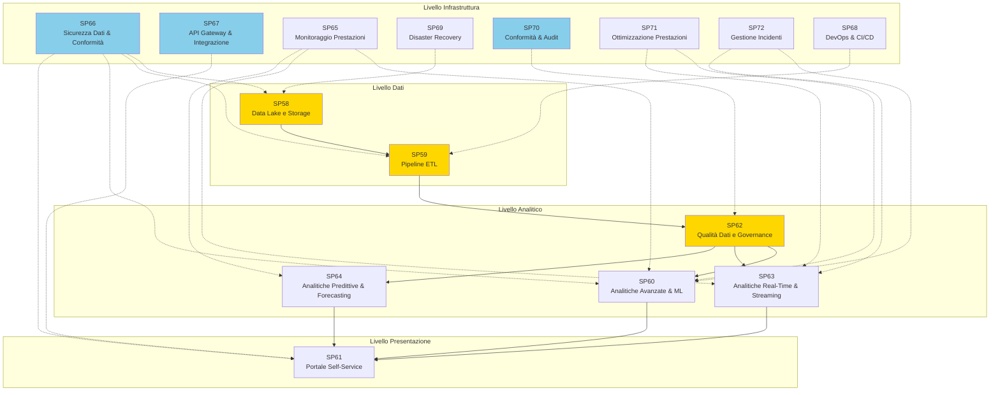

# Matrice Dipendenze - UC11 Analisi Dati e Reporting

## Panoramica: Stack completo UC11 (Analytics + Infrastruttura)

## Dipendenze Analitiche

| SP | Nome | Input da | Output verso | Criticità |
|---|---|---|---|---|
| **SP58** | Data Lake & Storage Management | Fonti esterne | SP59 | CRITICA |
| **SP59** | Pipeline ETL | SP58 | SP62 | CRITICA |
| **SP62** | Qualità Dati & Governance | SP59 | SP60, SP63, SP64 | CRITICA |
| **SP60** | Analitiche Avanzate & ML | SP62 | SP61 | ALTA |
| **SP63** | Analitiche Real-Time & Streaming | SP62 | SP61 | ALTA |
| **SP64** | Analitiche Predittive & Forecasting | SP62 | SP61 | ALTA |
| **SP61** | Portale Self-Service Analytics | SP60, SP63, SP64 | Pannelli BI | ALTA |

## Dipendenze Livello Infrastruttura

| SP | Nome | Supporta | Criticità | RTO | Fallback |
|---|---|---|---|---|---|
| **SP65** | Monitoraggio Prestazioni & Alerting | SP60, SP63, SP64 | ALTA | 5min | Monitoraggio manuale |
| **SP66** | Sicurezza Dati & Conformità | Tutti i livelli dati | CRITICA | 1min | Backup chiavi HSM |
| **SP67** | API Gateway & Integrazione | Interfacce SP61 | CRITICA | 15min | Failover load balancer |
| **SP68** | DevOps & CI/CD Pipeline | SP59 (deployments) | MEDIA | 30min | Deploy manuale |
| **SP69** | Disaster Recovery & Business Continuity | Tutti gli SP critici | ALTA | 1h | Attivazione regione di backup |
| **SP70** | Conformità & Gestione Audit | SP62 (governance) | CRITICA | 24h | Ripristino log di audit archiviati |
| **SP71** | Ottimizzazione Prestazioni & Scaling | SP60, SP63 (compute) | ALTA | 10min | Allocazione risorse statica |
| **SP72** | Gestione Incidenti & Escalation | SP60, SP63 (monitoraggio) | MEDIA | 10min | Risposta incidenti manuale |

## Flusso Principale (Analytics + Infrastructure)

### Pipeline di Elaborazione Dati
Data Lake (SP58) → Pipeline ETL (SP59) → Quality Gate (SP62) → Analitiche (SP60/63/64) → Portale (SP61)

### Infrastructure Overlay
- **Sicurezza**: SP66 copre tutti i livelli dati
- **Monitoraggio**: SP65 osserva i livelli analitici
- **Conformità**: SP70 applica governance (SP62)
- **DR/Scaling**: SP69/SP71 supportano i componenti core
- **Incident**: SP72 risponde agli alert di SP60/63

## Criticità

### CRITICA (Bloccante)
- **SP58** (Data Lake): Perdita dati = sistema non operativo
- **SP59** (Pipeline ETL): Blocco flusso dati = nessuna analisi
- **SP62** (Quality Gate): Dati scadenti → decisioni non valide
- **SP66** (Sicurezza): Violazione = perdita dati + violazione compliance
- **SP67** (API Gateway): Portale offline = utenti bloccati
- **SP70** (Audit): Violazione conformità = rischio legale

### ALTA (Degrado Severo)
- **SP60** (ML): Analisi lente = insight ritardati
- **SP63** (Real-Time): Ritardi nella freschezza degli analytics
- **SP61** (Portale): Degrado UX, ma i dati vengono comunque processati
- **SP65** (Monitoraggio): Zona cieca fino a intervento manuale
- **SP69** (DR): Ritardi di recovery impattano RTO
- **SP71** (Scaling): Degrado prestazioni sotto carico

### MEDIA (Impatto Funzionale)
- **SP64** (Forecasting): Perdita della capacità predittiva
- **SP68** (DevOps): Deploy manuali più lenti ma possibili
- **SP72** (Incident): Ritardi nella risposta ma escalation funzionante

## Mitigazioni

| SP | Mitigation | RTO | Fallback | Cost |
|---|---|---|---|---|
| **SP58** | Replicazione tripla, multi-region, point-in-time recovery | 30min | Replica in sola lettura | $$$ |
| **SP59** | Versioning dei dati, rollback, CDC (Change Data Capture) | 15min | Trigger ETL manuale | $$ |
| **SP62** | Versioning regole qualità, test suite, deployment staged | 5min | Versione regole precedente | $ |
| **SP60** | Versioning modelli, A/B testing, metriche baseline | 10min | Versione modello precedente | $$ |
| **SP63** | Replicazione topic Kafka, backup stream, alert consumer lag | 5min | Replay da checkpoint | $$ |
| **SP61** | Caching CDN, read replica, ottimizzazione query | 10min | Risultati in cache | $$ |
| **SP66** | Backup HSM, chiavi di backup criptate, log audit di sicurezza | 1min | Failover HSM | $$$ |
| **SP67** | Load balancer + failover, versioning API, rate limiting | 2min | Endpoint API manuali | $ |
| **SP69** | Failover automatico, RTO <1h, RPO <15min | 1h | Ripristino manuale | $$$ |
| **SP70** | Replicazione log audit, storage immutabile, hash blockchain | 24h | Ripristino log archiviati | $$ |
| **SP71** | Politiche auto-scaling, riserve risorse, capacità burst | 10min | Scaling manuale | $ |
| **SP72** | Instradamento alert, catene di escalation, on-call rotation | 10min | Notifica manuale | $ |

## KPI (Livello Analitico)

| SP | KPI | Target | Severity |
|---|---|---|---|
| **SP58** | Disponibilità dati | 99.99% (4h/anno downtime) | CRITICA |
| **SP59** | Freschezza ETL | < 1h ritardo massimo | CRITICA |
| **SP62** | Punteggio qualità dati | > 95% | CRITICA |
| **SP60** | Accuratezza modello | > 90% | ALTA |
| **SP63** | Latency real-time | < 5min | ALTA |
| **SP64** | Accuratezza previsioni | > 85% | MEDIA |
| **SP61** | Uptime portale | 99.9% (9h/anno) | ALTA |

## KPI (Livello Infrastruttura)

| SP | KPI | Target | Severity |
|---|---|---|---|
| **SP65** | Copertura monitoring | 100% dei sistemi critici | ALTA |
| **SP66** | Conformità di sicurezza | 100% (PCI-DSS, GDPR) | CRITICA |
| **SP67** | SLA API gateway | 99.95% uptime | CRITICA |
| **SP68** | Success rate CI/CD | > 95% deploy con successo | MEDIA |
| **SP69** | RTO (Recovery Time Objective) | < 1h failover completo | ALTA |
| **SP69** | RPO (Recovery Point Objective) | < 15min perdita dati | ALTA |
| **SP70** | Completezza audit trail | 100% copertura eventi | CRITICA |
| **SP71** | Successo auto-scaling | > 95% + 15% ottimizzazione costi | ALTA |
| **SP72** | SLA risoluzione incidenti | < 2h, rilevamento < 10sec | MEDIA |

## Implementazione Ordine (Sequenziale con Parallelizzazione)

### Phase 0: Foundation (Prerequisiti)
- **SP66** (Sicurezza Dati & Conformità) - DEVE esistere prima dell'elaborazione dati
- **SP68** (DevOps & CI/CD) - Costruire pipeline per tutti i componenti successivi

### Phase 1: Layer Dati Core (Settimane 1-3)
1. **SP58** (Data Lake & Storage) - Fondazione, tutto dipende da esso
2. **SP59** (Pipeline ETL) - Flusso dati, non si può procedere senza SP58
3. **SP62** (Quality Gate) - Regole di qualità prima che le analitiche consumino i dati

### Phase 2: Servizi Analitici (Settimane 4-6) - Parallelo
- **SP60** (Analitiche Avanzate & ML) - Dipende da SP62 quality gate
- **SP63** (Analitiche Real-Time) - Dipende da SP62, parallelo a SP60
- **SP64** (Analitiche Predittive) - Dipende da SP62, parallelo a SP60/63

### Phase 3: Layer Presentazione (Settimana 7)
- **SP61** (Portale Self-Service) - Dipende da SP60, SP63, SP64

### Phase 4a: Infrastruttura - Monitoraggio/Disponibilità (Settimane 8-9) - Parallelo
- **SP65** (Monitoraggio Prestazioni) - Monitora SP60, SP63, SP64
- **SP69** (Disaster Recovery) - Backup SP58, SP59
- **SP71** (Ottimizzazione Prestazioni) - Scaling per SP60, SP63

### Phase 4b: Infrastruttura - Governance/Integrazione (Settimana 10) - Parallelo
- **SP67** (API Gateway & Integrazione) - Frontend per SP61
- **SP70** (Conformità & Audit) - Gestisce SP62, SP58
- **SP72** (Gestione Incidenti) - Monitora SP60, SP63

### Critical Path
SP66 → SP68 → SP58 → SP59 → SP62 → SP60/63/64 (parallelo) → SP61 → completa fase infrastruttura (parallelo)
**Durata totale: ~10 settimane con parallelizzazione, ~15 sequenziali**

