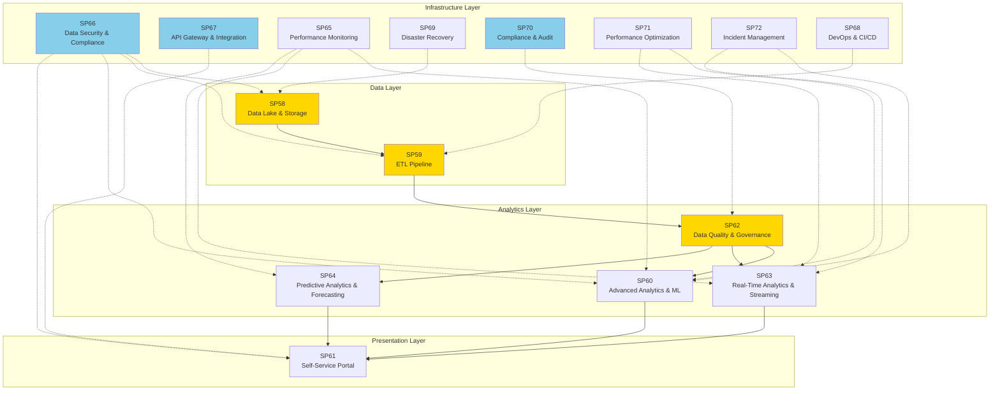

# Matrice Dipendenze - UC11 Analisi Dati e Reporting

## Overview: Complete UC11 Stack (Analytics + Infrastructure)

## Analytics Dipendenze

| SP | Nome | Input From | Output To | Criticità |
|---|---|---|---|---|
| **SP58** | Data Lake & Storage Management | External sources | SP59 | CRITICA |
| **SP59** | ETL & Data Processing Pipelines | SP58 | SP62 | CRITICA |
| **SP62** | Data Quality & Governance | SP59 | SP60, SP63, SP64 | CRITICA |
| **SP60** | Advanced Analytics & ML | SP62 | SP61 | ALTA |
| **SP63** | Real-Time Analytics & Streaming | SP62 | SP61 | ALTA |
| **SP64** | Predictive Analytics & Forecasting | SP62 | SP61 | ALTA |
| **SP61** | Self-Service Analytics Portal | SP60, SP63, SP64 | BI Dashboards | ALTA |

## Infrastructure Layer Dipendenze

| SP | Nome | Supporta | Criticità | RTO | Fallback |
|---|---|---|---|---|---|
| **SP65** | Performance Monitoring & Alerting | SP60, SP63, SP64 | ALTA | 5min | Manual monitoring |
| **SP66** | Data Security & Compliance | All data layers | CRITICA | 1min | Encryption key HSM |
| **SP67** | API Gateway & Integration | SP61 interfaces | CRITICA | 15min | Load balancer failover |
| **SP68** | DevOps & CI/CD Pipeline | SP59 (deployments) | MEDIA | 30min | Manual deployment |
| **SP69** | Disaster Recovery & Business Continuity | All critical SPs | ALTA | 1h | Backup region activation |
| **SP70** | Compliance & Audit Management | SP62 (governance) | CRITICA | 24h | Archived audit logs |
| **SP71** | Performance Optimization & Scaling | SP60, SP63 (compute) | ALTA | 10min | Static resource allocation |
| **SP72** | Incident Management & Escalation | SP60, SP63 (monitoring) | MEDIA | 10min | Manual incident response |

## Flusso Principale (Analytics + Infrastructure)

### Data Processing Pipeline
Data Lake (SP58) → ETL (SP59) → Quality Gate (SP62) → Analytics (SP60/63/64) → Portal (SP61)

### Infrastructure Overlay
- **Security**: SP66 covers all data layers
- **Monitoring**: SP65 watches analytics tiers
- **Compliance**: SP70 enforces governance (SP62)
- **DR/Scaling**: SP69/SP71 support core components
- **Incident**: SP72 responds to SP60/63 alerts

## Criticità

### CRITICA (Blocking)
- **SP58** (Data Lake): Loss of data = system down
- **SP59** (ETL): Data flow blockage = no analytics
- **SP62** (Quality Gate): Bad data → invalid decisions
- **SP66** (Security): Breach = data loss + compliance violation
- **SP67** (API Gateway): Portal offline = users blocked
- **SP70** (Audit): Compliance violation = legal risk

### ALTA (Severe Degradation)
- **SP60** (ML): Slow analytics = delayed insights
- **SP63** (Real-Time): Delays analytics freshness
- **SP61** (Portal): UX degradation, but data still processes
- **SP65** (Monitoring): Blind spot until manual intervention
- **SP69** (DR): Recovery delays impact RTO
- **SP71** (Scaling): Performance degradation under load

### MEDIA (Functional Impact)
- **SP64** (Forecasting): Loss of predictive capability
- **SP68** (DevOps): Manual deployments slower but possible
- **SP72** (Incident): Response delays but escalation still works

## Mitigazioni

| SP | Mitigation | RTO | Fallback | Cost |
|---|---|---|---|---|
| **SP58** | 3-way replication, multi-region, point-in-time recovery | 30min | Read-only replica | $$$ |
| **SP59** | Data versioning, rollback capability, CDC (Change Data Capture) | 15min | Manual ETL trigger | $$ |
| **SP62** | Quality rules versioning, test suite, staged deployment | 5min | Previous rule version | $ |
| **SP60** | Model versioning, A/B testing, baseline metrics | 10min | Previous model version | $$ |
| **SP63** | Kafka topic replication, stream backup, consumer lag alerts | 5min | Replay from checkpoint | $$ |
| **SP61** | CDN caching, read replicas, query optimization | 10min | Cached results | $$ |
| **SP66** | HSM backup, encrypted backup keys, security audit logs | 1min | HSM failover | $$$ |
| **SP67** | Load balancer + failover, API versioning, rate limiting | 2min | Manual API endpoints | $ |
| **SP69** | Automated failover, RTO <1h, RPO <15min | 1h | Manual restore | $$$ |
| **SP70** | Audit log replication, immutable storage, blockchain hash | 24h | Archived logs restore | $$ |
| **SP71** | Auto-scaling policies, resource reservations, burst capacity | 10min | Manual scaling | $ |
| **SP72** | Alert routing, escalation chains, on-call rotation | 10min | Manual notification | $ |

## KPIs (Analytics Layer)

| SP | KPI | Target | Severity |
|---|---|---|---|
| **SP58** | Data availability | 99.99% (4h/year downtime) | CRITICA |
| **SP59** | ETL freshness | < 1h max delay | CRITICA |
| **SP62** | Data quality score | > 95% | CRITICA |
| **SP60** | Model accuracy | > 90% | ALTA |
| **SP63** | Real-time latency | < 5min | ALTA |
| **SP64** | Forecast accuracy | > 85% | MEDIA |
| **SP61** | Portal uptime | 99.9% (9h/year) | ALTA |

## KPIs (Infrastructure Layer)

| SP | KPI | Target | Severity |
|---|---|---|---|
| **SP65** | Monitoring coverage | 100% of critical systems | ALTA |
| **SP66** | Security compliance | 100% (PCI-DSS, GDPR) | CRITICA |
| **SP67** | API gateway SLA | 99.95% uptime | CRITICA |
| **SP68** | CI/CD success rate | > 95% deployment success | MEDIA |
| **SP69** | RTO (Recovery Time Objective) | < 1h full failover | ALTA |
| **SP69** | RPO (Recovery Point Objective) | < 15min data loss | ALTA |
| **SP70** | Audit trail completeness | 100% event coverage | CRITICA |
| **SP71** | Auto-scaling success | > 95% + 15% cost optimization | ALTA |
| **SP72** | Incident resolution SLA | < 2h, detection < 10sec | MEDIA |

## Implementazione Ordine (Sequenziale con Parallelizzazione)

### Phase 0: Foundation (Prerequisite)
- **SP66** (Data Security & Compliance) - MUST exist before data processing
- **SP68** (DevOps & CI/CD) - Build pipeline for all subsequent components

### Phase 1: Core Data Layer (Week 1-3)
1. **SP58** (Data Lake & Storage) - Foundation, everything depends on it
2. **SP59** (ETL Pipeline) - Data flow, cannot proceed without SP58
3. **SP62** (Data Quality Gate) - Quality rules before analytics consume data

### Phase 2: Analytics Services (Week 4-6) - Parallel
- **SP60** (Advanced Analytics & ML) - Depends on SP62 quality gate
- **SP63** (Real-Time Analytics) - Depends on SP62, parallel with SP60
- **SP64** (Predictive Analytics) - Depends on SP62, parallel with SP60/63

### Phase 3: Presentation Layer (Week 7)
- **SP61** (Self-Service Portal) - Depends on SP60, SP63, SP64

### Phase 4a: Infrastructure - Monitoring/Availability (Week 8-9) - Parallel
- **SP65** (Performance Monitoring) - Watch SP60, SP63, SP64
- **SP69** (Disaster Recovery) - Backup SP58, SP59
- **SP71** (Performance Optimization) - Scaling for SP60, SP63

### Phase 4b: Infrastructure - Governance/Integration (Week 10) - Parallel
- **SP67** (API Gateway & Integration) - Frontend for SP61
- **SP70** (Compliance & Audit) - Govern SP62, SP58
- **SP72** (Incident Management) - Monitor SP60, SP63

### Critical Path
SP66 → SP68 → SP58 → SP59 → SP62 → SP60/63/64 (parallel) → SP61 → complete infra phase (parallel)
**Total duration: ~10 weeks with parallelization, ~15 sequential**

