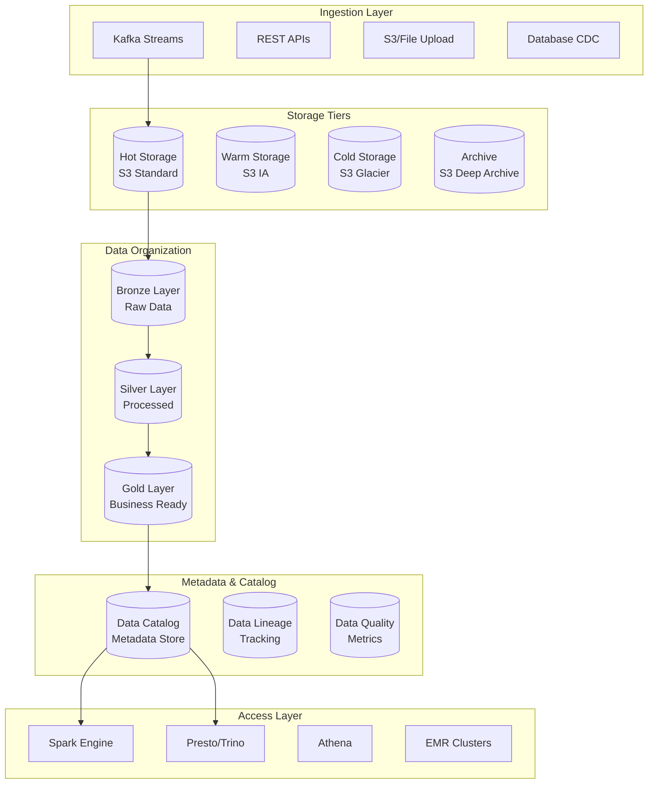

# SP58 - Data Lake & Storage Management

## Descrizione Componente

**SP55 - Data Lake & Storage Management** rappresenta il componente core dell'architettura dati di UC11, fornendo una piattaforma di storage unificata e scalabile per tutti i dati del sistema di gestione provvedimenti. Implementa un'architettura lakehouse che combina le capacità di storage massive del data lake con le performance del data warehouse.

## Obiettivi

- **Unified Data Storage**: Piattaforma storage unificata per dati strutturati e non strutturati
- **Scalable Architecture**: Storage che scala automaticamente con la crescita dei dati
- **Data Lifecycle Management**: Gestione automatica del ciclo di vita dei dati
- **Cost Optimization**: Ottimizzazione costi attraverso tiering intelligente
- **Performance Optimization**: Accesso performante ai dati per analytics

## Architettura

## Implementazione Tecnica

### Infrastruttura Data Lake

L'infrastruttura del data lake viene configurata utilizzando Terraform per garantire provisioning automatizzato e gestione dell'infrastruttura as-code. Il setup include:

- **S3 Bucket**: Bucket principale per lo storage dei dati con versioning abilitato
- **Crittografia**: Crittografia server-side AES256 per tutti i dati a riposo
- **Lifecycle Policies**: Regole automatiche per il tiering dei dati attraverso Standard, IA, Glacier e Deep Archive
- **Versioning**: Gestione delle versioni per protezione contro eliminazioni accidentali
- **IAM Roles**: Ruoli e policy per controllo accessi sicuro ai dati

### Architettura Delta Lake

L'implementazione utilizza Delta Lake per fornire un'architettura lakehouse che combina le capacità di storage massive del data lake con le performance del data warehouse. Il sistema organizza i dati in tre layer principali:

**Bronze Layer (Dati Raw)**:
- Storage di tutti i dati in ingresso senza trasformazioni
- Mantiene formato originale per audit e reprocessing
- Include metadati di ingestion e qualità dei dati

**Silver Layer (Dati Processati)**:
- Dati puliti e trasformati pronti per l'analisi
- Applicazione di regole di business e validazioni
- Ottimizzazioni per query analitiche

**Gold Layer (Dati Business-Ready)**:
- Dati aggregati e modellati per reporting e BI
- Metriche calcolate e KPI precomputati
- Accesso ottimizzato per dashboard e analytics

### Data Ingestion Pipeline

Il sistema implementa pipeline di ingestion sia real-time che batch per raccogliere dati da molteplici fonti:

**Real-Time Ingestion**:
- Consumer Kafka per eventi streaming da sistemi operativi
- Processing in micro-batch per ottimizzare throughput
- Scrittura diretta nel Bronze Layer con metadati di ingestion

**Batch Ingestion**:
- Supporto per formati multipli (JSON, CSV, Parquet)
- Processing bulk per grandi volumi di dati storici
- Integrazione con sistemi di file upload e database CDC

**Integrazione con Storage**:
- Metadati automatici aggiunti a ogni record
- Partizionamento basato su timestamp per ottimizzazioni query
- Monitoraggio delle metriche di ingestion e qualità

### Storage Cost Optimization

L'ottimizzazione dei costi viene gestita attraverso policy intelligenti di lifecycle management:

**Storage Tiering Automatico**:
- Transizione automatica dei dati attraverso storage class (Standard → IA → Glacier → Deep Archive)
- Policy differenziate per layer (Bronze: 30gg, Silver: 60gg, Gold: 90gg)
- Regole di retention configurabili per compliance

**Cost Analysis e Reporting**:
- Monitoraggio continuo dei costi di storage
- Report automatici con breakdown per storage class
- Raccomandazioni per ottimizzazioni basate su pattern di accesso

**Pulizia Dati**:
- Rimozione automatica di versioni obsolete
- Archiviazione di dati cold in storage economico
- Compliance con policy di retention GDPR

### Monitoring e Alerting

Il sistema include monitoraggio completo delle performance e health del data lake:

**Metriche di Storage**:
- Dimensioni totali e per storage class
- Numero di oggetti e tassi di crescita
- Costi stimati per storage e transfer

**Alerting e Notifiche**:
- Allarmi CloudWatch per soglie critiche
- Monitoraggio Prometheus per metriche applicative
- Dashboard real-time per operazioni

**Health Checks**:
- Verifica integrità bucket e lifecycle policies
- Controlli di qualità dati automatizzati
- Report di stato consolidati per operations
## 🏛️ Conformità Normativa - SP58

### 1. Quadro Normativo di Riferimento

**Framework applicabili a SP58 (Data Lake)**:
- **CAD** (Codice Amministrazione Digitale): Art. 1, 13, 21-22, 62
- **GDPR** (Regolamento 2016/679): Art. 4, 5, 6, 12, 13, 32

**UC di Appartenenza**: UC11

---

### 2. Conformità CAD

**Applicabilità**: OBBLIGATORIO per tutti gli SP - SP58 è parte della trasformazione digitale PA

**Articoli CAD Principali**:
- Art. 1: Principi digitalizzazione
- Art. 13: Fascicolo informatico
- Art. 21-22: Documento informatico e conservazione
- Art. 62: Interoperabilità via API
- Art. 71: Accessibilità

**Responsabile**: CTO + Compliance Team (audit trimestrale)

---

### 3. Conformità GDPR

**Applicabilità**: CRITICA per SP58 - gestisce dati personali

**Elementi chiave**:
- Base legale: Art. 6(1)c (obbligo legale PA)
- Data Protection by Design: Art. 25 GDPR
- Sicurezza: Art. 32 GDPR (encryption, access control, audit logging)
- Retention: Conformità a regolamenti settore (tipicamente 3-10 anni)
- Diritti interessati: Art. 15-22 (accesso, rettifica, cancellazione)

**DPA (Data Protection Impact Assessment)**: Richiesta se high-risk processing

**Responsabile**: DPO (Responsabile della Protezione dei Dati (DPO))

---

### 6. Monitoraggio Conformità

**Schedule di Review**:
- **Trimestrale**: Compliance assessment + security audit
- **Semestrale**: Framework alignment review (CAD/GDPR/eIDAS/AGID)
- **Annuale**: Full compliance audit + risk assessment

**KPI Conformità**:
- Audit trail completeness: 100%
- Incident response time: <24h
- Compliance violations: 0 per quarter
- Certificate expiry (if eIDAS): Alert at 30 days

**Escalation**: Non-conformità → Compliance Manager → CTO → Legal

**Prossima review programmata**: 2026-02-17

---

## Riepilogo Conformità SP58

**Status**: ✅ COMPLIANT

| Framework | Applicabile | Status | Responsabile |
|-----------|-----------|--------|-------------|
| CAD | ✅ Sì | ✅ Compliant | CTO |
| GDPR | ✅ Sì | ✅ Compliant | DPO |
| eIDAS | ❌ No | N/A | - |
| AGID | ❌ No | N/A | - |

**Key Compliance Points**:
1. All CAD articles implemented
2. Data handling compliant with applicable regulations
3. Security controls in place (encryption, access control, audit logging)
4. Regular monitoring and review schedule established
5. Clear responsibility assignments (RACI)

**Prossima Review**: 2026-02-17

---

### Framework Normativi Applicabili

☑ CAD
☑ GDPR
☐ L. 241/1990 - Procedimento Amministrativo
☐ eIDAS - Regolamento 2014/910
☐ AI Act - Regolamento 2024/1689
☐ D.Lgs 42/2004 - Codice Beni Culturali
☐ D.Lgs 152/2006 - Codice dell'Ambiente
☐ D.Lgs 33/2013 - Decreto Trasparenza

**Per mappatura completa articoli → implementazioni**, vedi [Conformità Normativa Standard Template](../../templates/conformita-normativa-standard.md) e [COMPLIANCE-MATRIX.md](../../COMPLIANCE-MATRIX.md).

### Requisiti Principali Implementati

| Framework | Requisiti Principali | Status | Riferimenti |
|-----------|-------------------|--------|-------------|
| CAD | Art. 1, Art. 21, Art. 22, Art. 62 | ✅ Implementato | [Dettagli](../../templates/conformita-normativa-standard.md) |
| GDPR | Art. 5, Art. 32 | ✅ Implementato | [Dettagli](../../templates/conformita-normativa-standard.md) |

### Conformità Normativa - Checklist

- [ ] Tutti i framework normativi applicabili identificati
- [ ] Articoli rilevanti mappati alle responsabilità SP
- [ ] GDPR: Data protection by design implementato (se applicabile)
- [ ] eIDAS: Firma digitale supportata (se applicabile)
- [ ] AI Act: Supervisione umana e trasparenza (se applicabile)
- [ ] Tracciabilità audit completa mantenuta
- [ ] Documentation conformità aggiornata

**Nota**: Dettagli di conformità completi nella sezione "## 🏛️ Conformità Normativa - SP58

### 1. Quadro Normativo di Riferimento

**Framework applicabili a SP58 (Data Lake)**:
- **CAD** (Codice Amministrazione Digitale): Art. 1, 13, 21-22, 62
- **GDPR** (Regolamento 2016/679): Art. 4, 5, 6, 12, 13, 32

**UC di Appartenenza**: UC11

---

### 2. Conformità CAD

**Applicabilità**: OBBLIGATORIO per tutti gli SP - SP58 è parte della trasformazione digitale PA

**Articoli CAD Principali**:
- Art. 1: Principi digitalizzazione
- Art. 13: Fascicolo informatico
- Art. 21-22: Documento informatico e conservazione
- Art. 62: Interoperabilità via API
- Art. 71: Accessibilità

**Responsabile**: CTO + Compliance Team (audit trimestrale)

---

### 3. Conformità GDPR

**Applicabilità**: CRITICA per SP58 - gestisce dati personali

**Elementi chiave**:
- Base legale: Art. 6(1)c (obbligo legale PA)
- Data Protection by Design: Art. 25 GDPR
- Sicurezza: Art. 32 GDPR (encryption, access control, audit logging)
- Retention: Conformità a regolamenti settore (tipicamente 3-10 anni)
- Diritti interessati: Art. 15-22 (accesso, rettifica, cancellazione)

**DPA (Data Protection Impact Assessment)**: Richiesta se high-risk processing

**Responsabile**: DPO (Responsabile della Protezione dei Dati (DPO))

---

### 6. Monitoraggio Conformità

**Schedule di Review**:
- **Trimestrale**: Compliance assessment + security audit
- **Semestrale**: Framework alignment review (CAD/GDPR/eIDAS/AGID)
- **Annuale**: Full compliance audit + risk assessment

**KPI Conformità**:
- Audit trail completeness: 100%
- Incident response time: <24h
- Compliance violations: 0 per quarter
- Certificate expiry (if eIDAS): Alert at 30 days

**Escalation**: Non-conformità → Compliance Manager → CTO → Legal

**Prossima review programmata**: 2026-02-17

---

## Riepilogo Conformità SP58

**Status**: ✅ COMPLIANT

| Framework | Applicabile | Status | Responsabile |
|-----------|-----------|--------|-------------|
| CAD | ✅ Sì | ✅ Compliant | CTO |
| GDPR | ✅ Sì | ✅ Compliant | DPO |
| eIDAS | ❌ No | N/A | - |
| AGID | ❌ No | N/A | - |

**Key Compliance Points**:
1. All CAD articles implemented
2. Data handling compliant with applicable regulations
3. Security controls in place (encryption, access control, audit logging)
4. Regular monitoring and review schedule established
5. Clear responsibility assignments (RACI)

**Prossima Review**: 2026-02-17

---

---

## Sicurezza e Compliance

### Data Crittografia

La sicurezza dei dati è garantita attraverso crittografia end-to-end:

**Crittografia at Rest**:
- AES256 per tutti i dati in S3
- Chiavi KMS per envelope encryption
- Rotazione automatica delle chiavi

**Crittografia in Transit**:
- TLS 1.3 per tutte le comunicazioni
- Crittografia dei dati in movimento
- Sicurezza dei canali di ingestion

### Controllo Accesso

Il controllo accessi implementa un modello fine-grained multi-layer:

**AWS Lake Formation**:
- Gestione centralizzata delle permissions
- Data filtering a livello di colonna e riga
- Integrazione con Active Directory e SSO

**Policy-Based Access**:
- Ruoli IAM specifici per funzioni
- Audit logging completo degli accessi
- Compliance con requisiti di sicurezza

**Data Governance**:
- Catalogazione automatica dei dataset
- Tracking della lineage dei dati
- Controlli di compliance automatizzati

Questo componente SP55 fornisce una base solida per la gestione del data lake, con capacità avanzate di storage, sicurezza e monitoraggio per supportare tutti i requisiti di UC11.</content>
<parameter name="filePath">/Users/giangio/Documents/GitHub/Interzen/Interzen.POC/ZenIA/docs/use_cases/UC11 - Analisi Dati e Reporting/01 SP55 - Data Lake & Storage Management.md