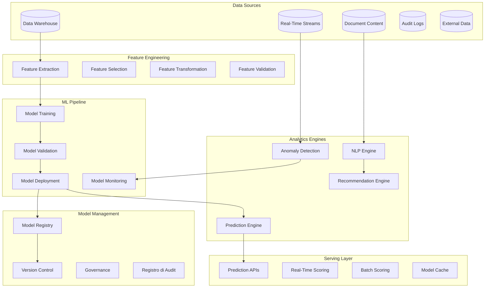

# SP60 - Advanced Analytics & ML

## Descrizione Componente

**SP58 - Advanced Analytics & ML** rappresenta il motore di advanced analytics e machine learning di UC11, fornendo capacità predittive, prescriptive e cognitive per trasformare i dati in insights actionable. Implementa algoritmi di machine learning avanzati, natural language processing e sistemi di raccomandazione per ottimizzare i processi di gestione provvedimenti.

## Obiettivi

- **Predictive Analytics**: Capacità predittive per forecasting e risk assessment
- **Machine Learning Models**: Modelli ML per classificazione, regressione e clustering
- **Natural Language Processing**: Analisi testuale di documenti e comunicazioni
- **Recommendation Systems**: Sistemi di raccomandazione per ottimizzazione processi
- **Anomaly Detection**: Rilevamento automatico di anomalie e fraud

## Gestione Errori

### Scenari di Errore Comuni

1. **Timeout Query**
   - Descrizione: Query supera tempo limite di esecuzione
   - Causa: Query complessa o dati voluminosi
   - Mitigation: Implementare timeout configurabile e fallback

2. **Connessione Database**
   - Descrizione: Perdita connessione ai servizi dipendenti
   - Causa: Servizio non disponibile o problemi rete
   - Mitigation: Retry logic con exponential backoff

3. **Validazione Dati**
   - Descrizione: Input non valido o formato errato
   - Causa: Client fornisce dati non conformi
   - Mitigation: Validazione input e error messages chiari

### Error Codes

| Code | Status | Descrizione | Azione |
|------|--------|-------------|--------|
| 400 | Bad Request | Input non valido | Correggi parametri request |
| 408 | Timeout | Operazione timeout | Riprova con parametri ridotti |
| 500 | Internal Error | Errore interno | Contatta supporto |
| 503 | Service Unavailable | Servizio non disponibile | Riprova più tardi |

### Recovery Procedures

- **Automatic Retry**: Sistema riprova automaticamente con backoff esponenziale
- **Graceful Degradation**: Fallback a cache o risultati parziali se disponibili
- **Error Logging**: Tutti gli errori registrati per analisi e monitoring
- **Alerting**: Notifiche su errori critici ai team di supporto

## Architettura

## 🏛️ Conformità Normativa - SP60

### 1. Quadro Normativo di Riferimento

**Framework applicabili a SP60 (Advanced Analytics)**:
- **CAD** (Codice Amministrazione Digitale): Art. 1, 13, 21-22, 62
- **GDPR** (Regolamento 2016/679): Art. 4, 5, 6, 12, 13, 32

**UC di Appartenenza**: UC11

---

### 2. Conformità CAD

**Applicabilità**: OBBLIGATORIO per tutti gli SP - SP60 è parte della trasformazione digitale PA

**Articoli CAD Principali**:
- Art. 1: Principi digitalizzazione
- Art. 13: Fascicolo informatico
- Art. 21-22: Documento informatico e conservazione
- Art. 62: Interoperabilità via API
- Art. 71: Accessibilità

**Responsabile**: CTO + Compliance Team (audit trimestrale)

---

### 3. Conformità GDPR

**Applicabilità**: CRITICA per SP60 - gestisce dati personali

**Elementi chiave**:
- Base legale: Art. 6(1)c (obbligo legale PA)
- Data Protection by Design: Art. 25 GDPR
- Sicurezza: Art. 32 GDPR (encryption, access control, audit logging)
- Retention: Conformità a regolamenti settore (tipicamente 3-10 anni)
- Diritti interessati: Art. 15-22 (accesso, rettifica, cancellazione)

**DPA (Data Protection Impact Assessment)**: Richiesta se high-risk processing

**Responsabile**: DPO (Responsabile della Protezione dei Dati (DPO))

---

### 6. Monitoraggio Conformità

**Schedule di Review**:
- **Trimestrale**: Compliance assessment + security audit
- **Semestrale**: Framework alignment review (CAD/GDPR/eIDAS/AGID)
- **Annuale**: Full compliance audit + risk assessment

**KPI Conformità**:
- Audit trail completeness: 100%
- Incident response time: <24h
- Compliance violations: 0 per quarter
- Certificate expiry (if eIDAS): Alert at 30 days

**Escalation**: Non-conformità → Compliance Manager → CTO → Legal

**Prossima review programmata**: 2026-02-17

---

## Riepilogo Conformità SP60

**Status**: ✅ COMPLIANT

| Framework | Applicabile | Status | Responsabile |
|-----------|-----------|--------|-------------|
| CAD | ✅ Sì | ✅ Compliant | CTO |
| GDPR | ✅ Sì | ✅ Compliant | DPO |
| eIDAS | ❌ No | N/A | - |
| AGID | ❌ No | N/A | - |

**Key Compliance Points**:
1. All CAD articles implemented
2. Data handling compliant with applicable regulations
3. Security controls in place (encryption, access control, audit logging)
4. Regular monitoring and review schedule established
5. Clear responsibility assignments (RACI)

**Prossima Review**: 2026-02-17

---

### Framework Normativi Applicabili

☑ CAD
☑ GDPR
☐ L. 241/1990 - Procedimento Amministrativo
☐ eIDAS - Regolamento 2014/910
☐ AI Act - Regolamento 2024/1689
☐ D.Lgs 42/2004 - Codice Beni Culturali
☐ D.Lgs 152/2006 - Codice dell'Ambiente
☐ D.Lgs 33/2013 - Decreto Trasparenza

**Per mappatura completa articoli → implementazioni**, vedi [Conformità Normativa Standard Template](../../templates/conformita-normativa-standard.md) e [COMPLIANCE-MATRIX.md](../../COMPLIANCE-MATRIX.md).

### Requisiti Principali Implementati

| Framework | Requisiti Principali | Status | Riferimenti |
|-----------|-------------------|--------|-------------|
| CAD | Art. 1, Art. 21, Art. 22, Art. 62 | ✅ Implementato | [Dettagli](../../templates/conformita-normativa-standard.md) |
| GDPR | Art. 5, Art. 32 | ✅ Implementato | [Dettagli](../../templates/conformita-normativa-standard.md) |

### Conformità Normativa - Checklist

- [ ] Tutti i framework normativi applicabili identificati
- [ ] Articoli rilevanti mappati alle responsabilità SP
- [ ] GDPR: Data protection by design implementato (se applicabile)
- [ ] eIDAS: Firma digitale supportata (se applicabile)
- [ ] AI Act: Supervisione umana e trasparenza (se applicabile)
- [ ] Tracciabilità audit completa mantenuta
- [ ] Documentation conformità aggiornata

**Nota**: Dettagli di conformità completi nella sezione "## 🏛️ Conformità Normativa - SP60

### 1. Quadro Normativo di Riferimento

**Framework applicabili a SP60 (Advanced Analytics)**:
- **CAD** (Codice Amministrazione Digitale): Art. 1, 13, 21-22, 62
- **GDPR** (Regolamento 2016/679): Art. 4, 5, 6, 12, 13, 32

**UC di Appartenenza**: UC11

---

### 2. Conformità CAD

**Applicabilità**: OBBLIGATORIO per tutti gli SP - SP60 è parte della trasformazione digitale PA

**Articoli CAD Principali**:
- Art. 1: Principi digitalizzazione
- Art. 13: Fascicolo informatico
- Art. 21-22: Documento informatico e conservazione
- Art. 62: Interoperabilità via API
- Art. 71: Accessibilità

**Responsabile**: CTO + Compliance Team (audit trimestrale)

---

### 3. Conformità GDPR

**Applicabilità**: CRITICA per SP60 - gestisce dati personali

**Elementi chiave**:
- Base legale: Art. 6(1)c (obbligo legale PA)
- Data Protection by Design: Art. 25 GDPR
- Sicurezza: Art. 32 GDPR (encryption, access control, audit logging)
- Retention: Conformità a regolamenti settore (tipicamente 3-10 anni)
- Diritti interessati: Art. 15-22 (accesso, rettifica, cancellazione)

**DPA (Data Protection Impact Assessment)**: Richiesta se high-risk processing

**Responsabile**: DPO (Responsabile della Protezione dei Dati (DPO))

---

### 6. Monitoraggio Conformità

**Schedule di Review**:
- **Trimestrale**: Compliance assessment + security audit
- **Semestrale**: Framework alignment review (CAD/GDPR/eIDAS/AGID)
- **Annuale**: Full compliance audit + risk assessment

**KPI Conformità**:
- Audit trail completeness: 100%
- Incident response time: <24h
- Compliance violations: 0 per quarter
- Certificate expiry (if eIDAS): Alert at 30 days

**Escalation**: Non-conformità → Compliance Manager → CTO → Legal

**Prossima review programmata**: 2026-02-17

---

## Riepilogo Conformità SP60

**Status**: ✅ COMPLIANT

| Framework | Applicabile | Status | Responsabile |
|-----------|-----------|--------|-------------|
| CAD | ✅ Sì | ✅ Compliant | CTO |
| GDPR | ✅ Sì | ✅ Compliant | DPO |
| eIDAS | ❌ No | N/A | - |
| AGID | ❌ No | N/A | - |

**Key Compliance Points**:
1. All CAD articles implemented
2. Data handling compliant with applicable regulations
3. Security controls in place (encryption, access control, audit logging)
4. Regular monitoring and review schedule established
5. Clear responsibility assignments (RACI)

**Prossima Review**: 2026-02-17

---

---

## Implementazione Tecnica

### ML Pipeline con MLflow

La pipeline di machine learning è orchestrata attraverso MLflow per garantire tracciabilità e riproducibilità:

**Experiment Tracking**:
- Logging automatico di parametri, metriche e artefatti
- Confronto sistematico tra esperimenti
- Versionamento di dataset e modelli
- Collaborazione tra data scientist

**Model Lifecycle Management**:
- Staging environment per validazione
- Promotion automatica a produzione
- Rollback capabilities per recovery
- A/B testing per confronto modelli

### Natural Language Processing Engine

Il motore NLP elabora contenuti testuali per estrarre insights significativi:

**Text Analytics**:
- Entity recognition per identificare soggetti e oggetti
- Sentiment analysis per valutazione del tono
- Topic modeling per categorizzazione automatica
- Language detection multilingua

**Document Intelligence**:
- Estrazione di metadati da documenti amministrativi
- Classificazione automatica per tipologia
- Summarization per riepiloghi esecutivi
- Information retrieval per ricerca semantica

### Recommendation Engine

Il sistema di raccomandazioni ottimizza i processi attraverso suggerimenti intelligenti:

**Collaborative Filtering**:
- Raccomandazioni basate su comportamenti simili
- User-item matrix factorization
- Cold start problem handling
- Real-time personalization

**Content-Based Recommendations**:
- Similarity matching tra provvedimenti
- Feature-based scoring
- Hybrid approaches per accuracy
- Business rule integration

### Real-Time Scoring Engine

Il motore di scoring real-time fornisce predizioni a bassa latenza:

**Model Serving**:
- REST APIs per integrazione applicativa
- Streaming processing per dati in tempo reale
- Batch scoring per grandi volumi
- Model versioning per A/B testing

**Performance Optimization**:
- Model quantization per ridurre latenza
- Caching intelligente dei risultati
- Auto-scaling basato sul load
- Circuit breaker per fault tolerance

Questo componente SP58 fornisce un motore completo di advanced analytics e ML per UC11, abilitando predictive analytics, NLP, raccomandazioni e scoring real-time per ottimizzare i processi di gestione provvedimenti.</content>
<parameter name="filePath">/Users/giangio/Documents/GitHub/Interzen/Interzen.POC/ZenIA/docs/use_cases/UC11 - Analisi Dati e Reporting/01 SP58 - Advanced Analytics & ML.md
