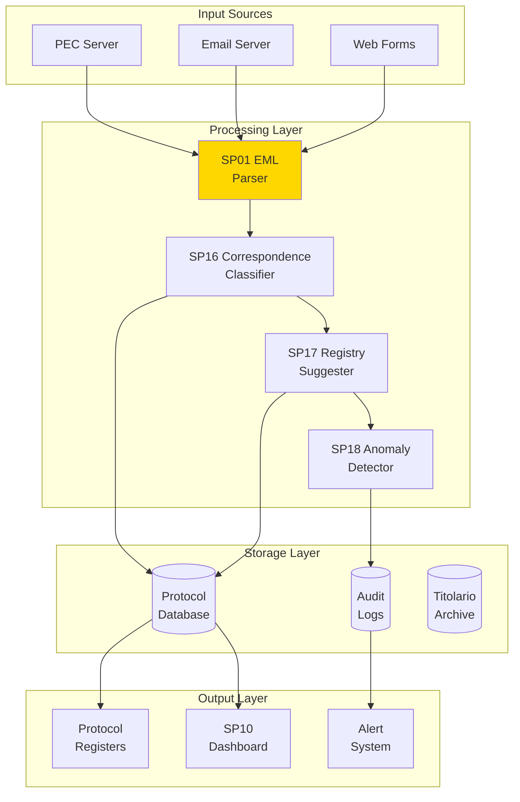

# Architettura Generale - Protocollo Informatico (UC2)

## Overview Architetturale

Il **Protocollo Informatico** è progettato come una piattaforma AI-powered per l'automazione completa del processo di protocollazione, dalla ricezione delle email/PEC alla registrazione nei registri ufficiali.



## Principi Architetturali

### 1. Intelligent Parsing
- Parsing avanzato di contenuti email/PEC
- Estrazione metadati e allegati
- Supporto multi-formato

### 2. Automated Classification
- Classificazione automatica corrispondenza
- Mapping con titolario di archivio
- Confidence scoring per decisioni

### 3. Anomaly Detection
- Rilevamento pattern anomali
- Alert real-time per irregolarità
- Learning continuo da dati storici

### 4. Audit Trail Completo
- Tracciabilità totale operazioni
- Compliance CAD/GDPR
- Explainability decisioni AI

## Componenti Architetturali

### Processing Pipeline
```
Email Reception → SP01 Parser → SP16 Classifier → SP17 Suggester → SP18 Detector → Protocol Registration
```

### Data Flow
- **Ingress**: Email/PEC da server IMAP/POP3
- **Processing**: Pipeline AI per classificazione e validazione
- **Storage**: Database protocollo, audit logs, titolario
- **Output**: Registri ufficiali, dashboard, alert

### Scalability Considerations
- **Message Queues**: Kafka per gestione volumi elevati
- **Load Balancing**: Distribuzione automatica workload
- **Caching**: Redis per titolario e regole frequenti

### Security Architecture
- **Email Security**: Validazione certificati PEC
- **Data Encryption**: Crittografia end-to-end
- **Access Control**: RBAC per registri sensibili

### Integration Points
- **Email Servers**: IMAP/SMTP integration
- **Protocol Systems**: Connessione sistemi esistenti
- **Archive Systems**: Integrazione titolario di archivio

## Integrazione con ZenShare Up

### Existing Systems Integration
- **Email Systems**: Sostituzione client manuali
- **Protocol Management**: Enhancement workflow esistenti
- **Archive Systems**: Integrazione titolario

### API Integration Points
- **Email Reception**: `/api/v1/protocol/emails`
- **Classification**: `/api/v1/protocol/classify`
- **Registration**: `/api/v1/protocol/register`

## Performance Targets

- **Processing**: 100 email/minuto
- **Accuracy**: >95% classificazione
- **Latency**: <30s per email
- **Availability**: 99.9% uptime

## Technology Stack

### Core Technologies
- **AI/ML**: BERT, spaCy, Isolation Forest
- **Messaging**: Kafka, RabbitMQ
- **Storage**: PostgreSQL, Elasticsearch
- **Security**: TLS, JWT, OAuth

### Cloud-Native
- **Container**: Docker
- **Orchestration**: Kubernetes
- **API Gateway**: Kong
- **Monitoring**: Prometheus, ELK</content>
<parameter name="filePath">/Users/giangio/Documents/GitHub/Interzen/Interzen.POC/ZenIA/docs/use_cases/UC2 - Protocollo Informatico/00 Architettura Generale UC2.md
