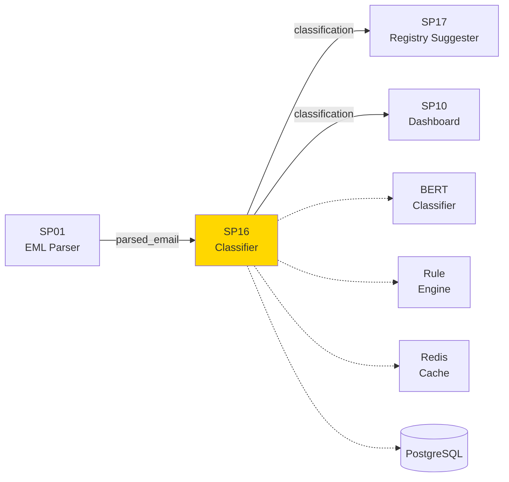
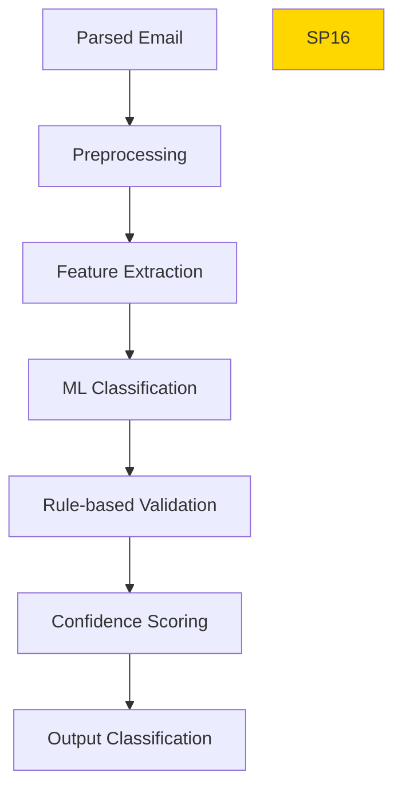

# SP16 - Correspondence Classifier

## Panoramica

**SP16 - Correspondence Classifier** è il componente che classifica automaticamente il tipo di corrispondenza ricevuta (PEC, email, web form), distinguendo tra istanze, comunicazioni, richieste, notifiche, etc.



## Responsabilità

### Core Functions

1. **Correspondence Type Classification**
   - Istanza amministrativa
   - Comunicazione ufficiale
   - Richiesta informazioni
   - Notifica/avviso
   - Reclamo/segnalazione
   - Altro

2. **Channel Recognition**
   - PEC (Posta Elettronica Certificata)
   - Email ordinaria
   - Web form submission
   - API integration

3. **Priority Assessment**
   - Alta priorità (istanze, reclami)
   - Media priorità (comunicazioni)
   - Bassa priorità (notifiche)

4. **Language Detection**
   - Italiano ufficiale
   - Italiano regionale/dialettale
   - Altre lingue
## 🏛️ Conformità Normativa

### Framework Normativi Applicabili

☑ CAD
☑ AI Act
☑ GDPR
☐ L. 241/1990 - Procedimento Amministrativo
☐ eIDAS - Regolamento 2014/910
☐ D.Lgs 42/2004 - Codice Beni Culturali
☐ D.Lgs 152/2006 - Codice dell'Ambiente
☐ D.Lgs 33/2013 - Decreto Trasparenza

**Per mappatura completa articoli → implementazioni**, vedi [Conformità Normativa Standard Template](../../templates/conformita-normativa-standard.md) e [COMPLIANCE-MATRIX.md](../../COMPLIANCE-MATRIX.md).

### Requisiti Principali Implementati

| Framework | Requisiti Principali | Status | Riferimenti |
|-----------|-------------------|--------|-------------|
| CAD | Art. 1, Art. 21, Art. 22, Art. 62 | ✅ Implementato | [Dettagli](../../templates/conformita-normativa-standard.md) |
| AI Act | Art. 6, Art. 13, Art. 22 | ✅ Implementato | [Dettagli](../../templates/conformita-normativa-standard.md) |
| GDPR | Art. 5, Art. 32 | ✅ Implementato | [Dettagli](../../templates/conformita-normativa-standard.md) |

### Conformità Normativa - Checklist

- [ ] Tutti i framework normativi applicabili identificati
- [ ] Articoli rilevanti mappati alle responsabilità SP
- [ ] GDPR: Data protection by design implementato (se applicabile)
- [ ] eIDAS: Firma digitale supportata (se applicabile)
- [ ] AI Act: Supervisione umana e trasparenza (se applicabile)
- [ ] Tracciabilità audit completa mantenuta
- [ ] Documentation conformità aggiornata

**Nota**: Dettagli di conformità completi nella sezione "## 🏛️ Conformità Normativa" del template standard.

---


## Architettura Tecnica

### Classification Pipeline



### Tecnologie Utilizzate

| Componente | Tecnologia | Versione | Scopo |
|------------|------------|----------|--------|
| ML Model | BERT |  | Classificazione testo |
| Rule Engine | Drools | 8.0 | Validazione regole |
| Language Detection | langdetect | 1.0.9 | Rilevamento lingua |
| Cache | Redis | 7.2 | Cache risultati |
| Database | PostgreSQL | 15 | Training data |

### Esempi di Classificazione

#### Istanza Amministrativa
```
Input: "Con la presente si richiede autorizzazione per..."
Output: {type: "ISTANZA", priority: "HIGH", confidence: 0.96}
```

#### Comunicazione Ufficiale
```
Input: "Si comunica l'avvenuta pubblicazione..."
Output: {type: "COMUNICAZIONE", priority: "MEDIUM", confidence: 0.89}
```

### API Endpoints

```yaml
POST /api/v1/classify/correspondence
  - Input: {"email_text": "string", "metadata": {}}
  - Output: {"type": "string", "priority": "string", "confidence": 0.95}
```

### Configurazione

```yaml
sp16:
  model: 'bert-correspondence-classifier'
  threshold: 0.8
  categories:
    - istanza
    - comunicazione
    - richiesta
    - notifica
    - reclamo
  cache_ttl: 3600
```

### Performance Metrics

- **Accuracy**: >95% classificazione corretta
- **Precision**: >92% per categorie principali
- **Latency**: <2s per classificazione
- **Throughput**: 200 email/minuto

### Sicurezza

- **Data Sanitization**: Rimozione dati sensibili
- **Audit Logging**: Tracciamento classificazioni
- **Model Security**: Validazione input

### Evoluzione

1. **Multi-language**: Supporto multilingua
2. **Domain Adaptation**: Fine-tuning per ente specifico
3. **Real-time Learning**: Aggiornamento modello continuo</content>
<parameter name="filePath">/Users/giangio/Documents/GitHub/Interzen/Interzen.POC/ZenIA/docs/use_cases/UC2 - Protocollo Informatico/01 SP16 - Correspondence Classifier.md