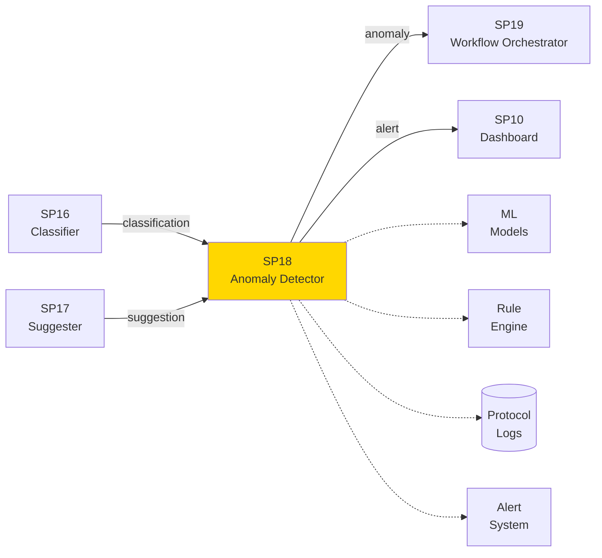
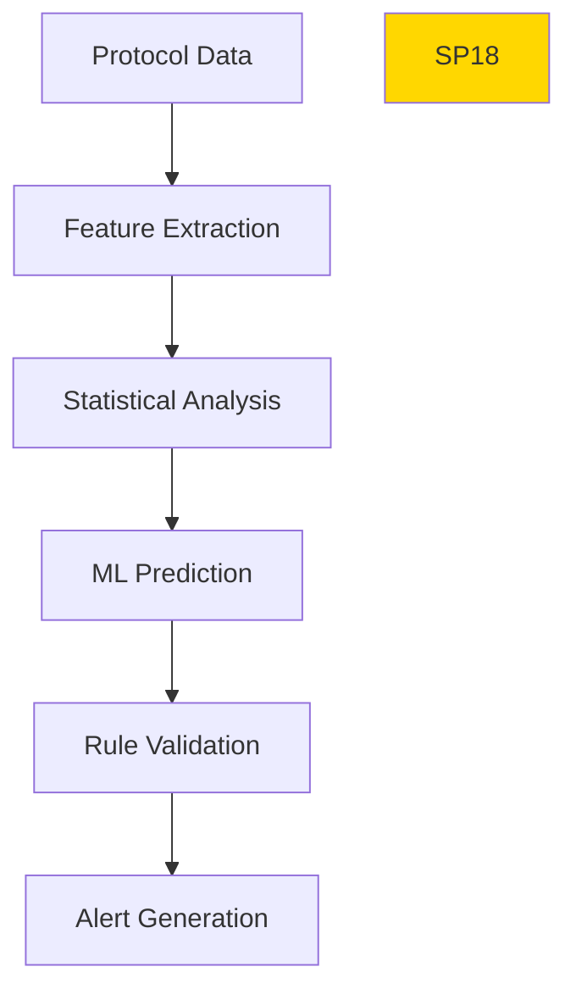

# SP18 - Anomaly Detector

## Panoramica

**SP18 - Anomaly Detector** è il componente responsabile dell'identificazione di anomalie e irregolarità nel flusso di protocollo, utilizzando tecniche di machine learning per rilevare comportamenti anomali.



## Responsabilità

### Core Functions

1. **Pattern Analysis**
   - Analisi sequenziale protocolli
   - Rilevamento duplicati
   - Controllo coerenza dati

2. **Anomaly Detection**
   - Protocolli fuori orario
   - Volumi anomali
   - Sequenze irregolari

3. **Fraud Detection**
   - Manipolazione numeri protocollo
   - Accessi non autorizzati
   - Modifiche sospette

4. **Alert Generation**
   - Notifiche real-time
   - Escalation automatica
   - Report periodici
## 🏛️ Conformità Normativa

### Framework Normativi Applicabili

☑ CAD
☑ GDPR
☐ L. 241/1990 - Procedimento Amministrativo
☐ eIDAS - Regolamento 2014/910
☐ AI Act - Regolamento 2024/1689
☐ D.Lgs 42/2004 - Codice Beni Culturali
☐ D.Lgs 152/2006 - Codice dell'Ambiente
☐ D.Lgs 33/2013 - Decreto Trasparenza

**Per mappatura completa articoli → implementazioni**, vedi [Conformità Normativa Standard Template](../../templates/conformita-normativa-standard.md) e [COMPLIANCE-MATRIX.md](../../COMPLIANCE-MATRIX.md).

### Requisiti Principali Implementati

| Framework | Requisiti Principali | Status | Riferimenti |
|-----------|-------------------|--------|-------------|
| CAD | Art. 1, Art. 21, Art. 22, Art. 62 | ✅ Implementato | [Dettagli](../../templates/conformita-normativa-standard.md) |
| GDPR | Art. 5, Art. 32 | ✅ Implementato | [Dettagli](../../templates/conformita-normativa-standard.md) |

### Conformità Normativa - Checklist

- [ ] Tutti i framework normativi applicabili identificati
- [ ] Articoli rilevanti mappati alle responsabilità SP
- [ ] GDPR: Data protection by design implementato (se applicabile)
- [ ] eIDAS: Firma digitale supportata (se applicabile)
- [ ] AI Act: Supervisione umana e trasparenza (se applicabile)
- [ ] Tracciabilità audit completa mantenuta
- [ ] Documentation conformità aggiornata

**Nota**: Dettagli di conformità completi nella sezione "## 🏛️ Conformità Normativa" del template standard.

---


## Architettura Tecnica

### Detection Pipeline



### Tecnologie Utilizzate

| Componente | Tecnologia | Versione | Scopo |
|------------|------------|----------|--------|
| ML Framework | Scikit-learn | 1.3 | Modelli anomalie |
| Time Series | Prophet | 1.1 | Analisi temporale |
| Streaming | Kafka Streams | 3.6 | Elaborazione real-time |
| Alert System | Prometheus Alertmanager | 0.26 | Gestione notifiche |

### Tipi di Anomalie

#### Protocollo Duplicato
```
Pattern: Stesso mittente, oggetto, data entro 24h
Threshold: Similarità > 0.85
Action: Flag per verifica manuale
```

#### Volume Anomale
```
Pattern: Protocolli/ora > 3σ dalla media
Threshold: Z-score > 3.0
Action: Alert supervisore
```

### API Endpoints

```yaml
POST /api/v1/detect/anomalies
  - Input: {"protocol_data": {}, "time_window": "1h"}
  - Output: {"anomalies": [], "severity": "string"}
  
GET /api/v1/anomalies/history
  - Query: ?from=2024-01-01&to=2024-01-31
  - Output: {"anomalies": [], "stats": {}}
```

### Configurazione

```yaml
sp18:
  detection_window: '24h'
  alert_threshold: 0.8
  ml_model: 'anomaly_detector.pkl'
  kafka_topic: 'protocol.events'
```

### Performance Metrics

- **Detection Rate**: >95% anomalie catturate
- **False Positive Rate**: <5%
- **Latency**: <500ms per analisi
- **Throughput**: 1000 protocolli/minuto

### Sicurezza

- **Data Isolation**: Separazione dati sensibili
- **Access Logging**: Audit completo accessi
- **Encryption**: Crittografia dati in transito

### Evoluzione

1. **Advanced ML**: Deep learning per pattern complessi
2. **Behavioral Analysis**: Profili utente dinamici
3. **Integration**: Con sistemi antifrode esterni</content>
<parameter name="filePath">/Users/giangio/Documents/GitHub/Interzen/Interzen.POC/ZenIA/docs/use_cases/UC2 - Protocollo Informatico/01 SP18 - Anomaly Detector.md