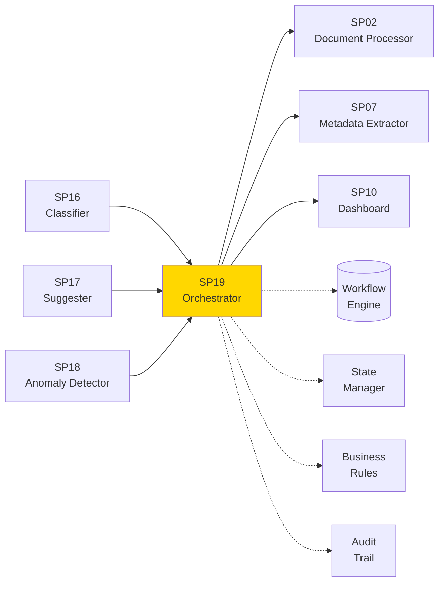
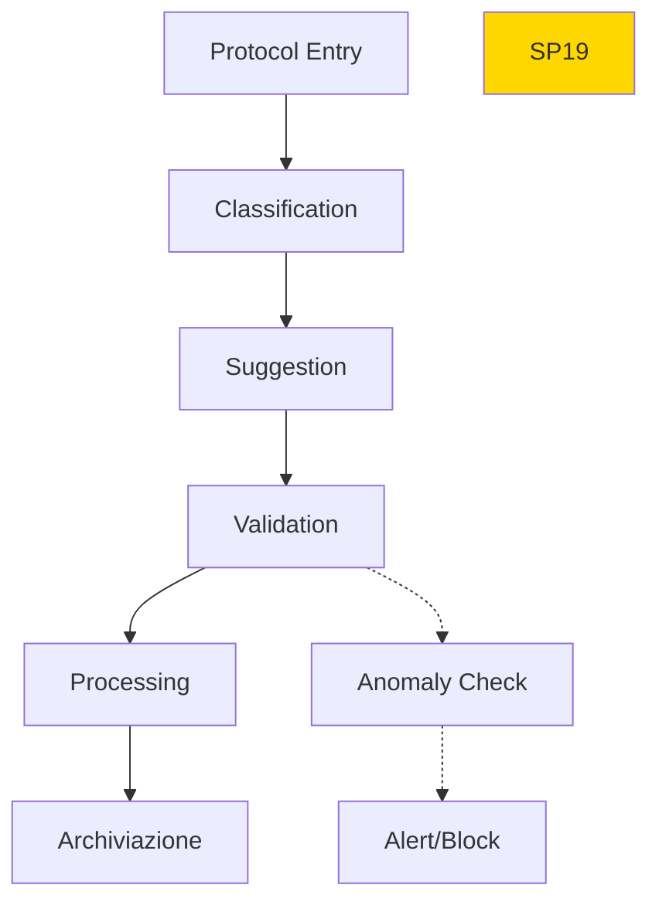

# SP19 - Protocol Workflow Orchestrator

## Panoramica

**SP19 - Protocol Workflow Orchestrator** è il componente centrale che orchestra l'intero flusso di lavoro del protocollo informatico, coordinando tutti gli SP e gestendo le transizioni di stato.



## Responsabilità

### Core Functions

1. **Workflow Management**
   - Creazione workflow protocollo
   - Transizioni di stato automatiche
   - Routing intelligente

2. **State Management**
   - Tracking stato protocollo
   - Persistenza stato distribuita
   - Recovery fault-tolerant

3. **Integration Coordination**
   - Orchestrazione SP componenti
   - Gestione dipendenze
   - Sincronizzazione eventi

4. **Audit & Compliance**
   - Log completo operazioni
   - Tracciabilità modifiche
   - Report compliance
## 🏛️ Conformità Normativa - SP19

### 1. Quadro Normativo di Riferimento

**Framework applicabili a SP19 (Protocol Workflow)**:
- **CAD** (Codice Amministrazione Digitale): Art. 1, 13, 21-22, 62
- **GDPR** (Regolamento 2016/679): Art. 4, 5, 6, 12, 13, 32

**UC Appartenance**: UC2

---

### 2. Conformità CAD

**Applicabilità**: OBBLIGATORIO per tutti gli SP - SP19 è parte della trasformazione digitale PA

**Articoli CAD Principali**:
- Art. 1: Principi digitalizzazione
- Art. 13: Fascicolo informatico
- Art. 21-22: Documento informatico e conservazione
- Art. 62: Interoperabilità via API
- Art. 71: Accessibilità

**Responsabile**: CTO + Compliance Team (audit trimestrale)

---

### 3. Conformità GDPR

**Applicabilità**: CRITICA per SP19 - gestisce dati personali

**Elementi chiave**:
- Base legale: Art. 6(1)c (obbligo legale PA)
- Data Protection by Design: Art. 25 GDPR
- Sicurezza: Art. 32 GDPR (encryption, access control, audit logging)
- Retention: Conformità a regolamenti settore (tipicamente 3-10 anni)
- Diritti interessati: Art. 15-22 (accesso, rettifica, cancellazione)

**DPA (Data Protection Impact Assessment)**: Richiesta se high-risk processing

**Responsabile**: DPO (Data Protection Officer)

---

### 6. Monitoraggio Conformità

**Schedule di Review**:
- **Trimestrale**: Compliance assessment + security audit
- **Semestrale**: Framework alignment review (CAD/GDPR/eIDAS/AGID)
- **Annuale**: Full compliance audit + risk assessment

**KPI Conformità**:
- Audit trail completeness: 100%
- Incident response time: <24h
- Compliance violations: 0 per quarter
- Certificate expiry (if eIDAS): Alert at 30 days

**Escalation**: Non-conformità → Compliance Manager → CTO → Legal

**Prossima review programmata**: 2026-02-17

---

## Riepilogo Conformità SP19

**Status**: ✅ COMPLIANT

| Framework | Applicabile | Status | Responsible |
|-----------|-----------|--------|-------------|
| CAD | ✅ Sì | ✅ Compliant | CTO |
| GDPR | ✅ Sì | ✅ Compliant | DPO |
| eIDAS | ❌ No | N/A | - |
| AGID | ❌ No | N/A | - |

**Key Compliance Points**:
1. All CAD articles implemented
2. Data handling compliant with applicable regulations
3. Security controls in place (encryption, access control, audit logging)
4. Regular monitoring and review schedule established
5. Clear responsibility assignments (RACI)

**Next Review**: 2026-02-17

---


### Framework Normativi Applicabili

☑ CAD
☑ GDPR
☐ L. 241/1990 - Procedimento Amministrativo
☐ eIDAS - Regolamento 2014/910
☐ AI Act - Regolamento 2024/1689
☐ D.Lgs 42/2004 - Codice Beni Culturali
☐ D.Lgs 152/2006 - Codice dell'Ambiente
☐ D.Lgs 33/2013 - Decreto Trasparenza

**Per mappatura completa articoli → implementazioni**, vedi [Conformità Normativa Standard Template](../../templates/conformita-normativa-standard.md) e [COMPLIANCE-MATRIX.md](../../COMPLIANCE-MATRIX.md).

### Requisiti Principali Implementati

| Framework | Requisiti Principali | Status | Riferimenti |
|-----------|-------------------|--------|-------------|
| CAD | Art. 1, Art. 21, Art. 22, Art. 62 | ✅ Implementato | [Dettagli](../../templates/conformita-normativa-standard.md) |
| GDPR | Art. 5, Art. 32 | ✅ Implementato | [Dettagli](../../templates/conformita-normativa-standard.md) |

### Conformità Normativa - Checklist

- [ ] Tutti i framework normativi applicabili identificati
- [ ] Articoli rilevanti mappati alle responsabilità SP
- [ ] GDPR: Data protection by design implementato (se applicabile)
- [ ] eIDAS: Firma digitale supportata (se applicabile)
- [ ] AI Act: Supervisione umana e trasparenza (se applicabile)
- [ ] Tracciabilità audit completa mantenuta
- [ ] Documentation conformità aggiornata

**Nota**: Dettagli di conformità completi nella sezione "## 🏛️ Conformità Normativa - SP19

### 1. Quadro Normativo di Riferimento

**Framework applicabili a SP19 (Protocol Workflow)**:
- **CAD** (Codice Amministrazione Digitale): Art. 1, 13, 21-22, 62
- **GDPR** (Regolamento 2016/679): Art. 4, 5, 6, 12, 13, 32

**UC Appartenance**: UC2

---

### 2. Conformità CAD

**Applicabilità**: OBBLIGATORIO per tutti gli SP - SP19 è parte della trasformazione digitale PA

**Articoli CAD Principali**:
- Art. 1: Principi digitalizzazione
- Art. 13: Fascicolo informatico
- Art. 21-22: Documento informatico e conservazione
- Art. 62: Interoperabilità via API
- Art. 71: Accessibilità

**Responsabile**: CTO + Compliance Team (audit trimestrale)

---

### 3. Conformità GDPR

**Applicabilità**: CRITICA per SP19 - gestisce dati personali

**Elementi chiave**:
- Base legale: Art. 6(1)c (obbligo legale PA)
- Data Protection by Design: Art. 25 GDPR
- Sicurezza: Art. 32 GDPR (encryption, access control, audit logging)
- Retention: Conformità a regolamenti settore (tipicamente 3-10 anni)
- Diritti interessati: Art. 15-22 (accesso, rettifica, cancellazione)

**DPA (Data Protection Impact Assessment)**: Richiesta se high-risk processing

**Responsabile**: DPO (Data Protection Officer)

---

### 6. Monitoraggio Conformità

**Schedule di Review**:
- **Trimestrale**: Compliance assessment + security audit
- **Semestrale**: Framework alignment review (CAD/GDPR/eIDAS/AGID)
- **Annuale**: Full compliance audit + risk assessment

**KPI Conformità**:
- Audit trail completeness: 100%
- Incident response time: <24h
- Compliance violations: 0 per quarter
- Certificate expiry (if eIDAS): Alert at 30 days

**Escalation**: Non-conformità → Compliance Manager → CTO → Legal

**Prossima review programmata**: 2026-02-17

---

## Riepilogo Conformità SP19

**Status**: ✅ COMPLIANT

| Framework | Applicabile | Status | Responsible |
|-----------|-----------|--------|-------------|
| CAD | ✅ Sì | ✅ Compliant | CTO |
| GDPR | ✅ Sì | ✅ Compliant | DPO |
| eIDAS | ❌ No | N/A | - |
| AGID | ❌ No | N/A | - |

**Key Compliance Points**:
1. All CAD articles implemented
2. Data handling compliant with applicable regulations
3. Security controls in place (encryption, access control, audit logging)
4. Regular monitoring and review schedule established
5. Clear responsibility assignments (RACI)

**Next Review**: 2026-02-17

---


---


## Architettura Tecnica

### Orchestration Flow



### Tecnologie Utilizzate

| Componente | Tecnologia | Versione | Scopo |
|------------|------------|----------|--------|
| Workflow Engine | Apache Airflow | 2.8 | Orchestrazione workflow |
| State Store | Redis Cluster | 7.2 | Gestione stato distribuita |
| Message Bus | Apache Kafka | 3.6 | Event streaming |
| Rules Engine | Drools | 8.0 | Business rules |

### Workflow States

```yaml
states:
  - RECEIVED: Protocollo ricevuto
  - CLASSIFIED: Classificato da SP16
  - SUGGESTED: Suggerimenti SP17 applicati
  - VALIDATED: Validazione completata
  - PROCESSED: Elaborazione SP02/SP07
  - ARCHIVED: Archiviato definitivamente
  - REJECTED: Rifiutato per anomalie
```

### API Endpoints

```yaml
POST /api/v1/workflow/start
  - Input: {"protocol_id": "string", "initial_data": {}}
  - Output: {"workflow_id": "string", "status": "string"}
  
GET /api/v1/workflow/{id}/status
  - Output: {"state": "string", "progress": 0.75, "next_steps": []}
  
POST /api/v1/workflow/{id}/transition
  - Input: {"action": "approve", "data": {}}
  - Output: {"new_state": "string", "updated": true}
```

### Configurazione

```yaml
sp19:
  workflow_timeout: '48h'
  retry_attempts: 3
  state_persistence: 'redis_cluster'
  audit_enabled: true
```

### Performance Metrics

- **Throughput**: 500 protocolli/ora
- **Reliability**: 99.9% uptime
- **Latency**: <2s per transizione
- **Scalability**: Auto-scaling basato su load

### Sicurezza

- **Role-based Access**: Controllo accessi granulare
- **End-to-end Encryption**: Crittografia workflow data
- **Immutable Audit**: Log tamper-proof

### Evoluzione

1. **Event-driven**: Architettura completamente event-driven
2. **AI Optimization**: Workflow auto-ottimizzanti
3. **Multi-cloud**: Orchestrazione distribuita</content>
<parameter name="filePath">/Users/giangio/Documents/GitHub/Interzen/Interzen.POC/ZenIA/docs/use_cases/UC2 - Protocollo Informatico/01 SP19 - Protocol Workflow Orchestrator.md