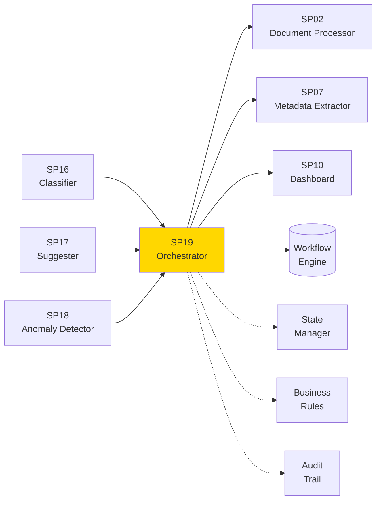
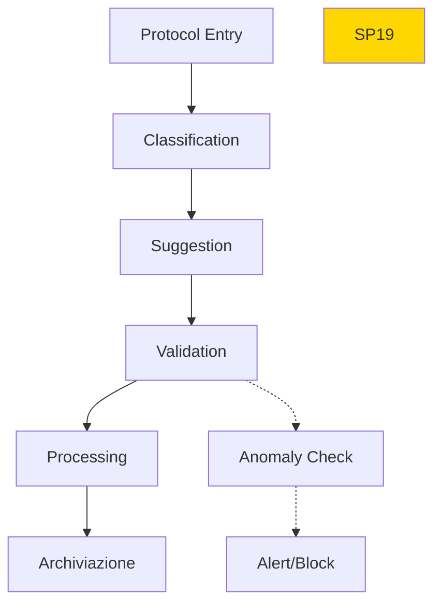

# SP19 - Protocol Workflow Orchestrator

## Panoramica

**SP19 - Protocol Workflow Orchestrator** è il componente centrale che orchestra l'intero flusso di lavoro del protocollo informatico, coordinando tutti gli SP e gestendo le transizioni di stato.



## Responsabilità

### Core Functions

1. **Workflow Management**
   - Creazione workflow protocollo
   - Transizioni di stato automatiche
   - Routing intelligente

2. **State Management**
   - Tracking stato protocollo
   - Persistenza stato distribuita
   - Recovery fault-tolerant

3. **Integration Coordination**
   - Orchestrazione SP componenti
   - Gestione dipendenze
   - Sincronizzazione eventi

4. **Audit & Compliance**
   - Log completo operazioni
   - Tracciabilità modifiche
   - Report compliance

## Architettura Tecnica

### Orchestration Flow



### Tecnologie Utilizzate

| Componente | Tecnologia | Versione | Scopo |
|------------|------------|----------|--------|
| Workflow Engine | Apache Airflow | 2.8 | Orchestrazione workflow |
| State Store | Redis Cluster | 7.2 | Gestione stato distribuita |
| Message Bus | Apache Kafka | 3.6 | Event streaming |
| Rules Engine | Drools | 8.0 | Business rules |

### Workflow States

```yaml
states:
  - RECEIVED: Protocollo ricevuto
  - CLASSIFIED: Classificato da SP16
  - SUGGESTED: Suggerimenti SP17 applicati
  - VALIDATED: Validazione completata
  - PROCESSED: Elaborazione SP02/SP07
  - ARCHIVED: Archiviato definitivamente
  - REJECTED: Rifiutato per anomalie
```

### API Endpoints

```yaml
POST /api/v1/workflow/start
  - Input: {"protocol_id": "string", "initial_data": {}}
  - Output: {"workflow_id": "string", "status": "string"}
  
GET /api/v1/workflow/{id}/status
  - Output: {"state": "string", "progress": 0.75, "next_steps": []}
  
POST /api/v1/workflow/{id}/transition
  - Input: {"action": "approve", "data": {}}
  - Output: {"new_state": "string", "updated": true}
```

### Configurazione

```yaml
sp19:
  workflow_timeout: '48h'
  retry_attempts: 3
  state_persistence: 'redis_cluster'
  audit_enabled: true
```

### Performance Metrics

- **Throughput**: 500 protocolli/ora
- **Reliability**: 99.9% uptime
- **Latency**: <2s per transizione
- **Scalability**: Auto-scaling basato su load

### Sicurezza

- **Role-based Access**: Controllo accessi granulare
- **End-to-end Encryption**: Crittografia workflow data
- **Immutable Audit**: Log tamper-proof

### Evoluzione

1. **Event-driven**: Architettura completamente event-driven
2. **AI Optimization**: Workflow auto-ottimizzanti
3. **Multi-cloud**: Orchestrazione distribuita</content>
<parameter name="filePath">/Users/giangio/Documents/GitHub/Interzen/Interzen.POC/ZenIA/docs/use_cases/UC2 - Protocollo Informatico/01 SP19 - Protocol Workflow Orchestrator.md