# Sequence Diagrams - UC2 Protocollo Informatico

## Diagramma Completo del Flusso di Protocollo


## Diagramma di Classificazione e Suggerimento

```mermaid
sequenceDiagram
    participant SP19 as Orchestrator
    participant SP16 as Classifier
    participant SP17 as Suggester
    participant CACHE as Redis Cache
    participant DB as PostgreSQL

    SP19->>SP16: Classifica corrispondenza
    SP16->>CACHE: Check cache classificazione
    alt Cache hit
        CACHE-->>SP16: Risultato cached
    else Cache miss
        SP16->>SP16: Esegui ML classification
        SP16->>CACHE: Salva risultato
    end
    SP16-->>SP19: Tipo corrispondenza

    SP19->>SP17: Suggerisci protocollo
    SP17->>DB: Query regole titolario
    DB-->>SP17: Regole attive
    SP17->>SP17: Applica regole business
    SP17->>CACHE: Check cache suggerimenti
    alt Cache hit
        CACHE-->>SP17: Suggerimento cached
    else
        SP17->>SP17: Calcolo ML prediction
        SP17->>CACHE: Salva suggerimento
    end
    SP17-->>SP19: Registro + titolario + priorità
```



## Diagramma di Rilevamento Anomalie


## Diagramma Ultra-Semplificato

```mermaid
sequenceDiagram
    participant User as Utente
    participant System as Sistema Protocollo

    User->>System: Invia documento
    System->>System: Classifica
    System->>System: Suggerisci
    System->>System: Verifica
    System->>System: Registra
    System-->>User: Protocollo assegnato
```</content>
<parameter name="filePath">/Users/giangio/Documents/GitHub/Interzen/Interzen.POC/ZenIA/docs/use_cases/UC2 - Protocollo Informatico/01 Sequence diagrams.md