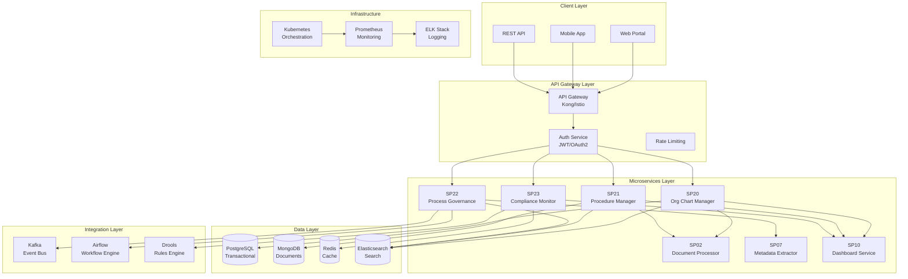
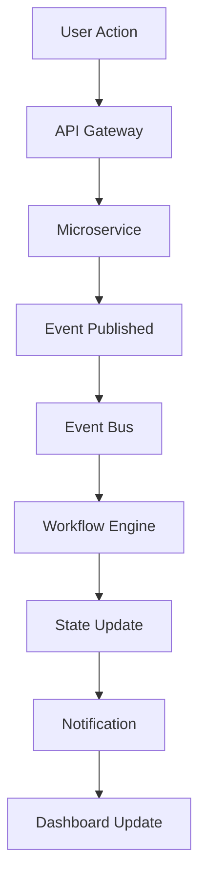
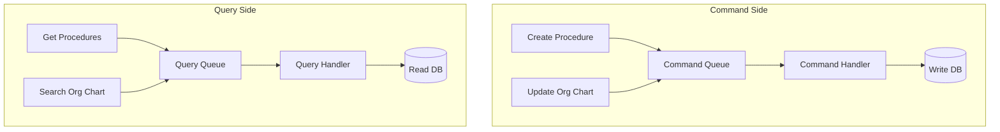
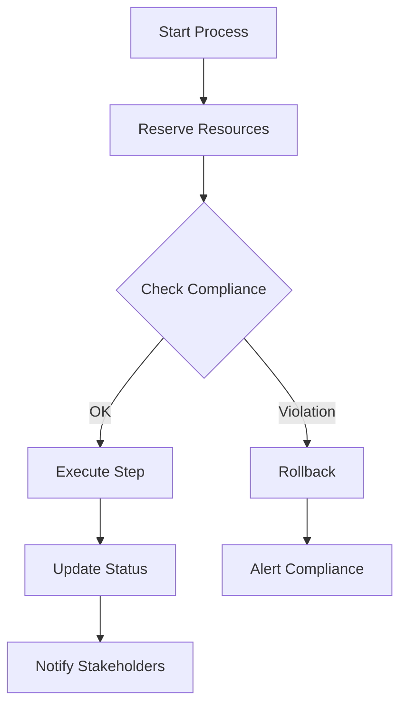
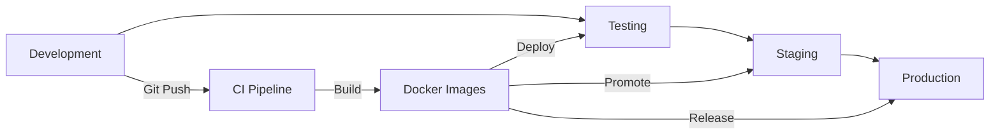

# 00 Architettura UC3 - Governance

## Architettura Generale

**UC3 - Governance** adotta un'architettura a microservizi basata su event-driven architecture per garantire scalabilità, resilienza e manutenibilità del sistema di governance amministrativa.



## Componenti Architetturali

### SP20 - Organization Chart Manager
**Responsabilità**: Gestione organigramma dinamico e strutture organizzative

**Tecnologie**:
- **Framework**: FastAPI (Python)
- **Database**: PostgreSQL con PostGIS per strutture gerarchiche
- **Cache**: Redis per organigramma attivo
- **Search**: Elasticsearch per ricerca posizioni

**API Endpoints**:
```yaml
GET /api/v1/orgchart/{unit_id}
POST /api/v1/orgchart/units
PUT /api/v1/orgchart/{unit_id}/positions
DELETE /api/v1/orgchart/{unit_id}
```

### SP21 - Procedure Manager
**Responsabilità**: Repository e gestione procedure operative

**Tecnologie**:
- **Framework**: FastAPI (Python)
- **Database**: MongoDB per documenti procedure
- **Versioning**: Git-based versioning
- **Search**: Elasticsearch per ricerca full-text

**API Endpoints**:
```yaml
GET /api/v1/procedures/{id}
POST /api/v1/procedures
PUT /api/v1/procedures/{id}/versions
GET /api/v1/procedures/search
```

### SP22 - Process Governance
**Responsabilità**: Orchestrazione procedimenti amministrativi

**Tecnologie**:
- **Workflow Engine**: Apache Airflow
- **Rules Engine**: Drools per business rules
- **Event Streaming**: Apache Kafka
- **State Management**: Redis Cluster

**API Endpoints**:
```yaml
POST /api/v1/processes/{template_id}/start
GET /api/v1/processes/{instance_id}/status
POST /api/v1/processes/{instance_id}/advance
GET /api/v1/processes/templates
```

### SP23 - Compliance Monitor
**Responsabilità**: Monitoraggio conformità e alerting

**Tecnologie**:
- **Monitoring**: Prometheus custom metrics
- **Alerting**: Alertmanager
- **Analytics**: TimescaleDB per metriche temporali
- **Reporting**: Grafana dashboards

**API Endpoints**:
```yaml
GET /api/v1/compliance/status
GET /api/v1/compliance/violations
POST /api/v1/compliance/alerts
GET /api/v1/compliance/reports
```

## Pattern Architetturali

### Event-Driven Architecture


### CQRS Pattern


### Saga Pattern per Transazioni Distribuite


## Sicurezza Architetturale

### Authentication & Authorization
- **OAuth 2.0 / OpenID Connect**: Identity provider centralizzato
- **JWT Tokens**: Stateless authentication
- **Role-Based Access Control**: Permessi granulari per ruolo
- **Attribute-Based Access**: Controllo basato su attributi

### Data Protection
- **Encryption at Rest**: AES-256 per database
- **Encryption in Transit**: TLS 1.3 obbligatorio
- **Data Masking**: Mascheramento dati sensibili
- **Audit Logging**: Log immutabile tutte operazioni

### Network Security
- **Zero Trust**: Verifica ogni richiesta
- **Service Mesh**: Istio per mTLS
- **API Gateway**: Kong per rate limiting e WAF
- **Network Policies**: Kubernetes network policies

## Scalabilità e Performance

### Horizontal Scaling
- **Microservices**: Scaling indipendente per componente
- **Database Sharding**: Partizionamento dati per performance
- **Cache Hierarchy**: Multi-level caching (L1 Redis, L2 CDN)
- **Load Balancing**: Kubernetes service mesh

### Performance Targets
| Componente | Throughput | Latency | Availability |
|------------|------------|---------|--------------|
| SP20 Org Chart | 1000 req/s | <100ms | 99.9% |
| SP21 Procedures | 500 req/s | <200ms | 99.9% |
| SP22 Processes | 200 req/s | <500ms | 99.9% |
| SP23 Compliance | 100 req/s | <1s | 99.9% |

### Monitoring & Observability
- **Metrics**: Prometheus per KPI tecnici
- **Tracing**: Jaeger per distributed tracing
- **Logging**: ELK Stack per log aggregation
- **Health Checks**: Kubernetes liveness/readiness probes

## Disaster Recovery

### Backup Strategy
- **Database**: Point-in-time recovery PostgreSQL
- **Documents**: Versioned backup MongoDB
- **Configuration**: GitOps con ArgoCD
- **Testing**: Regular DR drills

### High Availability
- **Multi-AZ Deployment**: Kubernetes across availability zones
- **Database Replication**: PostgreSQL streaming replication
- **Service Redundancy**: Multiple replicas per service
- **Failover Automation**: Automatic failover procedures

## Deployment Architecture

### CI/CD Pipeline


### Infrastructure as Code
- **Terraform**: Infrastructure provisioning
- **Helm**: Kubernetes package management
- **Kustomize**: Environment-specific configurations
- **GitOps**: ArgoCD per continuous deployment</content>
<parameter name="filePath">/Users/giangio/Documents/GitHub/Interzen/Interzen.POC/ZenIA/docs/use_cases/UC3 - Governance (Organigramma, Procedimenti, Procedure)/00 Architettura UC3.md