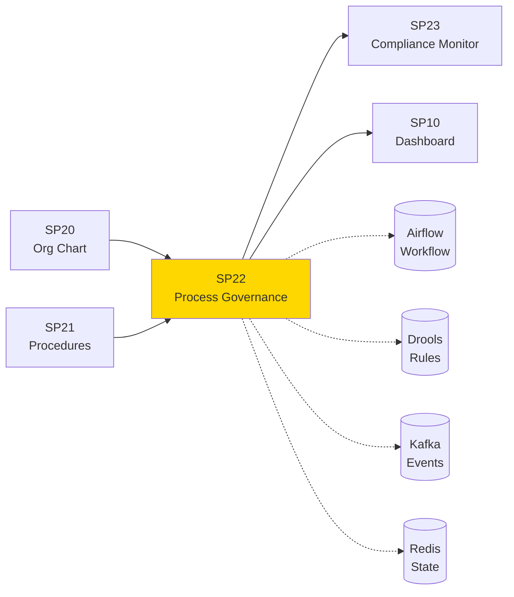

# SP22 - Process Governance

## Panoramica

**SP22 - Process Governance** orchestra l'esecuzione dei procedimenti amministrativi, gestendo workflow complessi, regole business e monitoraggio SLA attraverso un engine BPMN-based.



## Responsabilità

### Core Functions

1. **Process Orchestration**
   - Esecuzione workflow BPMN
   - State management distribuito
   - Exception handling automatico

2. **Business Rules Engine**
   - Valutazione regole dinamiche
   - Decision automation
   - Policy enforcement

3. **SLA Management**
   - Monitoraggio tempi esecuzione
   - Escalation automatica
   - Performance analytics

4. **Integration Coordination**
   - Orchestrazione SP componenti
   - Event-driven communication
   - Data flow management
## 🏛️ Conformità Normativa

### Framework Normativi Applicabili

☑ L. 241/1990
☑ CAD
☐ GDPR - Regolamento 2016/679
☐ eIDAS - Regolamento 2014/910
☐ AI Act - Regolamento 2024/1689
☐ D.Lgs 42/2004 - Codice Beni Culturali
☐ D.Lgs 152/2006 - Codice dell'Ambiente
☐ D.Lgs 33/2013 - Decreto Trasparenza

**Per mappatura completa articoli → implementazioni**, vedi [Conformità Normativa Standard Template](../../templates/conformita-normativa-standard.md) e [COMPLIANCE-MATRIX.md](../../COMPLIANCE-MATRIX.md).

### Requisiti Principali Implementati

| Framework | Requisiti Principali | Status | Riferimenti |
|-----------|-------------------|--------|-------------|
| L. 241/1990 | Art. 1, Art. 3, Art. 6, Art. 27 | ✅ Implementato | [Dettagli](../../templates/conformita-normativa-standard.md) |
| CAD | Art. 1, Art. 21, Art. 22, Art. 62 | ✅ Implementato | [Dettagli](../../templates/conformita-normativa-standard.md) |

### Conformità Normativa - Checklist

- [ ] Tutti i framework normativi applicabili identificati
- [ ] Articoli rilevanti mappati alle responsabilità SP
- [ ] GDPR: Data protection by design implementato (se applicabile)
- [ ] eIDAS: Firma digitale supportata (se applicabile)
- [ ] AI Act: Supervisione umana e trasparenza (se applicabile)
- [ ] Tracciabilità audit completa mantenuta
- [ ] Documentation conformità aggiornata

**Nota**: Dettagli di conformità completi nella sezione "## 🏛️ Conformità Normativa" del template standard.

---


## Architettura Tecnica

### Process Model

```yaml
ProcessDefinition:
  id: string
  name: string
  version: semver
  bpmn_xml: string
  variables: object
  sla_rules: array[sla_rule]
  exception_handlers: array[handler]

ProcessInstance:
  id: string
  definition_id: string
  status: enum[RUNNING, SUSPENDED, COMPLETED, FAILED]
  variables: object
  current_tasks: array[task]
  started_at: datetime
  completed_at: datetime

Task:
  id: string
  name: string
  type: enum[USER, SERVICE, DECISION]
  assignee: string
  due_date: datetime
  priority: enum[LOW, MEDIUM, HIGH, URGENT]
```

### API Endpoints

```yaml
# Process Management
GET /api/v1/processes/definitions
POST /api/v1/processes/definitions
GET /api/v1/processes/definitions/{id}
POST /api/v1/processes/{definition_id}/start
GET /api/v1/processes/{instance_id}
DELETE /api/v1/processes/{instance_id}

# Task Management
GET /api/v1/tasks?assignee={user}
POST /api/v1/tasks/{task_id}/complete
POST /api/v1/tasks/{task_id}/claim
POST /api/v1/tasks/{task_id}/delegate

# Rules Management
GET /api/v1/rules
POST /api/v1/rules
PUT /api/v1/rules/{id}
DELETE /api/v1/rules/{id}
POST /api/v1/rules/evaluate
```

### Tecnologie Utilizzate

| Componente | Tecnologia | Versione | Scopo |
|------------|------------|----------|--------|
| Workflow Engine | Apache Airflow | 2.8 | Orchestrazione processi |
| Rules Engine | Drools | 8.0 | Business rules |
| Message Bus | Apache Kafka | 3.6 | Event streaming |
| State Store | Redis Cluster | 7.2 | State management |

### Esempi di Utilizzo

#### Avvio Processo

**POST /api/v1/processes/ambiente_authorization/start**
```json
{
  "variables": {
    "applicant": "company_xyz",
    "activity_type": "scarico_acque",
    "documents": ["doc1.pdf", "doc2.pdf"]
  },
  "initiator": "user_123"
}
```

#### Valutazione Regola

**POST /api/v1/rules/evaluate**
```json
{
  "rule_id": "sla_check",
  "facts": {
    "process_type": "autorizzazione",
    "elapsed_days": 15,
    "sla_days": 30
  }
}
```

### Configurazione

```yaml
sp22:
  airflow_url: 'http://airflow:8080'
  drools_url: 'http://drools:8080'
  kafka_bootstrap: 'kafka:9092'
  redis_cluster: 'redis-cluster:6379'
  sla_check_interval: '1h'
  max_concurrent_processes: 1000
```

### Performance Metrics

- **Process Throughput**: 500 processi/ora
- **Task Completion**: <5min media
- **Rule Evaluation**: <100ms per regola
- **SLA Compliance**: >95%

### Sicurezza

- **Process Isolation**: Sandboxing esecuzione
- **Data Protection**: Crittografia dati processo
- **Audit Trail**: Log completo esecuzione
- **Access Control**: RBAC per processi/tasks

### Evoluzione

1. **AI-Driven Decisions**: ML per ottimizzazione workflow
2. **Predictive SLA**: Previsione violazioni SLA
3. **Dynamic Adaptation**: Auto-tuning processi</content>
<parameter name="filePath">/Users/giangio/Documents/GitHub/Interzen/Interzen.POC/ZenIA/docs/use_cases/UC3 - Governance (Organigramma, Procedimenti, Procedure)/01 SP22 - Process Governance.md