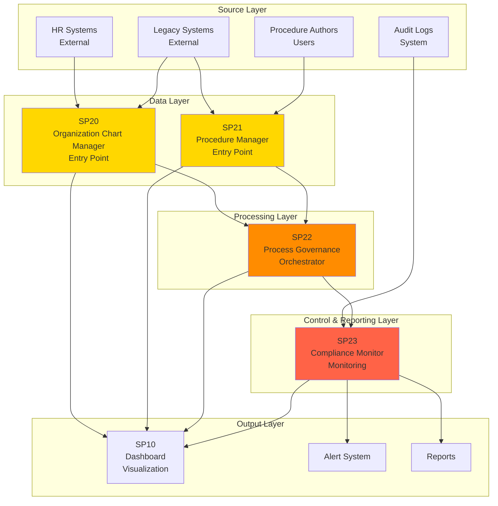

# Matrice Dipendenze Sottoprogetti - UC3 Governance

## Overview Dipendenze

Questa matrice mostra le interdipendenze tra i sottoprogetti del sistema di Governance amministrativa, identificando relazioni di dipendenza, flusso dati e punti di integrazione.



## Matrice Dipendenze Dettagliata

| Sottoprogetto | Dipendenze In | Dipendenze Out | Tipo Dipendenza | Dati Scambiati |
|---|---|---|---|---|
| **SP20 Org Chart Manager** | HR Systems, Legacy Systems | SP22, SP10 | Data Source | Organigramma, Ruoli, Responsabilità |
| **SP21 Procedure Manager** | Procedure Authors, Legacy Procedures | SP22, SP10 | Data Source | Procedure, Versioni, Metadata |
| **SP22 Process Governance** | SP20, SP21 | SP23, SP10 | Orchestration | Workflow state, Business rules, Events |
| **SP23 Compliance Monitor** | SP22, Audit Logs, Compliance Rules | SP10, Alerts, Reports | Monitoring | Compliance status, Violations, Scores |

## Flusso Dati Principale

```
┌─ HR Systems ─┐
│              v
└─ SP20 (Org Chart) ────────┐
   ├─ Organigramma          │
   ├─ Ruoli                 │
   └─ Responsabilità        │
                            v
┌─ Procedure Authors ─┐   SP22 (Process Governance) ─┐
│                     v    ├─ Workflow BPMN            │
└─ SP21 (Procedures)  │    ├─ Business Rules           │
   ├─ Procedure List  │    └─ Events                   │
   ├─ Versioni        │                                v
   └─ Approval Flow   │                            SP23 (Compliance Monitor)
                      │                            ├─ Compliance Check
                      │                            ├─ Alerts
                      └────────────> SP10 (Dashboard)─ ├─ Reports
                          │          ├─ Org View     └─ Metrics
                          │          ├─ Procedures
                          │          └─ Compliance
                          v
                      Alert System
```

## Dipendenze Critiche

### 1. SP20 → SP22 (Org Chart to Process Governance)
- **Tipo**: Forte dipendenza
- **Dato**: Organigramma, routing dati per processo
- **Criticità**: ALTA - Senza organigramma non si può eseguire processo
- **SLA**: Organigramma freschi < 1h
- **Impatto fallimento**: Processi non eseguibili

### 2. SP21 → SP22 (Procedures to Process Governance)
- **Tipo**: Forte dipendenza
- **Dato**: Procedure, workflow definition, business rules
- **Criticità**: ALTA - Processo necessita procedure
- **SLA**: Procedure updates riflessi < 30 min
- **Impatto fallimento**: Processi eseguiti senza rules

### 3. SP22 → SP23 (Process Governance to Compliance Monitor)
- **Tipo**: Forte dipendenza
- **Dato**: Process events, execution state
- **Criticità**: ALTA - Compliance necessita eventi processo
- **SLA**: Events in real-time < 1 sec
- **Impatto fallimento**: No compliance monitoring

### 4. SP20 → SP10, SP21 → SP10, SP22 → SP10, SP23 → SP10 (All to Dashboard)
- **Tipo**: Dipendenza aggregazione
- **Dato**: Aggregated metrics e stati
- **Criticità**: MEDIA - Dashboard è view-layer
- **SLA**: Dashboard refresh < 5 sec
- **Impatto fallimento**: Visibilità compromessa (non critical)

## Dipendenze Cicliche

✅ **Nessuna dipendenza ciclica** rilevata:
- SP20 → SP22: Unidirezionale
- SP21 → SP22: Unidirezionale
- SP22 → SP23: Unidirezionale
- Tutti convergono a SP10: Fan-in pattern OK

## Matrice Tecnologica

| Tecnologia | SP20 | SP21 | SP22 | SP23 | Note |
|---|---|---|---|---|---|
| **Python** | ✓ | ✓ | ✓ | ✓ | Core language |
| **PostgreSQL** | ✓ | - | ✓ | ✓ | Relational data |
| **MongoDB** | - | ✓ | - | - | Document procedures |
| **Redis** | ✓ | ✓ | ✓ | ✓ | Caching layer |
| **Elasticsearch** | ✓ | ✓ | - | ✓ | Search & logs |
| **Airflow** | - | - | ✓ | - | Workflow orchestration |
| **Drools** | - | - | ✓ | - | Business rules |
| **Kafka** | - | - | ✓ | ✓ | Event streaming |
| **Prometheus** | - | - | - | ✓ | Metrics |
| **TimescaleDB** | - | - | - | ✓ | Time-series analytics |
| **Docker** | ✓ | ✓ | ✓ | ✓ | Containerization |
| **Kubernetes** | ✓ | ✓ | ✓ | ✓ | Orchestration |
| **FastAPI** | ✓ | ✓ | ✓ | ✓ | REST API |

## Matrice di Sicurezza

| Aspetto | SP20 | SP21 | SP22 | SP23 | Implementazione |
|---|---|---|---|---|---|
| **Autenticazione** | JWT | JWT | JWT | JWT | Token-based |
| **Autorizzazione** | RBAC | RBAC | RBAC | RBAC | Role-based (admin, manager, user) |
| **Crittografia** | TLS 1.3 | TLS 1.3 | TLS 1.3 | TLS 1.3 | End-to-end |
| **Audit Logging** | ✓ | ✓ | ✓ | ✓ | Complete trail |
| **Data Masking** | - | - | - | ✓ | Sensitive data in reports |
| **Rate Limiting** | ✓ | ✓ | ✓ | ✓ | Token bucket |

## Matrice di Scalabilità

| Metrica | SP20 | SP21 | SP22 | SP23 | Target |
|---|---|---|---|---|---|
| **Throughput** | 500 req/s | 300 req/s | 1000 req/s | 100 req/s | Massimo |
| **Latency (p50)** | <100ms | <200ms | <500ms | <1s | Median |
| **Latency (p99)** | <500ms | <1s | <2s | <5s | 99th percentile |
| **Availability** | 99.9% | 99.9% | 99.95% | 99.5% | SLA |
| **Scalability** | Horizontal | Horizontal | Horizontal | Horizontal | Tipo |

**Note**:
- SP20 (Org Chart): High throughput per ricerche frequent
- SP21 (Procedures): Medium load, heavy on storage
- SP22 (Governance): Highest throughput (orchestration core)
- SP23 (Compliance): Batch processing allowed, lower throughput OK

## Matrice di Monitoraggio

| Metriche | SP20 | SP21 | SP22 | SP23 | Tool |
|---|---|---|---|---|---|
| **Performance** | ✓ | ✓ | ✓ | ✓ | Prometheus |
| **Errors** | ✓ | ✓ | ✓ | ✓ | Prometheus |
| **Business KPIs** | ✓ | ✓ | ✓ | ✓ | Custom dashboards |
| **Health Checks** | ✓ | ✓ | ✓ | ✓ | Kubernetes |
| **Logs** | ✓ | ✓ | ✓ | ✓ | ELK Stack |
| **Traces** | ✓ | ✓ | ✓ | ✓ | Jaeger |
| **SLA Metrics** | - | - | ✓ | ✓ | Custom (workflow SLA) |

**Key Metrics per SP**:
- **SP20**: Organigramma freshness, search latency, user count
- **SP21**: Procedure versioning lag, approval cycle time, file size
- **SP22**: Process execution time, workflow completion rate, error rate
- **SP23**: Compliance violations detected, alert latency, report generation time

## Matrice di Deployment

| Ambiente | SP20 | SP21 | SP22 | SP23 | Config |
|---|---|---|---|---|---|
| **Development** | Docker | Docker | Docker | Docker | docker-compose |
| **Staging** | K8s | K8s | K8s | K8s | Helm |
| **Production** | K8s | K8s | K8s | K8s | Helm + Istio |
| **CI/CD** | GitHub Actions | GitHub Actions | GitHub Actions | GitHub Actions | Pipeline |

## Rischi e Mitigazioni

### Dipendenze Critiche

**1. SP20 Org Chart downtime**
   - **Rischio**: Processi non possono essere routed senza organigramma
   - **Probabilità**: Media (data source esterno)
   - **Impatto**: Alto (business critical)
   - **Mitigazione**:
     - Cache organigramma in Redis (TTL 1h)
     - Read replicas per HR sync
     - Fallback to last-known state
     - Alert when data > 24h old

**2. SP21 Procedures downtime**
   - **Rischio**: Processi eseguiti senza rules updated
   - **Probabilità**: Bassa (internal)
   - **Impatto**: Alto (compliance issue)
   - **Mitigazione**:
     - Version control (Git) per procedure
     - Approval workflow before publish
     - Rollback capability
     - Health check on procedure load

**3. SP22 Process Governance bottleneck**
   - **Rischio**: Orchestrator è SPOF
   - **Probabilità**: Media (high load)
   - **Impatto**: Critico (no process execution)
   - **Mitigazione**:
     - Horizontal scaling (multiple instances)
     - Load balancing
     - Circuit breaker pattern
     - Queue for async processing

**4. SP23 Compliance Monitor lag**
   - **Rischio**: Violations detected late
   - **Probabilità**: Bassa (optimized)
   - **Impatto**: Medio (delayed alerts)
   - **Mitigazione**:
     - Real-time event streaming (Kafka)
     - Multiple check rules (fail-fast)
     - Alerting SLA < 1 min
     - Escalation procedures

### Performance Issues

**Bottleneck potenziale: PostgreSQL contention**
- **Scenario**: Multiple processes accessing org chart simultaneously
- **Mitigazione**: Read replicas, caching, query optimization

**Bottleneck potenziale: MongoDB document size**
- **Scenario**: Large procedure documents with full history
- **Mitigazione**: Archiving, pagination, lazy loading

**Bottleneck potenziale: Kafka event throughput**
- **Scenario**: Too many process events for Kafka to handle
- **Mitigazione**: Partitioning, batching, topic optimization

## Ordine Implementazione Consigliato

1. **Fase 1**: SP20 (Org Chart Manager)
   - Base data layer
   - Simple CRUD operations
   - HR system integration
   - Dependency: Minimal

2. **Fase 2**: SP21 (Procedure Manager)
   - Document storage
   - Version control
   - Approval workflow
   - Dependency: SP20 (soft dependency for search)

3. **Fase 3**: SP22 (Process Governance)
   - Orchestration engine
   - Workflow execution
   - Rules evaluation
   - Dependency: SP20, SP21 (HARD dependencies)

4. **Fase 4**: SP23 (Compliance Monitor)
   - Event processing
   - Compliance checks
   - Alerting
   - Dependency: SP22 (HARD dependency)

5. **Fase 5**: SP10 (Dashboard)
   - Visualization
   - All SP as input
   - Dependency: All others

## Testing Dependencies

| Test Type | Dependency Chain |
|---|---|
| **Unit** | Each SP independently |
| **Integration** | SP20 + SP21, then SP22, then SP23 |
| **E2E** | HR → SP20 → SP22 → SP23 → Dashboard |
| **Load** | Each SP separately, then combined |
| **Chaos** | Failure of each SP in chain, recovery |

## Documentazione Correlata

- [SP20 - Organization Chart Manager](./01 SP20 - Organization Chart Manager.md)
- [SP21 - Procedure Manager](./01 SP21 - Procedure Manager.md)
- [SP22 - Process Governance](./01 SP22 - Process Governance.md)
- [SP23 - Compliance Monitor](./01 SP23 - Compliance Monitor.md)
- [00 Architettura UC3](./00 Architettura UC3.md)
- [SP-MS-MAPPING-MASTER.md](../../SP-MS-MAPPING-MASTER.md)

