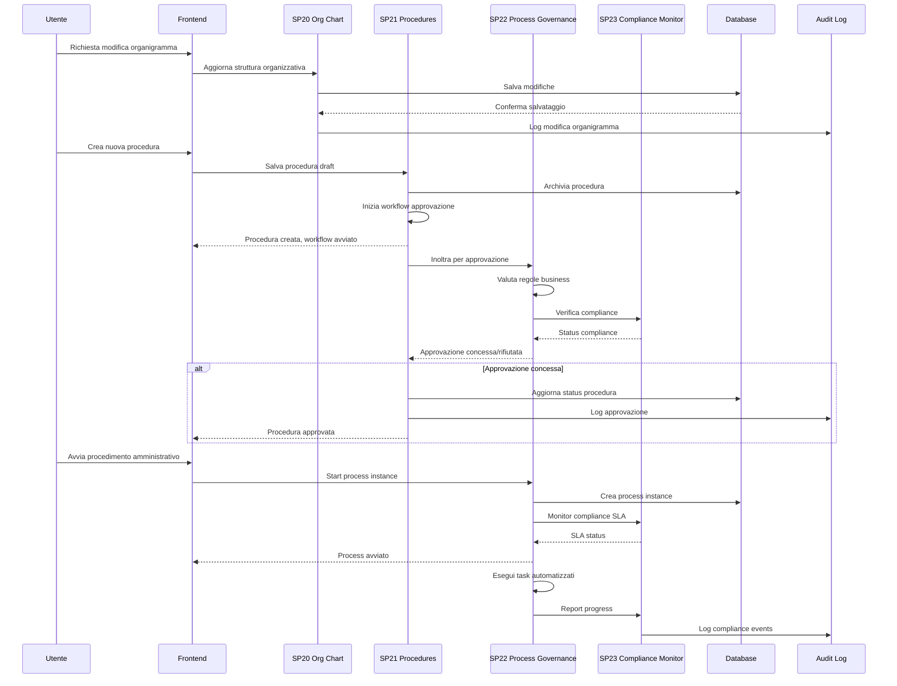
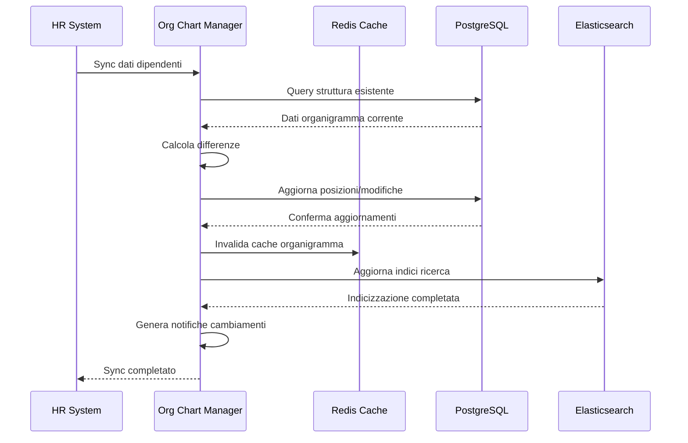
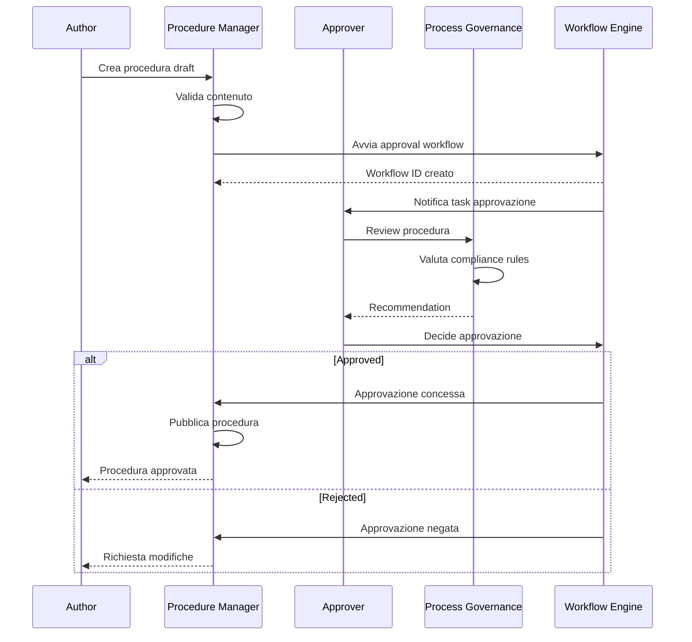
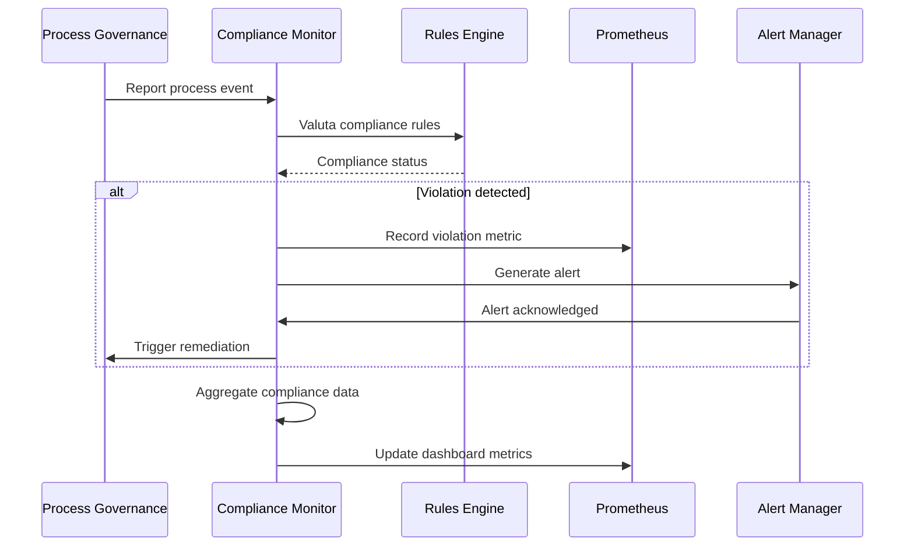

# Sequence Diagrams - UC3 Governance

## Diagramma Completo del Flusso di Governance



## Diagramma di Organigramma Management



## Diagramma di Procedure Approval



## Diagramma di Compliance Monitoring



## Diagramma Ultra-Semplificato

```mermaid
sequenceDiagram
    participant User as Utente
    participant System as Sistema Governance

    User->>System: Modifica organigramma
    System->>System: Valida e salva
    System-->>User: Aggiornamento completato

    User->>System: Crea procedura
    System->>System: Approval workflow
    System-->>User: Procedura approvata

    User->>System: Avvia processo
    System->>System: Monitor compliance
    System-->>User: Processo completato
```</content>
<parameter name="filePath">/Users/giangio/Documents/GitHub/Interzen/Interzen.POC/ZenIA/docs/use_cases/UC3 - Governance (Organigramma, Procedimenti, Procedure)/01 Sequence diagrams.md
