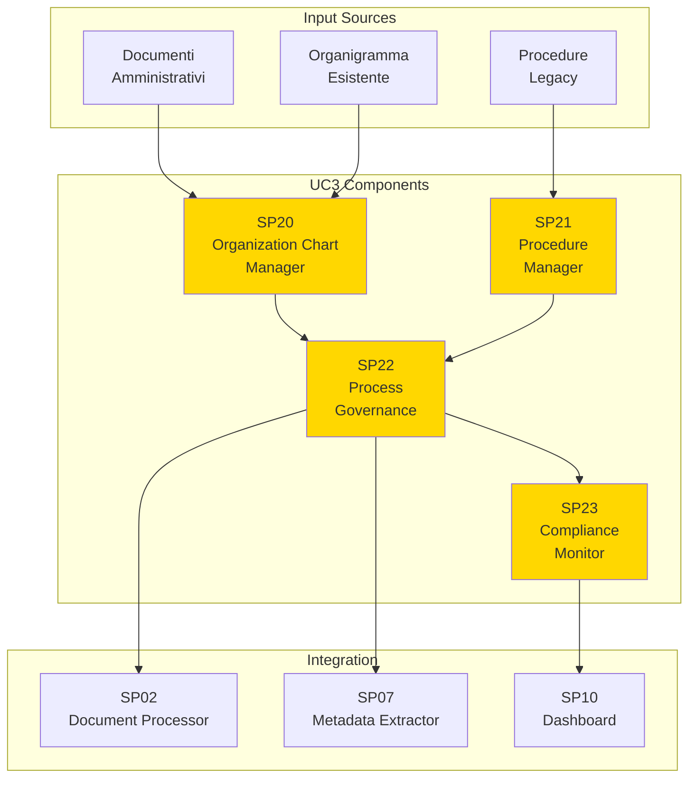
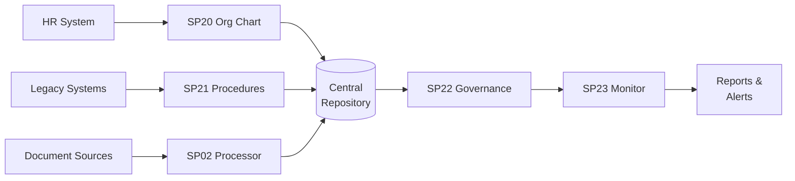

# Guida UC3 - Governance (Organigramma, Procedimenti, Procedure)

## Panoramica

**UC3 - Governance (Organigramma, Procedimenti, Procedure)** implementa un sistema completo di governance amministrativa che gestisce l'organigramma dinamico, i procedimenti amministrativi e le procedure operative, garantendo compliance e tracciabilità.

## Obiettivi

### Business Objectives

1. **Organigramma Dinamico**
   - Gestione strutture organizzative flessibili
   - Aggiornamenti real-time organigramma
   - Integrazione con sistemi HR

2. **Gestione Procedimenti**
   - Modellazione procedimenti amministrativi
   - Workflow configurabili
   - Tracking avanzato esecuzione

3. **Procedure Operative**
   - Repository centralizzato procedure
   - Versioning e approval workflow
   - Accesso controllato per ruolo

4. **Compliance & Governance**
   - Monitoraggio conformità procedurale
   - Audit trail completo
   - Report compliance automatici

## Caratteristiche Principali

### Organigramma Intelligente
- **Strutture Gerarchiche**: Gestione multi-livello posizioni/ruoli
- **Relazioni Dinamiche**: Assegnazione compiti flessibile
- **Integrazione HR**: Sync con sistemi risorse umane
- **Visualizzazione**: Dashboard interattive organigramma

### Procedimenti Amministrativi
- **Modellazione BPMN**: Standard BPMN 2.0 per processi
- **Workflow Engine**: Esecuzione automatizzata procedimenti
- **SLA Management**: Monitoraggio tempi esecuzione
- **Exception Handling**: Gestione casi eccezionali

### Procedure Operative
- **Document Management**: Repository strutturato procedure
- **Version Control**: Tracking modifiche e approvazioni
- **Search & Discovery**: Ricerca intelligente procedure
- **Training Integration**: Link con sistemi formazione

### Compliance Monitoring
- **Rule Engine**: Valutazione conformità automatica
- **Audit Logging**: Tracciabilità completa operazioni
- **Alert System**: Notifiche violazioni compliance
- **Reporting**: Dashboard compliance executive

## Architettura di Integrazione

### Data Flow

### API Integration
- **REST APIs**: Esposizione servizi governance
- **GraphQL**: Query flessibili dati organigramma
- **Webhooks**: Notifiche eventi governance
- **Bulk Operations**: Import/export massivi

## Benefici Attesi

### Efficienza Operativa
- **Riduzione Tempi**: Automazione workflow procedimenti
- **Standardizzazione**: Procedure uniformi across organization
- **Trasparenza**: Visibilità completa processi

### Compliance & Risk
- **Audit Readiness**: Tracciabilità completa operazioni
- **Risk Mitigation**: Monitoraggio proattivo compliance
- **Regulatory Compliance**: Adempimenti normativi automatici

### User Experience
- **Self-Service**: Accesso autonomo procedure/organigramma
- **Mobile Support**: Accessibilità dispositivi mobili
- **Real-time Updates**: Informazioni sempre aggiornate

## KPI di Successo

| KPI | Target | Misurazione |
|-----|--------|-------------|
| Coverage Procedure | >95% | Procedure digitalizzate vs totali |
| Compliance Rate | >98% | Procedure seguite correttamente |
| Update Frequency | <24h | Tempo aggiornamento organigramma |
| User Adoption | >80% | Utenti attivi sistema governance |

## Roadmap Implementazione

### Fase 1: Foundation (Mesi 1-3)
- Setup infrastruttura base
- Migrazione organigramma esistente
- Import procedure critiche

### Fase 2: Core Features (Mesi 4-6)
- Workflow engine procedimenti
- Compliance monitoring
- Dashboard governance

### Fase 3: Advanced Features (Mesi 7-9)
- AI-powered insights
- Predictive compliance
- Advanced analytics

### Fase 4: Optimization (Mesi 10-12)
- Performance optimization
- Mobile app
- Integration avanzate</content>
<parameter name="filePath">/Users/giangio/Documents/GitHub/Interzen/Interzen.POC/ZenIA/docs/use_cases/UC3 - Governance (Organigramma, Procedimenti, Procedure)/Guida_UC3_Governance.md
