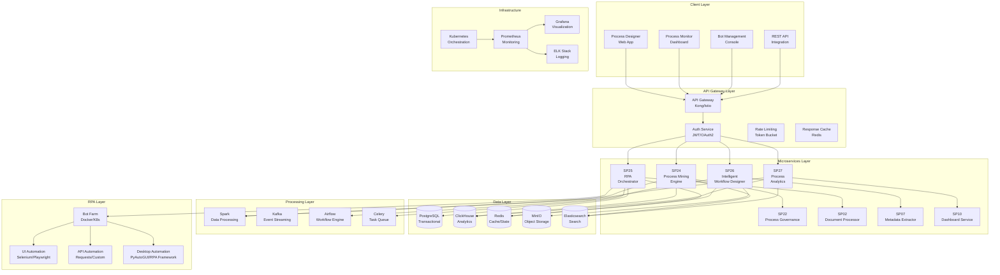
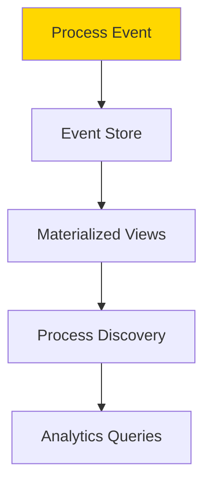
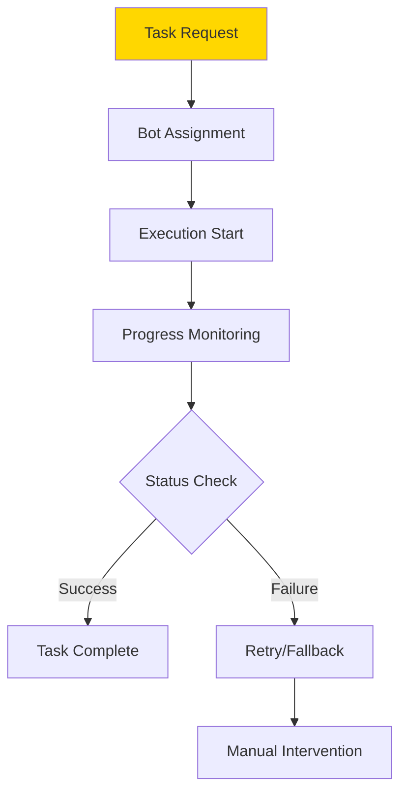
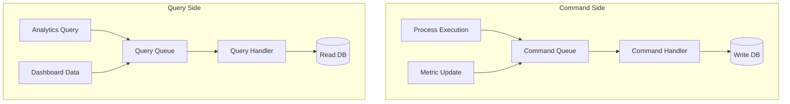
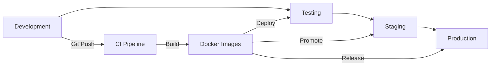

# 00 Architettura UC4 - BPM e Automazione Processi

## Architettura Generale

**UC4 - BPM e Automazione Processi** adotta un'architettura distribuita basata su microservizi e event-driven design per supportare process mining, RPA orchestration e workflow intelligence su scala enterprise.



## Componenti Architetturali

### SP24 - Process Mining Engine
**Responsabilità**: Analisi e discovery processi da event logs esistenti

**Tecnologie**:
- **Data Processing**: Apache Spark per analisi distribuita
- **Analytics DB**: ClickHouse per aggregazioni veloci
- **Process Mining**: PM4Py/Custom algorithms
- **Storage**: MinIO per event logs archiviati

**API Endpoints**:
```yaml
POST /api/v1/mining/discover
  - Input: {"event_log": "file_path", "algorithm": "alpha|heuristic"}
  - Output: {"process_model": "bpmn_xml", "statistics": {}}

GET /api/v1/mining/conformance
  - Query: ?model_id=123&log_id=456
  - Output: {"fitness": 0.85, "precision": 0.92}
```

### SP25 - RPA Orchestrator
**Responsabilità**: Orchestrazione e gestione robot software

**Tecnologie**:
- **Bot Framework**: Custom RPA framework basato su Python
- **Task Queue**: Celery per distribuzione task
- **State Management**: Redis per tracking esecuzione bot
- **Container Orchestration**: Kubernetes per scaling bot

**API Endpoints**:
```yaml
POST /api/v1/rpa/bots/{bot_id}/execute
  - Input: {"task": "task_definition", "parameters": {}}
  - Output: {"execution_id": "string", "status": "queued"}

GET /api/v1/rpa/executions/{execution_id}
  - Output: {"status": "running", "progress": 0.75, "logs": []}
```

### SP26 - Intelligent Workflow Designer
**Responsabilità**: Design visuale e intelligente di workflow

**Tecnologie**:
- **Frontend**: React.js con BPMN.js per designer visuale
- **Backend**: FastAPI per API design
- **AI Engine**: TensorFlow/PyTorch per suggerimenti
- **Versioning**: Git per version control processi

**API Endpoints**:
```yaml
POST /api/v1/designer/processes
  - Input: {"name": "string", "bpmn_xml": "string"}
  - Output: {"process_id": "string", "version": "1.0"}

POST /api/v1/designer/optimize
  - Input: {"process_id": "string", "goals": ["efficiency", "cost"]}
  - Output: {"optimized_bpmn": "string", "improvements": []}
```

### SP27 - Process Analytics
**Responsabilità**: Analytics avanzati e monitoraggio processi

**Tecnologie**:
- **Time Series**: ClickHouse per metriche temporali
- **ML Analytics**: Scikit-learn per predictive analytics
- **Real-time Processing**: Kafka Streams per aggregazioni
- **Visualization**: Grafana per dashboard custom

**API Endpoints**:
```yaml
GET /api/v1/analytics/kpis
  - Query: ?process_id=123&time_range=30d
  - Output: {"throughput": 150, "cycle_time": "2.5h", "error_rate": 0.02}

POST /api/v1/analytics/predict
  - Input: {"process_id": "string", "forecast_days": 30}
  - Output: {"predictions": [], "confidence": 0.85}
```

## Pattern Architetturali

### Event-Sourcing per Process Mining


### Saga Pattern per RPA Orchestration


### CQRS per Analytics


## Sicurezza Architetturale

### Bot Security
- **Credential Management**: Vault per credenziali bot
- **Access Control**: Least privilege per bot operations
- **Audit Logging**: Complete audit trail bot actions
- **Network Isolation**: Bot execution in isolated networks

### Process Data Protection
- **Data Encryption**: End-to-end encryption sensitive data
- **PII Masking**: Automatic masking dati personali
- **Access Logging**: Detailed logging access to process data
- **Compliance**: GDPR/CCPA compliance per process data

## Scalabilità e Performance

### RPA Scaling
- **Bot Auto-scaling**: Kubernetes HPA basato su queue length
- **Load Balancing**: Intelligent distribution across bot pool
- **Resource Optimization**: CPU/memory optimization per bot type
- **Geographic Distribution**: Bot deployment across regions

### Analytics Performance
- **Data Partitioning**: Time-based partitioning ClickHouse
- **Caching Strategy**: Multi-level caching (Redis + CDN)
- **Query Optimization**: Pre-computed aggregations
- **Real-time Processing**: Stream processing per real-time metrics

### Performance Targets
| Componente | Throughput | Latency | Availability |
|------------|------------|---------|--------------|
| SP24 Mining | 100 GB/hour | <30min | 99.5% |
| SP25 RPA | 1000 tasks/hour | <5min | 99.9% |
| SP26 Designer | 100 req/s | <500ms | 99.9% |
| SP27 Analytics | 1000 queries/min | <2s | 99.9% |

## Deployment Architecture

### Multi-Environment Strategy


### Infrastructure as Code
- **Terraform**: Cloud infrastructure provisioning
- **Helm**: Kubernetes application packaging
- **Kustomize**: Environment-specific configurations
- **GitOps**: ArgoCD per continuous deployment

### RPA Deployment Patterns
- **Containerized Bots**: Docker containers per bot type
- **Serverless Bots**: AWS Lambda/Azure Functions per lightweight automation
- **Edge Bots**: On-premise deployment per legacy systems
- **Cloud Bots**: Managed cloud RPA services integration</content>
<parameter name="filePath">/Users/giangio/Documents/GitHub/Interzen/Interzen.POC/ZenIA/docs/use_cases/UC4 - BPM e Automazione Processi/00 Architettura UC4.md