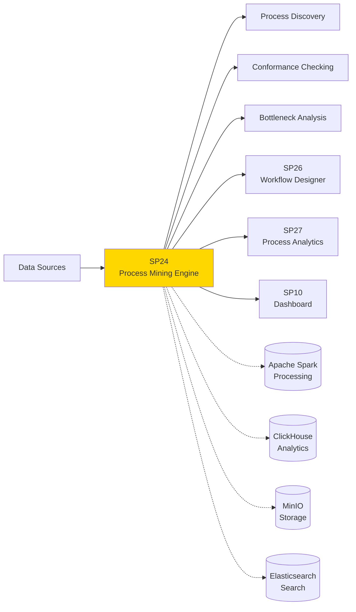
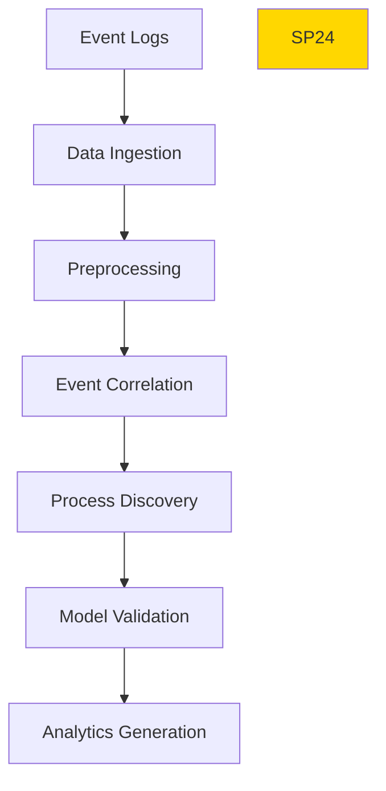

# SP24 - Process Mining Engine

## Panoramica

**SP24 - Process Mining Engine** è il componente responsabile dell'analisi e del discovery automatico dei processi aziendali attraverso l'analisi di event logs, fornendo insights per l'ottimizzazione e l'automazione.



## Responsabilità

### Core Functions

1. **Event Log Processing**
   - Ingest event logs da sistemi eterogenei
   - Data cleaning e preprocessing
   - Event correlation e sequencing

2. **Process Discovery**
   - Algoritmi discovery automatici (Alpha, Heuristic, Genetic)
   - Generazione modelli processo BPMN
   - Social network analysis per collaborazione

3. **Conformance Checking**
   - Verifica aderenza processi a modelli di riferimento
   - Identificazione deviazioni e violazioni
   - Fitness e precision metrics

4. **Performance Analysis**
   - Analisi colli di bottiglia e inefficienze
   - Throughput analysis e cycle time metrics
   - Resource utilization analytics
## 🏛️ Conformità Normativa

### Framework Normativi Applicabili

☑ CAD
☑ GDPR
☐ L. 241/1990 - Procedimento Amministrativo
☐ eIDAS - Regolamento 2014/910
☐ AI Act - Regolamento 2024/1689
☐ D.Lgs 42/2004 - Codice Beni Culturali
☐ D.Lgs 152/2006 - Codice dell'Ambiente
☐ D.Lgs 33/2013 - Decreto Trasparenza

**Per mappatura completa articoli → implementazioni**, vedi [Conformità Normativa Standard Template](../../templates/conformita-normativa-standard.md) e [COMPLIANCE-MATRIX.md](../../COMPLIANCE-MATRIX.md).

### Requisiti Principali Implementati

| Framework | Requisiti Principali | Status | Riferimenti |
|-----------|-------------------|--------|-------------|
| CAD | Art. 1, Art. 21, Art. 22, Art. 62 | ✅ Implementato | [Dettagli](../../templates/conformita-normativa-standard.md) |
| GDPR | Art. 5, Art. 32 | ✅ Implementato | [Dettagli](../../templates/conformita-normativa-standard.md) |

### Conformità Normativa - Checklist

- [ ] Tutti i framework normativi applicabili identificati
- [ ] Articoli rilevanti mappati alle responsabilità SP
- [ ] GDPR: Data protection by design implementato (se applicabile)
- [ ] eIDAS: Firma digitale supportata (se applicabile)
- [ ] AI Act: Supervisione umana e trasparenza (se applicabile)
- [ ] Tracciabilità audit completa mantenuta
- [ ] Documentation conformità aggiornata

**Nota**: Dettagli di conformità completi nella sezione "## 🏛️ Conformità Normativa" del template standard.

---


## Architettura Tecnica

### Mining Pipeline



### Tecnologie Utilizzate

| Componente | Tecnologia | Versione | Scopo |
|------------|------------|----------|--------|
| Data Processing | Apache Spark | 3.5 | Distributed processing |
| Analytics DB | ClickHouse | 23.8 | Fast aggregations |
| Process Mining | PM4Py | 2.3 | Mining algorithms |
| Object Storage | MinIO | 2023 | Event log storage |
| Search | Elasticsearch | 8.11 | Model search |

### Algoritmi di Discovery

#### Alpha Algorithm
```
Input: Event log con case ID, activity, timestamp
Output: Petri net model
Complexity: O(n log n) dove n = numero eventi
Accuracy: Buona per processi strutturati
```

#### Heuristic Mining
```
Input: Event log con frequenze
Output: Heuristic net
Complexity: O(n) con n = numero eventi
Accuracy: Robusta a noise e infrequent paths
```

### API Endpoints

```yaml
POST /api/v1/mining/discover
  - Input: {
      "event_log": "s3://logs/process_log.csv",
      "algorithm": "heuristic",
      "parameters": {"noise_threshold": 0.1}
    }
  - Output: {
      "process_model": "bpmn_xml",
      "statistics": {
        "events": 10000,
        "cases": 500,
        "activities": 25
      }
    }

GET /api/v1/mining/conformance/{model_id}
  - Query: ?log_id=123&metric=fitness
  - Output: {
      "fitness": 0.87,
      "precision": 0.92,
      "generalization": 0.78
    }

POST /api/v1/mining/analyze/bottlenecks
  - Input: {"process_id": "string", "time_range": "30d"}
  - Output: {
      "bottlenecks": [
        {"activity": "review", "avg_wait": "5.2h"},
        {"activity": "approval", "avg_wait": "3.1h"}
      ]
    }
```

### Configurazione

```yaml
sp24:
  spark_master: 'spark://spark-master:7077'
  clickhouse_host: 'clickhouse:8123'
  minio_endpoint: 'minio:9000'
  elasticsearch_url: 'http://search:9200'
  algorithms:
    - name: alpha
      enabled: true
      max_complexity: 100000
    - name: heuristic
      enabled: true
      noise_threshold: 0.1
  cache_ttl: 3600
```

### Performance Metrics

- **Processing Speed**: 1M eventi/minuto
- **Discovery Accuracy**: >90% per processi strutturati
- **Memory Usage**: <8GB per mining job
- **Scalability**: Lineare con cluster size

### Sicurezza

- **Data Privacy**: Anonimizzazione automatica PII
- **Access Control**: RBAC per mining results
- **Audit Trail**: Logging completo accessi
- **Data Encryption**: Crittografia at rest/transit

### Evoluzione

1. **Real-time Mining**: Streaming process discovery
2. **AI-Enhanced Mining**: ML per pattern recognition
3. **Predictive Mining**: Forecasting process changes</content>
<parameter name="filePath">/Users/giangio/Documents/GitHub/Interzen/Interzen.POC/ZenIA/docs/use_cases/UC4 - BPM e Automazione Processi/01 SP24 - Process Mining Engine.md