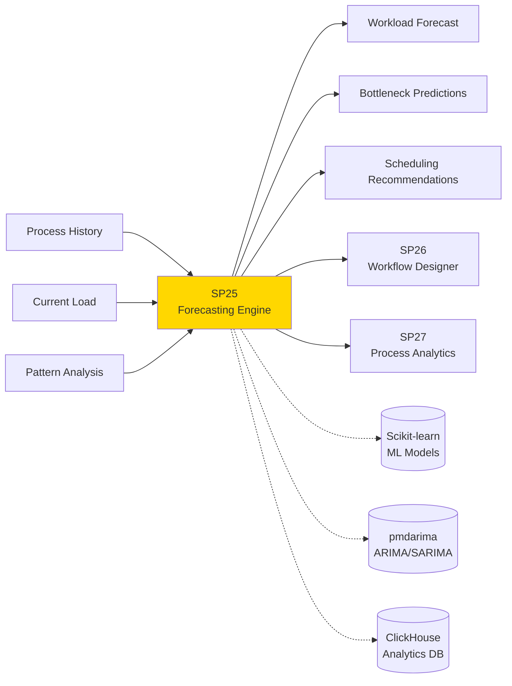
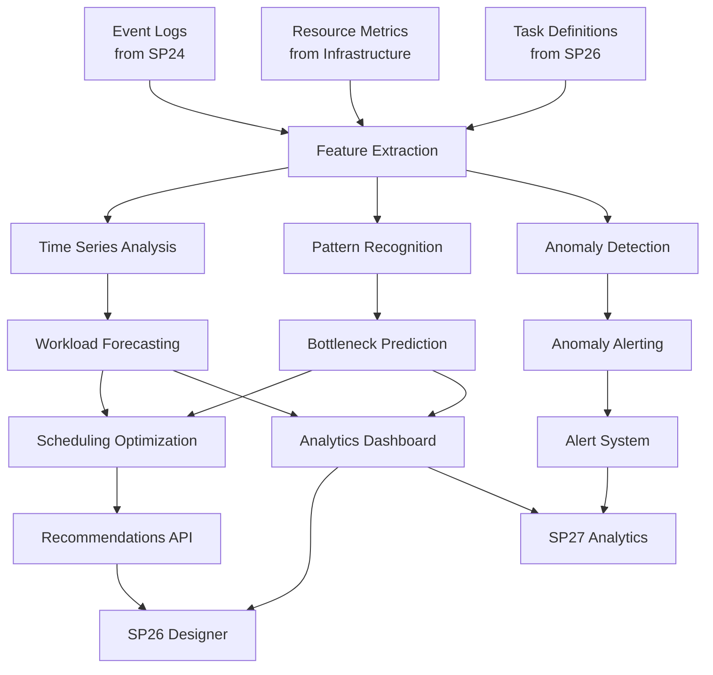

# SP25 - Forecasting & Predictive Scheduling Engine

## 1. Informazioni Generali

| Proprietà | Valore |
|---|---|
| **Numero SP** | SP25 |
| **Nome** | Forecasting & Predictive Scheduling Engine |
| **Caso d'Uso** | UC4 - BPM e Automazione Processi |
| **Categoria** | Core AI |
| **MS Primario** | **MS02** Generic Analyzer Engine |
| **MS Supporto** | **MS10** Generic Analytics & Reporting |
| **Status** | In Design |

## 2. Panoramica

**Scopo**: Prevedere carichi di lavoro futuri, identificare colli di bottiglia emergenti e suggerire ottimizzazioni di scheduling prima che i problemi si manifestino.



**Business Value**:
- **Proattività**: Identificare problemi prima che impattino gli SLA
- **Ottimizzazione risorse**: Allocare workload intelligentemente basato su previsioni
- **Miglioramento performance**: Ridurre attese e colli di bottiglia attraverso scheduling intelligente
- **Resilienza**: Piani di contingency basati su trend predittivi

## 3. Responsabilità Principali

1. **Forecasting Workload**
   - Previsione volumi task futuri (settimanale, mensile)
   - Trend detection e seasonality analysis
   - Anomaly detection nella domanda
   - Confidence intervals per predictions

2. **Bottleneck Prediction**
   - Identificazione probabilistica di risorse che diventeranno saturation
   - Predizione timing quando colli appariranno
   - Impact analysis su SLA e cycle time
   - Suggerimenti di mitigazione

3. **Intelligent Scheduling**
   - Raccomandazioni per distribuzione lavoro nel tempo
   - Task prioritization basato su urgenza + risorse
   - Load balancing ottimale tra worker/sistema
   - Scheduling vincoli (deadline, dipendenze, risorse)

4. **Capacity Planning**
   - Predizione fabbisogni risorse (CPU, memoria, parallel workers)
   - Scaling trigger recommendations
   - Cost optimization suggestions
   - Budget forecasting

## 4. Input/Output

### Input
| Nome | Tipo | Fonte | Formato | Note |
|---|---|---|---|---|
| **Event Logs** | Time-series data | SP24 Process Mining | JSON events with timestamps | Process execution events |
| **Task Definitions** | Configuration | SP26 Workflow Designer | BPMN + metadata | Task durations, dependencies, resources |
| **Resource Metrics** | Metrics | Infrastructure | Prometheus/Grafana | CPU, memory, worker availability |
| **Historical Patterns** | Statistical data | ClickHouse | Aggregated metrics | Trend data, seasonality, patterns |
| **Current State** | Real-time metrics | Process Monitor | Live KPI | Current queue length, processing rate |

### Output
| Nome | Tipo | Destinazione | Formato | Note |
|---|---|---|---|---|
| **Workload Forecast** | Predictions | SP26, SP27, Dashboard | JSON time-series | Predicted task volume per hour/day/week |
| **Bottleneck Alerts** | Predictions | SP27 Analytics, Alert System | JSON with severity | List of predicted bottlenecks with timing |
| **Scheduling Plan** | Recommendations | SP26 Designer, Workflow Engine | JSON plan | Suggested task distribution, load balancing |
| **Capacity Report** | Analytics | Dashboard, Planning | JSON report | Resource needs, scaling recommendations |
| **Confidence Metrics** | Quality metrics | Dashboard | JSON metrics | Model accuracy, prediction confidence |

## 5. Dipendenze

### Upstream (Cosa richiede)
```
SP24 (Process Mining) → SP25
  Data: Event logs, process discovery models
  Timing: Asincrono (batch daily)
  SLA: Dati disponibili entro 24h

SP26 (Workflow Designer) → SP25
  Data: BPMN models, task definitions
  Timing: Real-time subscription
  SLA: Model updates riflesse entro 1h

Infrastructure → SP25
  Data: Resource metrics (CPU, memory, load)
  Timing: Real-time (Prometheus scrape)
  SLA: Metrics freschi < 5min
```

### Downstream (Cosa fornisce)
```
SP25 → SP26 (Workflow Designer)
  Data: Scheduling recommendations, load predictions
  Timing: Asincrono (updated daily + on-demand)
  SLA: Recommendations disponibili entro 2h

SP25 → SP27 (Process Analytics)
  Data: Forecasts, bottleneck predictions, capacity plans
  Timing: Push-based (daily), Pull-based (on-demand)
  SLA: Data disponibile in real-time dashboard

SP25 → Alert System
  Data: Critical bottleneck alerts when prediction > threshold
  Timing: Real-time event stream
  SLA: Alert < 30 sec from prediction
```

## 6. Architettura Tecnica

### Componenti Core
```
SP25 Forecasting Engine
├── Data Ingestion Layer
│   ├── Event Log Processor (from SP24)
│   ├── Metrics Aggregator (from Prometheus)
│   └── Feature Engineering Pipeline
├── Model Layer
│   ├── Time Series Models (ARIMA, Prophet, LSTM)
│   ├── Anomaly Detection (Isolation Forest, Autoencoders)
│   ├── Clustering (K-means per pattern recognition)
│   └── Ensemble Methods (weighted voting)
├── Prediction Engine
│   ├── Workload Forecaster (short-term: 1-7 days)
│   ├── Bottleneck Predictor (medium-term: 1-4 weeks)
│   ├── Capacity Planner (long-term: 1-12 months)
│   └── Confidence Calculator
├── Recommendation Engine
│   ├── Scheduling Optimizer (task distribution)
│   ├── Resource Allocator (CPU/memory/workers)
│   ├── Scaling Suggester (horizontal/vertical)
│   └── Cost Optimizer
└── Output Layer
    ├── Dashboard Publisher
    ├── Alert Generator
    └── API Endpoint
```

### Data Flow Diagram


### Storage Layer
- **TimescaleDB**: Time-series storage per event logs, metrics
- **ClickHouse**: Analytics data warehouse per historical aggregates
- **Redis**: Cache per model predictions (TTL 1h)
- **MinIO**: Model artifacts, training datasets

## 7. Implementazione Tecnica

### Stack Tecnologico
| Componente | Tecnologia | Versione | Note |
|---|---|---|---|
| Language | Python | 3.11 | Core implementation |
| ML Framework | Scikit-learn + Custom | Latest | Classical ML models |
| Time Series | pmdarima, Prophet, TensorFlow | Latest | ARIMA, SARIMA, LSTM |
| API | FastAPI | 0.104+ | REST endpoints |
| Elaborazione Dati | Pandas + NumPy | Latest | Feature engineering |
| Database | TimescaleDB | 2.13+ | Time-series data |
| Analytics | ClickHouse | 23.x | Aggregated analytics |
| Cache | Redis | 7.2+ | Prediction caching |
| Orchestration | Airflow | 2.7+ | Scheduled training/prediction |
| Monitoring | Prometheus + Grafana | Latest | Metrics + dashboards |

### API Endpoints

**POST /api/v1/forecast/workload**
```http
{
  "forecast_horizon_days": 7,
  "granularity": "hourly",  # hourly, daily, weekly
  "process_id": "proc_123",
  "include_confidence": true
}

Response:
{
  "forecast": [
    {"timestamp": "2025-11-24T09:00:00Z", "predicted_volume": 250, "confidence_80": [200, 300]},
    ...
  ],
  "model_accuracy": 0.92,
  "last_training": "2025-11-17T15:00:00Z"
}
```

**POST /api/v1/predict/bottlenecks**
```http
{
  "process_id": "proc_123",
  "lookahead_days": 14,
  "threshold_utilization": 0.8
}

Response:
{
  "predictions": [
    {
      "resource": "worker_pool_1",
      "predicted_saturation_date": "2025-11-30T10:00:00Z",
      "severity": "high",
      "confidence": 0.85,
      "recommendations": ["scale_up_workers", "redistribute_load"]
    }
  ]
}
```

**POST /api/v1/optimize/scheduling**
```http
{
  "process_id": "proc_123",
  "optimization_goal": "minimize_latency",  # or "balance_load", "cost_optimize"
  "constraints": {
    "max_workers": 10,
    "max_cost_per_day": 500
  }
}

Response:
{
  "schedule_plan": {
    "recommended_worker_count": 8,
    "task_distribution": [...],
    "estimated_cycle_time": "2.5 hours",
    "expected_cost": 350,
    "improvement_vs_current": "15%"
  }
}
```

### Database Schema
```sql
-- Workload forecasts
CREATE TABLE workload_forecasts (
  id SERIAL PRIMARY KEY,
  process_id VARCHAR(255),
  forecast_timestamp TIMESTAMPTZ,
  horizon_start TIMESTAMPTZ,
  horizon_end TIMESTAMPTZ,
  predicted_volume FLOAT,
  confidence_80_low FLOAT,
  confidence_80_high FLOAT,
  model_version VARCHAR(50),
  accuracy FLOAT,
  created_at TIMESTAMPTZ DEFAULT NOW(),
  INDEX idx_process_forecast (process_id, forecast_timestamp DESC)
);

-- Bottleneck predictions
CREATE TABLE bottleneck_predictions (
  id SERIAL PRIMARY KEY,
  process_id VARCHAR(255),
  resource_name VARCHAR(255),
  prediction_timestamp TIMESTAMPTZ,
  predicted_saturation_date TIMESTAMPTZ,
  severity VARCHAR(20),  -- low, medium, high, critical
  confidence FLOAT,
  recommendations JSONB,
  created_at TIMESTAMPTZ DEFAULT NOW(),
  INDEX idx_resource_prediction (resource_name, prediction_timestamp DESC)
);

-- Model training metadata
CREATE TABLE model_training_logs (
  id SERIAL PRIMARY KEY,
  model_type VARCHAR(50),  -- arima, prophet, lstm, ensemble
  process_id VARCHAR(255),
  training_start TIMESTAMPTZ,
  training_end TIMESTAMPTZ,
  dataset_size INT,
  accuracy FLOAT,
  parameters JSONB,
  status VARCHAR(20),  -- success, failed
  created_at TIMESTAMPTZ DEFAULT NOW()
);
```

### Configuration
```yaml
sp25:
  models:
    primary: "ensemble"  # ensemble of multiple models
    available:
      - arima
      - prophet
      - lstm
      - isolation_forest
    ensemble_weights:
      arima: 0.3
      prophet: 0.3
      lstm: 0.2
      isolation_forest: 0.2  # for anomaly detection

  forecasting:
    horizons:
      short_term: 7  # days
      medium_term: 30
      long_term: 365
    min_history_days: 60
    confidence_levels: [80, 95]

  bottleneck_detection:
    utilization_threshold: 0.8
    prediction_horizon_days: 14
    min_confidence: 0.7

  scheduling:
    optimization_goals: ["minimize_latency", "balance_load", "cost_optimize"]
    constraint_types: ["max_workers", "max_cost", "deadline"]

  caching:
    forecast_ttl_hours: 1
    prediction_ttl_hours: 2

  training:
    frequency: "daily"  # or "weekly"
    max_training_hours: 2
    auto_retrain_on_accuracy_drop: true
    accuracy_threshold: 0.85
```

## 8. Performance & Scalability

### Target KPIs
| Metrica | Target | Note |
|---|---|---|
| **Forecast Latency** | < 2 sec | For UI dashboard |
| **Bottleneck Prediction** | < 5 sec | Query response |
| **Model Training** | < 2 hours | Daily batch |
| **Forecast Accuracy** | > 85% | MAPE < 15% |
| **Availability** | 99.5% | SLA for prediction API |
| **Throughput** | 1000 pred/sec | Concurrent requests |

### Scaling Strategy
- **Horizontal**: Multiple forecast instances behind load balancer
- **Vertical**: GPU for LSTM model training
- **Caching**: Redis for frequently accessed predictions
- **Async**: Airflow for scheduled training jobs

## 9. Security & Compliance

### Data Protection
- **At Rest**: Encrypted PostgreSQL/TimescaleDB
- **In Transit**: TLS 1.3 for API
- **PII**: No PII in predictions (only process metrics)
- **Audit**: All predictions logged with lineage

### Controllo Accesso
- **Authentication**: JWT token
- **Authorization**: RBAC (only process owners can see their forecasts)
- **API Rate Limiting**: 100 req/min per user

## 10. Monitoring & Alerting

### Prometheus Metrics
```
sp25_forecast_latency_seconds{process_id}
sp25_model_accuracy{model_type}
sp25_bottleneck_predictions_total{severity}
sp25_training_duration_seconds
sp25_cache_hit_ratio
sp25_api_requests_total{endpoint, status}
```

### Alerts
- Model accuracy < 80% → Page on-call
- Forecast latency > 5s → Warning
- Training failure → Critical
- Cache hit ratio < 70% → Investigate

## 11. Dipendenze Critiche

### Process Flow
```
SP24 (Event Logs)
  ↓
SP25 (Forecasting) ← Metrics from Infrastructure
  ↓
SP26 (Recommendations) → Workflow Designer
  ↓
SP27 (Analytics) → Dashboard
```

### Single Point of Failure
- **TimescaleDB downtime**: Predictions fail
  - **Mitigazione**: Read replica, fallback cache

- **Model training failure**: Stale predictions
  - **Mitigazione**: Keep previous model, alert + manual review

## 12. Testing Strategy

### Unit Tests
- Individual forecast models (ARIMA, Prophet)
- Feature engineering functions
- Recommendation engine logic
- Coverage target: > 85%

### Integration Tests
- Data pipeline from SP24 to SP25
- API endpoint tests
- Model retraining workflow
- Database operations

### E2E Tests
- Full forecast pipeline with mock data
- Bottleneck detection accuracy
- Scheduling recommendations correctness
- Performance under load

## 13. Roadmap & Evoluzione

### Current Version (v1.0)
- Baseline forecasting with multiple models
- Simple bottleneck detection
- Basic scheduling recommendations

### v1.1 (Q1 2026)
- Integration con SP24 event logs
- Custom models per process pattern
- Real-time forecast updates

### v2.0 (Q2 2026)
- Multi-step lookahead (cascading predictions)
- Causal forecasting (impact analysis)
- Federated learning for privacy-preserving models

## 14. Operational Runbook

### Startup Checklist
- [ ] Database connectivity
- [ ] Model weights loaded
- [ ] Metrics collection working
- [ ] API health check passing
- [ ] Cache initialized

### Common Issues
| Problema | Sintomo | Soluzione |
|---|---|---|
| Low Accuracy | MAPE > 15% | Retrain with new data, check for anomalies |
| High Latency | p99 > 5s | Check TimescaleDB load, add caching |
| Model Stale | Predictions outdated | Trigger manual retraining |
## 🏛️ Conformità Normativa - SP25

### 1. Quadro Normativo di Riferimento

**Framework applicabili a SP25 (Predictive Planning)**:
- **CAD** (Codice Amministrazione Digitale): Art. 1, 13, 21-22, 62

**UC di Appartenenza**: UC4

---

### 2. Conformità CAD

**Applicabilità**: OBBLIGATORIO per tutti gli SP - SP25 è parte della trasformazione digitale PA

**Articoli CAD Principali**:
- Art. 1: Principi digitalizzazione
- Art. 13: Fascicolo informatico
- Art. 21-22: Documento informatico e conservazione
- Art. 62: Interoperabilità via API
- Art. 71: Accessibilità

**Responsabile**: CTO + Compliance Team (audit trimestrale)

---

### 6. Monitoraggio Conformità

**Schedule di Review**:
- **Trimestrale**: Compliance assessment + security audit
- **Semestrale**: Framework alignment review (CAD/GDPR/eIDAS/AGID)
- **Annuale**: Full compliance audit + risk assessment

**KPI Conformità**:
- Audit trail completeness: 100%
- Incident response time: <24h
- Compliance violations: 0 per quarter
- Certificate expiry (if eIDAS): Alert at 30 days

**Escalation**: Non-conformità → Compliance Manager → CTO → Legal

**Prossima review programmata**: 2026-02-17

---

## Riepilogo Conformità SP25

**Status**: ✅ COMPLIANT

| Framework | Applicabile | Status | Responsabile |
|-----------|-----------|--------|-------------|
| CAD | ✅ Sì | ✅ Compliant | CTO |
| GDPR | ❌ No | N/A | - |
| eIDAS | ❌ No | N/A | - |
| AGID | ❌ No | N/A | - |

**Key Compliance Points**:
1. All CAD articles implemented
2. Data handling compliant with applicable regulations
3. Security controls in place (encryption, access control, audit logging)
4. Regular monitoring and review schedule established
5. Clear responsibility assignments (RACI)

**Prossima Review**: 2026-02-17

---


### Framework Normativi Applicabili

☑ CAD
☑ GDPR
☐ L. 241/1990 - Procedimento Amministrativo
☐ eIDAS - Regolamento 2014/910
☐ AI Act - Regolamento 2024/1689
☐ D.Lgs 42/2004 - Codice Beni Culturali
☐ D.Lgs 152/2006 - Codice dell'Ambiente
☐ D.Lgs 33/2013 - Decreto Trasparenza

**Per mappatura completa articoli → implementazioni**, vedi [Conformità Normativa Standard Template](../../templates/conformita-normativa-standard.md) e [COMPLIANCE-MATRIX.md](../../COMPLIANCE-MATRIX.md).

### Requisiti Principali Implementati

| Framework | Requisiti Principali | Status | Riferimenti |
|-----------|-------------------|--------|-------------|
| CAD | Art. 1, Art. 21, Art. 22, Art. 62 | ✅ Implementato | [Dettagli](../../templates/conformita-normativa-standard.md) |
| GDPR | Art. 5, Art. 32 | ✅ Implementato | [Dettagli](../../templates/conformita-normativa-standard.md) |

### Conformità Normativa - Checklist

- [ ] Tutti i framework normativi applicabili identificati
- [ ] Articoli rilevanti mappati alle responsabilità SP
- [ ] GDPR: Data protection by design implementato (se applicabile)
- [ ] eIDAS: Firma digitale supportata (se applicabile)
- [ ] AI Act: Supervisione umana e trasparenza (se applicabile)
- [ ] Tracciabilità audit completa mantenuta
- [ ] Documentation conformità aggiornata

**Nota**: Dettagli di conformità completi nella sezione "## 🏛️ Conformità Normativa - SP25

### 1. Quadro Normativo di Riferimento

**Framework applicabili a SP25 (Predictive Planning)**:
- **CAD** (Codice Amministrazione Digitale): Art. 1, 13, 21-22, 62

**UC di Appartenenza**: UC4

---

### 2. Conformità CAD

**Applicabilità**: OBBLIGATORIO per tutti gli SP - SP25 è parte della trasformazione digitale PA

**Articoli CAD Principali**:
- Art. 1: Principi digitalizzazione
- Art. 13: Fascicolo informatico
- Art. 21-22: Documento informatico e conservazione
- Art. 62: Interoperabilità via API
- Art. 71: Accessibilità

**Responsabile**: CTO + Compliance Team (audit trimestrale)

---

### 6. Monitoraggio Conformità

**Schedule di Review**:
- **Trimestrale**: Compliance assessment + security audit
- **Semestrale**: Framework alignment review (CAD/GDPR/eIDAS/AGID)
- **Annuale**: Full compliance audit + risk assessment

**KPI Conformità**:
- Audit trail completeness: 100%
- Incident response time: <24h
- Compliance violations: 0 per quarter
- Certificate expiry (if eIDAS): Alert at 30 days

**Escalation**: Non-conformità → Compliance Manager → CTO → Legal

**Prossima review programmata**: 2026-02-17

---

## Riepilogo Conformità SP25

**Status**: ✅ COMPLIANT

| Framework | Applicabile | Status | Responsabile |
|-----------|-----------|--------|-------------|
| CAD | ✅ Sì | ✅ Compliant | CTO |
| GDPR | ❌ No | N/A | - |
| eIDAS | ❌ No | N/A | - |
| AGID | ❌ No | N/A | - |

**Key Compliance Points**:
1. All CAD articles implemented
2. Data handling compliant with applicable regulations
3. Security controls in place (encryption, access control, audit logging)
4. Regular monitoring and review schedule established
5. Clear responsibility assignments (RACI)

**Prossima Review**: 2026-02-17

---


---


## 15. Documentazione Correlata

- [SP-MS-MAPPING-MASTER.md](../../SP-MS-MAPPING-MASTER.md) - Full mapping
- [UC4 - BPM](../../README.md) - Parent use case overview
- [SP24 - Process Mining](./01 SP24 - Motore Process Mining.md) - Upstream data source
- [SP26 - Workflow Designer](./01 SP26 - Progettista Workflow Intelligente.md) - Consumer
- [SP27 - Process Analytics](./01 SP27 - Analitiche Processi.md) - Consumer
- [MS02 - Analyzer](../../microservices/MS02-ANALYZER/README.md) - Primary MS
- [MS10 - Logger](../../microservices/MS10-LOGGER/README.md) - Support MS

