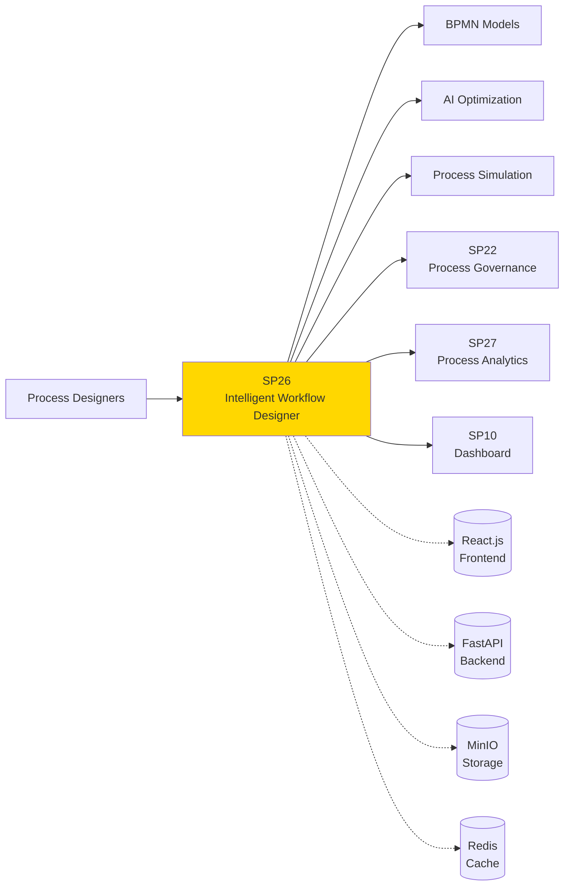
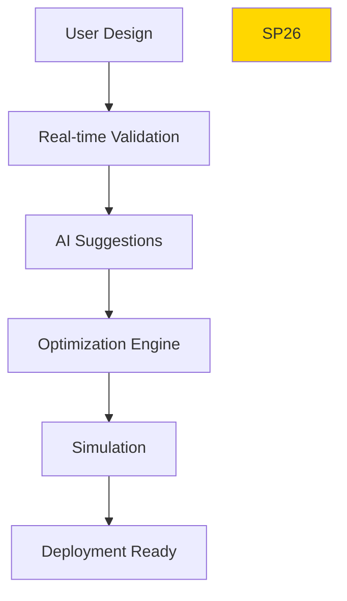

# SP26 - Intelligent Workflow Designer

## Panoramica

**SP26 - Intelligent Workflow Designer** fornisce un'interfaccia visuale drag-and-drop per la creazione e modifica di workflow BPMN, con funzionalità AI-assisted per ottimizzazione automatica e suggerimenti intelligenti.



## Responsabilità

### Core Functions

1. **Visual Design**
   - Interfaccia drag-and-drop BPMN
   - Template library processi
   - Real-time validation modelli

2. **AI-Assisted Design**
   - Suggerimenti ottimizzazione automatici
   - Best practice recommendations
   - Pattern recognition da processi esistenti

3. **Process Simulation**
   - Testing workflow prima deployment
   - Performance prediction
   - Bottleneck identification

4. **Version Management**
   - Version control processi
   - Change tracking e diff
   - Rollback capabilities
## 🏛️ Conformità Normativa

### Framework Normativi Applicabili

☑ CAD
☑ GDPR
☐ L. 241/1990 - Procedimento Amministrativo
☐ eIDAS - Regolamento 2014/910
☐ AI Act - Regolamento 2024/1689
☐ D.Lgs 42/2004 - Codice Beni Culturali
☐ D.Lgs 152/2006 - Codice dell'Ambiente
☐ D.Lgs 33/2013 - Decreto Trasparenza

**Per mappatura completa articoli → implementazioni**, vedi [Conformità Normativa Standard Template](../../templates/conformita-normativa-standard.md) e [COMPLIANCE-MATRIX.md](../../COMPLIANCE-MATRIX.md).

### Requisiti Principali Implementati

| Framework | Requisiti Principali | Status | Riferimenti |
|-----------|-------------------|--------|-------------|
| CAD | Art. 1, Art. 21, Art. 22, Art. 62 | ✅ Implementato | [Dettagli](../../templates/conformita-normativa-standard.md) |
| GDPR | Art. 5, Art. 32 | ✅ Implementato | [Dettagli](../../templates/conformita-normativa-standard.md) |

### Conformità Normativa - Checklist

- [ ] Tutti i framework normativi applicabili identificati
- [ ] Articoli rilevanti mappati alle responsabilità SP
- [ ] GDPR: Data protection by design implementato (se applicabile)
- [ ] eIDAS: Firma digitale supportata (se applicabile)
- [ ] AI Act: Supervisione umana e trasparenza (se applicabile)
- [ ] Tracciabilità audit completa mantenuta
- [ ] Documentation conformità aggiornata

**Nota**: Dettagli di conformità completi nella sezione "## 🏛️ Conformità Normativa" del template standard.

---


## Architettura Tecnica

### Design Pipeline



### Tecnologie Utilizzate

| Componente | Tecnologia | Versione | Scopo |
|------------|------------|----------|--------|
| Frontend | React.js | 18.2 | UI components |
| BPMN Editor | bpmn-js | 16.0 | Visual modeling |
| Backend | FastAPI | 0.104 | API services |
| AI Engine | TensorFlow | 2.14 | ML optimization |
| Storage | MinIO | 2023 | Model storage |
| Cache | Redis | 7.2 | Session cache |

### AI Optimization Features

#### Pattern Recognition
```
Input: BPMN model + historical data
Output: Suggested improvements
Algorithm: Graph neural networks
Accuracy: >85% rilevanza suggerimenti
```

#### Performance Prediction
```
Input: Process model + resource data
Output: Performance metrics prediction
Algorithm: Simulation + ML regression
Accuracy: >90% prediction accuracy
```

### API Endpoints

```yaml
POST /api/v1/designer/processes
  - Input: {
      "name": "Order Processing",
      "bpmn_xml": "<bpmn...>",
      "metadata": {
        "category": "operational",
        "owner": "procurement_team"
      }
    }
  - Output: {
      "process_id": "proc_123",
      "version": "1.0",
      "validation_status": "valid"
    }

POST /api/v1/designer/optimize
  - Input: {
      "process_id": "proc_123",
      "optimization_goals": ["efficiency", "cost", "quality"],
      "constraints": {"max_cost": 1000, "min_quality": 0.9}
    }
  - Output: {
      "optimized_bpmn": "<bpmn...>",
      "improvements": [
        {"type": "parallel_execution", "benefit": "30% faster"},
        {"type": "resource_reallocation", "benefit": "15% cost reduction"}
      ]
    }

POST /api/v1/designer/simulate
  - Input: {
      "process_id": "proc_123",
      "simulation_parameters": {
        "instances": 1000,
        "resources": {"reviewers": 5, "approvers": 2}
      }
    }
  - Output: {
      "results": {
        "avg_cycle_time": "4.2h",
        "bottlenecks": ["approval_step"],
        "resource_utilization": {"reviewers": 0.85}
      }
    }

GET /api/v1/designer/templates
  - Query: ?category=administrative&limit=10
  - Output: {
      "templates": [
        {"id": "temp_1", "name": "Document Approval", "bpmn_xml": "..."}
      ]
    }
```

### Configurazione

```yaml
sp26:
  frontend_url: 'http://designer.example.com'
  backend_url: 'http://api:8000'
  minio_endpoint: 'minio:9000'
  redis_url: 'redis://cache:6379'
  ai_engine:
    model_path: '/models/optimization_model'
    confidence_threshold: 0.8
  simulation:
    max_instances: 10000
    timeout: '5m'
  templates_bucket: 'process-templates'
```

### Performance Metrics

- **Design Responsiveness**: <100ms per action
- **AI Suggestion Latency**: <2s per optimization
- **Simulation Speed**: 1000 instances/second
- **Concurrent Users**: 50+ designers simultanei

### Sicurezza

- **Model Encryption**: Crittografia modelli BPMN
- **Access Control**: RBAC per design operations
- **Version Audit**: Complete audit trail modifiche
- **Template Security**: Validazione sicurezza template

### Evoluzione

1. **Collaborative Design**: Real-time multi-user editing
2. **Voice Commands**: Natural language process design
3. **AR/VR Design**: Immersive process modeling</content>
<parameter name="filePath">/Users/giangio/Documents/GitHub/Interzen/Interzen.POC/ZenIA/docs/use_cases/UC4 - BPM e Automazione Processi/01 SP26 - Intelligent Workflow Designer.md