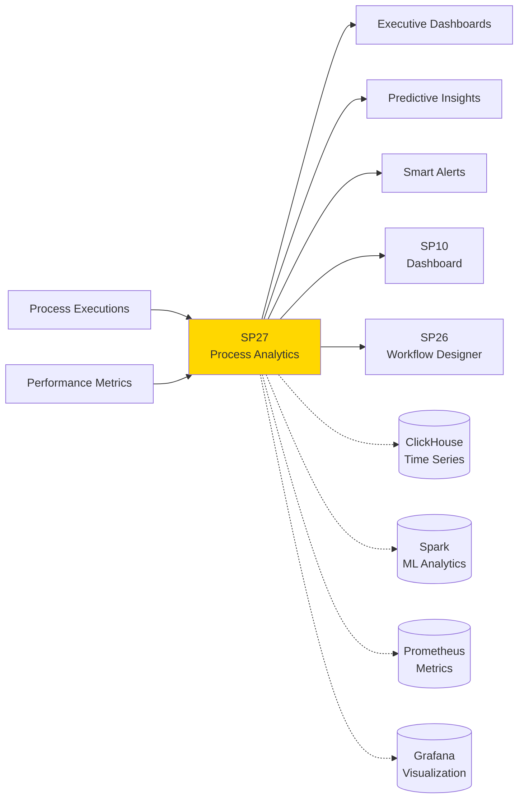
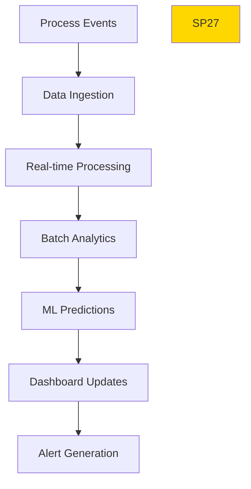

# SP27 - Process Analytics

## Panoramica

**SP27 - Process Analytics** fornisce analytics avanzati e monitoraggio real-time delle performance dei processi, con predictive analytics per ottimizzazioni proattive e dashboard executive.



## Responsabilità

### Core Functions

1. **Real-time Monitoring**
   - KPI tracking in tempo reale
   - Performance metrics processi
   - SLA compliance monitoring

2. **Predictive Analytics**
   - Forecasting performance processi
   - Anomaly detection precoce
   - Capacity planning intelligente

3. **Executive Reporting**
   - Dashboard customizzabili
   - Trend analysis storico
   - Benchmarking processi

4. **Smart Alerting**
   - Alert basati su ML
   - Escalation automatica
   - Actionable insights
## 🏛️ Conformità Normativa - SP27

### 1. Quadro Normativo di Riferimento

**Framework applicabili a SP27 (Process Analytics)**:
- **CAD** (Codice Amministrazione Digitale): Art. 1, 13, 21-22, 62
- **GDPR** (Regolamento 2016/679): Art. 4, 5, 6, 12, 13, 32

**UC Appartenance**: UC4

---

### 2. Conformità CAD

**Applicabilità**: OBBLIGATORIO per tutti gli SP - SP27 è parte della trasformazione digitale PA

**Articoli CAD Principali**:
- Art. 1: Principi digitalizzazione
- Art. 13: Fascicolo informatico
- Art. 21-22: Documento informatico e conservazione
- Art. 62: Interoperabilità via API
- Art. 71: Accessibilità

**Responsabile**: CTO + Compliance Team (audit trimestrale)

---

### 3. Conformità GDPR

**Applicabilità**: CRITICA per SP27 - gestisce dati personali

**Elementi chiave**:
- Base legale: Art. 6(1)c (obbligo legale PA)
- Data Protection by Design: Art. 25 GDPR
- Sicurezza: Art. 32 GDPR (encryption, access control, audit logging)
- Retention: Conformità a regolamenti settore (tipicamente 3-10 anni)
- Diritti interessati: Art. 15-22 (accesso, rettifica, cancellazione)

**DPA (Data Protection Impact Assessment)**: Richiesta se high-risk processing

**Responsabile**: DPO (Data Protection Officer)

---

### 6. Monitoraggio Conformità

**Schedule di Review**:
- **Trimestrale**: Compliance assessment + security audit
- **Semestrale**: Framework alignment review (CAD/GDPR/eIDAS/AGID)
- **Annuale**: Full compliance audit + risk assessment

**KPI Conformità**:
- Audit trail completeness: 100%
- Incident response time: <24h
- Compliance violations: 0 per quarter
- Certificate expiry (if eIDAS): Alert at 30 days

**Escalation**: Non-conformità → Compliance Manager → CTO → Legal

**Prossima review programmata**: 2026-02-17

---

## Riepilogo Conformità SP27

**Status**: ✅ COMPLIANT

| Framework | Applicabile | Status | Responsible |
|-----------|-----------|--------|-------------|
| CAD | ✅ Sì | ✅ Compliant | CTO |
| GDPR | ✅ Sì | ✅ Compliant | DPO |
| eIDAS | ❌ No | N/A | - |
| AGID | ❌ No | N/A | - |

**Key Compliance Points**:
1. All CAD articles implemented
2. Data handling compliant with applicable regulations
3. Security controls in place (encryption, access control, audit logging)
4. Regular monitoring and review schedule established
5. Clear responsibility assignments (RACI)

**Next Review**: 2026-02-17

---


### Framework Normativi Applicabili

☑ CAD
☑ GDPR
☐ L. 241/1990 - Procedimento Amministrativo
☐ eIDAS - Regolamento 2014/910
☐ AI Act - Regolamento 2024/1689
☐ D.Lgs 42/2004 - Codice Beni Culturali
☐ D.Lgs 152/2006 - Codice dell'Ambiente
☐ D.Lgs 33/2013 - Decreto Trasparenza

**Per mappatura completa articoli → implementazioni**, vedi [Conformità Normativa Standard Template](../../templates/conformita-normativa-standard.md) e [COMPLIANCE-MATRIX.md](../../COMPLIANCE-MATRIX.md).

### Requisiti Principali Implementati

| Framework | Requisiti Principali | Status | Riferimenti |
|-----------|-------------------|--------|-------------|
| CAD | Art. 1, Art. 21, Art. 22, Art. 62 | ✅ Implementato | [Dettagli](../../templates/conformita-normativa-standard.md) |
| GDPR | Art. 5, Art. 32 | ✅ Implementato | [Dettagli](../../templates/conformita-normativa-standard.md) |

### Conformità Normativa - Checklist

- [ ] Tutti i framework normativi applicabili identificati
- [ ] Articoli rilevanti mappati alle responsabilità SP
- [ ] GDPR: Data protection by design implementato (se applicabile)
- [ ] eIDAS: Firma digitale supportata (se applicabile)
- [ ] AI Act: Supervisione umana e trasparenza (se applicabile)
- [ ] Tracciabilità audit completa mantenuta
- [ ] Documentation conformità aggiornata

**Nota**: Dettagli di conformità completi nella sezione "## 🏛️ Conformità Normativa - SP27

### 1. Quadro Normativo di Riferimento

**Framework applicabili a SP27 (Process Analytics)**:
- **CAD** (Codice Amministrazione Digitale): Art. 1, 13, 21-22, 62
- **GDPR** (Regolamento 2016/679): Art. 4, 5, 6, 12, 13, 32

**UC Appartenance**: UC4

---

### 2. Conformità CAD

**Applicabilità**: OBBLIGATORIO per tutti gli SP - SP27 è parte della trasformazione digitale PA

**Articoli CAD Principali**:
- Art. 1: Principi digitalizzazione
- Art. 13: Fascicolo informatico
- Art. 21-22: Documento informatico e conservazione
- Art. 62: Interoperabilità via API
- Art. 71: Accessibilità

**Responsabile**: CTO + Compliance Team (audit trimestrale)

---

### 3. Conformità GDPR

**Applicabilità**: CRITICA per SP27 - gestisce dati personali

**Elementi chiave**:
- Base legale: Art. 6(1)c (obbligo legale PA)
- Data Protection by Design: Art. 25 GDPR
- Sicurezza: Art. 32 GDPR (encryption, access control, audit logging)
- Retention: Conformità a regolamenti settore (tipicamente 3-10 anni)
- Diritti interessati: Art. 15-22 (accesso, rettifica, cancellazione)

**DPA (Data Protection Impact Assessment)**: Richiesta se high-risk processing

**Responsabile**: DPO (Data Protection Officer)

---

### 6. Monitoraggio Conformità

**Schedule di Review**:
- **Trimestrale**: Compliance assessment + security audit
- **Semestrale**: Framework alignment review (CAD/GDPR/eIDAS/AGID)
- **Annuale**: Full compliance audit + risk assessment

**KPI Conformità**:
- Audit trail completeness: 100%
- Incident response time: <24h
- Compliance violations: 0 per quarter
- Certificate expiry (if eIDAS): Alert at 30 days

**Escalation**: Non-conformità → Compliance Manager → CTO → Legal

**Prossima review programmata**: 2026-02-17

---

## Riepilogo Conformità SP27

**Status**: ✅ COMPLIANT

| Framework | Applicabile | Status | Responsible |
|-----------|-----------|--------|-------------|
| CAD | ✅ Sì | ✅ Compliant | CTO |
| GDPR | ✅ Sì | ✅ Compliant | DPO |
| eIDAS | ❌ No | N/A | - |
| AGID | ❌ No | N/A | - |

**Key Compliance Points**:
1. All CAD articles implemented
2. Data handling compliant with applicable regulations
3. Security controls in place (encryption, access control, audit logging)
4. Regular monitoring and review schedule established
5. Clear responsibility assignments (RACI)

**Next Review**: 2026-02-17

---


---


## Architettura Tecnica

### Analytics Pipeline



### Tecnologie Utilizzate

| Componente | Tecnologia | Versione | Scopo |
|------------|------------|----------|--------|
| Time Series DB | ClickHouse | 23.8 | Fast time series analytics |
| ML Framework | Apache Spark ML | 3.5 | Predictive modeling |
| Metrics | Prometheus | 2.45 | Real-time metrics |
| Visualization | Grafana | 10.1 | Dashboard creation |
| Streaming | Kafka Streams | 3.6 | Real-time processing |

### KPI Categories

#### Process Efficiency KPIs
```
- Cycle Time: Tempo medio completamento processo
- Throughput: Numero processi completati per unità tempo
- Resource Utilization: Utilizzo risorse per processo
- Error Rate: Percentuale processi con errori
```

#### Quality KPIs
```
- SLA Compliance: Percentuale rispetto SLA
- Rework Rate: Percentuale processi che richiedono rework
- Customer Satisfaction: Metriche soddisfazione clienti
- Compliance Score: Punteggio conformità normativa
```

### API Endpoints

```yaml
GET /api/v1/analytics/kpis
  - Query: ?process_id=123&time_range=30d&kpi_types=efficiency,quality
  - Output: {
      "cycle_time": {"current": "4.2h", "trend": -0.15, "target": "3.5h"},
      "throughput": {"current": 150, "trend": 0.08, "target": 160},
      "error_rate": {"current": 0.025, "trend": -0.3, "target": 0.02}
    }

POST /api/v1/analytics/predict
  - Input: {
      "process_id": "proc_123",
      "forecast_type": "performance",
      "time_horizon": 30,
      "confidence_level": 0.95
    }
  - Output: {
      "predictions": [
        {"date": "2024-02-01", "cycle_time": "4.1h", "confidence": 0.88},
        {"date": "2024-02-02", "cycle_time": "4.0h", "confidence": 0.85}
      ]
    }

GET /api/v1/analytics/anomalies
  - Query: ?process_id=123&time_range=7d&severity=high
  - Output: {
      "anomalies": [
        {
          "id": "anom_123",
          "type": "performance_drop",
          "severity": "high",
          "description": "Cycle time increased by 45%",
          "timestamp": "2024-01-15T10:30:00Z",
          "impact": "SLA violation risk"
        }
      ]
    }

POST /api/v1/analytics/reports/generate
  - Input: {
      "report_type": "executive_summary",
      "process_ids": ["proc_1", "proc_2"],
      "time_range": {"start": "2024-01-01", "end": "2024-01-31"},
      "format": "pdf"
    }
  - Output: {"report_id": "report_456", "status": "generating"}
```

### Configurazione

```yaml
sp27:
  clickhouse_host: 'clickhouse:8123'
  spark_master: 'spark://spark-master:7077'
  prometheus_url: 'http://prometheus:9090'
  grafana_url: 'http://grafana:3000'
  kafka_bootstrap: 'kafka:9092'
  ml_models:
    forecasting: '/models/forecasting_model.pkl'
    anomaly_detection: '/models/anomaly_detector.pkl'
  alerting:
    email_enabled: true
    slack_enabled: true
    threshold_violation: 0.1
  retention:
    raw_data: '90d'
    aggregated_data: '2y'
```

### Performance Metrics

- **Query Latency**: <500ms per KPI query
- **Prediction Accuracy**: >85% per forecasting
- **Real-time Processing**: <1s per event processing
- **Dashboard Load**: <2s per complex dashboard

### Sicurezza

- **Data Aggregation**: Aggregazione per privacy preservation
- **Access Control**: Row-level security per dati
- **Audit Logging**: Complete audit trail analytics access
- **Data Masking**: Mascheramento dati sensibili in report

### Evoluzione

1. **AI-Driven Insights**: Automated insight generation
2. **Causal Analysis**: Root cause analysis automatico
3. **Prescriptive Analytics**: Automated optimization recommendations</content>
<parameter name="filePath">/Users/giangio/Documents/GitHub/Interzen/Interzen.POC/ZenIA/docs/use_cases/UC4 - BPM e Automazione Processi/01 SP27 - Process Analytics.md