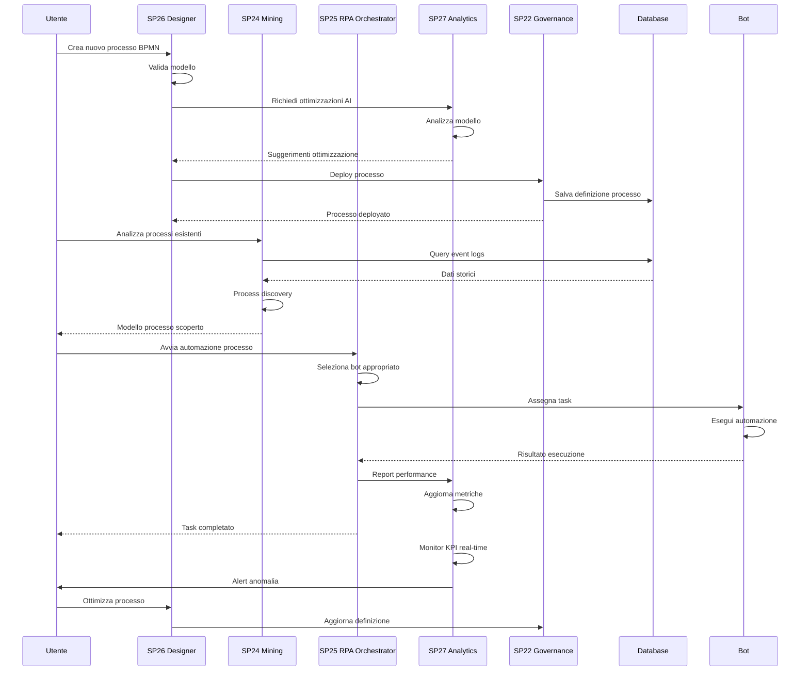
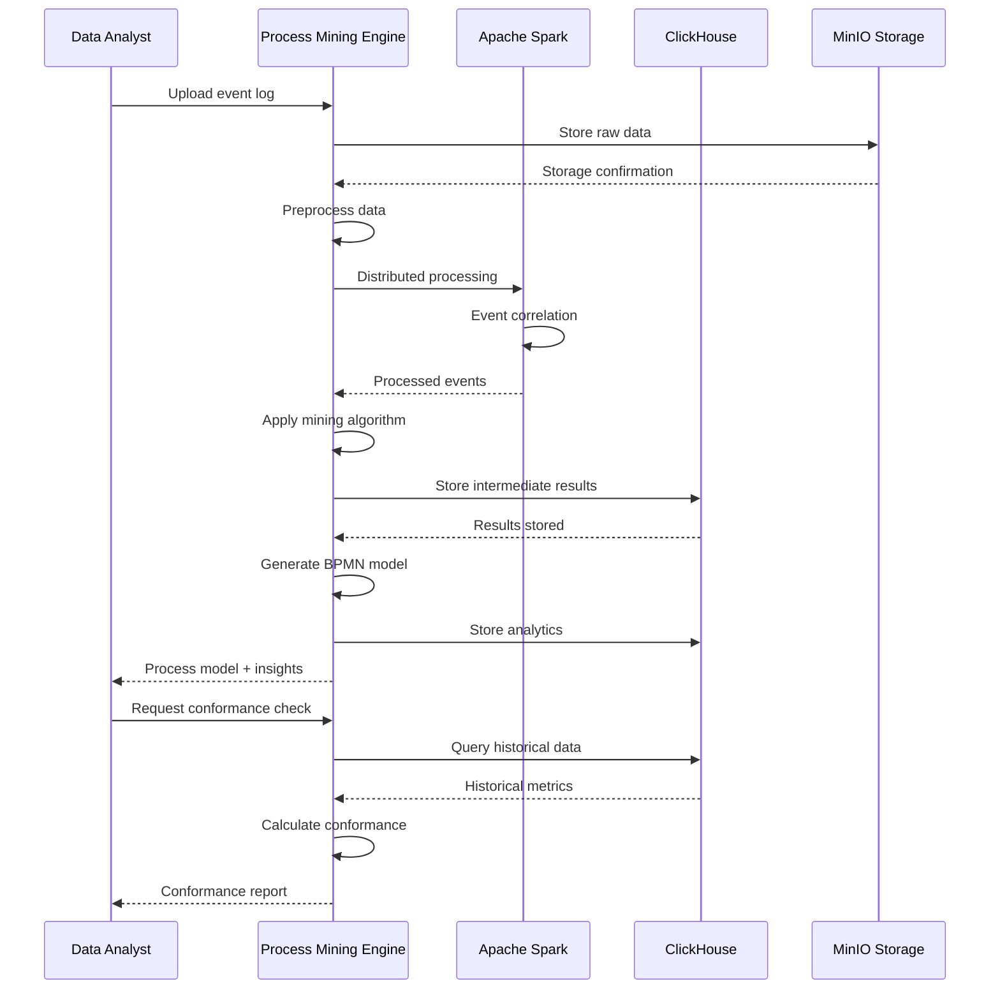
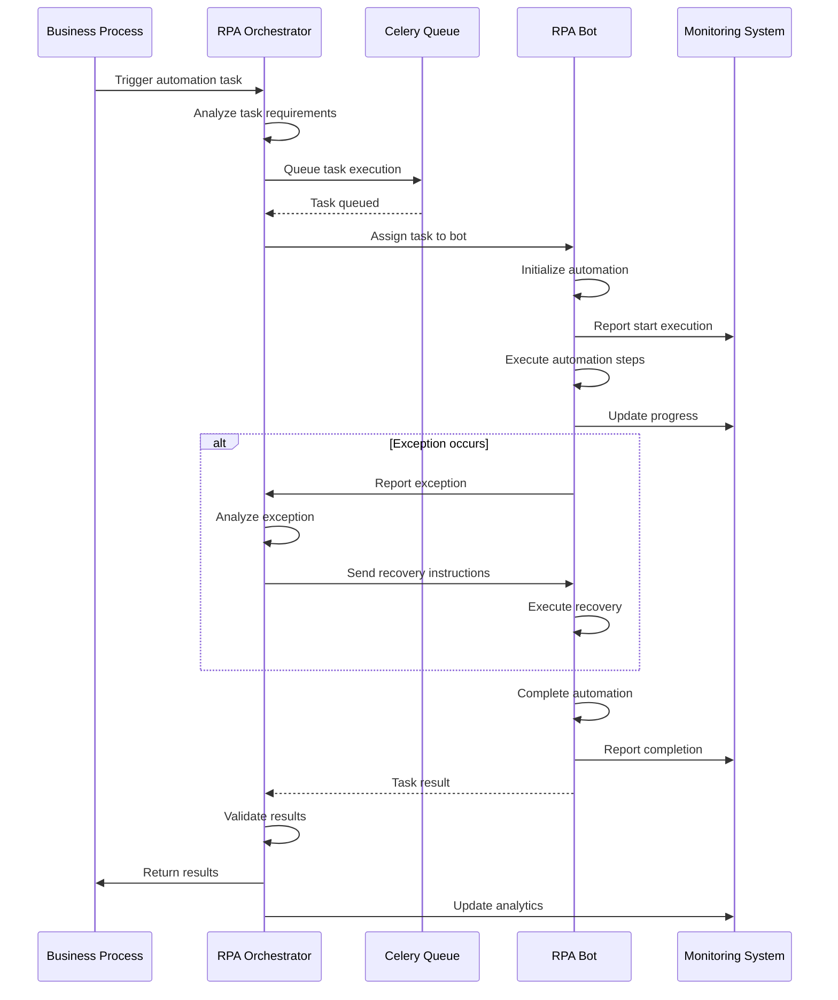
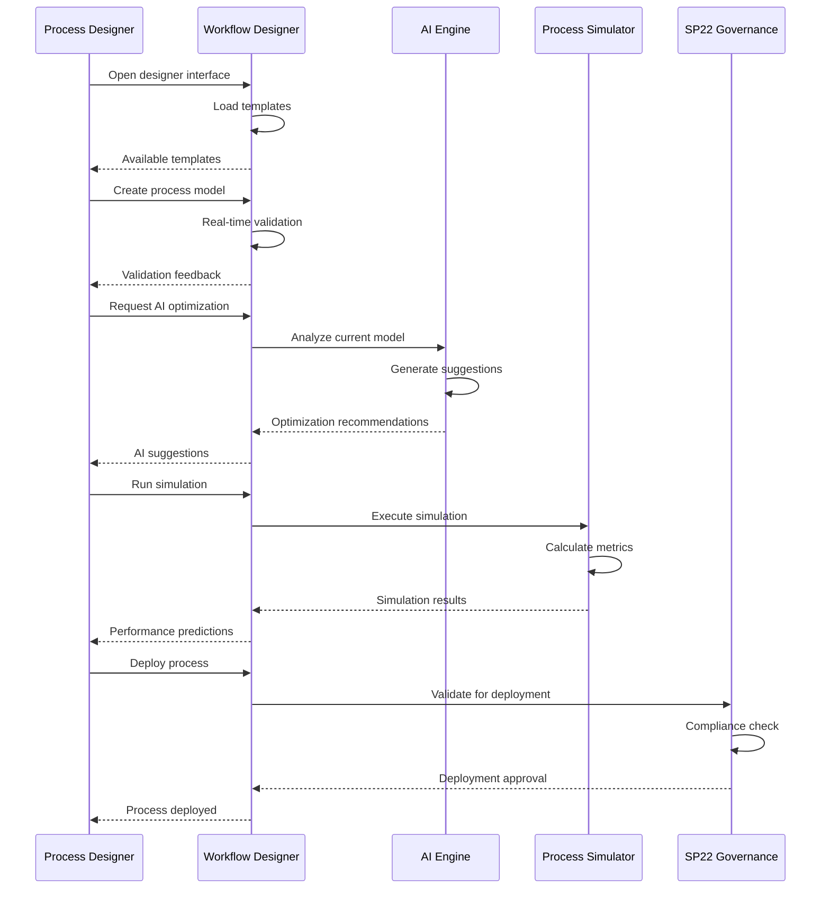
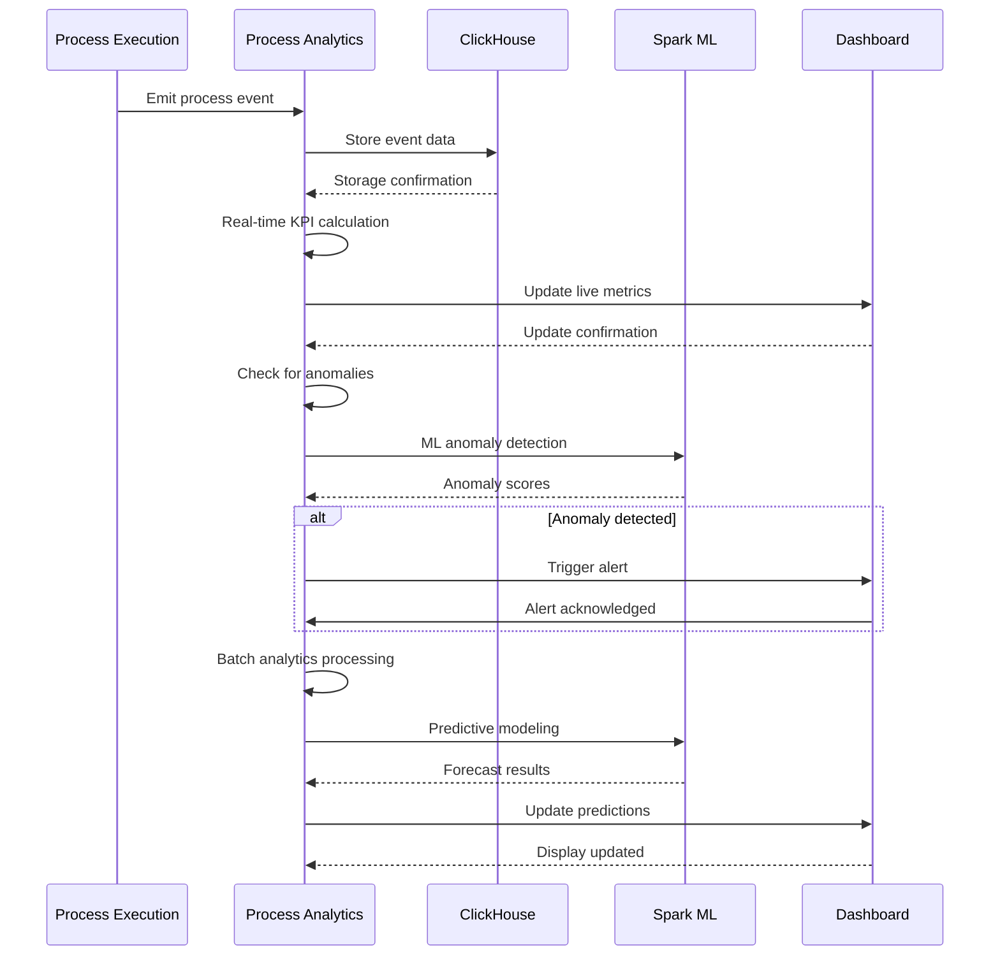

# Sequence Diagrams - UC4 BPM e Automazione Processi

## Diagramma Completo del Flusso BPM



## Diagramma di Process Mining



## Diagramma di RPA Orchestration



## Diagramma di Intelligent Design



## Diagramma di Analytics e Monitoring



## Diagramma Ultra-Semplificato

```mermaid
sequenceDiagram
    participant User as Utente
    participant System as Sistema BPM

    User->>System: Analizza processi
    System->>System: Process mining
    System-->>User: Modelli scoperti

    User->>System: Design workflow
    System->>System: AI optimization
    System-->>User: Workflow ottimizzato

    User->>System: Avvia automazione
    System->>System: RPA execution
    System-->>User: Task completato

    User->>System: Monitor performance
    System->>System: Analytics
    System-->>User: KPI e insights
```</content>
<parameter name="filePath">/Users/giangio/Documents/GitHub/Interzen/Interzen.POC/ZenIA/docs/use_cases/UC4 - BPM e Automazione Processi/01 Sequence diagrams.md