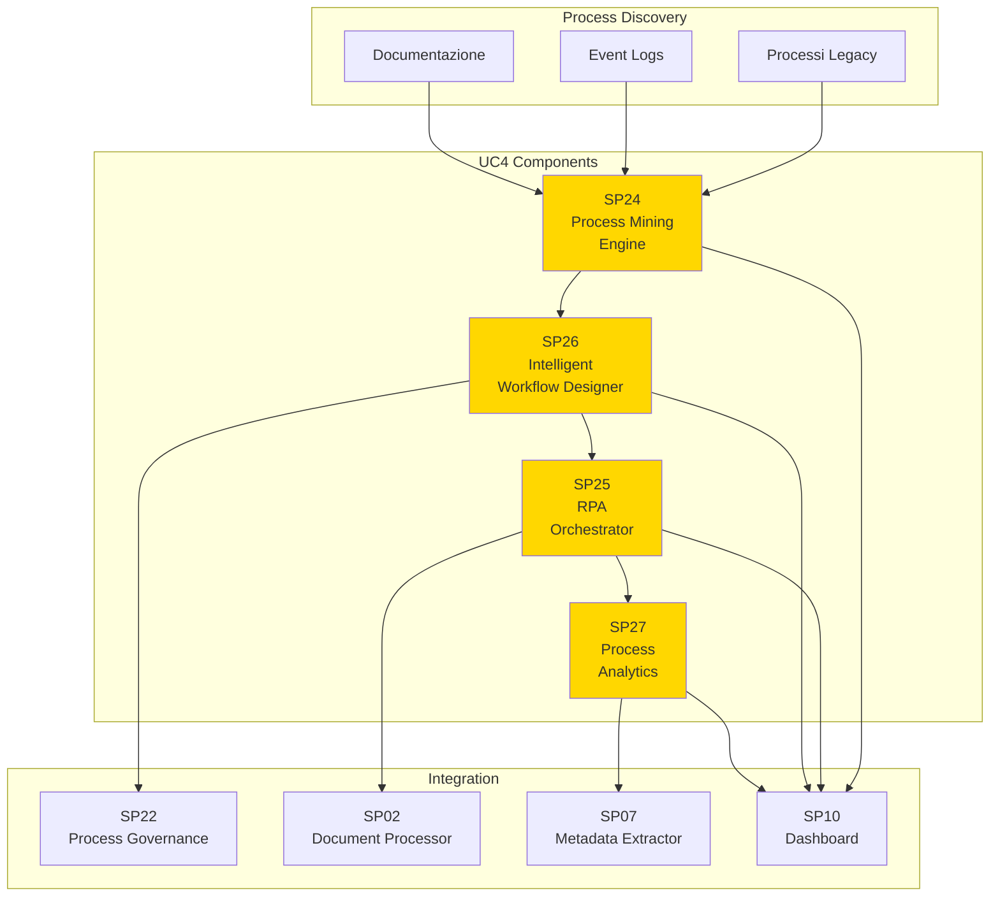
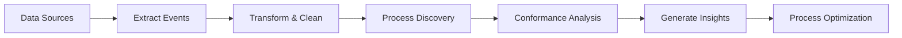
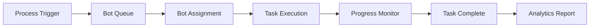

# Guida UC4 - BPM e Automazione Processi

## Panoramica

**UC4 - BPM e Automazione Processi** implementa un sistema completo di Business Process Management con automazione intelligente, process mining e Robotic Process Automation per ottimizzare l'efficienza operativa e ridurre gli errori umani.

## Obiettivi

### Business Objectives

1. **Process Discovery & Mining**
   - Analisi processi esistenti da log eventi
   - Identificazione colli di bottiglia e inefficienze
   - Discovery automatico workflow nascosti

2. **Intelligent Automation**
   - Robotic Process Automation per task ripetitivi
   - Workflow auto-ottimizzanti con AI
   - Decision automation basata su regole e ML

3. **Process Design & Optimization**
   - Designer visuale drag-and-drop per workflow
   - Simulazione e ottimizzazione processi
   - Continuous improvement basato su analytics

4. **Process Analytics & Monitoring**
   - Real-time monitoring performance processi
   - Predictive analytics per ottimizzazioni
   - KPI tracking e reporting avanzato

## Caratteristiche Principali

### Process Mining Intelligente
- **Event Log Analysis**: Analisi automatica log sistemi esistenti
- **Process Discovery**: Ricostruzione modelli processo da dati
- **Conformance Checking**: Verifica aderenza processi a modelli ideali
- **Bottleneck Analysis**: Identificazione colli di bottiglia automatica

### Robotic Process Automation
- **Bot Orchestration**: Gestione flotta robot software
- **Attended/Unattended RPA**: Automazione con/supervisione umana
- **Intelligent Document Processing**: OCR + AI per elaborazione documenti
- **Exception Handling**: Gestione automatica eccezioni

### Workflow Design Intelligente
- **Visual Designer**: Interfaccia drag-and-drop BPMN
- **AI-Assisted Design**: Suggerimenti ottimizzazione automatici
- **Process Simulation**: Testing e validazione workflow
- **Version Control**: Gestione versioni processi

### Analytics Avanzati
- **Real-time Dashboards**: Monitoraggio KPI processi
- **Predictive Analytics**: Previsione performance e problemi
- **Process Comparison**: Benchmarking tra versioni processo
- **ROI Tracking**: Misurazione impatto automazione

## Architettura di Integrazione

### Process Mining Pipeline

### RPA Orchestration Flow

## Benefici Attesi

### Efficienza Operativa
- **Riduzione Tempi**: Automazione task ripetitivi fino al 80%
- **Eliminazione Errori**: Riduzione errori umani del 90%
- **Scalabilità**: Gestione volumi crescenti senza aumento personale

### Qualità e Compliance
- **Process Standardization**: Uniformità esecuzione processi
- **Audit Trail**: Tracciabilità completa operazioni automatizzate
- **Compliance Automation**: Adempimento automatico requisiti normativi

### Business Intelligence
- **Process Transparency**: Visibilità completa su performance processi
- **Data-Driven Decisions**: Ottimizzazioni basate su dati reali
- **Predictive Insights**: Previsione problemi e opportunità

## KPI di Successo

| KPI | Target | Misurazione |
|-----|--------|-------------|
| Process Automation Rate | >70% | Task automatizzati vs totali |
| Error Reduction | >90% | Errori post-automazione vs pre |
| Process Discovery Accuracy | >95% | Accuratezza modelli scoperti |
| RPA ROI | >300% | Return on investment automazione |

## Roadmap Implementazione

### Fase 1: Foundation (Mesi 1-3)
- Setup infrastruttura process mining
- Analisi processi esistenti
- Proof of concept RPA su processi critici

### Fase 2: Core Automation (Mesi 4-6)
- Implementazione RPA orchestrator
- Workflow designer intelligente
- Analytics dashboard base

### Fase 3: Advanced Features (Mesi 7-9)
- AI-powered process optimization
- Predictive analytics
- Advanced RPA capabilities

### Fase 4: Enterprise Scale (Mesi 10-12)
- Scalabilità enterprise-wide
- Integration con sistemi esterni
- Advanced analytics e reporting</content>
<parameter name="filePath">/Users/giangio/Documents/GitHub/Interzen/Interzen.POC/ZenIA/docs/use_cases/UC4 - BPM e Automazione Processi/Guida_UC4_BPM.md
