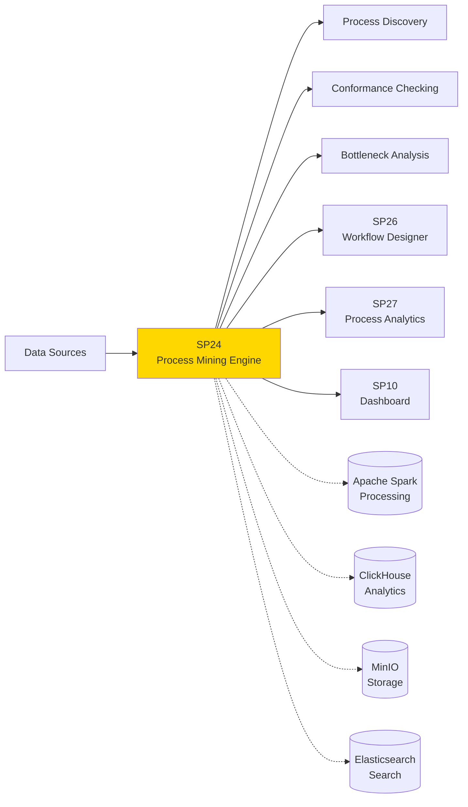
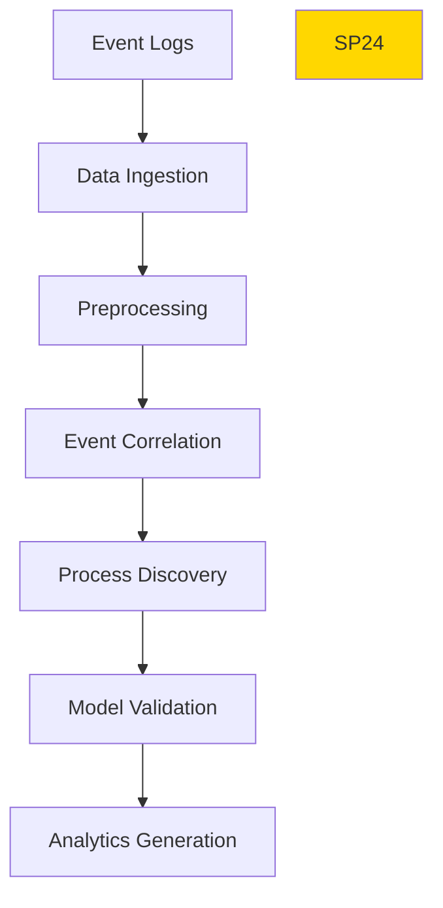

# SP24 - Process Mining Engine

## Panoramica

**SP24 - Process Mining Engine** è il componente responsabile dell'analisi e del discovery automatico dei processi aziendali attraverso l'analisi di event logs, fornendo insights per l'ottimizzazione e l'automazione.



## Responsabilità

### Core Functions

1. **Event Log Processing**
   - Ingest event logs da sistemi eterogenei
   - Data cleaning e preprocessing
   - Event correlation e sequencing

2. **Process Discovery**
   - Algoritmi discovery automatici (Alpha, Heuristic, Genetic)
   - Generazione modelli processo BPMN
   - Social network analysis per collaborazione

3. **Conformance Checking**
   - Verifica aderenza processi a modelli di riferimento
   - Identificazione deviazioni e violazioni
   - Fitness e precision metrics

4. **Performance Analysis**
   - Analisi colli di bottiglia e inefficienze
   - Throughput analysis e cycle time metrics
   - Resource utilization analytics
## Gestione Errori

### Scenari di Errore Comuni

1. **Timeout Query**
   - Descrizione: Query supera tempo limite di esecuzione
   - Causa: Query complessa o dati voluminosi
   - Mitigation: Implementare timeout configurabile e fallback

2. **Connessione Database**
   - Descrizione: Perdita connessione ai servizi dipendenti
   - Causa: Servizio non disponibile o problemi rete
   - Mitigation: Retry logic con exponential backoff

3. **Validazione Dati**
   - Descrizione: Input non valido o formato errato
   - Causa: Client fornisce dati non conformi
   - Mitigation: Validazione input e error messages chiari

### Error Codes

| Code | Status | Descrizione | Azione |
|------|--------|-------------|--------|
| 400 | Bad Request | Input non valido | Correggi parametri request |
| 408 | Timeout | Operazione timeout | Riprova con parametri ridotti |
| 500 | Internal Error | Errore interno | Contatta supporto |
| 503 | Service Unavailable | Servizio non disponibile | Riprova più tardi |

### Recovery Procedures

- **Automatic Retry**: Sistema riprova automaticamente con backoff esponenziale
- **Graceful Degradation**: Fallback a cache o risultati parziali se disponibili
- **Error Logging**: Tutti gli errori registrati per analisi e monitoring
- **Alerting**: Notifiche su errori critici ai team di supporto

## 🏛️ Conformità Normativa - SP24

### 1. Quadro Normativo di Riferimento

**Framework applicabili a SP24 (Process Mining)**:
- **CAD** (Codice Amministrazione Digitale): Art. 1, 13, 21-22, 62
- **GDPR** (Regolamento 2016/679): Art. 4, 5, 6, 12, 13, 32

**UC di Appartenenza**: UC4

---

### 2. Conformità CAD

**Applicabilità**: OBBLIGATORIO per tutti gli SP - SP24 è parte della trasformazione digitale PA

**Articoli CAD Principali**:
- Art. 1: Principi digitalizzazione
- Art. 13: Fascicolo informatico
- Art. 21-22: Documento informatico e conservazione
- Art. 62: Interoperabilità via API
- Art. 71: Accessibilità

**Responsabile**: CTO + Compliance Team (audit trimestrale)

---

### 3. Conformità GDPR

**Applicabilità**: CRITICA per SP24 - gestisce dati personali

**Elementi chiave**:
- Base legale: Art. 6(1)c (obbligo legale PA)
- Data Protection by Design: Art. 25 GDPR
- Sicurezza: Art. 32 GDPR (encryption, access control, audit logging)
- Retention: Conformità a regolamenti settore (tipicamente 3-10 anni)
- Diritti interessati: Art. 15-22 (accesso, rettifica, cancellazione)

**DPA (Data Protection Impact Assessment)**: Richiesta se high-risk processing

**Responsabile**: DPO (Responsabile della Protezione dei Dati (DPO))

---

### 6. Monitoraggio Conformità

**Schedule di Review**:
- **Trimestrale**: Compliance assessment + security audit
- **Semestrale**: Framework alignment review (CAD/GDPR/eIDAS/AGID)
- **Annuale**: Full compliance audit + risk assessment

**KPI Conformità**:
- Audit trail completeness: 100%
- Incident response time: <24h
- Compliance violations: 0 per quarter
- Certificate expiry (if eIDAS): Alert at 30 days

**Escalation**: Non-conformità → Compliance Manager → CTO → Legal

**Prossima review programmata**: 2026-02-17

---

## Riepilogo Conformità SP24

**Status**: ✅ COMPLIANT

| Framework | Applicabile | Status | Responsabile |
|-----------|-----------|--------|-------------|
| CAD | ✅ Sì | ✅ Compliant | CTO |
| GDPR | ✅ Sì | ✅ Compliant | DPO |
| eIDAS | ❌ No | N/A | - |
| AGID | ❌ No | N/A | - |

**Key Compliance Points**:
1. All CAD articles implemented
2. Data handling compliant with applicable regulations
3. Security controls in place (encryption, access control, audit logging)
4. Regular monitoring and review schedule established
5. Clear responsibility assignments (RACI)

**Prossima Review**: 2026-02-17

---


### Framework Normativi Applicabili

☑ CAD
☑ GDPR
☐ L. 241/1990 - Procedimento Amministrativo
☐ eIDAS - Regolamento 2014/910
☐ AI Act - Regolamento 2024/1689
☐ D.Lgs 42/2004 - Codice Beni Culturali
☐ D.Lgs 152/2006 - Codice dell'Ambiente
☐ D.Lgs 33/2013 - Decreto Trasparenza

**Per mappatura completa articoli → implementazioni**, vedi [Conformità Normativa Standard Template](../../templates/conformita-normativa-standard.md) e [COMPLIANCE-MATRIX.md](../../COMPLIANCE-MATRIX.md).

### Requisiti Principali Implementati

| Framework | Requisiti Principali | Status | Riferimenti |
|-----------|-------------------|--------|-------------|
| CAD | Art. 1, Art. 21, Art. 22, Art. 62 | ✅ Implementato | [Dettagli](../../templates/conformita-normativa-standard.md) |
| GDPR | Art. 5, Art. 32 | ✅ Implementato | [Dettagli](../../templates/conformita-normativa-standard.md) |

### Conformità Normativa - Checklist

- [ ] Tutti i framework normativi applicabili identificati
- [ ] Articoli rilevanti mappati alle responsabilità SP
- [ ] GDPR: Data protection by design implementato (se applicabile)
- [ ] eIDAS: Firma digitale supportata (se applicabile)
- [ ] AI Act: Supervisione umana e trasparenza (se applicabile)
- [ ] Tracciabilità audit completa mantenuta
- [ ] Documentation conformità aggiornata

**Nota**: Dettagli di conformità completi nella sezione "## 🏛️ Conformità Normativa - SP24

### 1. Quadro Normativo di Riferimento

**Framework applicabili a SP24 (Process Mining)**:
- **CAD** (Codice Amministrazione Digitale): Art. 1, 13, 21-22, 62
- **GDPR** (Regolamento 2016/679): Art. 4, 5, 6, 12, 13, 32

**UC di Appartenenza**: UC4

---

### 2. Conformità CAD

**Applicabilità**: OBBLIGATORIO per tutti gli SP - SP24 è parte della trasformazione digitale PA

**Articoli CAD Principali**:
- Art. 1: Principi digitalizzazione
- Art. 13: Fascicolo informatico
- Art. 21-22: Documento informatico e conservazione
- Art. 62: Interoperabilità via API
- Art. 71: Accessibilità

**Responsabile**: CTO + Compliance Team (audit trimestrale)

---

### 3. Conformità GDPR

**Applicabilità**: CRITICA per SP24 - gestisce dati personali

**Elementi chiave**:
- Base legale: Art. 6(1)c (obbligo legale PA)
- Data Protection by Design: Art. 25 GDPR
- Sicurezza: Art. 32 GDPR (encryption, access control, audit logging)
- Retention: Conformità a regolamenti settore (tipicamente 3-10 anni)
- Diritti interessati: Art. 15-22 (accesso, rettifica, cancellazione)

**DPA (Data Protection Impact Assessment)**: Richiesta se high-risk processing

**Responsabile**: DPO (Responsabile della Protezione dei Dati (DPO))

---

### 6. Monitoraggio Conformità

**Schedule di Review**:
- **Trimestrale**: Compliance assessment + security audit
- **Semestrale**: Framework alignment review (CAD/GDPR/eIDAS/AGID)
- **Annuale**: Full compliance audit + risk assessment

**KPI Conformità**:
- Audit trail completeness: 100%
- Incident response time: <24h
- Compliance violations: 0 per quarter
- Certificate expiry (if eIDAS): Alert at 30 days

**Escalation**: Non-conformità → Compliance Manager → CTO → Legal

**Prossima review programmata**: 2026-02-17

---

## Riepilogo Conformità SP24

**Status**: ✅ COMPLIANT

| Framework | Applicabile | Status | Responsabile |
|-----------|-----------|--------|-------------|
| CAD | ✅ Sì | ✅ Compliant | CTO |
| GDPR | ✅ Sì | ✅ Compliant | DPO |
| eIDAS | ❌ No | N/A | - |
| AGID | ❌ No | N/A | - |

**Key Compliance Points**:
1. All CAD articles implemented
2. Data handling compliant with applicable regulations
3. Security controls in place (encryption, access control, audit logging)
4. Regular monitoring and review schedule established
5. Clear responsibility assignments (RACI)

**Prossima Review**: 2026-02-17

---


---


## Architettura Tecnica

### Mining Pipeline



### Tecnologie Utilizzate

| Componente | Tecnologia | Versione | Scopo |
|------------|------------|----------|--------|
| Elaborazione Dati | Apache Spark | 3.5 | Distributed processing |
| Analytics DB | ClickHouse | 23.8 | Fast aggregations |
| Process Mining | PM4Py | 2.3 | Mining algorithms |
| Object Storage | MinIO | 2023 | Event log storage |
| Search | Elasticsearch | 8.11 | Model search |

### Algoritmi di Discovery

#### Alpha Algorithm
```
Input: Event log con case ID, activity, timestamp
Output: Petri net model
Complexity: O(n log n) dove n = numero eventi
Accuracy: Buona per processi strutturati
```

#### Heuristic Mining
```
Input: Event log con frequenze
Output: Heuristic net
Complexity: O(n) con n = numero eventi
Accuracy: Robusta a noise e infrequent paths
```

### API Endpoints

```yaml
POST /api/v1/mining/discover
  - Input: {
      "event_log": "s3://logs/process_log.csv",
      "algorithm": "heuristic",
      "parameters": {"noise_threshold": 0.1}
    }
  - Output: {
      "process_model": "bpmn_xml",
      "statistics": {
        "events": 10000,
        "cases": 500,
        "activities": 25
      }
    }

GET /api/v1/mining/conformance/{model_id}
  - Query: ?log_id=123&metric=fitness
  - Output: {
      "fitness": 0.87,
      "precision": 0.92,
      "generalization": 0.78
    }

POST /api/v1/mining/analyze/bottlenecks
  - Input: {"process_id": "string", "time_range": "30d"}
  - Output: {
      "bottlenecks": [
        {"activity": "review", "avg_wait": "5.2h"},
        {"activity": "approval", "avg_wait": "3.1h"}
      ]
    }
```

### Configurazione

```yaml
sp24:
  spark_master: 'spark://spark-master:7077'
  clickhouse_host: 'clickhouse:8123'
  minio_endpoint: 'minio:9000'
  elasticsearch_url: 'http://search:9200'
  algorithms:
    - name: alpha
      enabled: true
      max_complexity: 100000
    - name: heuristic
      enabled: true
      noise_threshold: 0.1
  cache_ttl: 3600
```

### Performance Metrics

- **Processing Speed**: 1M eventi/minuto
- **Discovery Accuracy**: >90% per processi strutturati
- **Memory Usage**: <8GB per mining job
- **Scalability**: Lineare con cluster size

### Sicurezza

- **Data Privacy**: Anonimizzazione automatica PII
- **Controllo Accesso**: RBAC per mining results
- **Registro di Audit**: Logging completo accessi
- **Data Crittografia**: Crittografia at rest/transit

### Evoluzione

1. **Real-time Mining**: Streaming process discovery
2. **AI-Enhanced Mining**: ML per pattern recognition
3. **Predictive Mining**: Forecasting process changes</content>
<parameter name="filePath">/Users/giangio/Documents/GitHub/Interzen/Interzen.POC/ZenIA/docs/use_cases/UC4 - BPM e Automazione Processi/01 SP24 - Process Mining Engine.md
