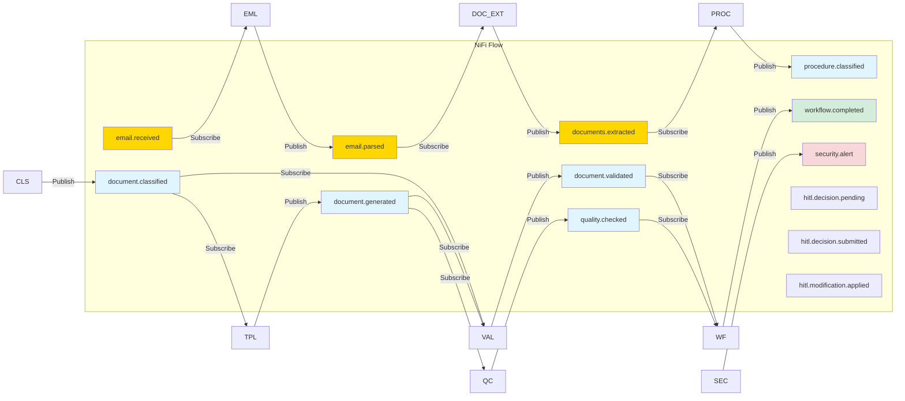
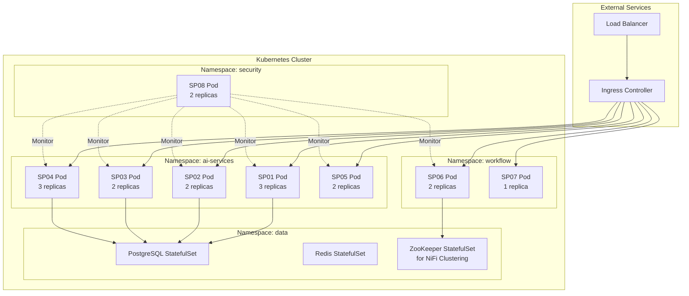
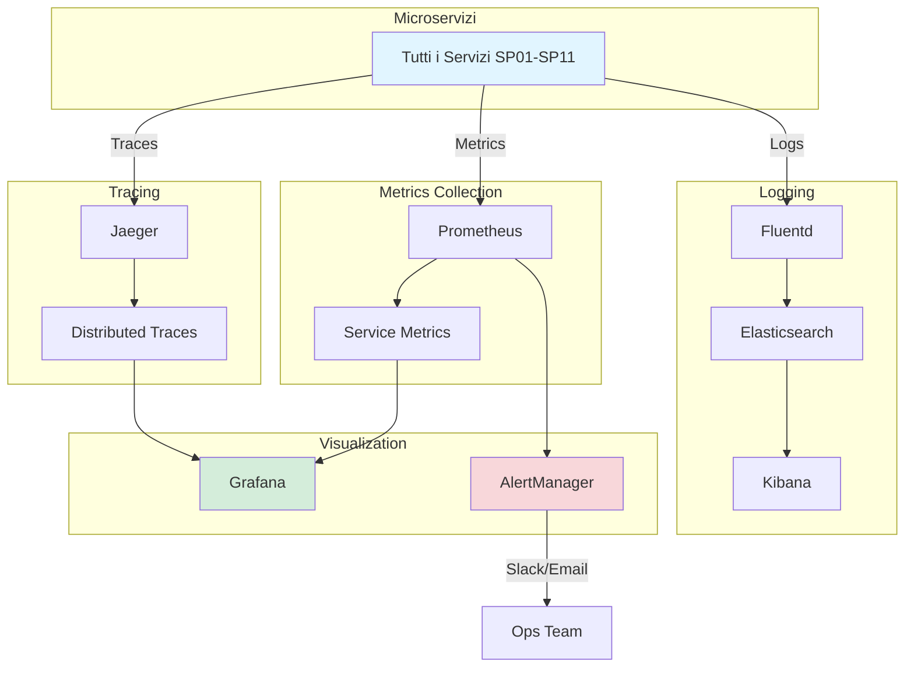
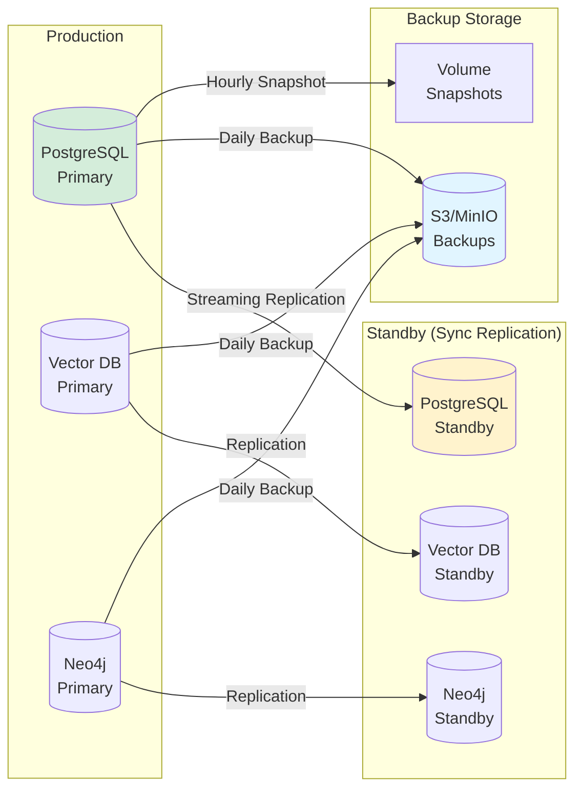
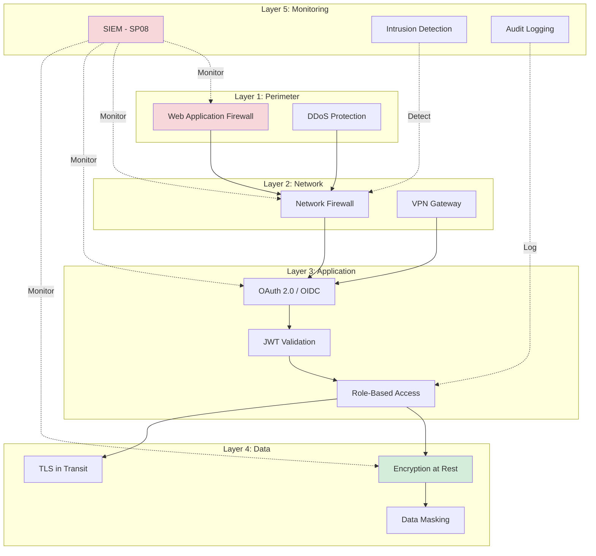

# Architettura Generale Microservizi ZenShareUp

## Diagramma Architettura Generale

```mermaid
graph TB
    subgraph "Client Layer"
        UI[Web UI Dashboard]
        API_GW[API Gateway]
        HITL_UI[HITL Interface<br/>Human in the Loop]
    end
    
    subgraph "Application Services"
        WF[SP09 - Workflow Engine<br/>Apache NiFi]
        DASH[SP10 - Explainability<br/>Dashboard]
        HITL_MGR[HITL Manager<br/>Decision Tracking]
    end
    
    subgraph "Input Processing Layer"
        EML[SP01 - EML Parser<br/>Email Intelligence]
        DOC_EXT[SP02 - Document Extractor<br/>OCR/Attachment Classifier]
    end
    
    subgraph "Core AI Services"
        PROC[SP03 - Classificatore Procedurale<br/>DistilBERT/spaCy]
        KB[SP04 - Knowledge Base<br/>RAG/Mistral]
        TPL[SP05 - Template Engine<br/>GPT-4/LangChain]
        VAL[SP06 - Validatore<br/>BERT/RoBERTa]
        CLS[SP07 - Classifier<br/>DistilBERT/spaCy]
        QC[SP08 - Quality Checker<br/>LanguageTool/spaCy]
    end
    
    subgraph "Cross-Cutting Services"
        SEC[SP11 - Security & Audit<br/>Isolation Forest/Vault]
        MON[Monitoring<br/>Grafana/Prometheus]
    end
    
    subgraph "Data Layer"
        PG[(PostgreSQL<br/>Metadata/Audit)]
        VDB[(Vector DB<br/>FAISS/Pinecone)]
        GRAPH[(Neo4j<br/>Knowledge Graph)]
        REDIS[(Redis<br/>Cache)]
        MINIO[(MinIO<br/>Documents/Attachments)]
        HITL_DB[(PostgreSQL<br/>HITL Tracking)]
    end
    
    subgraph "External Systems"
        PROT[Sistema Protocollo]
        FIRMA[Firma Digitale]
        PEC[Gestione PEC]
        DOC[Documentale]
    end
    
    UI --> API_GW
    HITL_UI --> API_GW
    API_GW --> WF
    API_GW --> DASH
    API_GW --> HITL_MGR
    
    PEC --> WF
    WF --> EML
    EML --> DOC_EXT
    DOC_EXT --> PROC
    
    WF --> HITL_MGR
    HITL_MGR --> HITL_UI
    
    WF --> PROC
    WF --> TPL
    WF --> VAL
    WF --> CLS
    WF --> QC
    WF --> KB
    
    PROC --> KB
    TPL --> KB
    TPL --> CLS
    VAL --> KB
    VAL --> CLS
    CLS --> QC
    
    DASH --> EML
    DASH --> DOC_EXT
    DASH --> PROC
    DASH --> TPL
    DASH --> VAL
    DASH --> CLS
    DASH --> QC
    DASH --> KB
    
    SEC -.->|Audit| EML
    SEC -.->|Audit| DOC_EXT
    SEC -.->|Audit| PROC
    SEC -.->|Audit| TPL
    SEC -.->|Audit| VAL
    SEC -.->|Audit| CLS
    SEC -.->|Audit| QC
    SEC -.->|Audit| KB
    
    MON -.->|Metrics| WF
    MON -.->|Metrics| EML
    MON -.->|Metrics| DOC_EXT
    MON -.->|Metrics| PROC
    MON -.->|Metrics| TPL
    MON -.->|Metrics| VAL
    MON -.->|Metrics| CLS
    MON -.->|Metrics| QC
    MON -.->|Metrics| KB
    
    EML --> PG
    EML --> MINIO
    DOC_EXT --> PG
    DOC_EXT --> MINIO
    PROC --> PG
    TPL --> PG
    VAL --> PG
    CLS --> PG
    KB --> VDB
    KB --> GRAPH
    PROC --> REDIS
    TPL --> REDIS
    VAL --> REDIS
    KB --> REDIS
    PROC --> MINIO
    CLS --> MINIO
    TPL --> MINIO
    SEC --> PG
    
    HITL_MGR --> HITL_DB
    HITL_MGR --> MINIO
    
    WF --> PROT
    WF --> FIRMA
    WF --> DOC
    
    style EML fill:#ffd700
    style DOC_EXT fill:#ffd700
    style PROC fill:#e1f5ff
    style TPL fill:#e1f5ff
    style VAL fill:#e1f5ff
    style KB fill:#e1f5ff
    style CLS fill:#e1f5ff
    style QC fill:#e1f5ff
    style WF fill:#fff3cd
    style SEC fill:#f8d7da
    style DASH fill:#d4edda
    style HITL_MGR fill:#ffeb3b
    style HITL_UI fill:#ffeb3b
    style HITL_DB fill:#ffeb3b
```



## Stack Tecnologico per Microservizio

| Microservizio | Linguaggio | Framework | Database | Message Queue | Container |
|--------------|-----------|-----------|----------|---------------|-----------|
| SP01 - EML Parser & Email Intelligence | Python | FastAPI | PostgreSQL + MinIO | NiFi FlowFiles | Docker |
| SP02 - Document Extractor & Classifier | Python | FastAPI | PostgreSQL + MinIO | NiFi FlowFiles | Docker |
| SP03 - Classificatore Procedurale | Python | FastAPI | PostgreSQL + MinIO | NiFi FlowFiles | Docker |
| SP04 - Legal Knowledge Base | Python | FastAPI | FAISS + Neo4j | NiFi FlowFiles | Docker |
| SP05 - Template Engine | Python | FastAPI | PostgreSQL | NiFi FlowFiles | Docker |
| SP06 - Validatore | Python | FastAPI | PostgreSQL | NiFi FlowFiles | Docker |
| SP07 - Content Classifier | Python | FastAPI | PostgreSQL + MinIO | NiFi FlowFiles | Docker |
| SP08 - Quality Checker | Python | FastAPI | Redis | NiFi FlowFiles | Docker |
| SP09 - Workflow Engine | Python | Apache NiFi | PostgreSQL | - | Docker |
| SP10 - Explainability Dashboard | Python | Streamlit | PostgreSQL | - | Docker |
| SP11 - Security & Audit | Python | FastAPI | PostgreSQL | NiFi FlowFiles | Docker |
| **HITL Manager** | **Python** | **FastAPI** | **PostgreSQL** | **NiFi FlowFiles** | **Docker** |

## Comunicazione tra Microservizi

### Pattern Architetturali

1. **Comunicazione Sincrona**: REST API via HTTP
2. **Comunicazione Asincrona**: Event-driven via Apache NiFi flow files
3. **Service Mesh**: Istio per resilienza e osservabilità  
4. **Circuit Breaker**: Pattern integrato in NiFi processors
5. **API Gateway**: Kong/Ambassador per routing e rate limiting

### Event Bus (Apache NiFi FlowFiles)

Apache NiFi gestisce il routing degli eventi tramite **FlowFiles** che vengono processati attraverso i vari Process Groups. Ogni evento mantiene gli attributi e può essere tracciato completamente tramite **Data Provenance**.



## Deployment Architecture



## Service Mesh Configuration (Istio)

```yaml
# Esempio configurazione Istio per retry e circuit breaker
apiVersion: networking.istio.io/v1beta1
kind: DestinationRule
metadata:
  name: template-engine-circuit-breaker
spec:
  host: sp05-template-engine
  trafficPolicy:
    connectionPool:
      tcp:
        maxConnections: 100
      http:
        http1MaxPendingRequests: 50
        http2MaxRequests: 100
        maxRequestsPerConnection: 2
    outlierDetection:
      consecutiveErrors: 5
      interval: 30s
      baseEjectionTime: 30s
      maxEjectionPercent: 50
      minHealthPercent: 40
```

## Scalabilità e Resilienza

### Horizontal Pod Autoscaling (HPA)

```yaml
apiVersion: autoscaling/v2
kind: HorizontalPodAutoscaler
metadata:
  name: sp05-template-engine-hpa
spec:
  scaleTargetRef:
    apiVersion: apps/v1
    kind: Deployment
    name: sp05-template-engine
  minReplicas: 2
  maxReplicas: 10
  metrics:
  - type: Resource
    resource:
      name: cpu
      target:
        type: Utilization
        averageUtilization: 70
  - type: Resource
    resource:
      name: memory
      target:
        type: Utilization
        averageUtilization: 80
  - type: Pods
    pods:
      metric:
        name: http_requests_per_second
      target:
        type: AverageValue
        averageValue: "1000"
```

### Priorità di Scaling

| Servizio | Min Replicas | Max Replicas | Priorità | Motivo |
|----------|-------------|-------------|----------|---------|
| SP01 - EML Parser | 2 | 8 | Alta | Entry point email, parsing PEC |
| SP02 - Document Extractor | 3 | 12 | Alta | OCR CPU-intensive, alto traffico allegati |
| SP03 - Classificatore Procedurale | 3 | 10 | Alta | Classificazione critica |
| SP05 - Template Engine | 3 | 10 | Alta | CPU intensive (LLM) |
| SP06 - Validatore | 2 | 8 | Media | Validation critica |
| SP04 - Knowledge Base | 2 | 6 | Media | RAG queries frequenti |
| SP08 - Quality Checker | 2 | 5 | Bassa | Non bloccante |
| SP09 - Workflow Engine | 2 | 4 | Media | Orchestrazione critica |
| SP11 - Security & Audit | 2 | 4 | Alta | Always-on monitoring |

## Monitoring e Observability Stack



## Key Metrics da Monitorare

### Service Level Indicators (SLI)

| Categoria | Metrica | Target | Alert Threshold |
|-----------|---------|--------|-----------------|
| **Latency** | P50 response time | <500ms | >1s |
| **Latency** | P95 response time | <2s | >5s |
| **Latency** | P99 response time | <5s | >10s |
| **Availability** | Uptime | >99.9% | <99.5% |
| **Throughput** | Requests/sec | >100 | <50 |
| **Errors** | Error rate | <1% | >3% |
| **Saturation** | CPU usage | <70% | >85% |
| **Saturation** | Memory usage | <80% | >90% |
| **Queue** | NiFi FlowFiles queue depth | <1000 FlowFiles | >10000 FlowFiles |

### Business Metrics

| Metrica | Descrizione | Target |
|---------|-------------|--------|
| Email Processing Rate | Email/ora processate | >500 |
| Document Extraction Success | % allegati estratti correttamente | >95% |
| OCR Accuracy | % accuratezza riconoscimento testo | >92% |
| Document Processing Rate | Documenti/ora elaborati | >1000 |
| Template Generation Success | % generazioni accettate | >90% |
| Validation Accuracy | % validazioni corrette | >95% |
| Average Processing Time | Tempo totale email→atto | <45s |
| Human Intervention Rate | % documenti richiede review | <10% |
| PEC Signature Validation | % firme digitali validate | 100% |

## Disaster Recovery e Backup

### Strategia di Backup



### Recovery Time Objective (RTO) e Recovery Point Objective (RPO)

| Sistema | RPO | RTO | Strategia |
|---------|-----|-----|-----------|
| PostgreSQL (transactional) | <5 min | <15 min | Streaming replication + PITR |
| Vector DB (ricreabile) | <1 ora | <2 ore | Daily backup + rebuild |
| Neo4j (knowledge graph) | <15 min | <30 min | Continuous backup |
| MinIO (documents) | <1 ora | <1 ora | Multi-region replication |
| Apache NiFi (workflow orchestrator) | <5 min | <10 min | 3-node cluster |
| ZooKeeper (NiFi coordination) | <2 min | <5 min | 3-node ensemble |

## Security Architecture

### Defense in Depth



### Secrets Management

```yaml
# HashiCorp Vault integration
apiVersion: v1
kind: Secret
metadata:
  name: vault-secrets
  annotations:
    vault.hashicorp.com/agent-inject: "true"
    vault.hashicorp.com/role: "zenshare-ai"
    vault.hashicorp.com/agent-inject-secret-database: "database/creds/postgres"
    vault.hashicorp.com/agent-inject-secret-openai: "secret/openai/api-key"
```

## Costi Operativi Stimati (Mensili)

| Risorsa | Dimensione | Costo Mensile (€) | Note |
|---------|-----------|-------------------|------|
| **Compute (Kubernetes)** | 16 vCPU, 64GB RAM | 400 | 8 nodi worker |
| **GPU (per LLM on-premise)** | 2x RTX 4090 | 150 | Elettricità + ammortamento |
| **Database (PostgreSQL)** | 500GB SSD | 100 | Managed service |
| **Vector DB (Pinecone)** | 100M vectors | 70 | O self-hosted FAISS (€0) |
| **Redis Cache** | 16GB | 50 | Managed |
| **MinIO Storage** | 5TB | 80 | Object storage |
| **Apache NiFi** | 3-node cluster | 180 | Managed |
| **ZooKeeper** | 3-node ensemble | 30 | Managed |
| **Monitoring Stack** | Prometheus+Grafana | 60 | Self-hosted |
| **LLM API (sviluppo)** | Groq free tier | 0-50 | Free tier poi pay-as-you-go |
| **Network/Traffic** | 2TB/mese | 40 | Egress costs |
| **Backup Storage** | 10TB | 50 | S3-compatible |
| **Total** | | **1,120-1,170 €/mese** | ~14k €/anno |

### Alternative On-Premise vs Cloud

| Componente | On-Premise (1 anno) | Cloud (1 anno) | Break-even |
|-----------|---------------------|----------------|------------|
| Infrastruttura completa | 15k capex + 2k opex = **17k €** | 14k €/anno | 12-14 mesi |
| LLM inference | 0 € (self-hosted) | 2.4k €/anno (Groq) | Immediato |
| Storage | 500 € (hardware) | 1.2k €/anno (S3) | 5-6 mesi |

**Raccomandazione**: Hybrid - core services on-premise, LLM cloud durante sviluppo, poi migrazione.
